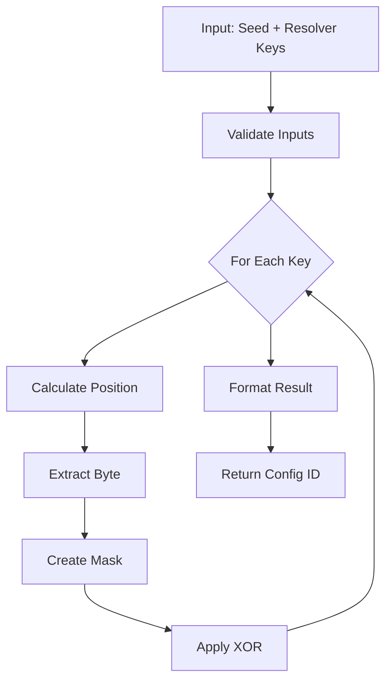

- [ISBE Contracts](#isbe-contracts)
    - [🚀 Quick Start](#-quick-start)
        - [Requirements](#requirements)
        - [Installation](#installation)
    - [🌐 Network Support](#-network-support)
        - [Available Networks](#available-networks)
        - [Deployment Commands](#deployment-commands)
        - [Deployment Options](#deployment-options)
    - [🔐 Account Management](#-account-management)
        - [secp256k1 Networks (Standard Ethereum)](#secp256k1-networks-standard-ethereum)
        - [secp256r1 Networks (Hyperledger Besu)](#secp256r1-networks-hyperledger-besu)
        - [AWS KMS Signing (secp256k1)](#aws-kms-signing-secp256k1)
        - [Account Validation](#account-validation)
        - [Showing the Active Signer](#showing-the-active-signer)
    - [🏗️ Architecture Overview](#-architecture-overview)
        - [Core Components](#core-components)
        - [Key Contracts](#key-contracts)
    - [🔇 Silent Configuration System](#-silent-configuration-system)
        - [Quick Start](#quick-start)
        - [Benefits](#benefits)
    - [🔧 TypeScript Utilities & Code Quality](#-typescript-utilities--code-quality)
        - [🏠 Core Utilities](#-core-utilities)
            - [Custom Error System](#custom-error-system)
            - [Ethereum Utilities](#ethereum-utilities)
            - [Enhanced Validation](#enhanced-validation)
        - [📜 Enhanced TypeScript Scripts](#-enhanced-typescript-scripts)
        - [🎖️ Quality Improvements](#-quality-improvements)
    - [🔐 secp256r1 Signature Support](#-secp256r1-signature-support)
        - [Current Implementation Status](#current-implementation-status)
        - [⚠️ Known Architectural Issues](#-known-architectural-issues)
        - [Developer Usage](#developer-usage)
            - [Network Configuration](#network-configuration)
            - [Automatic Curve Detection](#automatic-curve-detection)
            - [Manual Provider Creation](#manual-provider-creation)
        - [Event Detection & Reliability](#event-detection--reliability)
        - [Development & Debugging](#development--debugging)
            - [Debug Mode](#debug-mode)
            - [Testing Both Curves](#testing-both-curves)
        - [Architecture Improvement Plan](#architecture-improvement-plan)
        - [Known Limitations](#known-limitations)
        - [Production Readiness](#production-readiness)
    - [📋 Development Tasks](#-development-tasks)
        - [Build and Compilation](#build-and-compilation)
        - [Testing](#testing)
            - [Quick Start](#quick-start)
            - [Test Performance & Optimization](#test-performance--optimization)
        - [Code Quality](#code-quality)
        - [Security Analysis](#security-analysis)
        - [Gas Analysis](#gas-analysis)
        - [Documentation](#documentation)
        - [Pre-commit Pipeline](#pre-commit-pipeline)
        - [🔐 Secret‑Sharing Utilities](#secret-sharing-utilities)
    - [🎯 Deployment Tasks](#-deployment-tasks)
        - [Full Deployment](#full-deployment)
        - [Business Logic Management](#business-logic-management)
        - [Configuration Management](#configuration-management)
            - [Building Custom Configuration IDs](#building-custom-configuration-ids)
        - [Use Case Deployment](#use-case-deployment)
            - [Configuration-Only Approach](#configuration-only-approach)
        - [Genesis generation](#genesis-generation-for-governance-diamond)
        - [Network bootstrapping](#Network-bootstrapping)
    - [🔍 Verification and Monitoring](#-verification-and-monitoring)
        - [Deployment Verification](#deployment-verification)
        - [Governance Analysis](#governance-analysis)
        - [Diamond Pattern Tasks](#diamond-pattern-tasks)
        - [Access Control](#access-control)
        - [Pause Controls](#pause-controls)
    - [🛠️ Curve-Aware Development](#-curve-aware-development)
        - [Working with secp256k1 (Standard Ethereum)](#working-with-secp256k1-standard-ethereum)
        - [Working with secp256r1 (Hyperledger Besu)](#working-with-secp256r1-hyperledger-besu)
        - [Cross-Curve Development](#cross-curve-development)
        - [⚠️ EXPERIMENTAL SECP256R1 SUPPORT](#-experimental-secp256r1-support)
        - [Current secp256r1 Implementation Status](#current-secp256r1-implementation-status)
    - [📊 Examples](#-examples)
        - [Complete Deployment Example](#complete-deployment-example)
    - [👥 User Roles](#-user-roles)
    - [📝 Development Workflow](#-development-workflow)
        - [Branch Naming Convention](#branch-naming-convention)
        - [Commit Requirements](#commit-requirements)
        - [Pull Request Process](#pull-request-process)
    - [✅ Code Quality Standards](#-code-quality-standards)
        - [Mandatory Requirements](#mandatory-requirements)
        - [Configuration ID Algorithm](#configuration-id-algorithm)
            - [Algorithm Flow](#algorithm-flow)
            - [Example: Complete Deployment Flow](#example-complete-deployment-flow)
            - [Available Resolver Keys](#available-resolver-keys)
            - [Common Use Cases](#common-use-cases)
        - [Pre-commit Validation](#pre-commit-validation)
    - [📦 NPM Package Usage](#-npm-package-usage)
    - [📚 Documentation](#-documentation)
        - [📖 Gas Measurement](#-gas-measurement)
    - [🔧 Troubleshooting](#-troubleshooting)
        - [Common Issues with Configuration IDs](#common-issues-with-configuration-ids)
        - [Other Common Issues](#other-common-issues)
        - [Network Connection Issues](#network-connection-issues)
        - [secp256r1 Specific Issues (EXPERIMENTAL)](#secp256r1-specific-issues-experimental)
    - [🚀 Advanced Usage](#-advanced-usage)
        - [Custom Network Configuration](#custom-network-configuration)
        - [Environment-Specific Deployment](#environment-specific-deployment)
    - [Resources table](#resources-table)

# ISBE Contracts

Repository of certified and audited smart contracts for the ISBE (Interoperable Secure Blockchain Ecosystem) network, developed by Alastria. This project implements sophisticated Diamond Pattern (EIP-2535) architecture for modular, upgradeable smart contracts with comprehensive governance controls.

## 🚀 Quick Start

### Requirements

- **Node.js**: Version 20.X.X or higher
- **npm**: Latest version
- **Git**: For version control
- **Docker**: Required for Slither security analysis

### Installation

```bash
# Clone the repository
git clone <repository-url>
cd isbe-contracts

# Install dependencies
npm install

# Compile contracts
npm run compile:force

# Run tests
npm run test

# Generate documentation
npm run docgen

# Enable debug logging for troubleshooting (optional)
DEBUG=true npm run compile
```

> **🔇 Silent by Default**: The configuration system produces no output during normal operation. Use `DEBUG=true` to see detailed information when troubleshooting.

## 🌐 Network Support

This project supports both **secp256k1** (standard Ethereum) and **secp256r1** (custom Hyperledger Besu) elliptic curves.

### Available Networks

| Network             | Type           | Curve     | Chain ID | Status          | URL                                        |
| ------------------- | -------------- | --------- | -------- | --------------- | ------------------------------------------ |
| `hardhat`           | Local          | secp256k1 | 31337    | ✅ Stable       | Local Hardhat Network                      |
| `localhost`         | Local Besu     | secp256k1 | 2222     | ✅ Stable       | http://172.16.240.30:8545                  |
| `isbelocaldeployer` | Local Deploy   | secp256k1 | 2222     | ✅ Stable       | http://127.0.0.1:8545                      |
| `mvp`               | ISBE MVP       | secp256k1 | 2023     | ✅ Stable       | https://besu-node-non-validator-1.mvp...   |
| `arsys`             | ISBE Arsys     | secp256k1 | 2024     | ✅ Stable       | http://213.165.85.41:8545                  |
| `kepler`            | IoBuilders     | secp256k1 | 1003     | ✅ Stable       | https://regular.pre.iosec.io.builders:8565 |
| `customR1Network`   | Besu secp256r1 | secp256r1 | 2222     | ⚠️ Experimental | http://172.16.240.30:8545                  |

> ⚠️ **EXPERIMENTAL FEATURE WARNING**: The `customR1Network` (secp256r1 support) is currently experimental and not recommended for production use. This feature uses custom cryptographic implementations that may have compatibility issues. Use only for development and testing purposes.

### Deployment Commands

```bash
# Deploy to local Hardhat network (secp256k1)
npx hardhat deployAll --network hardhat

# Deploy to localhost (secp256k1)
npx hardhat deployAll --network localhost

# Deploy to ISBE MVP (secp256k1)
npx hardhat deployAll --network mvp

# Deploy to Hyperledger Besu with secp256r1
npx hardhat deployAll --network customR1Network

# Configure without deploying use cases (registers configurations with setConfig but skips deployUseCase)
npx hardhat deployAll --network hardhat --no-deploy-use-cases
npx hardhat deployAllClean --network hardhat --no-deploy-use-cases

# Selective deployment - deploy only specific use cases based on JSON configuration
npx hardhat deployAllClean --network hardhat --config-file custom.json

# Test deployment (comprehensive)
npx hardhat deployTest
```

#### Deployment Options

| Option                  | Description                                                          |
| ----------------------- | -------------------------------------------------------------------- |
| `--network <name>`      | Specifies the network to deploy to                                   |
| `--precommit`           | Runs pre-commit validations after deployment                         |
| `--info`                | Shows detailed network and signature provider information            |
| `--no-deploy-use-cases` | Registers configurations with setConfig but skips deployUseCase      |
| `--config-file <file>`  | 🆕 JSON configuration for selective deployment (deployAllClean only) |
| `--log-level <level>`   | Sets logging verbosity (minimal, normal, verbose, debug)             |
| `--legacy`              | (deployAllClean only) Uses legacy DeploymentOrchestrator             |

## 🔐 Account Management

### secp256k1 Networks (Standard Ethereum)

For standard Ethereum networks, create a `.env` file:

```bash
# .env file for secp256k1 networks
; Curve: SECP256K1
ACCOUNT_ADDRESS=0xYourAddress
ACCOUNT_PRIVATE_KEY=0xYourPrivateKey
ACCOUNTS=privatekey1,privatekey2,privatekey3,privatekey4,privatekey5
```

> **Note for Local Deployer:** When using `isbelocaldeployer`, ensure the `ACCOUNT_ADDRESS` corresponds to the pre-funded account on the local Besu node and that `ACCOUNT_PRIVATE_KEY` matches.

### secp256r1 Networks (Hyperledger Besu)

For Hyperledger Besu networks with secp256r1:

```bash
# Generate secp256r1 accounts (EXPERIMENTAL)
npx hardhat generate-secp256r1-accounts --count 5

# Generate both secp256k1 and secp256r1 files with same private keys (EXPERIMENTAL)
npx hardhat generate-env --dual --count 5

# This creates two files:
# .env.secp256k1 - Standard Ethereum accounts
# .env.secp256r1 - Same keys but with secp256r1 addresses (EXPERIMENTAL)

# Use the appropriate file:
cp .env.secp256k1 .env  # For standard networks
cp .env.secp256r1 .env  # For secp256r1 networks (EXPERIMENTAL)
```

### AWS KMS Signing (secp256k1)

Use an AWS KMS key to sign transactions instead of a local private key. No `.env` key changes are required — the factory switches automatically when `KMS_KEY_ID` is set.

#### Prerequisites

- An AWS KMS key of type **`ECC_SECG_P256K1`** (secp256k1, the Ethereum curve).
- AWS credentials with `kms:Sign` and `kms:GetPublicKey` permissions on that key.

#### Enabling KMS signing

```bash
export AWS_PROFILE="isbe-dev"        # or set AWS_ACCESS_KEY_ID / AWS_SECRET_ACCESS_KEY
export AWS_REGION="eu-west-1"
export KMS_KEY_ID="alias/your-kms-key-alias"   # key ID or alias

npx hardhat deployAll --network dev
npx hardhat native:transfer --to $ADDRESS --amount "1" --network isbe
npx hardhat grantRole --role $ROLE --account $ACCOUNT --diamond $DIAMOND --network isbe
```

#### Disabling KMS signing (revert to local key)

```bash
unset KMS_KEY_ID
```

No other arguments change. The provider selection is logged at startup so you can always confirm which signer is active:

```
🔐 Using AWS KMS signature provider (secp256k1)        ← KMS active
🔐 Using secp256k1 signature provider (standard Ethereum)  ← local key active
```

#### Supported networks

KMS signing is supported on: `dev`, `isbe`, `arsys`, `kepler`. The `hardhat` and `localhost` networks always use local keys regardless of `KMS_KEY_ID`.

#### Selection order

```
secp256r1 → KMS (if KMS_KEY_ID is set) → secp256k1 local key
```

---

### Account Validation

```bash
# Validate current account configuration
npx hardhat validate-accounts

# Show account configuration (without private keys)
npx hardhat show-env-accounts

# Show account configuration (with private keys - development only)
npx hardhat show-env-accounts --private

# Show secp256r1 accounts with public keys
npx hardhat show-secp256r1-accounts
```

### Showing the Active Signer

`show-signer` resolves the active signing address through `SignatureProviderFactory`, so it correctly reflects whichever provider is in use — KMS, secp256r1, or local secp256k1:

```bash
npx hardhat show-signer --network isbe
```

Example output:

```
=== Active Signer ===
   Network: isbe

🔐 Using AWS KMS signature provider (secp256k1)
   Address: 0xf0349d9cCc129b44FF69F2a2250B4AeD0367F86a
   Curve:   secp256k1
   Balance: 115.0 native tokens
```

## 🏗️ Architecture Overview

### Core Components

1. **Diamond Pattern (EIP-2535)**: Modular proxy architecture
2. **Governance Layer**: Role-based access control and factory management
3. **Business Logic**: Pluggable facets for different functionalities
4. **Use Cases**: Complete applications using diamond proxies

### Key Contracts

- **ISBE Factory**: Governance and factory management
- **Business Logic Factory**: Manages business logic deployment
- **Configuration Management**: Diamond configuration management
- **Proxy Factory**: Use case proxy deployment
- **Global ISBE Pause**: Network-wide pause functionality

## 🔇 **Silent Configuration System**

🆕 **New in this version**: The configuration system is now **completely silent by default**, eliminating configuration noise from your builds and scripts.

### Quick Start

```bash
# Silent operation (default) - clean output
npx hardhat compile
npx hardhat test
npx hardhat deployAll --network mvp

# Detailed debug output when troubleshooting
DEBUG=true npx hardhat compile
DEBUG=true npx hardhat deployAll --network mvp
```

### Benefits

- **🔇 Clean Output**: No configuration noise cluttering your builds
- **🚫 Silent Scripts**: All hardhat commands run quietly by default
- **🔍 Debug When Needed**: Rich debugging information available when `DEBUG=true`
- **🏠 Unified Networks**: All network configurations in one clear location (`config/networks.ts`)

## 🔧 **TypeScript Utilities & Code Quality**

This project includes comprehensive TypeScript utilities and improvements implemented in **Phase 1** of the code quality enhancement initiative.

### 🏠 **Core Utilities**

#### **Custom Error System** (`utils/errors.ts`)

Robust error handling with specialized error types and rich context:

```typescript
// Validation errors with helpful suggestions
import { ValidationError } from './utils/errors'
throw ValidationError.withSuggestions(
    'businessId',
    invalidId,
    '32-byte hex string',
    ['Ensure it starts with "0x"', 'Use only hex characters']
)

// Transaction errors with blockchain context
import { TransactionError } from './utils/errors'
throw TransactionError.withContext('Transaction failed', txHash, blockNumber)
```

**Available Error Types**: `ValidationError`, `TransactionError`, `ContractInteractionError`, `NetworkError`, `ConfigurationError`, `SignatureError`, `FileSystemError`, `TimeoutError`, `BatchError`

#### **Ethereum Utilities** (`utils/ethereum.ts`)

Comprehensive Ethereum-specific utilities:

```typescript
import {
    validateEthereumAddress,
    weiToEther,
    ETHEREUM_CONSTANTS,
} from './utils/ethereum'

// Address validation with detailed error messages
validateEthereumAddress('0x1234...')

// Unit conversions
const ethValue = weiToEther('1000000000000000000') // "1.000000"

// Common constants
console.log(ETHEREUM_CONSTANTS.ZERO_ADDRESS)
console.log(ETHEREUM_CONSTANTS.ROLES.DEFAULT_ADMIN)
```

#### **Enhanced Validation** (`scripts/utils/validation.ts`)

Type-safe validation with comprehensive error reporting:

```typescript
import {
    validateBusinessId,
    validateBytecode,
} from './scripts/utils/validation'

validateBusinessId('0x1234...') // throws ValidationError with suggestions
validateBytecode('0x608060405...') // validates contract bytecode format
```

### 📜 **Enhanced TypeScript Scripts**

- **Coverage Analysis**: `scripts/check-coverage.ts` - Enhanced error reporting and type safety
- **Documentation Generation**: `scripts/post-docgen.ts` - Robust file processing with error handling
- **Event Parsing**: `scripts/utils/getEvent.ts` - Transaction error handling with context

### 🎖️ **Quality Improvements**

- ✅ **Type Safety**: 100% TypeScript coverage for utility scripts
- ✅ **Error Handling**: Rich, contextual error messages with actionable suggestions
- ✅ **Developer Experience**: Enhanced IntelliSense and compile-time validation
- ✅ **Maintainability**: Structured error hierarchy and comprehensive utilities
- ✅ **Documentation**: JSDoc comments for all public functions

For complete implementation details, see [`docs/TypeScript-Code-Improvements.md`](docs/TypeScript-Code-Improvements.md).

## 🔐 **secp256r1 Signature Support**

**⚠️ EXPERIMENTAL**: This project includes experimental support for secp256r1 elliptic curve signatures, commonly used in enterprise and government systems.

### Current Implementation Status

**✅ Working Features:**

- Automatic curve detection based on network configuration
- Raw transaction signing for secp256r1 networks
- Enhanced event detection with multiple fallback strategies
- Role-based access control with secp256r1 signatures
- Comprehensive testing across both curve types

**⚠️ Known Architectural Issues:**

The current secp256r1 implementation has a **distributed architecture** with several maintenance challenges:

#### Critical Issue: Address Derivation Inconsistency

```typescript
// Two different address derivation methods:
// Method 1: secp256r1Utils.deriveEthereumAddress() - Custom Keccak-256
// Method 2: AccountManager.getSecp256r1Accounts() - Uses ethers.Wallet
```

**Risk**: Could generate different addresses for the same private key, potentially causing deployment failures or asset loss.

#### Distributed Logic

secp256r1 functionality is spread across 6+ files:

- `utils/secp256r1Utils.ts` - Cryptographic operations
- `utils/networkUtils.ts` - Network detection
- `config/AccountManager.ts` - Account management
- `utils/secp256r1TransactionSigner.ts` - Transaction signing
- `utils/SignatureProviderFactory.ts` - Provider selection
- `utils/getCurveAwareSigner.ts` - Signer abstraction

### Developer Usage

#### Network Configuration

```typescript
// hardhat.config.ts - Add curve to network configuration
export default {
    networks: {
        'secp256r1-network': {
            url: 'https://your-secp256r1-network.com',
            accounts: process.env.ACCOUNTS?.split(',') || [],
            curve: 'secp256r1', // Enable secp256r1 support
        },
    },
}
```

#### Automatic Curve Detection

```bash
# Automatic detection based on network configuration
npx hardhat deployAll --network secp256r1-network
# ✅ secp256r1 network detected - using secp256r1 wallet
```

#### Manual Provider Creation

```typescript
import { SignatureProviderFactory } from './tasks/deployment/providers/SignatureProviderFactory'

// Automatically selects appropriate provider based on network
const signatureProvider = SignatureProviderFactory.create(hre)
const curveType = signatureProvider.getCurveType() // 'secp256r1' or 'secp256k1'
```

### Event Detection & Reliability

**Enhanced for secp256r1**: The system includes robust event detection with multiple fallback strategies:

1. **Standard Receipt Parsing**: Normal ethers.js event parsing
2. **Block Log Retrieval**: Direct block log queries when receipt parsing fails
3. **Contract State Validation**: Fallback validation using contract state queries

```typescript
// Example: Role granting with enhanced event detection
const result = await grantRole(
    roleToGrant,
    accountToGrantTo,
    diamond,
    signatureProvider
)
// Automatically handles secp256r1 event detection challenges
```

### Development & Debugging

#### Debug Mode

```bash
# Enable detailed secp256r1 debugging
DEBUG=true npx hardhat deployAll --network secp256r1-network
```

#### Testing Both Curves

```bash
# Test secp256k1 behavior (default)
npm run test

# Test secp256r1 behavior (requires secp256r1 network)
npm run test -- --network secp256r1-testnet
```

### Architecture Improvement Plan

**📋 Complete Guide**: [`docs/SECP256R1_COMPLETE_GUIDE.md`](docs/SECP256R1_COMPLETE_GUIDE.md)

**Planned Improvements**:

- **Phase 1**: Fix address derivation inconsistency (Critical)
- **Phase 2**: Unified Secp256r1Manager for centralized control
- **Phase 3**: Enhanced error handling and monitoring

### Known Limitations

1. **Address Derivation**: Two different methods may generate different addresses
2. **Distributed Configuration**: No centralized secp256r1 settings management
3. **Error Handling**: Inconsistent error patterns across components
4. **Testing Complexity**: Difficult to test all secp256r1 scenarios comprehensively

### Production Readiness

**Current Status**: ⚠️ **Use with Caution**

- **Development/Testing**: ✅ Safe for development and testing
- **Staging**: ⚠️ Requires careful address validation
- **Production**: ❌ Wait for architecture improvements

**Recommended**: Validate all addresses and test thoroughly before production deployment.

For technical debt details and improvement roadmap, see [`docs/TypeScript-Code-Improvements.md`](docs/TypeScript-Code-Improvements.md).

## 📋 Development Tasks

### Build and Compilation

```bash
# Standard compilation
npm run compile

# Force recompilation
npm run compile:force

# Compilation with stack traces
npm run compile:traces

# Generate TypeChain types
npm run typechain

# Check contract sizes
npm run size
```

### Testing

#### Quick Start

```bash
# Run all tests
npm run test

# Run tests in parallel
npm run test:parallel

# Run coverage analysis (requires 100%)
npm run test:coverage

# Test deployment scripts
npm run test:scripts

# Run specific test suites (individual tests)
npm run test:accessControl
npm run test:erc20
npm run test:erc721
npm run test:businessLogicFactory
npm run test:proxyFactory
npm run test:configurationManagement
npm run test:globalIsbePause
npm run test:didRegistry

# Run test suites by category
npm run test:core          # Access control, ownership, pause, reentrancy
npm run test:tokens        # ERC20, ERC721, ERC165
npm run test:proxies       # Beacon, ERC1967, Transparent proxies
npm run test:governance    # All governance-related tests
npm run test:identity      # DID Registry tests
npm run test:utilities     # Asset tracker, hash timestamp
```

#### Test Performance & Optimization

**Performance Metrics:**

- **Total test suite**: ~13 seconds (556 tests) - **28% improvement** from optimization
- **Average per test**: ~23ms
- **Coverage**: 100% statements, functions, and lines; ~98.56% branches

**Key Optimizations Implemented:**

- **Eliminated redundant `deployGovernance()` calls** - Major performance bottleneck resolved
- **Shared fixture system** - Standardized deployment patterns in `test/fixtures/common.ts`
- **Single deployment per fixture** - No nested fixture calls
- **Optimized ERC20 tests** - 50% performance improvement (12s → 6s)

**Available Test Fixtures:**

```typescript
import { loadFixture } from '@nomicfoundation/hardhat-toolbox/network-helpers'
import {
    deployBasicERC20Fixture, // Basic ERC20 without initialization
    deployInitializedERC20Fixture, // Standard initialized ERC20
    deployPausedERC20Fixture, // ERC20 in paused state
    deployPreparedERC20Fixture, // ERC20 with all roles granted
    deployLightweightERC20Fixture, // Minimal deployment for unit tests
    getTestSigners, // Standard signer utility
} from './test/fixtures/common'

// Usage example
describe('MyTest', function () {
    beforeEach(async () => {
        const contracts = await loadFixture(deployInitializedERC20Fixture)
        // Use contracts.erc20, contracts.owner, etc.
    })
})
```

**Best Practices for New Tests:**

- **Unit tests**: Use `deployLightweightERC20Fixture()` for minimal setup
- **Integration tests**: Use standard fixtures like `deployInitializedERC20Fixture()`
- **End-to-end tests**: Use full `deployGovernance()` with complete setup
- **Avoid redundant deployments**: Single deployment per fixture
- **Use shared fixtures**: Import from `test/fixtures/common.ts`

### Code Quality

```bash
# Run all linters
npm run lint

# Lint Solidity files (max 0 warnings)
npm run lint:sol

# Lint TypeScript files
npm run lint:ts

# Format all files
npm run prettier

# Check formatting
npm run prettier:check

# TypeScript compilation check
npx tsc --noEmit --skipLibCheck
```

### Security Analysis

```bash
# Complete Slither analysis (requires Docker)
npm run slither

# Local Slither analysis
npm run slither:analysis:local

# Generate security summary
npm run slither:summary

# Analyze storage layout
npm run slither:storageLayout

# Analyze inheritance structure
npm run slither:inheritance
```

### Gas Analysis

```bash
# Run tests with gas reporting enabled
npm run test:gas
```

### Documentation

```bash
# Generate contract documentation
npm run docgen
```

### Pre-commit Pipeline

```bash
# Full pre-commit pipeline
npm run pre-commit
# Includes: docgen, prettier, lint, test, coverage
```

### 🔐 Secret‑Sharing Utilities

The repository includes two Hardhat tasks that allow you to split a private key into Shamir
Secret Sharing (SSS) shares and later recover the original key.

#### `sss.generate`

Generate a new secp256r1 private key, derive its secp256k1 counterpart, and split the
private key into a configurable number of shares.

```bash README.md
# Usage
npx hardhat sss.generate --number-of-shares <NUMBER_OF_SHARES> --threshold <THRESHOLD>

# Example
npx hardhat sss.generate --number-of-shares 10 --threshold 6
```

**Sample output**

```json
{
    "shares": [
        "0801410629583dabeb86bb3b448cebce22b57c0b21716d0b8e9dd531d05d3f71da86f162367ac2e9853637aa30a4b2c1f7c71e7f4b5f4d76b3b223bb37cae4497c373581b8073f1e00a8d4e2c286a6765a54",
        "0802c90274d04e8249322e9ab5aecc3325084b5a201728128bf8c5db99c981e5173ccf1068482d11547c8a82f78e6905ae80e575a4c41ec8f095d9854ee98e8b7fa009055ab2488e2d981dfa539d1954672e",
        "... (remaining shares) ..."
    ],
    "secp256k1": {
        "publicKey": "0x03729dfc2d388ed66b99e7a22b29270cde62e757d491576afe2a9ad5b306ebf8e0",
        "address": "0x22F4fcddaA10F53F5bAC1fE480242EdF490d3988"
    },
    "secp256r1": {
        "publicKey": "0x03b362489bfe77dcdbd13c61fcb651bc96b9ebd71e199a1dbd98a19c33410570f2",
        "address": "0x89bff86116e80e4ea41f7317ce833b4ca77d3003"
    }
}
```

> **Note** – The `shares` array contains the hexadecimal representation of each share.  
> The `secp256k1` section shows the public key and the derived Ethereum address.  
> The `secp256r1` section shows the compressed public key and the address derived from the same private key for the P‑256 curve.

#### `sss.recover`

Reconstruct the original private key from a comma‑separated list of shares and display
the corresponding secp256k1 and secp256r1 key information.

```bash README.md
# Usage
npx hardhat sss.recover --shares <SHARE_1,SHARE_2,...,SHARE_N>

# Example (using the shares from the previous generate command)
npx hardhat sss.recover --shares \
0801410629583dabeb86bb3b448cebce22b57c0b21716d0b8e9dd531d05d3f71da86f162367ac2e9853637aa30a4b2c1f7c71e7f4b5f4d76b3b223bb37cae4497c373581b8073f1e00a8d4e2c286a6765a54,\
0802c90274d04e8249322e9ab5aecc3325084b5a201728128bf8c5db99c981e5173ccf1068482d11547c8a82f78e6905ae80e575a4c41ec8f095d9854ee98e8b7fa009055ab2488e2d981dfa539d1954672e,\
... (remaining shares) ...
```

**Sample output**

```json
{
    "recoveredPrivateKey": "0x416b67d96729ccd9ffa159df109564870998eb3e7eac2ad2834084fa230fe847",
    "secp256k1": {
        "publicKey": "0x03729dfc2d388ed66b99e7a22b29270cde62e757d491576afe2a9ad5b306ebf8e0",
        "address": "0x22F4fcddaA10F53F5bAC1fE480242EdF490d3988"
    },
    "secp256r1": {
        "publicKey": "0x03b362489bfe77dcdbd13c61fcb651bc96b9ebd71e199a1dbd98a19c33410570f2",
        "address": "0x89bff86116e80e4ea41f7317ce833b4ca77d3003"
    }
}
```

> The `recoveredPrivateKey` is the original secret (prefixed with `0x`). Both curve sections
> show the public keys and derived addresses that correspond to the recovered key.

---

These tasks are handy for distributing a private key among multiple parties
(e.g., custodians, administrators) while keeping the key recoverable only when the
required threshold of shares is presented.

## 🎯 Deployment Tasks

### Full Deployment

```bash
# Deploy all contracts to specific network
npx hardhat deployAll --network <network>

# Test complete deployment pipeline
npx hardhat deployTest
```

### Business Logic Management

```bash
# Deploy ISBE factory (governance)
npx hardhat deploy-isbe-factory --network <network>

# Deploy business logic
npx hardhat deployBusinessLogic --resolver <resolver> --network <network>

# Get business logic address
npx hardhat getBusinessLogicAddress --business-id <id> --network <network>

# Get all business logics
npx hardhat getBusinessLogics --network <network>

# Get business logic versions
npx hardhat getBusinessLogicVersions --business-id <id> --network <network>
```

### Configuration Management

```bash
# Build Configuration ID
npx hardhat build-configuration-id --seed <seed> --resolver-keys <key1,key2> [--position-divisor <divisor>] [--log-level <level>]

# Set configuration
npx hardhat setConfig --business-data <data> --network <network>

# Get configuration
npx hardhat getConfig --config-id <id> --network <network>

# Get facets from configuration
npx hardhat facets --config-id <id> --network <network>
```

#### Building Custom Configuration IDs

The `build-configuration-id` task allows you to generate deterministic Configuration IDs for custom facet combinations:

```bash
# Basic usage
npx hardhat build-configuration-id \
  --seed "0x000000000000000000000000000000000000000000000000000000000000002" \
  --resolver-keys "0x2428f215905ecd05cc26794e218b9fad455e6ae2ca828b2f1c1903e8770265ad"

# Multiple resolver keys
npx hardhat build-configuration-id \
  --seed "0x000000000000000000000000000000000000000000000000000000000000002" \
  --resolver-keys "0x2428f215905ecd05cc26794e218b9fad455e6ae2ca828b2f1c1903e8770265ad,0x81c694c8d5a595cfca0b2b486a8e2aff0a72d8063c636a02c1ca1cc12e55d471"

# With custom position divisor
npx hardhat build-configuration-id \
  --seed "0x000000000000000000000000000000000000000000000000000000000000002" \
  --resolver-keys "0x2428f215905ecd05cc26794e218b9fad455e6ae2ca828b2f1c1903e8770265ad" \
  --position-divisor 16

# With verbose logging
npx hardhat build-configuration-id \
  --seed "0x000000000000000000000000000000000000000000000000000000000000002" \
  --resolver-keys "0x2428f215905ecd05cc26794e218b9fad455e6ae2ca828b2f1c1903e8770265ad" \
  --log-level verbose
```

**Parameters**:

- `seed`: Initial 32-byte hex string (with or without 0x prefix)
- `resolver-keys`: Comma-separated list of 32-byte resolver key hex strings
- `position-divisor`: (Optional) Number to use for position calculation (default: 32)
- `log-level`: (Optional) Logging level: 'info' or 'verbose' (default: 'info')

**Features**:

- Deterministic output - same inputs always produce same Configuration ID
- Type-safe implementation with comprehensive error handling
- Verbose logging mode for debugging
- Support for multiple resolver keys

### Use Case Deployment

```bash
# Deploy use case
npx hardhat deployUseCase --config-id <id> --network <network>

# Deploy use case to specific address
npx hardhat deployUseCaseTo --config-id <id> --salt <salt> --network <network>

# Get configuration by proxy
npx hardhat getConfigurationByProxy --proxy <address> --network <network>
```

### Genesis generation for Governance Diamond

**Generate genesis and perform all checks (main use case)**

```bash
./makeGenesis.sh \
    --template-file <template-location>  \
    --output-file  <generated-file-location> \
    --do-validation \
    --do-besu-startup \
    --besu-dir <isbe-besu-local-deployer_repo-dir>
```

Additional information: [Genesis generation](docs/Genesis-generator.md)

### Network bootstrapping

Deploy usecase facets and usecase contract on a network with Governance Diamond deployed.

Main use:

```bash
npx hardhat genesis:bootstrap \
    --governanceaddress 0x00000000000000000000000000000000000015BE
    --network <network as specified in hardhat config networks>
```

Additional information: [Network Bootstrapping](docs/Network-Bootstrapping.md)

#### Configuration-Only Approach

In some scenarios, you might want to register configurations without deploying use cases. This is useful for:

- Preparing configurations for future deployments
- Testing configuration settings without full deployment
- Migration scenarios where existing proxies will be reused

```bash
# Register configurations without deploying use cases
npx hardhat deployAll --network <network> --no-deploy-use-cases

# Using clean deployment orchestrator
npx hardhat deployAllClean --network <network> --no-deploy-use-cases
```

This runs the setConfig step to register all configurations but skips the deployUseCase calls.

#### 🆕 Selective Deployment

Deploy only specific use cases instead of all 150+ available cases. Perfect for development, testing, or incremental deployments.

**Example - Deploy only ERC20 Base:**

```json
{
    "description": "ERC20 Base tokens only - no extensions",
    "version": "1.0.0",
    "includeAllBusinessLogics": true,
    "useCaseFilters": {
        "enabled": true,
        "includePatterns": ["ERC20 Base"],
        "excludePatterns": ["w/Burn", "w/Cap", "w/Ctrl", "w/Snap", "Complete"],
        "categories": ["erc20"]
    },
    "metadata": {
        "author": "ISBE Development Team",
        "created": "2025-10-30",
        "purpose": "Deploy only basic ERC20 token without any extensions"
    }
}
```

### Testing Basic ERC20

```bash
npx hardhat deployAllClean --network localhost --config-file erc20-basic.json
```

### Setup for Essential Use Cases

```bash
npx hardhat deployAllClean --network localhost --config-file essentials.json
```

### Testing Minimal Functionality

```bash
npx hardhat deployAllClean --network localhost --config-file minimal.json
```

### Or Test a Custom Selection

```bash
npx hardhat deployAllClean --network localhost --config-file custom.json
```

### ERC3643 Security Token Deployment

Deploy ERC3643 compliant security tokens with full regulatory compliance:

```bash
npx hardhat deployAllClean --network localhost --config-file erc3643-security-token.json
```

**Includes:**

- ERC20 base functionality
- Snapshot (dividends & voting)
- Capped supply (regulatory limits)
- Controller (forced transfers)
- ERC3643 Metadata (onchainID)
- Freeze capabilities
- Token recovery
- Compliance engine (max balance, daily/monthly limits)

**Benefits:**

- ⏱️ **Time Reduction**: ~3 minutes vs ~45 minutes (93% faster)
- 🎯 **Targeted Testing**: Deploy only what you need
- 💰 **Cost Optimization**: Reduce gas costs for development
- 🔧 **Incremental Updates**: Add specific use cases to existing deployments

**Available Filter Options:**

- `includePatterns`: Text patterns to include (e.g., `["ERC20 Base"]`)
- `excludePatterns`: Text patterns to exclude (e.g., `["w/Burn", "Complete"]`)
- `categories`: Use case categories (e.g., `["utility", "erc20", "erc721"]`)

## 🔍 Verification and Monitoring

### Deployment Verification

```bash
# Verify Besu deployment
npx hardhat verify-besu-deployment --network <network>

# Complete deployment status
npx hardhat complete-deployment-status --network <network>

# Simple deployment status
npx hardhat deployment-status --network <network>

# Contract information
npx hardhat contract-info --address <address> --network <network>
```

### Governance Analysis

```bash
# Analyze governance roles
npx hardhat governance-roles --governance <address> --network <network>

# Get role members
npx hardhat get-role-members --role <role> --contract <address> --network <network>

# Check if account has role
npx hardhat has-role --role <role> --account <address> --contract <address> --network <network>
```

### Diamond Pattern Tasks

#### Diamond Inspection

```bash
# Get all facets
npx hardhat getFacets --diamond <address> --network <network>

# Get facet address
npx hardhat getFacetAddress --selector <selector> --diamond <address> --network <network>

# Get facet selectors
npx hardhat getFacetSelectors --facet <address> --diamond <address> --network <network>

# Show current diamond facet configuration
npx hardhat showDiamondFacets --network <network>
# Custom diamond address:
npx hardhat showDiamondFacets --diamond 0x123... --network <network>
```

#### Diamond Updates

```bash
# Deploy all ISBE facets and update the diamond
npx hardhat updateDiamondFacets --network <network>

# Dry-run to preview changes without executing
npx hardhat updateDiamondFacets --network <network> --dry-run

# Deploy only specific facets
npx hardhat updateDiamondFacets --network <network> \
  --facets '["DiamondCutAccessControlFacet","DiamondLoupeFacet"]'

# Use pre-deployed facet addresses (skip deployment)
npx hardhat updateDiamondFacets --network <network> \
  --facet-addresses '["0x...","0x..."]'

# Deploy facets without updating diamond (just deployment)
npx hardhat deployFacets --network <network>

# Save deployed facet addresses to file
npx hardhat deployFacets --network <network> --save-addresses

# Perform diamond cut (advanced)
npx hardhat diamondCut --cuts <cuts> --diamond <address> --network <network>
```

#### Default Diamond Address

The default diamond address for ISBE networks is `0x00000000000000000000000000000000000015BE`. This address is used automatically when `--diamond` is not specified.

### Access Control

```bash
# Grant role
npx hardhat grantRole --role <role> --account <address> --contract <address> --network <network>

# Revoke role
npx hardhat revokeRole --role <role> --account <address> --contract <address> --network <network>

# Renounce role
npx hardhat renounceRole --role <role> --contract <address> --network <network>
```

### Pause Controls

```bash
# Pause ISBE globally
npx hardhat pauseIsbe --network <network>

# Unpause ISBE globally
npx hardhat unpauseIsbe --network <network>

# Pause specific contract
npx hardhat pause --contract <address> --network <network>

# Unpause specific contract
npx hardhat unpause --contract <address> --network <network>

# Check if paused
npx hardhat isPaused --contract <address> --network <network>
```

## 🛠️ Curve-Aware Development

### Working with secp256k1 (Standard Ethereum)

```bash
# Use standard Ethereum tools and wallets
# MetaMask, Hardhat, Ganache work out of the box
npx hardhat deployAll --network hardhat
npx hardhat validate-accounts  # Shows SECP256K1 detected
```

### Working with secp256r1 (Hyperledger Besu)

```bash
# Generate secp256r1 compatible accounts (EXPERIMENTAL)
npx hardhat generate-secp256r1-accounts --count 5

# Generate both curve types with same private keys (EXPERIMENTAL)
npx hardhat generate-env --dual --count 5
cp .env.secp256r1 .env  # Use secp256r1 version

# Validate secp256r1 accounts
npx hardhat validate-accounts  # Shows SECP256R1 detected

# Show secp256r1 account details
npx hardhat show-secp256r1-accounts

# Deploy to secp256r1 network (EXPERIMENTAL)
npx hardhat deployAll --network customR1Network
```

### Cross-Curve Development

The project automatically detects the curve type based on your `.env` configuration:

1. **Curve Detection**: Automatic detection from account validation
2. **Network Configuration**: Each network specifies its curve type
3. **Task Compatibility**: All tasks work with both curves
4. **Account Generation**: Separate tools for each curve type

### ⚠️ EXPERIMENTAL SECP256R1 SUPPORT

> **🚨 WARNING: EXPERIMENTAL FEATURE**  
> secp256r1 support is currently **EXPERIMENTAL** and **NOT PRODUCTION READY**.
> This implementation uses custom cryptographic libraries and raw transaction handling
> that may have compatibility issues, security vulnerabilities, or stability problems.
>
> **Use only for:**
>
> - Development and testing
> - Research purposes
> - Proof of concept implementations
>
> **DO NOT USE FOR:**
>
> - Production deployments
> - Real value transactions
> - Critical business applications

**Experimental secp256r1 deployment:**

```bash
# Deploy to secp256k1 networks (PRODUCTION READY)
npx hardhat deployAll --network hardhat --precommit
npx hardhat deployAll --network mvp --precommit

# Deploy to secp256r1 networks (EXPERIMENTAL ONLY)
npx hardhat deployAll --network customR1Network --precommit
# ⚠️ Experimental deployment with custom cryptography
# ⚠️ May fail or behave unexpectedly
# ⚠️ Not recommended for production use
```

**Current secp256r1 Implementation Status:**

- ⚠️ **Experimental Status**: Custom secp256r1 cryptographic implementation
- ⚠️ **Limited Testing**: Not extensively tested in production scenarios
- ⚠️ **Compatibility Issues**: May not work with standard Ethereum tools
- ⚠️ **Security Concerns**: Custom signing implementation needs thorough audit
- ⚠️ **Maintenance Burden**: Requires specialized knowledge to maintain
- ⚠️ **Future Uncertainty**: Implementation may change or be deprecated
- 🔧 **Event Detection Issues**: Raw transactions may not populate logs correctly in receipts
- 🆕 **Fallback Validation**: Automatic state validation when events are missing (v1.2.0+)

For detailed technical information and implementation status, see [`docs/SECP256R1_COMPLETE_GUIDE.md`](docs/SECP256R1_COMPLETE_GUIDE.md).

## 📊 Examples

### Complete Deployment Example

```bash
# For secp256k1 networks
echo '; Curve: SECP256K1' > .env
echo 'ACCOUNT_ADDRESS=0xYourAddress' >> .env
echo 'ACCOUNT_PRIVATE_KEY=0xYourPrivateKey' >> .env
echo 'ACCOUNTS=key1,key2,key3,key4,key5' >> .env

npx hardhat validate-accounts
npx hardhat deployAll --network hardhat
npx hardhat complete-deployment-status --network hardhat
```

```bash
# For secp256r1 networks (EXPERIMENTAL - Hyperledger Besu)
# Option 1: Generate secp256r1 only
npx hardhat generate-secp256r1-accounts --count 5

# Option 2: Generate both curves (RECOMMENDED)
npx hardhat generate-env --dual --count 5
cp .env.secp256r1 .env  # Use secp256r1 version

npx hardhat validate-accounts
npx hardhat deployAll --network customR1Network  # EXPERIMENTAL
npx hardhat verify-besu-deployment --network customR1Network
```

## 👥 User Roles

This repository has two types of users:

- **Admin Users**: Smart contract working group coordinators (IoBuilders) who:
    - Maintain the project
    - Manage user access and roles
    - Review all changes before approval
    - Have full deployment and governance rights

- **Collaborator Users**: Contributors who:
    - Have read permissions
    - Can submit pull requests
    - Contribute to development
    - Must have changes reviewed by admin users

## 📝 Development Workflow

### Branch Naming Convention

- `feat/[IssueId]-description` - New features
- `fix/[IssueId]-description` - Bug fixes
- `docs/[IssueId]-description` - Documentation updates
- `release/[IssueId]-description` - Release preparations

> **IssueId**: GitHub project issue ID from [ISBE Project](https://github.com/orgs/alastria/projects/21)

### Commit Requirements

- All commits must be **signed** (`git commit -S`)
- Follow conventional commit format
- Include comprehensive commit messages
- Reference related issues

### Pull Request Process

1. Create branch from `main`
2. Implement changes following code standards
3. Run pre-commit checks: `npm run pre-commit`
4. Create pull request to `main`
5. Share PR link in smart contract working group channel
6. Await admin approval
7. Merge PR (by original author)
8. Delete feature branch

> **Note**: Any commits pushed after PR approval require re-approval.

## ✅ Code Quality Standards

### Mandatory Requirements

- **100% test coverage** (lines and branches)
- **Zero critical Slither vulnerabilities**
- **All linting rules pass** (Solidity + TypeScript)
- **Prettier formatting applied**
- **Clean npm audit** (no high/critical vulnerabilities)
- **Complete NatSpec documentation**
- **TypeScript compilation passes** (`npx tsc --noEmit --skipLibCheck`)
- **Custom error handling** (use structured error classes from `utils/errors.ts`)

### Configuration ID Algorithm

The project includes a robust Configuration ID generation algorithm:

```typescript
// Core algorithm steps
function buildConfigurationId(
    seed: string, // Initial state (32-byte hex)
    resolverKeys: string[], // Array of resolver keys
    options?: {
        positionDivisor?: number // For position calculation
        logLevel?: 'info' | 'verbose'
    }
): string {
    // 1. Input validation
    // 2. For each resolver key:
    //    a. Calculate position using modulo
    //    b. Extract byte at position
    //    c. Create mask with byte
    //    d. Apply XOR operation
    // 3. Return final Configuration ID
}
```

For detailed implementation and usage, see the [Custom Configuration IDs ADR](docs/adrs/ADR_003-CustomConfigurationIDs.md).

#### Algorithm Flow



#### Example: Complete Deployment Flow

```typescript
// 1. Import resolver key constants
import {
    ERC20_RESOLVER_KEY,
    ERC20_BURNABLE_RESOLVER_KEY,
    ERC20_MINTABLE_RESOLVER_KEY,
    CONFIGURATION_ID_ERC20,
} from '../utils/constants'

// 2. Build Configuration ID for ERC20 with Burnable and Mintable
const configId = await hre.run('build-configuration-id', {
    seed: CONFIGURATION_ID_ERC20,
    resolverKeys: [
        ERC20_RESOLVER_KEY,
        ERC20_BURNABLE_RESOLVER_KEY,
        ERC20_MINTABLE_RESOLVER_KEY,
    ].join(','),
    logLevel: 'verbose',
})

// 3. Register configuration
await hre.run('setConfig', {
    configurationId: configId,
    businessData: [
        // Business logic facet addresses
        { businessId: ERC20_RESOLVER_KEY, address: erc20Address },
        { businessId: ERC20_BURNABLE_RESOLVER_KEY, address: burnableAddress },
        { businessId: ERC20_MINTABLE_RESOLVER_KEY, address: mintableAddress },
    ],
})

// 4. Deploy token with custom configuration
const proxyAddress = await hre.run('deployUseCase', {
    configurationId: configId,
})

// 5. Initialize token
const token = await ethers.getContractAt('IERC20Metadata', proxyAddress)
await token.initialize('My Token', 'MTK', 18)
```

#### Available Resolver Keys

Pre-defined resolver keys for common facets:

```typescript
// ERC20 Resolver Keys
ERC20_RESOLVER_KEY = '0x2428f215...' // Base ERC20
ERC20_BURNABLE_RESOLVER_KEY = '0x81c694c8...' // Burnable extension
ERC20_MINTABLE_RESOLVER_KEY = '0x3f28d71e...' // Mintable extension
ERC20_CAPPED_RESOLVER_KEY = '0x9a43de51...' // Capped extension

// ERC721 Resolver Keys
ERC721_RESOLVER_KEY = '0x90e014db...' // Base ERC721
ERC721_BURNABLE_RESOLVER_KEY = '0x71e9f4b7...' // Burnable extension
ERC721_ENUMERABLE_RESOLVER_KEY = '0x4b2a0982...' // Enumerable extension

// Configuration Seeds
CONFIGURATION_ID_ERC20 = '0x...0020' // ERC20 base seed
CONFIGURATION_ID_ERC721 = '0x...0721' // ERC721 base seed
```

#### Common Use Cases

1. **Basic ERC20 Token**:

    ```bash
    npx hardhat build-configuration-id --seed $CONFIGURATION_ID_ERC20 --resolver-keys $ERC20_RESOLVER_KEY
    ```

2. **Mintable & Burnable ERC20**:

    ```bash
    npx hardhat build-configuration-id --seed $CONFIGURATION_ID_ERC20 \
        --resolver-keys "$ERC20_RESOLVER_KEY,$ERC20_BURNABLE_RESOLVER_KEY,$ERC20_MINTABLE_RESOLVER_KEY"
    ```

3. **Complete ERC721 with Extensions**:
    ```bash
    npx hardhat build-configuration-id --seed $CONFIGURATION_ID_ERC721 \
        --resolver-keys "$ERC721_RESOLVER_KEY,$ERC721_BURNABLE_RESOLVER_KEY,$ERC721_ENUMERABLE_RESOLVER_KEY" \
        --log-level verbose
    ```

### Pre-commit Validation

The project uses Husky hooks that automatically run:

```bash
# Automatic checks on git commit
- Documentation generation (enhanced TypeScript version)
- Code formatting (Prettier)
- Linting (Solidity + TypeScript with enhanced rules)
- TypeScript compilation validation
- Full test suite execution
- Coverage analysis (enhanced with custom error handling)
- Deployment script testing
```

## 📦 NPM Package Usage

To use ISBE contracts as a dependency in your project:

```bash
npm install @red-isbe/isbe-contracts
```

For detailed installation and usage instructions, visit the [package documentation](https://github.com/alastria/isbe-contracts/pkgs/npm/isbe-contracts).

## 📚 Documentation

- **Development Guidelines**: `docs/Development-guidelines.md`
- **Diamond Pattern Guide**: `docs/Diamond-pattern-guidelines.md`
- **Governance Architecture**: `docs/Governance-Layer-Architecture.md`
- **TypeScript Code Improvements**: `docs/TypeScript-Code-Improvements.md` 🎯 _Phase 1 Completed_
- **SECP256R1 Complete Guide**: `docs/SECP256R1_COMPLETE_GUIDE.md` ⚠️ _Experimental_
- **Production Deployment Guide**: `docs/Production-Deployment-Guide.md`
- **Gas Usage Summary**: [`docs/generated/gas-usage-summary.md`](docs/generated/gas-usage-summary.md) 📊 _Auto-updated on each commit_
- **Generated Documentation**: `docs/generated/` (via `npm run docgen`)

### 📊 Gas Measurement

- **Gas Reporting**: Test execution with gas consumption analysis using Hardhat's built-in gas reporter
- **Integration**: Gas reporting available through `npm run test:gas` command

## 🔧 Troubleshooting

### Common Issues with Configuration IDs

1. **Invalid Configuration ID Format**:

    ```bash
    # Error: "Invalid hex format"
    # Fix: Ensure 32-byte hex with 0x prefix
    npx hardhat build-configuration-id --seed "0x$(printf '%064d' 0)"
    ```

2. **Resolver Key Order**:
    - The order of resolver keys affects the final Configuration ID
    - Keep consistent ordering in your deployment scripts
    - Document the order used for each configuration

3. **Missing Business Logic**:

    ```bash
    # First: Deploy business logic facets
    npx hardhat deployBusinessLogic --resolver ERC20_RESOLVER_KEY
    npx hardhat deployBusinessLogic --resolver ERC20_BURNABLE_RESOLVER_KEY

    # Then: Build and register configuration
    npx hardhat build-configuration-id ...
    npx hardhat setConfig ...
    ```

### Other Common Issues

1. **Account Validation Fails**:

    ```bash
    npx hardhat validate-accounts --fix
    ```

2. **Wrong Curve Detected**:
    - Check `.env` file curve comments
    - Regenerate accounts for correct curve
3. **Compilation Errors**:

    ```bash
    npm run compile:force
    npm run typechain
    ```

4. **Test Failures**:
    ```bash
    npm run test:coverage
    npm run lint
    ```

### Network Connection Issues

- Network configurations are now centralized in `config/networks.ts`
- Check account balances
- Validate network accessibility
- Use `DEBUG=true` to see detailed configuration information

### secp256r1 Specific Issues (EXPERIMENTAL)

5. **Event Detection Failures in secp256r1**:
    - **Symptom**: "RoleGranted event not found in transaction receipt" during validation
    - **Cause**: Raw secp256r1 transactions may not populate event logs correctly
    - **Solution**: The system automatically falls back to direct state validation
    - **Status**: ✅ Auto-resolved in v1.2.0+ with fallback validation

6. **Low Gas Consumption with secp256r1**:
    - **Symptom**: Successful transactions consuming unusually low gas (~36k vs ~150k)
    - **Cause**: Transaction execution path differences or event emission issues
    - **Solution**: Direct contract state validation confirms role grants
    - **Impact**: Functional behavior is correct despite event detection issues

7. **Role Constants Mismatch**:
    - **Symptom**: ValidationError about wrong role being used
    - **Fix**: Updated `ISBE_PAUSER_ROLE` constant from `ISBE_ROLE` value
    - **Check**: Verify role constants match `contracts/constants/roles.sol`

## 🚀 Advanced Usage

### Custom Network Configuration

🆕 **New Unified Configuration System**: All network configurations are now centralized in `config/networks.ts` for better maintainability.

To add a new network:

```typescript
// In config/networks.ts - add to getNetworkConfigs() return object
myNewNetwork: {
    url: process.env.MY_NETWORK_URL || 'https://your-network-url.com',
    chainId: yourChainId,
    accounts, // or secp256r1PrivateKeys for R1 networks
    gasPrice: 0,
    gas: 100000000,
    blockGasLimit: 30000000,
    curve: 'secp256k1', // or 'secp256r1'
} as NetworkConfigWithCurve,
```

**Environment Variable Support**: Override any network URL via environment variables:

```bash
export MY_NETWORK_URL="https://my-custom-endpoint.com"
```

### Environment-Specific Deployment

Use different `.env` files for different environments to manage deployment configurations securely:

```bash
# Development
cp .env.development .env
npx hardhat deployAll --network localhost

# Production
cp .env.production .env
npx hardhat deployAll --network mvp
```

## Resources table

- [ISBE Configuration](./config/README.md)
- [Documentation table of content](./docs/README.md)
- [Architecture Decision Records (ADRs)](./docs/adrs/README.md)
- [Artifacts from Smart Contracts group](./docs/artifacts/README.md)
- [Deployments done in each network](./docs/deployments/README.md)
- [Module documentation index](./docs/generated/INDEX.md)
- [PDR — Smart Contract “Catálogo de Redes” (Revisión con Resources genérico)](./docs/pdr/PDR-DirectorioDeRedes.md)
- [Tasks Index](./tasks/README.md)
- [ISBE Contract Utilities](./utils/README.md)
