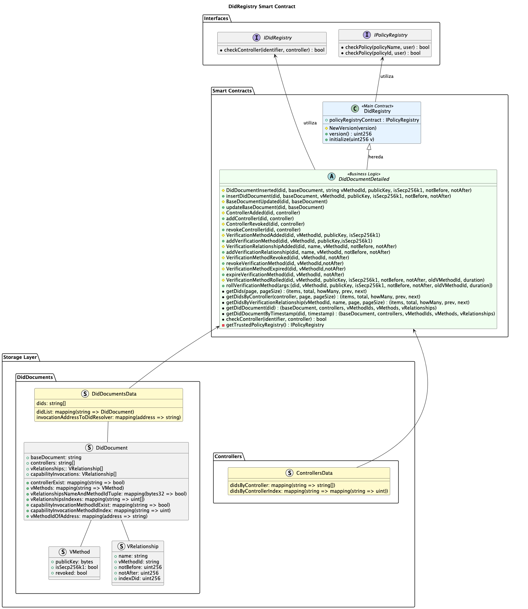

# Architecture Design Record: DidRegistryFacet Integration with Governance Diamond

## Status

Proposal

## Context

The current system has an independent DidRegistry contract that handles decentralised identity (DID) management. Integration of this functionality into the governance diamond is required to centralise access control and improve security.

## Decision

We propose to restructure the DidRegistry system following the Diamond pattern (EIP-2535) with the following changes:

### 1. Conversion to DidRegistryFacet

- Transform `DidRegistry` into `DidRegistryFacet` as part of the governance diamond
- Maintain all existing business logic in `DidDocumentDetailed`
- Integrate role-based access control

### 2. Disabling policy registry

As it is a managed registry by ISBE, the policy registry is not necessary.

### 3. New Access Roles

#### DID_REGISTRY_ROLE

- **Purpose**: Operational role for interacting with the registry
- **Permissions**:
    - Insert new DID documents
    - Update existing documents
    - Add/revoke controllers
    - Manage verification methods
    - Query registry information

#### DID_REGISTRY_MANAGER_ROLE

- **Purpose**: Administrative role with complete control
- **Permissions**: - Assignment/revocation of DID_REGISTRY_ROLE roles - List of actions: - updateBaseDocument - revokeController - revokeVerificationMethod
  It whould be done changing the original implementation of DidDocumentDetailed.onlyControllerOrAuth.

## enefits

1. **Centralised Control**: All access management is performed through the governance diamond
2. **Enhanced Security**: Granular roles for different access levels
3. **Compatibility**: Maintains the existing DidRegistry interface
4. **Scalability**: Leverages Diamond architecture for future extensions
5. **Auditability**: Centralised access control facilitates monitoring

## Consequences

### Positive

- Greater security and centralised control
- Better integration with the governance ecosystem
- Flexibility for future extensions

### Negative

- Additional complexity in deployment
- Dependency on governance diamond for DID operations

## Implementation fases

- Review Interface definition from original implementation and unify interfaces.
- Define minimum storage layout, prepare roles and implement insertDiDDocument and getDidDocument.
- Implement updateBaseDocument, getDids and getDidDocumentByTimestamp.
- Implement addController, revokeController, getDidsByController & checkController.
- Implement addVerificationMethod, revokeVerificationMethod, expireVerificationMethod.
- Implement addVerificationRelationship, rollVerificationMethod, getDidsByVerificationRelationship.
- Implement getDids, integrate in deployment scripts and test it.
