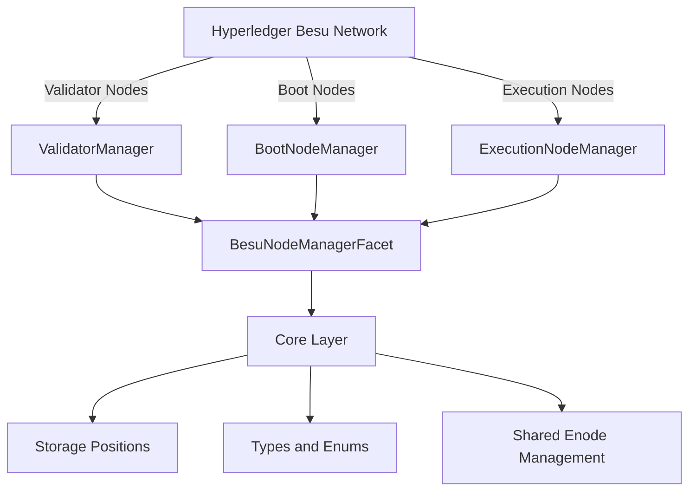
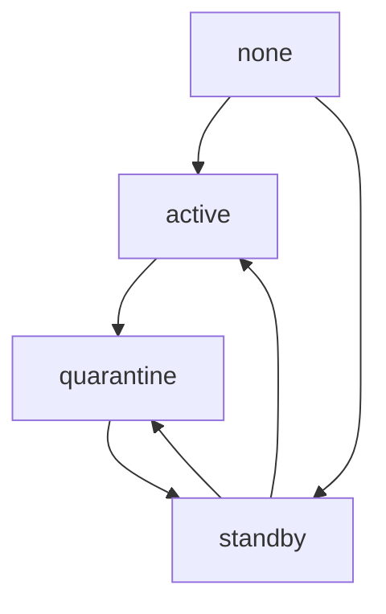

# BesuNodeManager Documentation

## Table of Contents

1. [Introduction](#introduction)
2. [Key Features and Functionalities](#key-features-and-functionalities)
3. [Step-by-Step Implementation Guidelines](#step-by-step-implementation-guidelines)
    - [Prerequisites](#prerequisites)
    - [Core Layer - Storage & Shared Logic](#core-layer---storage--shared-logic)
    - [Validator Layer](#validator-layer)
    - [BootNode and ExecutionNode Layers](#bootnode-and-executionnode-layers)
    - [Facet Layer](#facet-layer)
    - [Deployment Integration](#deployment-integration)
4. [Sample Usage Scenarios and User Instructions](#sample-usage-scenarios-and-user-instructions)
    - [Adding a Validator Node](#adding-a-validator-node)
    - [Querying Validator State](#querying-validator-state)
    - [Removing a Validator Node](#removing-a-validator-node)
    - [State Transitions](#state-transitions)
    - [Pagination](#pagination)
5. [Diagrams and Graphics](#diagrams-and-graphics)
6. [Conclusion](#conclusion)

---

## Introduction

The BesuNodeManager is a smart contract designed to manage the lifecycle of different types of nodes in a Hyperledger Besu network. It provides robust management for Validator Nodes, Boot Nodes, and Execution Nodes, ensuring network health, security, and performance. The contract follows the Diamond Pattern (EIP-2535) architecture, allowing for modular and upgradeable functionality.

---

## Key Features and Functionalities

### Node Types

- **Validator Nodes**: Participate in consensus and block validation.
- **Boot Nodes**: Facilitate peer discovery and network connectivity.
- **Execution Nodes**: Process transactions and maintain network state.

### Lifecycle Management

- **Registration**: Add new nodes to the network.
- **State Transitions**: Transition nodes between states (e.g., active, standby, quarantine).
- **Removal**: Remove nodes from the network.

### Security and Access Control

- **Role-Based Access Control (RBAC)**: Ensures only authorized accounts can manage nodes.
- **Pause Mechanism**: Allows pausing operations during critical periods.

### Gas Optimization

- **Packed Data Structures**: Optimizes storage and reduces gas costs.
- **Shared Enode Management**: Eliminates duplication across categories.

---

## Step-by-Step Implementation Guidelines

### Prerequisites

- Solidity version: 0.8.28
- Hardhat for deployment
- TypeChain for type generation

### Core Layer - Storage & Shared Logic

1. **Add Storage Positions**:
    - Define storage positions in `contracts/constants/storagePositions.sol`.
    - Example:
        ```solidity
        bytes32 constant _BESU_NODE_MANAGER_CORE_STORAGE_POSITION = keccak256(
            'com.isbe.besu.node.manager.core.storage'
        );
        ```

2. **Define Types**:
    - Create `internal/core/Types.sol` with packed data structs and enums.
    - Example:
        ```solidity
        struct ValidatorData {
            uint8 state;
            uint40 timestamp;
        }
        ```

3. **Implement Core Internal Logic**:
    - Create `internal/core/BesuNodeManagerInternalCore.sol` with shared enode management.
    - Example:
        ```solidity
        function _registerEnode(bytes32 nodeId, string memory enode) internal {
            require(bytes(enode).length > 0, 'EmptyEnode');
            require(!_isNodeRegistered(nodeId), 'NodeAlreadyRegistered');
            coreStorage().enodes[nodeId] = enode;
        }
        ```

### Validator Layer

1. **Create Interface**:
    - Define `IValidatorManager.sol` with all lifecycle functions.
    - Example:
        ```solidity
        function addValidator(string memory enode) external returns (bytes32);
        ```

2. **Implement Internal Logic**:
    - Create `internal/validators/ValidatorManagerInternal.sol` with state validation and lifecycle functions.
    - Example:
        ```solidity
        function _addValidator(string memory enode) internal returns (bytes32) {
            bytes32 nodeId = keccak256(abi.encodePacked(enode));
            _registerEnode(nodeId, enode);
            validatorData[nodeId].state = ValidatorState.active;
            validatorData[nodeId].timestamp = uint40(block.timestamp);
            return nodeId;
        }
        ```

3. **Create Facade**:
    - Create `internal/validators/ValidatorManager.sol` with RBAC and pause protection.
    - Example:
        ```solidity
        function addValidator(
            string memory enode
        )
            external
            whenNotPaused
            onlyRole(_BESU_NODE_MANAGER_ROLE)
            returns (bytes32)
        {
            return _addValidator(enode);
        }
        ```

### BootNode and ExecutionNode Layers

Follow the same pattern as the Validator Layer for BootNodes and ExecutionNodes.

### Facet Layer

1. **Create Facet**:
    - Create `BesuNodeManagerFacet.sol` that inherits from all three facades and core.
    - Example:
        ```solidity
        contract BesuNodeManagerFacet is
            ValidatorManager,
            BootNodeManager,
            ExecutionNodeManager,
            BesuNodeManagerCore
        {
            function businessIdIntrospection() external pure returns (bytes32) {
                return _BESU_NODE_MANAGER_RESOLVER_KEY;
            }
        }
        ```

2. **Implement Introspection Functions**:
    - Implement business ID and interface introspection functions.
    - Example:
        ```solidity
        function interfacesIntrospection()
            external
            pure
            returns (bytes4[] memory)
        {
            return _implementedInterfaces();
        }
        ```

### Deployment Integration

1. **Create Deployment Constants**:
    - Define constants in `tasks/deployment/constants/client/besuNodeManager.ts`.
    - Example:
        ```typescript
        export const BESU_NODE_MANAGER_RESOLVER_KEY =
            '0xed251ea052ffafa4903db889a3309600adf2ac15456e02760c1221ea3792c1ca'
        ```

2. **Update Deployment Scripts**:
    - Update `tasks/deployment/constants/DeploymentConstants.ts` and `tasks/deployTest.ts` to include BesuNodeManager.
    - Example:
        ```typescript
        import { BESU_NODE_MANAGER_DEFINITIONS } from './client/besuNodeManager'
        BUSINESS_LOGIC_DEFINITIONS = [
            ...BUSINESS_LOGIC_DEFINITIONS,
            ...BESU_NODE_MANAGER_DEFINITIONS,
        ]
        ```

3. **Verify Deployment**:
    - Create a verification script in `scripts/besuNodeManager/verifyDeployment.ts`.
    - Example:
        ```typescript
        const loupeFacet = await ethers.getContractAt(
            'IsbeLoupeFacet',
            governanceAddress
        )
        const facets = await loupeFacet.facets()
        const besuNodeManagerFacet = facets.find((f) =>
            f.functionSelectors.some(
                (sel) => sel === ethers.id('addValidator(string)').slice(0, 10)
            )
        )
        console.log(
            'BesuNodeManagerFacet registered at:',
            besuNodeManagerFacet.facetAddress
        )
        ```

---

## Sample Usage Scenarios and User Instructions

### Adding a Validator Node

1. **Deploy the Governance Diamond**:
    - Deploy the governance diamond with BesuNodeManager as a facet.
    - Example:
        ```bash
        npx hardhat run scripts/deployIsbeFactory.ts --network localhost
        ```

2. **Grant Role**:
    - Grant the `BESU_NODE_MANAGER_ROLE` to an authorized account.
    - Example:
        ```typescript
        await accessControl.grantRole(BESU_NODE_MANAGER_ROLE, adminAddress)
        ```

3. **Add Validator**:
    - Call the `addValidator` function with a valid enode.
    - Example:
        ```typescript
        const tx = await besuNodeManager
            .connect(admin)
            .addValidator('enode://abc123...@127.0.0.1:30303')
        const receipt = await tx.wait()
        const nodeId = receipt.logs.find(
            (log) =>
                log.topics[0] ===
                ethers.id('ValidatorAdded(bytes32,string,uint256,uint8)')
        ).topics[1]
        console.log('Validator added with node ID:', nodeId)
        ```

### Querying Validator State

1. **Get Validator State**:
    - Call the `getValidatorState` function with the node ID.
    - Example:
        ```typescript
        const state = await besuNodeManager.getValidatorState(nodeId)
        console.log('Validator state:', state)
        ```

### Removing a Validator Node

1. **Remove Validator**:
    - Call the `removeValidator` function with the node ID.
    - Example:
        ```typescript
        await besuNodeManager.connect(admin).removeValidator(nodeId)
        console.log('Validator removed')
        ```

### State Transitions

1. **Promote Validator**:
    - Call the `promoteValidator` function to move a standby validator to active.
    - Example:
        ```typescript
        await besuNodeManager.connect(admin).promoteValidator(nodeId)
        console.log('Validator promoted to active')
        ```

2. **Quarantine Validator**:
    - Call the `quarantineValidator` function to move a validator to quarantine.
    - Example:
        ```typescript
        await besuNodeManager.connect(admin).quarantineValidator(nodeId)
        console.log('Validator quarantined')
        ```

### Pagination

1. **Get Paginated Validators**:
    - Call the `getPaginatedValidators` function to retrieve a page of validators.
    - Example:
        ```typescript
        const validators = await besuNodeManager.getPaginatedValidators(
            ValidatorState.active,
            10,
            1
        )
        console.log('Paginated validators:', validators)
        ```

---

## Diagrams and Graphics

### Architecture Diagram



### State Transition Diagram



---

## Conclusion

The BesuNodeManager provides a comprehensive solution for managing the lifecycle of different node types in a Hyperledger Besu network. It follows best practices for security, gas optimization, and modular design. The implementation guidelines and usage scenarios provided ensure that users can effectively deploy and utilize the contract in their projects.
