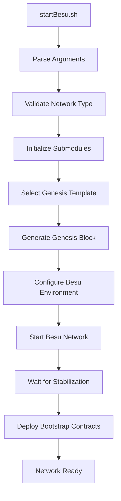

# ISBE Contract Scripts Documentation

This documentation provides comprehensive information about the `startBesu.sh` and `initSubmodules.sh` scripts used in the ISBE (Integrated Secure Blockchain Environment) project for local development and testing.

## Table of Contents

1. [Introduction](#introduction)
2. [Prerequisites](#prerequisites)
3. [User Manual](#user-manual)
4. [Technical Reference](#technical-reference)
5. [Module Dependencies](#module-dependencies)
6. [Orchestration Overview](#orchestration-overview)
7. [Troubleshooting](#troubleshooting)

## Introduction

The ISBE project provides two essential scripts for setting up and managing a local blockchain development environment:

- **`initSubmodules.sh`**: Initializes and updates Git submodules containing essential components for the ISBE blockchain network
- **`startBesu.sh`**: Orchestrates the complete startup process of a local Hyperledger Besu blockchain network with ISBE-specific configurations

These scripts are designed to streamline the development workflow by automating the complex process of setting up a local blockchain environment with proper genesis configuration, network initialization, and smart contract deployment.

### Key Features

- **Automated Submodule Management**: Handles Git submodule initialization and synchronization
- **Network Type Selection**: Supports both BARE and CASE network configurations
- **Genesis Block Generation**: Creates appropriate genesis blocks for different network types
- **Local Besu Network**: Starts a complete 4-node Hyperledger Besu network
- **Smart Contract Bootstrapping**: Deploys and configures essential governance contracts

## Prerequisites

Before using these scripts, ensure you have the following dependencies installed:

### System Requirements

- **Operating System**: Linux or macOS
- **Shell**: Bash 4.0 or later
- **Git**: Version 2.0 or later with submodule support
- **Node.js**: Version 16 or later
- **npm**: Version 7 or later

### Development Tools

- **Hardhat**: Ethereum development framework
- **Docker**: For containerized Besu deployment
- **jq**: Command-line JSON processor

### Network Access

- Internet connection for downloading submodules and dependencies
- Access to GitHub repositories:
    - `https://github.com/alastria/isbe-genesis-files`
    - `https://github.com/alastria/isbe-besu-local-deployer`

## User Manual

### Quick Start

1. **Clone the Repository**

    ```bash
    git clone https://github.com/alastria/isbe-contracts
    cd isbe-contracts
    ```

2. **Install Dependencies**

    ```bash
    npm install
    ```

3. **Start the Local Network**
    ```bash
    ./startBesu.sh
    ```

### Script Usage

#### `initSubmodules.sh`

**Purpose**: Initializes and updates Git submodules required for the ISBE project.

**Usage**:

```bash
./initSubmodules.sh
```

**What it does**:

1. Validates the presence of `.gitmodules` file
2. Synchronizes submodule configuration
3. Initializes and updates all submodules recursively

**Output Example**:

```
🔄 Syncing submodule configuration...
📥 Initializing and updating submodules...
✅ Submodules successfully initialized.
```

#### `startBesu.sh`

**Purpose**: Comprehensive script to initialize submodules, generate genesis blocks, and start a local Besu network.

**NOTE**: This script invokes initSubmodules.sh

**IMPORTANT**: This module assumes:

- The Governance Diamond is on address **0x00000000000000000000000000000000000015BE**
- Genesis generated file must be present in
    - modules/isbe-genesis-files/DEV/bare/genesis-bare-dev-GEN.json
    - modules/isbe-genesis-files/DEV/case/genesis-case-dev-GEN.json
- There must be present and correctly configured at least these networks in [network config file](../config/networks.ts):
    - genesis_validation_network_k1
    - genesis_validation_network_r1

**Usage**:

```bash
./startBesu.sh [--type <BARE|CASE>] [--help]
```

**Parameters**:

- `--type <BARE|CASE>`: Specifies the network type (default: CASE)
    - **CASE**: Standard ISBE network with full feature set
    - **BARE**: Minimal network configuration for testing
- `--help|-h`: Display help information

**Examples**:

```bash
# Start with default CASE network
./startBesu.sh

# Start with BARE network type
./startBesu.sh --type BARE

# Display help information
./startBesu.sh --help
```

**Execution Flow**:

1. **Argument Parsing**: Validates and processes command-line arguments
2. **Submodule Initialization**: Calls `initSubmodules.sh` to ensure all dependencies are available
3. **Genesis Configuration**: Selects appropriate genesis template based on network type
4. **Genesis Generation**: Creates the genesis block using `makeGenesis.sh`
5. **Besu Network Startup**: Launches the 4-node Besu network
6. **Network Stabilization**: Waits for network to stabilize (10 seconds)
7. **Bootstrap Deployment**: Deploys governance contracts using Hardhat

### Network Types Explained

#### CASE Network

- **Template**: `./modules/isbe-genesis-files/DEV/case/genesis-case-dev.json`
- **Output**: `./modules/isbe-genesis-files/DEV/case/genesis-case-dev-GEN.json`
- **Network ID**: `genesis_validation_network_k1`
- **Features**: ISBE BARE network with governance contracts

#### BARE Network

- **Template**: `./modules/isbe-genesis-files/DEV/bare/genesis-bare-dev.json`
- **Output**: `./modules/isbe-genesis-files/DEV/bare/genesis-bare-dev-GEN.json`
- **Network ID**: `genesis_validation_network_r1`
- **Features**: ISBE CASE network with governance contracts

## Technical Reference

### Script Architecture

#### Error Handling

Both scripts use `set -euo pipefail` for robust error handling:

- `-e`: Exit immediately if any command fails
- `-u`: Treat unset variables as errors
- `-o pipefail`: Fail if any command in a pipeline fails

### Core Components

#### Genesis Generation Process

The genesis generation is handled by `makeGenesis.sh` with the following workflow:

1. **Template Processing**: Uses predefined JSON templates for different network types
2. **Contract Deployment**: Embeds governance contract bytecode in genesis
3. **Node Configuration**: Configures validator nodes and network parameters
4. **Output Generation**: Creates finalized genesis file for Besu consumption

More information [here](./Genesis-generator.md)

#### Besu Network Configuration

The local deployment creates a 4-node IBFT 2.0 consensus network:

- **Consensus Algorithm**: IBFT 2.0 (Istanbul Byzantine Fault Tolerance)
- **Node Count**: 4 validator nodes
- **Network Configuration**: Docker-based deployment
- **IP Range**: 172.16.240.x (configurable)

### Configuration Management

#### Hardhat Integration

The scripts integrate with Hardhat framework for:

- Smart contract compilation and deployment
- Network configuration management
- Genesis block validation
- Bootstrap contract deployment

#### Environment Variables

Key environment variables used:

- `NODE_OPTIONS`: Controls Node.js memory allocation
- `NETWORK_TYPE`: Determines genesis template selection
- `GOVERNANCE_ADDRESS`: Fixed governance contract address (`0x00000000000000000000000000000000000015BE`)

## Module Dependencies

### Git Submodules

The project relies on two critical submodules:

#### 1. isbe-genesis-files

- **Repository**: `https://github.com/alastria/isbe-genesis-files`
- **Branch**: `gen/ver0.9` _(Note: This specific branch is required as it has not been merged yet. This will change in the future)_
- **Path**: `modules/isbe-genesis-files/`
- **Purpose**: Contains genesis block templates and network configurations
- **Structure**:
    ```
    DEV/
    ├── case/
    │   ├── genesis-case-dev.json
    │   └── genesis-case-dev-GEN.json (generated)
    └── bare/
        ├── genesis-bare-dev.json
        └── genesis-bare-dev-GEN.json (generated)
    ```

#### 2. isbe-besu-local-deployer

- **Repository**: `https://github.com/alastria/isbe-besu-local-deployer`
- **Branch**: `main` (default)
- **Path**: `modules/isbe-besu-local-deployer/`
- **Purpose**: Docker-based Hyperledger Besu network deployment tools
- **Key Components**:
    - Docker Compose configurations
    - Besu node setup scripts
    - Network initialization tools

### Node.js Dependencies

Critical npm packages used by the scripts:

#### Core Framework

- **hardhat**: Ethereum development environment
- **@nomicfoundation/hardhat-toolbox**: Essential Hardhat plugins
- **@typechain/hardhat**: TypeScript bindings for contracts

#### Utilities

- **jq**: JSON processing (system dependency)
- **dotenv**: Environment variable management
- **rimraf**: Cross-platform file removal

### System Dependencies

#### Docker Infrastructure

- **Docker Engine**: Container runtime for Besu nodes
- **Docker Compose**: Multi-container orchestration
- **Network Bridge**: Custom bridge network for node communication

#### Blockchain Tools

- **Hyperledger Besu**: Enterprise Ethereum node software configured as QBFT

## Orchestration Overview

### Startup Sequence

The complete startup process follows this orchestrated sequence:



### Process Coordination

#### 1. Initialization Phase

- **Duration**: ~30 seconds
- **Activities**:
    - Submodule synchronization
    - Dependency validation
    - Configuration setup

#### 2. Genesis Generation Phase

- **Duration**: ~60 seconds
- **Activities**:
    - Template processing
    - Contract bytecode embedding
    - Genesis block creation
    - Configuration adaptation

#### 3. Network Startup Phase

- **Duration**: ~120 seconds
- **Activities**:
    - Docker container creation
    - Besu node initialization
    - Consensus establishment
    - Network stabilization

#### 4. Bootstrap Phase

- **Duration**: ~30 seconds
- **Activities**:
    - Governance contract deployment
    - Network validation
    - Service registration

### Inter-Process Communication

#### File-Based Coordination

- **Genesis Files**: JSON configuration passed between processes
- **Configuration Files**: Docker and Besu configuration files
- **Log Files**: Centralized logging for debugging

#### Network Communication

- **JSON-RPC**: Primary interface for blockchain interaction
- **HTTP APIs**: REST endpoints for status monitoring
- **WebSocket**: Real-time event streaming

### Resource Management

#### Memory Allocation

- **Docker Memory**: Per-container limits in Docker Compose
- **System Resources**: Monitoring and allocation strategies

#### Storage Management

- **Blockchain Data**: Persistent volumes for node data
- **Configuration Files**: Temporary and persistent configurations
- **Log Files**: Rotation and retention policies

## Troubleshooting

### Common Issues and Solutions

#### 1. Submodule Initialization Failures

**Symptoms**:

```
❌ Error: .gitmodules not found. Run this script from the repository root.
```

**Solution**:

- Ensure you're running the script from the repository root directory
- Verify `.gitmodules` file exists and is properly formatted
- Check Git configuration and network connectivity

#### 2. Genesis Generation Errors

**Symptoms**:

```
❌ Invalid NETWORK_TYPE: 'INVALID'. Allowed values: BARE, CASE.
```

**Solution**:

- Use only supported network types: `BARE` or `CASE`
- Check command-line argument syntax
- Verify genesis template files exist in submodules

#### 3. Besu Startup Issues

**Symptoms**:

- Network fails to start after 10-second wait
- Docker containers exit unexpectedly
- Port conflicts on local machine

**Solutions**:

Remove Besu configuration manually and stop containers. In the **modules/isbe-besu-local-deployer** directory, run **./clean.sh** (may require sudo capabilities)

Additional steps:

- Check Docker daemon is running: `docker --version`
- Verify port availability: `netstat -tulpn | grep :8545`
- Review Docker logs: `docker logs <container-name>`
- Ensure sufficient system resources (RAM, disk space)

#### 4. Hardhat Network Connection Issues

**Symptoms**:

```
Error: could not detect network (event="noNetwork", code=NETWORK_ERROR)
```

**Solutions**:

- Verify Besu network is fully started by executing **docker ps** and additionally **docker logs -f [container-id]**
- Check network configuration in `hardhat.config.ts`
- Confirm RPC endpoints are accessible

### Recovery Procedures

#### Clean Restart

```bash
# Stop all containers (In directory modules/isbe-besu-local-deployer)
 ./clean.sh # (may require sudo capabilities)

# Start from clean state
./startBesu.sh
```
