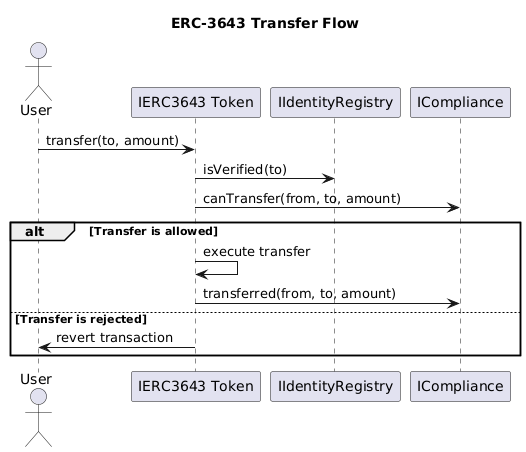
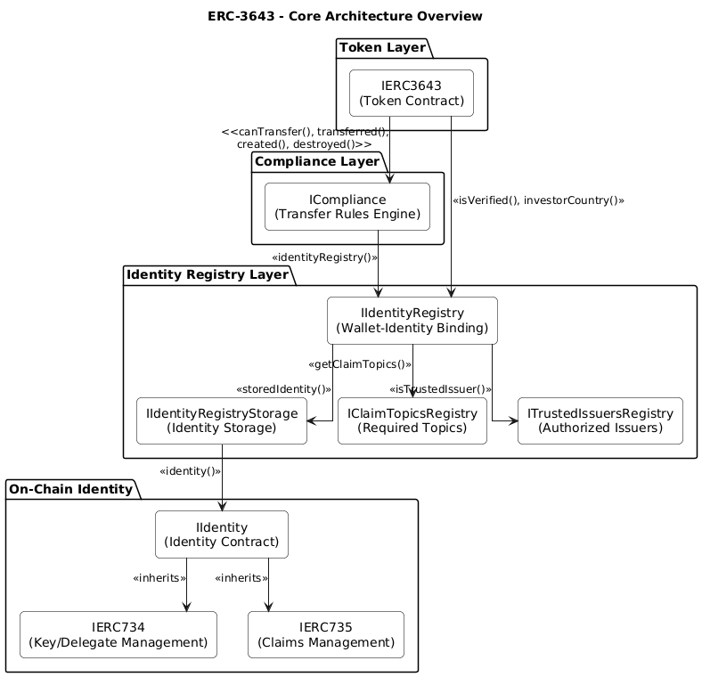
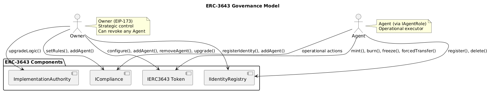
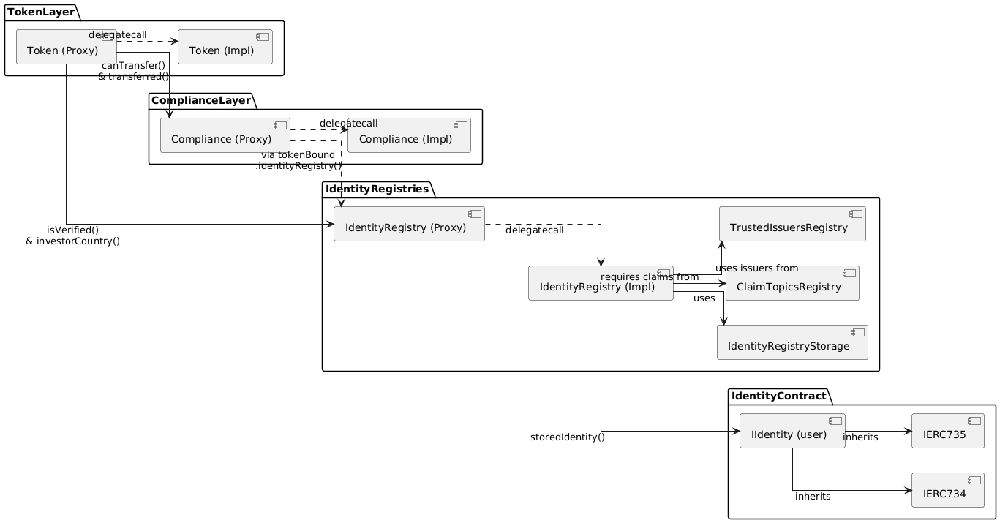
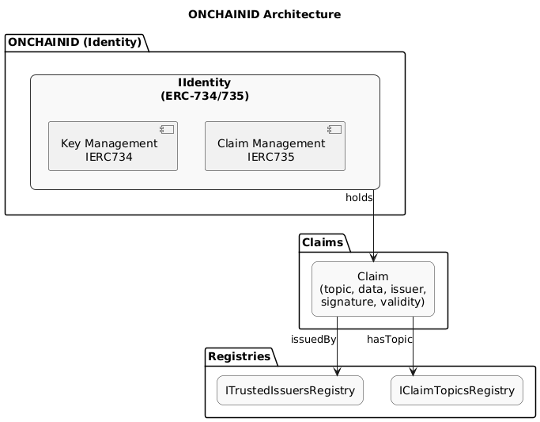
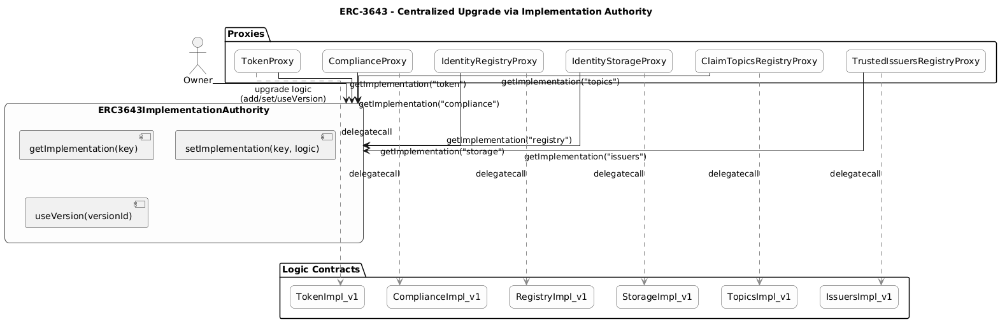
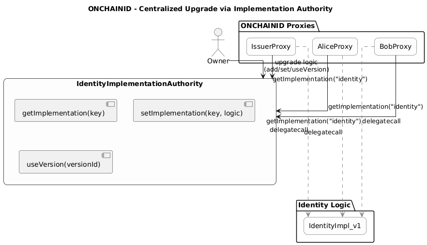

# 1. ERC‑3643 Standard Overview

The [ERC‑3643: T‑REX – Token for Regulated EXchanges](https://eips.ethereum.org/EIPS/eip-3643) standard defines a modular framework for creating **permissioned, compliant tokens**. It embeds KYC/AML, jurisdictional controls, and transfer restrictions directly into the token's logic, making it suitable for regulated instruments.

It extends ERC‑20 functionality and leverages additional interfaces for **identity**, **compliance**, and **governance**.

---

## 1.1 Key Functional Components

ERC‑3643 organizes the system into specialized modules:

| **Component**                               | **Purpose**                                                                                                                           |
| ------------------------------------------- | ------------------------------------------------------------------------------------------------------------------------------------- |
| **Token (`IERC3643`)**                      | ERC‑20-compatible fungible token extended with compliance hooks, freezing, recovery, forced transfers, pausing, and batch operations. |
| **Compliance (`ICompliance`)**              | A modular rule engine that evaluates transfers in real time (`canTransfer`). Custom logic can be plugged per token.                   |
| **Identity Registry (`IIdentityRegistry`)** | Links wallets to verified on-chain identities and checks if they satisfy required claims.                                             |
| **Identity (`IIdentity`)**                  | On-chain identity contract (ERC‑734/735) holding signed claims (e.g. KYC passed, jurisdiction, investor status).                      |
| **Claim Topics Registry**                   | Lists required identity attributes (KYC, accredited, AML, etc.).                                                                      |
| **Trusted Issuers Registry**                | Maintains a list of entities authorized to issue valid claims.                                                                        |
| **Governance (Owner & Agents)**             | Role separation: Owner has strategic control; Agents execute operational functions (mint, freeze, etc.).                              |

---

## 1.2 Transfer Flow

A transfer in an ERC‑3643 token goes through the following validation flow:

1. **Identity Verification**: The `IIdentityRegistry` checks if the sender and recipient wallets are linked to compliant identities.
2. **Compliance Check**: The `ICompliance` module executes `canTransfer(from, to, amount)`.
3. **Execution**: Only if both checks pass, the transfer proceeds.

This mechanism ensures **compliance-by-design**, preventing unauthorized transactions at the protocol level.



---

## 1.3 Entity Lifecycle

Entities in ERC‑3643 go through a regulated onboarding process:

- A wallet is associated with an `IIdentity` smart contract.
- Claims (KYC, country, status, etc.) are issued and signed by a trusted issuer.
- The identity is registered via `IIdentityRegistry`.
- Only compliant identities may receive, hold, or send tokens.

---

## 1.4 Governance and Roles

Governance is handled via two roles:

| **Role**  | **Responsibilities**                                                                                        |
| --------- | ----------------------------------------------------------------------------------------------------------- |
| **Owner** | Defined via EIP‑173. Can assign agents, upgrade contract logic, configure registries.                       |
| **Agent** | Operational role (EOA or contract). Executes tasks like minting, burning, freezing, registering identities. |

Permissions are granted per contract via the `IAgentRole` interface. Owners retain full authority and can revoke agents instantly (`removeAgent`).

---

# 2. Technical Architecture of ERC‑3643

ERC‑3643 formalizes a set of interfaces that govern token behavior, identity validation, and compliance enforcement. Its modular approach allows systems to be extended, upgraded, and integrated securely.

Canonical interface definitions:  
[`ERC-3643 Interfaces`](https://github.com/ERC-3643/ERCs/tree/master/assets/erc-3643/interfaces)

---

## 2.1 Architecture Overview

The standard defines a layered architecture:

```
IERC3643 (Token)
├── ICompliance (Compliance logic)
└── IIdentityRegistry
   └── IIdentityRegistryStorage
   └── IClaimTopicsRegistry
   └── ITrustedIssuersRegistry
└── IIdentity (per user)
```

Each layer plays a specific role:

- **Token** delegates to Compliance and Identity Registry.
- **Compliance** defines transfer rules.
- **Identity Registry** verifies that wallets meet eligibility requirements based on claims.
- **Storage** and **registries** keep modular and upgradeable control of all mappings.



---

## 2.2 Interface Summary

| **Interface**              | **Source**                                                                                                                             | **Description**                                                                        |
| -------------------------- | -------------------------------------------------------------------------------------------------------------------------------------- | -------------------------------------------------------------------------------------- |
| `IERC3643`                 | [`IERC3643.sol`](https://github.com/ERC-3643/ERCs/blob/master/assets/erc-3643/interfaces/IERC3643.sol)                                 | ERC‑20-compatible token with compliance, batch, pause, recovery, forced transfer, etc. |
| `ICompliance`              | [`ICompliance.sol`](https://github.com/ERC-3643/ERCs/blob/master/assets/erc-3643/interfaces/ICompliance.sol)                           | Implements `canTransfer`; hooks into transfer lifecycle.                               |
| `IIdentityRegistry`        | [`IIdentityRegistry.sol`](https://github.com/ERC-3643/ERCs/blob/master/assets/erc-3643/interfaces/IIdentityRegistry.sol)               | Verifies wallet–identity mapping and required claims.                                  |
| `IIdentity`                | [`IIdentity.sol`](https://github.com/ERC-3643/ERCs/blob/master/assets/erc-3643/interfaces/IIdentity.sol)                               | On-chain identity contract (ERC‑734/735); holds signed claims.                         |
| `IIdentityRegistryStorage` | [`IIdentityRegistryStorage.sol`](https://github.com/ERC-3643/ERCs/blob/master/assets/erc-3643/interfaces/IIdentityRegistryStorage.sol) | Stores wallet–identity relations.                                                      |
| `IClaimTopicsRegistry`     | [`IClaimTopicsRegistry.sol`](https://github.com/ERC-3643/ERCs/blob/master/assets/erc-3643/interfaces/IClaimTopicsRegistry.sol)         | Lists required identity claims.                                                        |
| `ITrustedIssuersRegistry`  | [`ITrustedIssuersRegistry.sol`](https://github.com/ERC-3643/ERCs/blob/master/assets/erc-3643/interfaces/ITrustedIssuersRegistry.sol)   | Maintains list of trusted KYC/claim issuers.                                           |
| `IAgentRole`               | [`IAgentRole.sol`](https://github.com/ERC-3643/ERCs/blob/master/assets/erc-3643/interfaces/IAgentRole.sol)                             | Grants/revokes agent permissions.                                                      |

---

## 2.3 Mandatory Requirements (MUSTs)

The ERC‑3643 specification mandates that any conforming token must implement the following features:

| **Requirement**          | **Interfaces**                   | **Key Methods**                                      |
| ------------------------ | -------------------------------- | ---------------------------------------------------- |
| ERC‑20 compatibility     | `IERC3643`                       | `transfer`, `balanceOf`, etc.                        |
| Compliance enforcement   | `ICompliance`                    | `canTransfer`, `transferred`, `created`, `destroyed` |
| On-chain identity system | `IIdentityRegistry`, `IIdentity` | `isVerified`, `identity()`                           |
| Freezing and pause       | `IERC3643`                       | `setAddressFrozen`, `pause`, `unpause`               |
| Mint & burn              | `IERC3643`                       | `mint`, `burn`                                       |
| Recovery                 | `IERC3643`                       | `recoveryAddress`                                    |
| Forced transfers         | `IERC3643`                       | `forcedTransfer`                                     |
| Batch operations         | `IERC3643`                       | `batchMint`, `batchTransfer`                         |
| Owner/Agent role system  | `IAgentRole`                     | `addAgent`, `removeAgent`, `isAgent`                 |

All requirements are detailed in the [ERC‑3643 specification](https://github.com/ERC-3643/ERCs/blob/master/ERCS/erc-3643.md).

---

## 2.4 Governance Model (Owner & Agent)

Governance is enforced through a combination of:

- **EIP‑173 `owner()`**: Central authority for strategic decisions
- **`IAgentRole`**: Operational permissions delegated to trusted agents

Each contract (token, compliance, registry) enforces role validation independently. Agents can be revoked without contract redeployment, enabling secure delegation.



# 3. ERC‑3643 Reference Implementation

The [official ERC‑3643 implementation](https://github.com/ERC-3643/ERC-3643) provides a production-ready, modular suite of smart contracts aligned with the [ERC‑3643 standard](https://eips.ethereum.org/EIPS/eip-3643). It is designed to simplify the deployment and management of permissioned, compliant tokens — including upgradeability, operational delegation, and identity integration via [ONCHAINID](https://github.com/ERC-3643/ONCHAINID).

Originally known as **T‑REX**, the implementation has since been formalized under the `ERC-3643` GitHub organization and is widely used for regulated token deployments.

---

## 3.1 Architecture Overview

The system encapsulates the full ERC‑3643 stack: token, compliance, identity registry, claim registries, and governance. Each component is deployed as an upgradeable proxy and wired together via a factory contract.

Key characteristics:

- Full modular deployment (token + compliance + identity)
- Upgradeable via centralized authority contracts
- Uses CREATE2 for deterministic addresses
- Preconfigured to support cross-chain deployment and interoperability



---

## 3.2 ONCHAINID: Identity Layer

[ONCHAINID](https://github.com/ERC-3643/ONCHAINID) is the identity management layer used in the ERC‑3643 ecosystem. It is based on [ERC‑734](https://eips.ethereum.org/EIPS/eip-734) and [ERC‑735](https://eips.ethereum.org/EIPS/eip-735), and provides on-chain identity contracts for natural and legal persons.

### Key Functions:

- Represents identities as smart contracts
- Stores verifiable claims (e.g., KYC passed, residency, investor type)
- Claims are signed by trusted issuers and linked via registries
- Supports identity recovery, role delegation, and metadata

Each wallet interacting with a permissioned token must be linked to an ONCHAINID identity contract.

The reference implementation includes:

- **ONCHAINID Factory** for automated deployment of identities
- Deterministic identity addresses using `CREATE2`
- Optional ONCHAINID assignment to the token itself for metadata (e.g., ISIN, prospectus)



---

## 3.3 Deployment via Factory Pattern

Deployment is handled by a **factory contract** that orchestrates the creation of all required components in a single transaction. This guarantees atomic setup and consistent configuration across environments.

### Deployed Components:

- ERC‑3643 token
- Identity Registry + Storage
- Claim Topics Registry
- Trusted Issuers Registry
- Compliance contract (Basic or Modular)
- ONCHAINID instances for token and issuer

### Deployment Flow:

1. Issuer invokes the factory with config parameters.
2. Proxy contracts are deployed using CREATE2.
3. All components are interconnected:
    - Token ↔ IdentityRegistry ↔ Compliance
    - Compliance ↔ Rules
    - Registries ↔ ONCHAINID
4. Ownership and agent roles are configured.
5. The entire system is handed over to the issuer.

This pattern allows:

- Predictable addresses (useful for allowlisting)
- Fully automated setup
- Secure and clean separation of logic vs. data

---

## 3.4 Upgrade Pattern – Implementation Authority

The implementation adopts a **centralized upgrade model** using an `ImplementationAuthority` contract. This is conceptually similar to the [Beacon Proxy](https://docs.openzeppelin.com/contracts/4.x/api/proxy#BeaconProxy) pattern.

### Structure:

- Each proxy (e.g., token, registry, compliance) forwards calls to its logic via `delegatecall`.
- Instead of pointing directly to a logic address, the proxy asks an `ImplementationAuthority` for the current version.
- Authorities can be updated by the owner to deploy new logic.

There are typically two main authorities:

| **Authority**                     | **Controls**                  |
| --------------------------------- | ----------------------------- |
| `ERC3643ImplementationAuthority`  | Token, Compliance, Registries |
| `IdentityImplementationAuthority` | ONCHAINID contracts           |

### Benefits:

- Seamless upgrades without redeploying proxies
- Shared versions across multiple deployments
- Issuer-level isolation for governance or upgrades
- Option to transfer or lock the authority post-deployment



_Figure: ERC‑3643 Implementation Authority structure_

&nbsp;



_Figure: ONCHAINID Implementation Authority structure_

---

This implementation makes ERC‑3643 practical and scalable for real-world deployments, offering issuers complete control over governance, compliance, and identity while conforming to the official specification.
