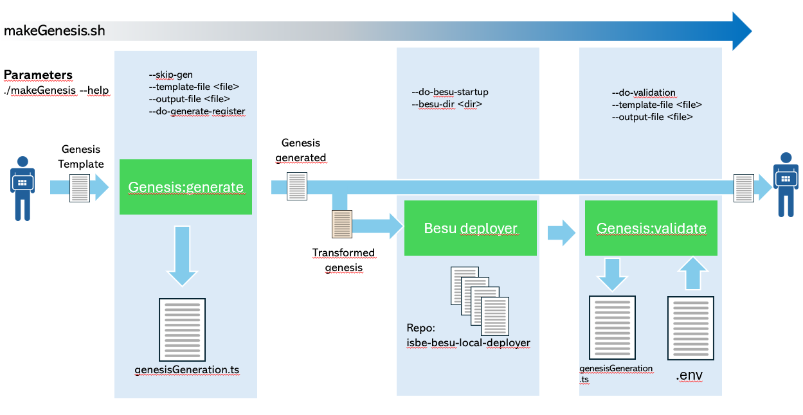
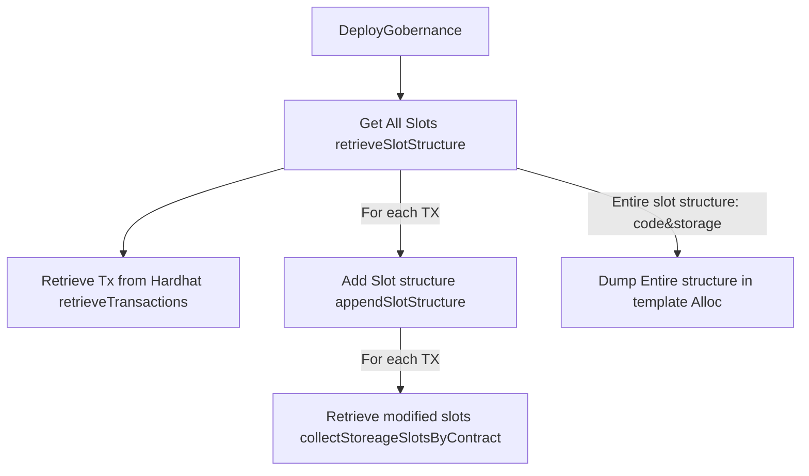
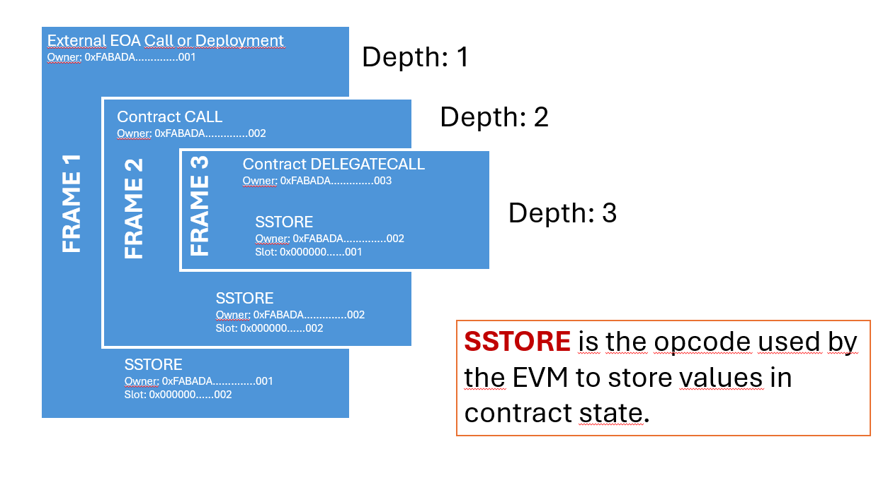

# GENESIS GENERATOR

This document describes genesis generation procedures and technical details. This tool has been automated to generate genesis and test it locally using besu local deployer. Process can be shortened by skipping steps, so it is suitable for developing and testing, not only for generation.

Please, take a look to this ADR: [ADR 004](./adrs/ADR_004-DespliegueGenesis.md).

It includes two guides:

1. **User manual** intended for testers and deployers. This section provides a detailed view of how this tool can be used for genesis generation and testing
2. **Technical details** intended for developers and maintainers. It describes relevant functionalities and files aimed to help coders in maintenance

## USER MANUAL

If it is the first time you use this repo, you need to install all packages and compile all contracts

```bash
npm i
npm run compile
```

The purpose of this section is to provide a guide for exploiting the functionalities related to the generation of the ISBE genesis. The entry point to this tool's functionalities is the makeGenesis.sh script. This script performs all the necessary steps to generate, test, and debug the genesis block generation process. The following diagram provides an overview of this process:



```bash
./makeGenesis.sh --help

Usage:
  --skip-gen                       Skip the genesis generation process.
  --do-besu-startup                Run the Besu startup procedure.
  --do-validation                  Execute post-start validation steps.
  --besu-dir <path>                Specify the directory containing the Besu build.
  --template-file <file>           Specify the genesis template JSON file to use. (MANDATORY)
  --output-file <file>             Specify the generated output JSON file. (MANDATORY if not skipping genesis)
  --do-generate-register           Generate contract register JSON. (Default: false)
  --gobernance-address <address>   Specify the governance contract address. (MANDATORY)


Example:
  ./script.sh --skip-gen --do-besu-startup --besu-dir ./besu/ --gobernance-address 0x00000000000000000000000000000000000015BE

Description:
  This script orchestrates the Besu genesis setup.
```

### Genesis generate

This subprocess is executed whenever this command is run unless the **--skip-gen** parameter is specified. In this case, the process will continue with a previously generated genesis if it exists, or it will throw an error if that genesis does not exist.

The parameters **--template-file and --output-file** are mandatory. The first specifies the Genesis template to be used, onto which the Genesis generation will be dumped, resulting in the file specified in the second parameter.

By default, a Contract Registry file is not generated. This JSON-file contains an index for locating a contract address using the contract name. This function can be activated by adding **--do-generate-register** flag. It is relevant to point out that if --do-validation flag is enabled, Contract Registry will be generated even if --do-generate-register is not enabled. The reason is because this file is needed for validation process as it is required to obtain the addresses for contracts

**IMPORTANT:** This process changes Governance Contract Address as specified in --gobernance-address parameter. Currently, for the Governance Diamond, the address is:

**0x00000000000000000000000000000000000015BE**.

**IMPORTANT:** First alloc address will be considered as ISBE Admin. Please, make sure the first alloc corresponds to it.

**IMPORTANT:** The Genesis generation process requires large amounts of memory (tested with 32GB) and may take several minutes. Therefore, remain calm and do not panic if it gets stuck for several minutes at this point:

````
Analyzing transaction 0xd98ccc4be2dc7a0850e145ec2626e57e174de41a73ba09bdf6b47204f9562b14 ...
TX IS A CONTRACT CREATION: 0x9A9f2CCfdE556A7E9Ff0848998Aa4a0CFD8863AE
Root owner (depth=1) is 0x9a9f2ccfde556a7e9ff0848998aa4a0cfd8863ae
Requesting TX trace from Hardhat (could take several minutes. Please be patient.)...       <-------------------------------- This line
``

### BESU DEPLOYER
If the **--do-besu-startup** flag is enabled, the script will launch the besu deployer using the genesis generated in the previous process as genesis. To do this, the **--besu-dir** parameter must contain the directory where Besu repository is located (isbe-besu-local-deployer). Otherwise, the process will fail.

**IMPORTANT:** Bear in mind that Besu genesis file is not a pure genesis configuration. It is necessary to add Besu's own metadata. Therefore, the process generates the Besu configuration file based on the generated genesis:

```json
{
 genesis:{...},
 blockchain: {
    nodes: {
      generate: true,
      count: 4,
      besuVersion: "latest",
      ip: "172.16.240"
    }
 }
}
````

### Genesis validation

This subprocess performs tests and deployments on the local besu network deployed in the previous step on the governance diamond to ensure that the genesis has been generated correctly. This subprocess is activated with the **--do-validation** flag and requires the **--template-file** parameter, as it will extract information from there to process the tests.

**IMPORTANT:** It is necessary to include in the .env file the private key that generates the first alloc address of the genesis (for K1 and for R1). It is not necessary to specify whether the network works with the K1 or R1 signature; that information is extracted from the genesis template.

### Common usages

**Generate genesis only:**

```bash
./makeGenesis.sh \
  --template-file /Users/marcosserradilla/dev/workspace/io.builders/isbe/isbe-genesis-files/DEV/bare/genesis-bare-dev-GEN.json  \
  --output-file /genesis-bare-dev-GEN.json \
  --gobernance-address 0x00000000000000000000000000000000000015BE
```

**Generate genesis and perform all checks**

```bash
./makeGenesis.sh \
    --template-file <template-location>  \
    --output-file  <generated-file-location> \
    --do-validation \
    --do-besu-startup
    --besu-dir <isbe-besu-local-deployer_repo-dir> \
    --gobernance-address <governance-address>
```

**Check previously generated genesis**
In this case genesis is already installed in besu-local-deployer

```bash
./makeGenesis.sh \
    --template-file <template-location>  \
    --do-validation \
    --do-besu-startup
    --besu-dir <isbe-besu-local-deployer_repo-dir>
    --gobernance-address <governance-address>
    --skip-gen
```

## TECHNICAL DETAILS

This section describes the development; it serves as a guide for developers to maintain and extend the functionality of the Genesis generation. I strongly recommend reading the previous section to familiarise yourself with the main generation functions.

As exposed, there exist several subprocesses involved (check previous schema):

- Genesis generation
- Automatic testing
    - Besu deployment
    - Automatic tests

### Genesis generation process

I think it is important to note that this generation process is generic; so it can be used for other deployment processes.

Steps are shown, included corresponding functions:



**Deploy gobernance:** Entry poiny of this functionality is **genesis:generate** located in **task/genesisGeneration.ts**. This task processes parameters and read files involved in this process.
**Get All Slots**: This function (**retrieveSlotStructure()**) in file **script/slotStractor.ts** perform:

- Extract all transactions (Hashes only) **retrieveTransactions()**
- For each Tx calls **appendSlotStructure()** which returns contract code, contract name, contract modified slots and values add this information to previous information. The information from each transaction is merged with previous transactions, resulting in an aggregate of all transactions that have been deployed on the Hardhat network.
- The **AppendStructure()** function obtains the information from the modified slots for each contract and adds to that information the final value of each modified slot, the deployed bytecode of the contract, and a label with the name of the contract. The latter is not necessary but is very informative. To obtain the list of modified slots, the **collectStorageSlotsByContract()** function is invoked. Due to the complexity of this function and its importance, it will be described separately.

**collectStorageSlotsByContract() function:** This function is the core of this process and is where most of the functionality resides. Firstly, as indicated in ADR 004, there is no immediate way to extract slots associated with contracts when the slot structure is complex. In this regard, the use of the diamond pattern, which places information outside standard slots, makes it impossible to use most plugins.

The method used to generate and detect modified slots is to review the entire trace of each transaction in search of the OPCODE **SSTORE**, responsible for saving data in a contract state slot.This method is very effective for obtaining the list of modified slots. However, it is necessary to know which contract the slot refers to. Answering this question is not easy, as it requires partially emulating the behavior of the EVM in relation to two key parameters: depth and frames.

The Ethereum Virtual Machine (EVM) executes transactions through a stack-based call structure. Each call or contract creation spawns a new execution frame (or context) that encapsulates its own state, including memory, stack, program counter, gas, and environment variables.

Execution Depth (depth)

- The EVM maintains a call depth counter, incremented every time a new frame is created (e.g., via a CALL or CREATE).
- The maximum call depth is 1024; exceeding this limit causes a failure (CALL/CREATE returns 0).
- Each frame operates independently, but shares or isolates storage and balance depending on the opcode used.

This is described in next scheme:



These are the opcodes that increment depth and creates a new frame:
| Opcode | Description | Frame Behavior | Impact On Genesis Generation Process |
|---------------|--------------------------------------------------------------------|---------------------------------------------------------------|----------------------------------------------------------------------------------|
| **CALL** | Invokes another contract, optionally transferring ETH. | Creates a new frame with its own memory, stack, and storage scope. | Change the owner contract. Within the newly created frame, all calls to SSTORE refer to the contract being called. |
| **DELEGATECALL** | Executes another contract’s code in the caller’s context. | Creates a new frame, but reuses caller’s storage, sender, and value. | Although the depth increases and a frame is created, given the nature of the DELEGATE call, the proprietary contract does not change. It remains the same as before. |
| **STATICCALL** | Like `CALL`, but disallows state modifications. | New frame, read-only execution. | The same thing happens as with call, but a static call (and nested calls of any type) should not generate changes in the blockchain; therefore, it does not modify slots or create new contracts. The function processes this OPCODE as a CALL, and although it is not the most appropriate, it does not cause serious problems in the genesis; at most, it would add empty slots, which is a minor problem. |
| **CREATE** | Deploys a new contract from bytecode in memory. | New frame executes the constructor code. | Creating a new contract increases the depth and generates a new frame to execute the constructor. This situation is very similar to CALL, but in this case, the address of the generated contract is unknown until it exits the current frame and returns to the previous one. This complicates the processing of this opcode. |
| **CREATE2** | Like `CREATE`, but computes the address deterministically using `salt` and `keccak256`. | Same frame behavior as `CREATE`. | The same applies to CREATE2. |

Additionally, comprehensive error handling has been included to ensure that the process functions properly and as expected.

### Automatic testing

- **Besu deployment:** Start Besu using **isbe-besu-local-deployer** with generated genesis with default configuration in batch mode.

- **Validation process:** Perform tests on the governance diamond and deploy the facets of the use cases through the governance diamond to check that everything is working as intended. This process is performed for both 1 and r1. The curve is selected based on how it is configured in the genesis template.
