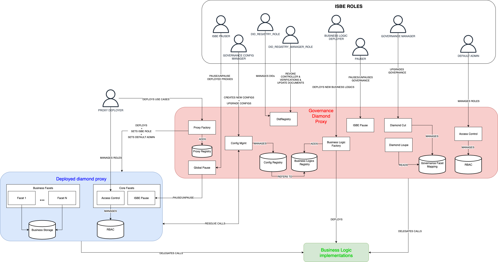
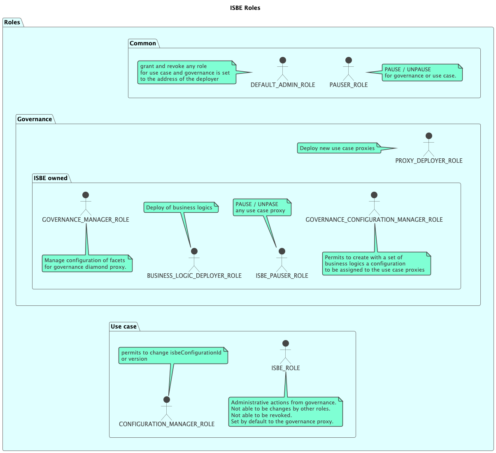
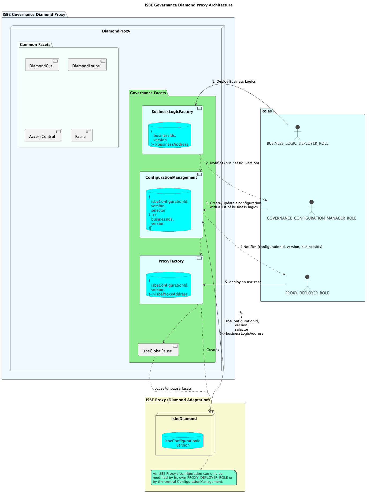

### Governance Architecture Documentation

### Table of Contents

- **[Overview](#overview)** 
- **[Core Contract](#core-contract)** 
- **[Role-Based Access Control (RBAC)](#role-based-access-control)** 
- **[Governance Facets](#governance-facets)** 
- **[Use Cases Facets](#use-cases-facets)** 

# Overview

This document outlines the architecture for deploying and managing the governance logic, utilizing an EIP-2535 Diamond contract. The system is engineered to be modular, secure, and upgradable by separating responsibilities through role-based access control (RBAC) and specialized facets.

# Core Contract

The heart of the governance framework is a single **Diamond contract (EIP-2535)**. This contract serves as a central proxy, delegating function calls to various implementation contracts known as facets. This design allows for the atomic addition, replacement, and removal of functionalities without requiring data migration.

# Role-Based Access Control

A role-based system restricts access to critical functionalities. Each role is granted specific permissions within the ecosystem, creating a clear separation of duties between governance and operational management.

## Common Roles

These roles are applicable to both the central Governance contract and the individual use-case proxies.

- **`DEFAULT_ADMIN_ROLE`**
    - **Purpose**: The most privileged role, holding ultimate authority over a contract's administration. It is automatically assigned to the address that deploys the contract.
    - **Permissions**: Authorised to grant and revoke any other role. It serves as the root administrator.

When deploying diamond proxies for specific use cases, the DEFAULT_ADMIN_ROLE is assigned only to the msg.sender (the account performing the deployment). If the msg.sender attempts to assign the DEFAULT_ADMIN_ROLE to additional accounts at deployment time (by including them in the initial RBAC array), those assignments will be ignored.

When deploying the governance contract, roles assignment will be managed by the deployment script.

- **`PAUSER_ROLE`**
    - **Purpose**: A dedicated role for managing the operational status of a contract.
    - **Permissions**: Authorised to pause and un-pause the functionality of the contract it is assigned to. This acts as a crucial safety mechanism.

## Governance Roles

These roles are specific to the management and operation of the central ISBE Governance Diamond Proxy.

- **`GOVERNANCE_MANAGER_ROLE`**

    - **Purpose**: Responsible for the structural integrity and functionality of the central governance diamond proxy.
    - **Permissions**: Authorised to manage the facet configuration of the governance diamond. This includes adding, removing, or replacing the smart contracts that define the governance system's behaviour.

- **`BUSINESS_LOGIC_DEPLOYER_ROLE`**

    - **Purpose**: Manages the lifecycle of business logic contracts within the ecosystem.
    - **Permissions**: Authorised to deploy new business logic contracts. This role is central to introducing new features or updates.

- **`GOVERNANCE_CONFIGURATION_MANAGER_ROLE`**

    - **Purpose**: Defines the official sets of functionalities available to use-case proxies.
    - **Permissions**: Authorised to create and manage 'configurations'. A configuration is a defined set of business logics that can be collectively assigned to a use-case proxy.

- **`ISBE_PAUSER_ROLE`**

    - **Purpose**: A high-level administrative role for network-wide safety operations.
    - **Permissions**: Authorised to pause and un-pause any use-case proxy across the entire network, providing a global override for security.

- **`PROXY_DEPLOYER_ROLE`**
    - **Purpose**: Responsible for instantiating new use-cases on the platform.
    - **Permissions**: Authorised to deploy new use-case proxies through the `ProxyFactoryFacet`.

## Use-Case Roles

These roles operate within the scope of an individual use-case proxy.

- **`CONFIGURATION_MANAGER_ROLE`**

    - **Purpose**: Manages the functional configuration of a specific use-case proxy.
    - **Permissions**: Authorised to change the `isbeConfigurationId` or the version of the configuration assigned to their proxy, allowing for upgrades and functional changes.

- **`ISBE_ROLE`**
    - **Purpose**: Represents the Governance contract when performing administrative actions on a use-case proxy.
    - **Permissions**: This role is automatically assigned to the central governance proxy's address within each use-case proxy. It is immutable and cannot be revoked by other roles, ensuring the governance contract always retains administrative oversight.

# Governance Facets

The Diamond contract is composed of the following facets, each with a unique responsibility:

- **`DiamondCutFacet`**:

    - **Function**: Exposes the functionality to modify the diamond's facets (`diamondCut`, `facetUpdates`).
    - **Access**: Restricted exclusively to the `GOVERNANCE_MANAGER_ROLE`, enabling secure governance updates.

- **`DiamondLoupeFacet`**:

    - **Function**: Provides introspection capabilities, allowing any actor (internal or external) to query which facets and functions are registered with the diamond.
    - **Access**: Public.

- **`BusinessLogicFactoryFacet`**:

    - **Function**: Manages the deployment and versioning of business logic contracts (implementations). Each business logic is registered with a unique `businessId` and a version number.
    - **Access**: Usage is restricted to the `BUSINESS_LOGIC_DEPLOYER_ROLE`.

- **`ConfigurationManagement`**:

    - **Function**: A factory for manages configurations of diamonds to create different use cases.
    - **Default Behaviour**:

        - When a configuration is created, a list of facets must be assigned and it is set to version 1.
            - The map from selectors to address is created.
            - The map from interface identifier to boolean is created.
        - When a configuration is updated inserting, removing or updating facets:

            - The map from selector to address is updated with the differences.
            - The map from interface identifier to boole is updated.
            - A final transactions publish the new version

        - **Access**: Proxy deployment is permitted for the `GOVERNANCE_CONFIGURATION_MANAGER_ROLE`.

- **`ProxyFactoryFacet`**:

    - **Function**: A factory for deploying new proxies (diamonds) for use cases.
    - **Default Behaviour**:

        - A set of essential governance facets (`DiamondCutFacet`, `DiamondLoupeFacet`, `AccessControlFacet`, and `IsbePauseFacet`) are automatically added to each new proxy.
        - The `DEFAULT_ADMIN_ROLE` is assigned to de sender of the transaction.
        - The `ISBE_ROLE` is configured by default to the governance proxy.

    - **Access**: Proxy deployment is permitted for the `PROXY_DEPLOYER_ROLE`.

- **`GlobalIsbePause`**:

    - **Function**: Allows for the centralised pausing and unpausing of any proxy contract deployed via the `ProxyFactoryFacet`.
    - **Access**: Restricted exclusively to the `ISBE_PAUSER_ROLE` to facilitate rapid responses to security incidents.

- **`AccessControlFacet`**:

    - **Function**: Assigns and revokes roles to/from the accounts.
    - **Access**: restricted to `DEFAULT_ADMIN_ROLE`.

- **`ISBEPauseFacet`**:

    - **Function**: Pauses/Unpauses the governance diamond proxy.
    - **Access**: restricted to `PAUSER_ROLE`.

# Use Cases Facets

Each use case will have different facets based on its specific business logic. However, a set of core facets will always be added—regardless of the use case—by the governance smart contract that deploys the diamond proxies :

- **`AccessControlFacet`**:

    - **Function**: Assigns and revokes roles to/from the accounts.
    - **Access**: restricted to `DEFAULT_ADMIN_ROLE`.

- **`ISBEPauseFacet`**:

    - **Function**: Pauses/Unpauses the use case diamond proxy.
    - **Access**: restricted to `PAUSER_ROLE` and `ISBE_ROLE`.

