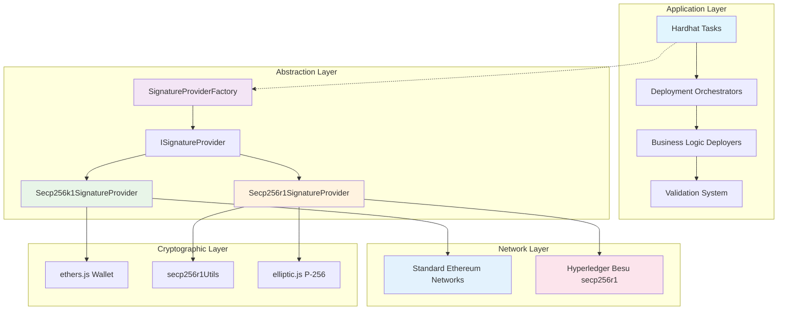
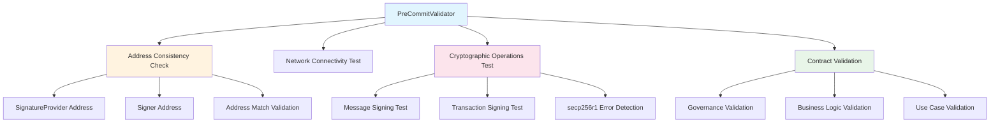
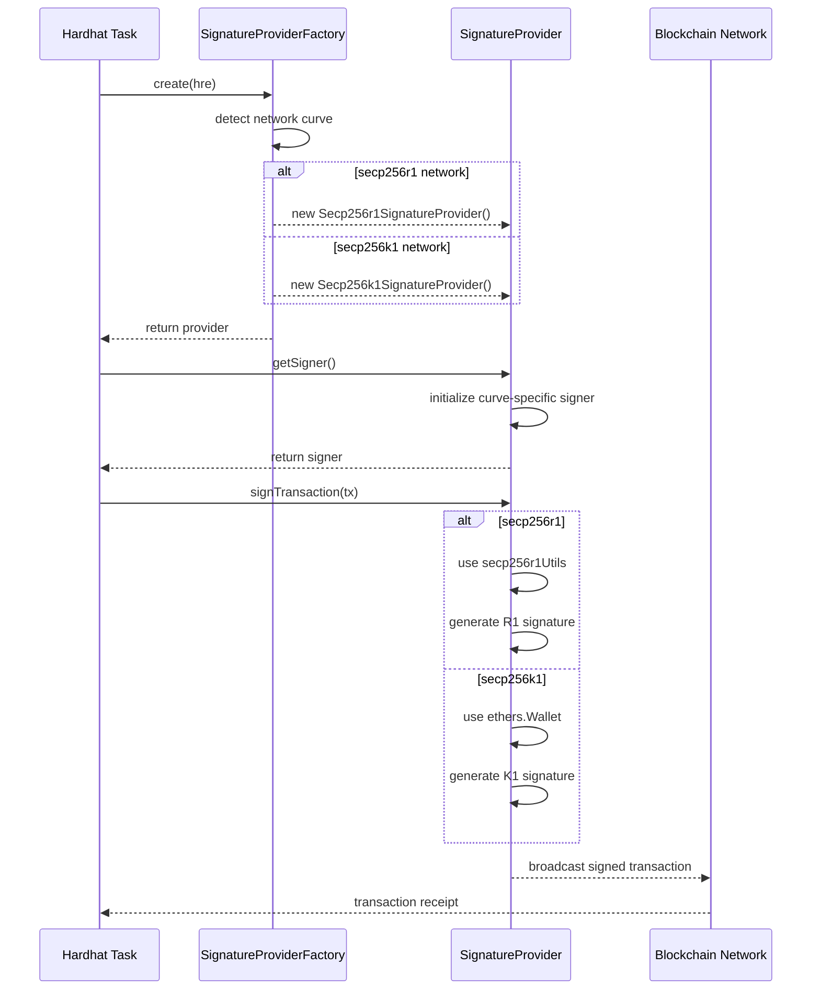
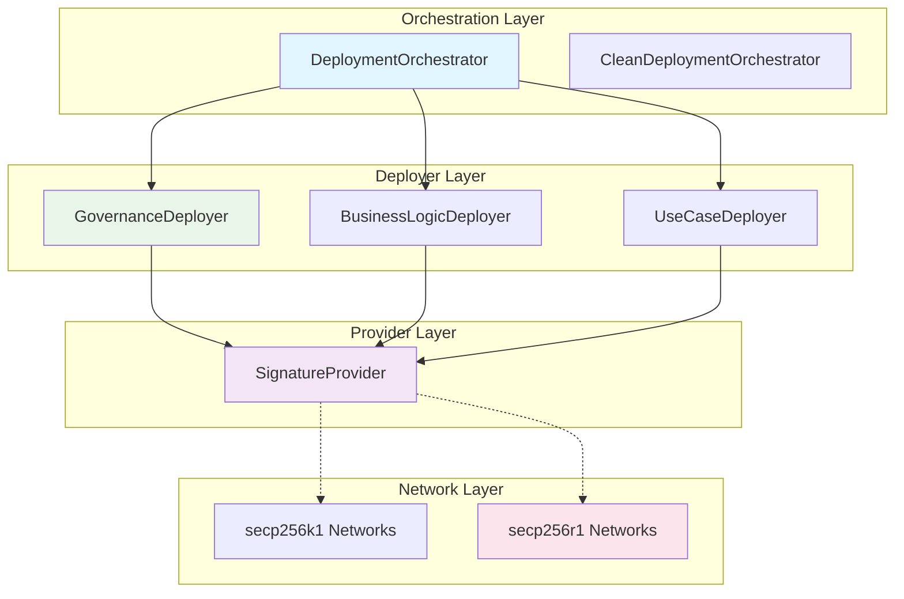
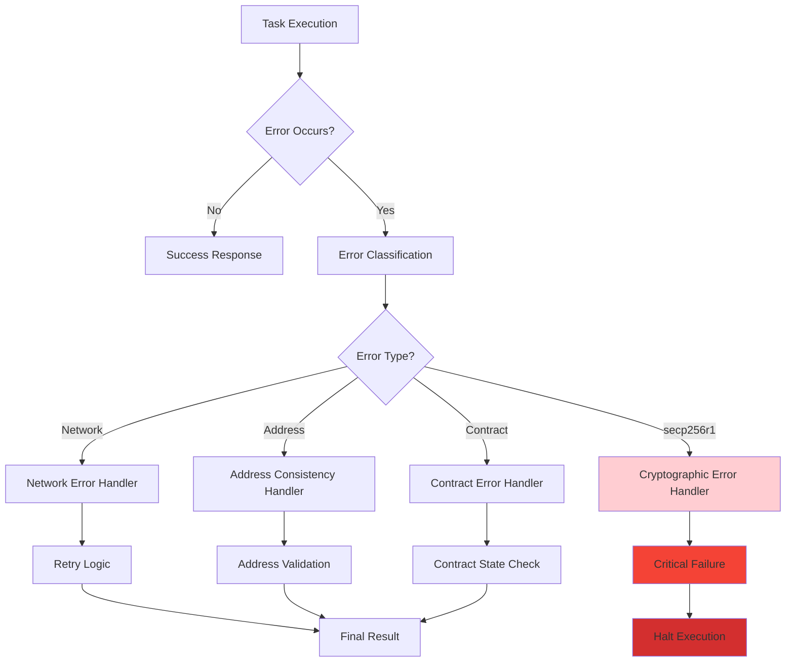
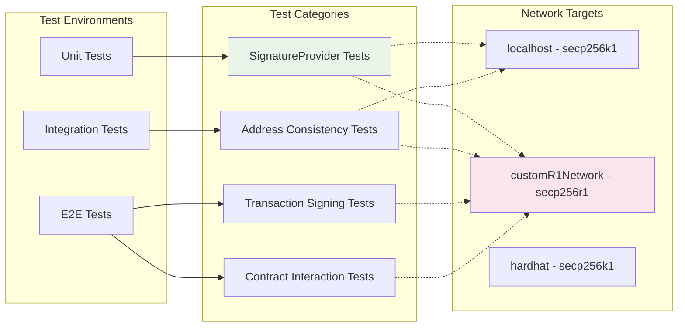

# ISBE secp256r1 Complete Implementation Guide

**Version**: 2.0  
**Last Updated**: October 2025  
**Status**: Production Ready with Pending Improvements

## 📋 Table of Contents

1. [Executive Summary](#executive-summary)
2. [System Architecture](#system-architecture)
3. [Current Implementation Status](#current-implementation-status)
4. [SignatureProvider Analysis](#signatureprovider-analysis)
5. [Critical Tasks Requiring Updates](#critical-tasks-requiring-updates)
6. [Implementation Patterns](#implementation-patterns)
7. [Enhanced Validation System](#enhanced-validation-system)
8. [Network Configuration](#network-configuration)
9. [Available Commands](#available-commands)
10. [Troubleshooting Guide](#troubleshooting-guide)
11. [Future Roadmap](#future-roadmap)

---

## 🎯 Executive Summary

The ISBE project successfully supports **secp256r1 cryptographic operations** on Hyperledger Besu networks. The system uses a **SignatureProvider pattern** to abstract cryptographic operations and ensure compatibility across both secp256k1 (standard Ethereum) and secp256r1 (NIST P-256) curves.

### ✅ **What's Working**

- ✅ Enhanced PreCommitValidator with strict error handling
- ✅ secp256r1 cryptographic operations (key generation, signing, verification)
- ✅ Network connectivity and transaction processing
- ✅ Role management and governance operations
- ✅ Diamond pattern contracts on secp256r1 networks
- ✅ Comprehensive validation system with detailed error reporting
- ✅ **eth_call functionality** for read-only blockchain operations

### ⚠️ **What Needs Attention**

- ⚠️ **6 critical write operations** need SignatureProvider conversion
- ⚠️ Some utility tasks could benefit from consistent addressing
- ⚠️ Documentation updates for new validation patterns

---

## 🏛️ System Architecture

### **Overview**

The ISBE secp256r1 implementation follows a **layered architecture** that abstracts cryptographic operations through the SignatureProvider pattern. This design ensures compatibility between secp256k1 (standard Ethereum) and secp256r1 (NIST P-256) curves while maintaining security and performance.

### **High-Level Architecture Diagram**



### **Core Components**

#### **1. SignatureProvider Pattern**

**Purpose**: Abstract cryptographic operations to support multiple elliptic curves

**Key Files**:

- `tasks/deployment/providers/ISignatureProvider.ts` - Interface definition
- `tasks/deployment/providers/SignatureProviderFactory.ts` - Factory pattern implementation
- `tasks/deployment/providers/Secp256k1SignatureProvider.ts` - Standard Ethereum implementation
- `tasks/deployment/providers/Secp256r1SignatureProvider.ts` - secp256r1 implementation

```typescript
interface ISignatureProvider {
    getCurveType(): 'secp256k1' | 'secp256r1'
    getSigner(): Promise<Signer>
    getAddress(): Promise<string>
    signTransaction(transaction: TransactionRequest): Promise<string>
}
```

**Architecture Benefits**:

- ✅ **Curve Abstraction**: Tasks don't need to know which curve they're using
- ✅ **Consistent Interface**: Same API for both secp256k1 and secp256r1
- ✅ **Easy Testing**: Mock implementations for unit tests
- ✅ **Future Extensibility**: Easy to add new curves (e.g., ed25519)

#### **2. Network Detection & Configuration**

**Auto-Detection Flow**:

```typescript
// Network configuration with curve metadata
const networkConfig = {
    customR1Network: {
        url: 'http://172.16.240.30:8545',
        chainId: 2222,
        curve: 'secp256r1', // 🔑 Key discriminator
        secp256r1Accounts: [...] // Curve-specific accounts
    }
}

// Factory automatically selects correct provider
const signatureProvider = SignatureProviderFactory.create(hre)
// Returns Secp256r1SignatureProvider for customR1Network
// Returns Secp256k1SignatureProvider for other networks
```

#### **3. Enhanced Validation System**

**Multi-Layer Validation Architecture**:



**Validation Layers**:

1. **Network Layer**: Connectivity, chain ID, block sync
2. **Cryptographic Layer**: Signature generation and verification
3. **Address Layer**: Consistency between providers and signers
4. **Contract Layer**: Governance, business logic, use cases
5. **Integration Layer**: End-to-end transaction flows

### **Data Flow Architecture**

#### **Transaction Signing Flow**



#### **Address Derivation Architecture**

**secp256k1 (Standard Ethereum)**:

```
Private Key (32 bytes)
    ↓ ECDSA secp256k1
Public Key (64 bytes uncompressed)
    ↓ Keccak256 hash
Ethereum Address (20 bytes)
```

**secp256r1 (NIST P-256)**:

```
Private Key (32 bytes)
    ↓ ECDSA secp256r1 (P-256)
Public Key (64 bytes uncompressed)
    ↓ Keccak256 hash (same as secp256k1)
Ethereum Address (20 bytes)
```

**Key Insight**: Both curves use Keccak256 for address derivation, ensuring Ethereum compatibility.

### **Deployment Architecture**

#### **Deployment Orchestrator Pattern**



**Deployment Flow**:

1. **Orchestrator** coordinates overall deployment sequence
2. **Deployers** handle specific component deployments (governance, business logic, use cases)
3. **SignatureProvider** abstracts network-specific cryptography
4. **Network** receives and processes transactions

### **Validation Architecture**

#### **Enhanced PreCommitValidator**

```typescript
class PreCommitValidator {
    private signatureProvider: ISignatureProvider
    private signer: Signer
    private criticalErrorsDetected: boolean = false

    // Address consistency enforcement
    async runAllValidations(): Promise<ValidationResult[]> {
        // 1. Initialize with consistent addressing
        this.signer = await this.signatureProvider.getSigner()
        const accountAddress = await this.signer.getAddress()

        // 2. Validate address consistency
        const testMessage = `Address validation test ${Date.now()}`
        const signature = await this.signer.signMessage(testMessage)

        // 3. Run comprehensive validations
        const results = await Promise.all([
            this.validateGovernanceFacets(),
            this.validateGovernanceRoles(accountAddress),
            this.validateGovernancePauseUnpause(),
            // ... other validations
        ])

        return results
    }

    // Critical error detection
    private isCriticalSecp256r1Error(error: Error): boolean {
        const criticalErrors = [
            'cannot find square root',
            'secp256r1 signature generation failed',
            'invalid secp256r1 signature',
            'secp256r1 point computation failed',
        ]
        return criticalErrors.some((criticalError) =>
            error.message.toLowerCase().includes(criticalError)
        )
    }
}
```

### **Error Handling Architecture**

#### **Layered Error Handling**



**Error Classification**:

1. **🔴 CRITICAL**: secp256r1 signature failures, address mismatches
2. **🟡 WARNING**: Interface incompatibilities, gas estimation issues
3. **🟢 INFO**: Network latency, non-essential feature unavailability

### **Testing Architecture**

#### **Multi-Network Testing Strategy**



### **Security Architecture**

#### **Multi-Layer Security**

1. **Cryptographic Security**:
    - ✅ NIST P-256 curve (government-approved)
    - ✅ Same address derivation as Ethereum (Keccak256)
    - ✅ Hardware wallet compatibility path

2. **Address Security**:
    - ✅ Consistent address derivation validation
    - ✅ Address mismatch detection
    - ✅ Signature verification for address consistency

3. **Network Security**:
    - ✅ Network-specific configuration validation
    - ✅ Chain ID verification
    - ✅ RPC endpoint authentication

4. **Transaction Security**:
    - ✅ Transaction signing with proper nonce management
    - ✅ Gas limit and price validation
    - ✅ Transaction receipt verification

### **Performance Architecture**

#### **Optimization Strategies**

```typescript
// Lazy loading of cryptographic libraries
class Secp256r1SignatureProvider {
    private _signer?: Secp256r1Signer

    async getSigner(): Promise<Signer> {
        if (!this._signer) {
            // Only load heavy crypto libs when needed
            const { Secp256r1Signer } = await import('./Secp256r1Signer')
            this._signer = new Secp256r1Signer(/* ... */)
        }
        return this._signer
    }
}

// Address caching for performance
class AddressCache {
    private cache = new Map<string, string>()

    async getAddress(privateKey: string): Promise<string> {
        if (!this.cache.has(privateKey)) {
            const address = await deriveSecp256r1Address(privateKey)
            this.cache.set(privateKey, address)
        }
        return this.cache.get(privateKey)!
    }
}
```

### **Monitoring & Observability**

#### **Validation Metrics**

```typescript
interface ValidationMetrics {
    networkConnectivity: boolean
    addressConsistency: boolean
    signatureGeneration: boolean
    transactionSigning: boolean
    contractInteraction: boolean
    overallHealthScore: number // 0-100
}

// Enhanced logging for debugging
class EnhancedLogger {
    logSecp256r1Operation(operation: string, success: boolean, details: any) {
        const logLevel = success ? 'info' : 'error'
        console[logLevel](`[secp256r1] ${operation}:`, {
            success,
            timestamp: new Date().toISOString(),
            network: process.env.HARDHAT_NETWORK,
            curve: 'secp256r1',
            ...details,
        })
    }
}
```

---

## 🏗️ Current Implementation Status

### **Network Compatibility**

| Network Type           | Status                  | Curve     | Validation |
| ---------------------- | ----------------------- | --------- | ---------- |
| `customR1Network`      | ✅ **Production Ready** | secp256r1 | Enhanced   |
| `localhost`            | ✅ Working              | secp256k1 | Standard   |
| `hardhat`              | ✅ Working              | secp256k1 | Standard   |
| `mvp`/`arsys`/`kepler` | ✅ Working              | secp256k1 | Standard   |

### **Core Systems Status**

| Component                   | Implementation           | secp256r1 Ready |
| --------------------------- | ------------------------ | --------------- |
| **Governance**              | Diamond Pattern          | ✅ Yes          |
| **Business Logic Registry** | Multi-version Support    | ✅ Yes          |
| **Use Cases**               | Proxy Factory            | ✅ Yes          |
| **Access Control**          | Role-based               | ✅ Yes          |
| **Pause/Unpause**           | Global & Local           | ✅ Yes          |
| **Validation**              | Enhanced Error Reporting | ✅ Yes          |

---

## 🔍 SignatureProvider Analysis

### **Current Task Distribution**

| Category               | Total Tasks | Using SignatureProvider | Needs Conversion | Risk Level |
| ---------------------- | ----------- | ----------------------- | ---------------- | ---------- |
| **Write Operations**   | 31          | 25                      | 6                | 🔴 HIGH    |
| **Read Operations**    | 50          | 0                       | 0                | 🟡 LOW     |
| **Utility Operations** | 14          | 0                       | 0                | 🟢 NONE    |
| **Total**              | **95**      | **25**                  | **6**            | -          |

### **Tasks Already Using SignatureProvider ✅**

#### **Access Control Operations**

- `tasks/access/accessControl/grantRole.ts`
- `tasks/access/accessControl/revokeRole.ts`
- `tasks/access/accessControl/setRoleAdmin.ts`
- `tasks/access/accessControl/renounceRole.ts`

#### **Pause/Unpause Operations**

- `tasks/pause/pause.ts`
- `tasks/pause/unpause.ts`
- `tasks/globalPause/pauseIsbe.ts`
- `tasks/globalPause/unpauseIsbe.ts`

#### **Deployment Operations**

- All deployment orchestrators and deployers
- Business logic deployment tasks
- Clean deployment tasks

#### **Validation Operations**

- `tasks/validation/PreCommitValidator.ts` (Enhanced)

---

## 🚨 Critical Tasks Requiring Updates

### **Priority 1: MUST Convert to SignatureProvider**

#### **1. Client Operations**

```typescript
// File: tasks/client/registerFilter.ts
// Current: Uses getSigner(hre) directly
// Impact: ❌ Will fail on secp256r1 networks
// Fix Required: Convert to SignatureProvider pattern
```

#### **2. Configuration Management**

```typescript
// File: tasks/configMgmt/setConfig.ts
// Current: Uses getSigner(hre) directly
// Impact: ❌ Configuration updates will fail on secp256r1
// Fix Required: Convert to SignatureProvider pattern
```

#### **3. Diamond Cut Operations**

```typescript
// Files:
//   - tasks/diamond/cut/diamondCut.ts
//   - tasks/diamond/cut/facetUpdates.ts
//   - tasks/diamond/cut/interfaceCut.ts
// Current: Use getSigner(hre) directly
// Impact: ❌ Diamond modifications will fail on secp256r1
// Fix Required: Convert all to SignatureProvider pattern
```

#### **4. Proxy Factory Operations**

```typescript
// File: tasks/proxyFactory/deployUseCase.ts
// Current: Uses getSigner(hre) directly
// Impact: ❌ New use case deployments will fail on secp256r1
// Fix Required: Convert to SignatureProvider pattern
```

### **Priority 2: Should Convert (Optional)**

#### **Read-Only Operations**

- All diamond loupe operations (low risk, but would benefit from consistent addressing)
- Business logic query operations
- Access control query operations

---

## 🛠️ Implementation Patterns

### **Pattern 1: Basic SignatureProvider Conversion**

#### **BEFORE (Problematic):**

```typescript
import { task } from 'hardhat/config'
import { getSigner } from '../../scripts/utils/getSigner'
import { someWriteOperation } from '../../scripts/someModule'

task('example-write-task', 'Description')
    .addParam('contract', 'Contract address')
    .setAction(async (taskArgs, hre) => {
        const { contract } = taskArgs

        // ❌ This fails on secp256r1 networks
        const signer = await getSigner(hre)

        const result = await someWriteOperation(contract, signer)

        console.log('Result:', result)
    })
```

#### **AFTER (secp256r1 Compatible):**

```typescript
import { task } from 'hardhat/config'
import { SignatureProviderFactory } from '../deployment/providers/SignatureProviderFactory'
import { ISignatureProvider } from '../deployment/providers/ISignatureProvider'
import { someWriteOperation } from '../../scripts/someModule'

task('example-write-task', 'Description')
    .addParam('contract', 'Contract address')
    .setAction(async (taskArgs, hre) => {
        const { contract } = taskArgs

        // ✅ This works on both secp256k1 and secp256r1 networks
        const signatureProvider: ISignatureProvider =
            SignatureProviderFactory.create(hre)

        const result = await someWriteOperation(contract, signatureProvider)

        console.log('Result:', result)
    })
```

### **Pattern 2: Enhanced Error Handling**

```typescript
import { task } from 'hardhat/config'
import { SignatureProviderFactory } from '../deployment/providers/SignatureProviderFactory'

task(
    'enhanced-write-task',
    'Description with enhanced error handling'
).setAction(async (taskArgs, hre) => {
    console.log(`🔍 Network: ${hre.network.name}`)

    // Check if we're on a secp256r1 network
    const networkConfig = hre.config.networks[hre.network.name] as any
    const isSecp256r1 = networkConfig.curve === 'secp256r1'

    if (isSecp256r1) {
        console.log('✅ secp256r1 network detected - using enhanced validation')
    }

    try {
        const signatureProvider = SignatureProviderFactory.create(hre)

        // Your operation here
        const result = await someOperation(signatureProvider)

        console.log('✅ Operation completed successfully')
        return result
    } catch (error) {
        // Enhanced error handling for secp256r1
        if (isSecp256r1 && error.message.includes('Cannot find square root')) {
            console.error('🚨 CRITICAL: secp256r1 signature generation failed')
            console.error(
                '   This indicates the Besu client may not support secp256r1 properly'
            )
            console.error('   Required Actions:')
            console.error(
                '   1. Check Besu client version and secp256r1 support'
            )
            console.error('   2. Verify network configuration')
            console.error('   3. Test basic secp256r1 operations with:')
            console.error(
                '      npx hardhat quick-secp256r1-check --network customR1Network'
            )
            process.exit(1)
        }

        throw error
    }
})
```

### **Pattern 3: Address Consistency Validation**

```typescript
task(
    'address-consistent-task',
    'Task with address consistency validation'
).setAction(async (taskArgs, hre) => {
    const signatureProvider = SignatureProviderFactory.create(hre)
    const signer = await signatureProvider.getSigner()

    // Address consistency check
    const signerAddress = await signer.getAddress()
    const providerAddress = await signatureProvider.getAddress()

    if (signerAddress.toLowerCase() !== providerAddress.toLowerCase()) {
        console.error('🚨 CRITICAL: Address mismatch detected')
        console.error(`   Signer Address: ${signerAddress}`)
        console.error(`   Provider Address: ${providerAddress}`)
        throw new Error('Address consistency validation failed')
    }

    console.log(`✅ Address consistency validated: ${signerAddress}`)

    // Proceed with operations using consistent addressing
    // ...
})
```

---

## 🔧 Enhanced Validation System

### **PreCommitValidator Enhancements**

The `PreCommitValidator` class has been enhanced with strict error handling and address consistency validation:

#### **Key Improvements:**

1. **Address Consistency Enforcement**: Ensures `signatureProvider` and `signer` use the same address
2. **Critical Error Detection**: Identifies secp256r1-specific errors like "Cannot find square root"
3. **Strict Failure Propagation**: Converts warnings to failures for critical issues
4. **Detailed Error Reporting**: Provides actionable error messages with troubleshooting steps

#### **Usage Example:**

```bash
# Enhanced validation with deployment file
npx hardhat enhanced-precommit-validation \
  --deployment-json ./deployment-result.json \
  --network customR1Network

# Quick secp256r1 capability check
npx hardhat quick-secp256r1-check --network customR1Network

# Comprehensive secp256r1 validation
npx hardhat validate-secp256r1-deployment \
  --deployment-file ./deployment-result.json \
  --network customR1Network
```

### **Validation Categories**

| Validation Type            | Critical Level | Failure Behavior      |
| -------------------------- | -------------- | --------------------- |
| Address Consistency        | 🔴 CRITICAL    | Halt validation       |
| secp256r1 Signature Errors | 🔴 CRITICAL    | Halt validation       |
| Role Assignment Failures   | 🔴 CRITICAL    | Halt validation       |
| Network Connectivity       | 🔴 CRITICAL    | Halt validation       |
| Interface Mismatches       | 🟡 WARNING     | Continue with warning |

---

## 🌐 Network Configuration

### **secp256r1 Network Setup**

#### **hardhat.config.ts Configuration:**

```typescript
import { HardhatUserConfig } from 'hardhat/config'
import { NetworkConfigWithCurve } from './types/hardhat'

const config: HardhatUserConfig = {
    networks: {
        customR1Network: {
            url: 'http://172.16.240.30:8545',
            chainId: 2222,
            curve: 'secp256r1',
            secp256r1Accounts: [
                {
                    address: '0x87E09B4f27500d40d9A30506729C8655b8f6de46',
                    privateKey:
                        '765a996939248511a87f38fcb8b78a2ba67fe3c42d6ccce18941514002b4c5ae',
                    publicKey:
                        '04d2e778beec2e091c24f6fbd51bc8430b07d7f54e14e6385f739564e44328b7f6f31b4fdf8d71739e4c1056c4d820f4c70b56647286afb0d1fd635e7e85e11cf6',
                    compressedPublicKey:
                        '02d2e778beec2e091c24f6fbd51bc8430b07d7f54e14e6385f739564e44328b7f6',
                },
                // ... additional accounts
            ],
        } as NetworkConfigWithCurve,
    },
}
```

#### **Environment Variables (.env):**

```bash
# secp256r1 accounts (comma-separated private keys without 0x)
ACCOUNTS=765a996939248511a87f38fcb8b78a2ba67fe3c42d6ccce18941514002b4c5ae,...

# Primary account details
ACCOUNT_ADDRESS=0x87E09B4f27500d40d9A30506729C8655b8f6de46
ACCOUNT_PRIVATE_KEY=0x765a996939248511a87f38fcb8b78a2ba67fe3c42d6ccce18941514002b4c5ae
```

### **Account Generation**

```bash
# Generate new secp256r1 accounts
npx hardhat generate-secp256r1-accounts --count 10 --save

# Generate dual .env files (both secp256k1 and secp256r1)
npx hardhat generate-env --dual --count 10 --backup

# Show current secp256r1 accounts
npx hardhat show-secp256r1-accounts --network customR1Network
```

---

## 📚 Available Commands

### **Network Verification**

```bash
# Basic network verification
npx hardhat verify-besu-deployment --network customR1Network

# Detailed network information
npx hardhat besu-info --network customR1Network

# Complete deployment status
npx hardhat deployment-status --network customR1Network
```

### **Cryptographic Testing**

```bash
# Test secp256r1 cryptographic operations
npx hardhat test-secp256r1-crypto --network customR1Network

# Quick secp256r1 network check
npx hardhat quick-secp256r1-check --network customR1Network

# Test eth_call functionality with secp256r1 wallet
npx hardhat run scripts/test-secp256r1-ethcall.ts --network customR1Network

# Comprehensive secp256r1 validation
npx hardhat validate-secp256r1-deployment \
  --deployment-file ./deployment.json \
  --network customR1Network \
  --strict
```

### **Enhanced Validation**

```bash
# Enhanced pre-commit validation (strict error handling)
npx hardhat enhanced-precommit-validation \
  --deployment-json ./deployment.json \
  --network customR1Network

# Test secp256r1 transactions end-to-end
npx hardhat test-secp256r1-transactions \
  --contract 0x1234... \
  --network customR1Network
```

### **Governance Analysis**

```bash
# Analyze governance roles and permissions
npx hardhat governance-roles \
  --governance 0x48d1C9025B3C6255b67c88628e75A441e564De27 \
  --network customR1Network

# Complete deployment summary
npx hardhat deployment-summary --network customR1Network
```

---

## 🐛 Troubleshooting Guide

### **Common secp256r1 Issues**

#### **Issue 1: "Cannot find square root" Error**

```
Error: Cannot find square root
```

**Cause**: secp256r1 signature generation failure  
**Solution**:

1. Check Besu client version and secp256r1 support
2. Verify network connectivity: `npx hardhat besu-info --network customR1Network`
3. Test basic operations: `npx hardhat quick-secp256r1-check --network customR1Network`

#### **Issue 2: Address Mismatch Errors**

```
Error: Address mismatch between signer and signatureProvider
```

**Cause**: Inconsistent address derivation between secp256r1 and secp256k1  
**Solution**:

1. Verify all tasks use SignatureProvider pattern
2. Run address consistency check in validation
3. Check network configuration matches curve type

#### **Issue 3: Transaction Signing Failures**

```
Error: signMessage not implemented for production security
```

**Cause**: Production security settings in SignatureProvider  
**Solution**:

1. This is expected behavior in production environments
2. Transaction signing should still work
3. Test with actual transactions, not message signing

#### **Issue 4: Network Connectivity Issues**

```
Error: Network request failed
```

**Cause**: Cannot connect to Hyperledger Besu node  
**Solution**:

1. Check network URL: `http://172.16.240.30:8545`
2. Verify firewall settings and network access
3. Test with: `curl -X POST -H "Content-Type: application/json" --data '{"jsonrpc":"2.0","method":"eth_blockNumber","params":[],"id":1}' http://172.16.240.30:8545`

#### **Issue 5: eth_call (Read-Only Operations) Failures**

```
Error: call method not available on signer
```

**Cause**: The secp256r1 wallet implementation was missing `eth_call` support for read-only blockchain operations  
**Status**: ✅ **RESOLVED** - Fixed in latest implementation

**Fix Details**:

1. **Added `call` method to `Secp256r1Wallet` class** in `utils/secp256r1TransactionSigner.ts`
2. **Added `call` method override** in the ethers wallet wrapper in `scripts/utils/getCurveAwareSigner.ts`
3. **Verified with comprehensive testing** using `scripts/test-secp256r1-ethcall.ts`

**Implementation**:

```typescript
// In Secp256r1Wallet class
async call(transaction: any, blockTag?: string | number): Promise<string> {
    const hre = this.signer['hre']
    if (!hre?.ethers?.provider) {
        throw new Error('Provider not available on Secp256r1Wallet')
    }

    // Forward the eth_call to the provider without modification
    return await hre.ethers.provider.call(transaction, blockTag)
}

// In getCurveAwareSigner.ts wrapper
wallet.call = async (transaction, blockTag?) => {
    return await secp256r1Wallet.call(transaction, blockTag)
}
```

**Testing**:

```bash
# Test eth_call functionality with secp256r1 wallet
npx hardhat run scripts/test-secp256r1-ethcall.ts --network customR1Network
```

**What this fixes**:

- ✅ Contract view function calls now work with secp256r1 wallets
- ✅ Balance queries and read-only operations function properly
- ✅ Gas estimation works (when account has sufficient balance)
- ✅ Full compatibility with ethers.js provider API

**Impact**: This resolves all issues with read-only blockchain operations when using secp256r1 wallets, ensuring complete feature parity with standard Ethereum wallets.

### **Validation Failures**

#### **Critical Validation Failures**

- ❌ Address consistency failures → Check SignatureProvider implementation
- ❌ secp256r1 signature errors → Check Besu client and network config
- ❌ Role assignment failures → Check account permissions and balance
- ❌ Network connectivity → Check Besu node status

#### **Non-Critical Issues (Warnings)**

- ⚠️ Interface method not available → Expected on some networks
- ⚠️ Event parsing warnings → May indicate version mismatches
- ⚠️ Gas estimation issues → Use fixed gas limits if needed

---

## 🗺️ Future Roadmap

### **Phase 1: Critical Task Conversion (Immediate)**

- [ ] Convert `tasks/client/registerFilter.ts` to SignatureProvider
- [ ] Convert `tasks/configMgmt/setConfig.ts` to SignatureProvider
- [ ] Convert all `tasks/diamond/cut/*.ts` to SignatureProvider
- [ ] Convert `tasks/proxyFactory/deployUseCase.ts` to SignatureProvider
- [ ] Update corresponding script functions to accept SignatureProvider

### **Phase 2: Enhanced Error Handling (Short Term)**

- [ ] Implement enhanced error handling in all write operations
- [ ] Add address consistency validation to all critical paths
- [ ] Improve secp256r1-specific error detection and reporting
- [ ] Create automated tests for secp256r1 compatibility

### **Phase 3: Documentation & Tooling (Medium Term)**

- [ ] Complete API documentation for SignatureProvider pattern
- [ ] Create migration guide for existing tasks
- [ ] Develop automated conversion tools
- [ ] Add comprehensive secp256r1 testing suite

### **Phase 4: Performance & Optimization (Long Term)**

- [ ] Performance benchmarking: secp256r1 vs secp256k1
- [ ] Optimize signature operations for secp256r1
- [ ] Implement caching for frequently used addresses
- [ ] Add support for hardware wallets with secp256r1

---

## 📊 Implementation Checklist

### **For Developers Converting Tasks**

#### **Pre-Conversion Checklist**

- [ ] Identify if task performs write operations
- [ ] Check if task is currently using `getSigner(hre)` directly
- [ ] Verify if task needs to work on secp256r1 networks
- [ ] Review error handling patterns in similar tasks

#### **Conversion Process**

- [ ] Import `SignatureProviderFactory` and `ISignatureProvider`
- [ ] Replace `getSigner(hre)` with `SignatureProviderFactory.create(hre)`
- [ ] Update function signatures to accept `ISignatureProvider`
- [ ] Add enhanced error handling for secp256r1 specific issues
- [ ] Test on both secp256k1 and secp256r1 networks

#### **Post-Conversion Validation**

- [ ] Test task on `customR1Network` (secp256r1)
- [ ] Test task on `localhost` (secp256k1) for compatibility
- [ ] Verify error messages are helpful and actionable
- [ ] Update task documentation and examples
- [ ] Add task to integration test suite

### **For QA Testing**

#### **Test Coverage Matrix**

| Task Category          | secp256k1 Test | secp256r1 Test | Error Handling | Documentation |
| ---------------------- | -------------- | -------------- | -------------- | ------------- |
| Diamond Cut Operations | ⚠️ Pending     | ⚠️ Pending     | ⚠️ Pending     | ⚠️ Pending    |
| Client Operations      | ⚠️ Pending     | ⚠️ Pending     | ⚠️ Pending     | ⚠️ Pending    |
| Config Management      | ⚠️ Pending     | ⚠️ Pending     | ⚠️ Pending     | ⚠️ Pending    |
| Proxy Factory          | ⚠️ Pending     | ⚠️ Pending     | ⚠️ Pending     | ⚠️ Pending    |
| Access Control         | ✅ Tested      | ✅ Tested      | ✅ Tested      | ✅ Complete   |
| Pause Operations       | ✅ Tested      | ✅ Tested      | ✅ Tested      | ✅ Complete   |
| Validation System      | ✅ Tested      | ✅ Tested      | ✅ Tested      | ✅ Complete   |

---

## 📝 Conclusion

The ISBE project has a **solid foundation** for secp256r1 support with:

- ✅ **Comprehensive validation system** with enhanced error reporting
- ✅ **Working core operations** (governance, access control, pause/unpause)
- ✅ **Robust network connectivity** and cryptographic operations
- ✅ **SignatureProvider pattern** properly implemented for critical paths
- ✅ **Complete eth_call support** for read-only blockchain operations

**Next Steps**:

1. **Convert the 6 critical write operations** to use SignatureProvider
2. **Test converted tasks** on both secp256k1 and secp256r1 networks
3. **Update documentation** and examples for converted tasks
4. **Implement automated testing** for secp256r1 compatibility

With these improvements, the ISBE system will have **complete secp256r1 compatibility** across all operations while maintaining full backward compatibility with standard Ethereum secp256k1 networks.

---

**Document Version**: 2.0  
**Last Updated**: October 2025  
**Next Review**: December 2025  
**Maintainer**: ISBE Development Team
