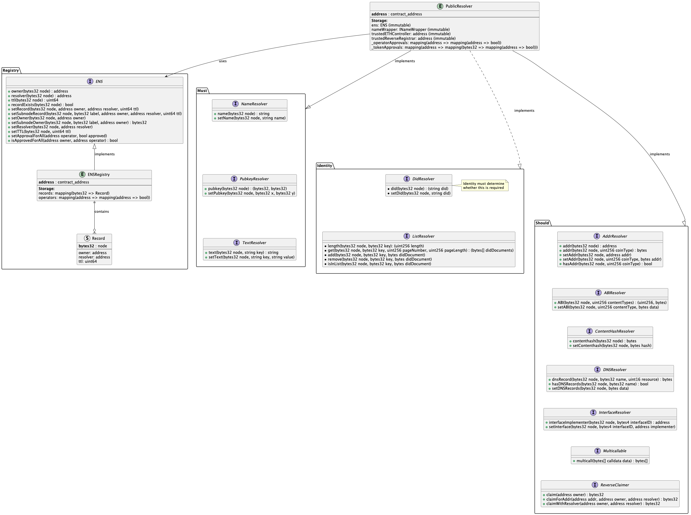

# ADR-003: Ethereum Name Service (ENS) Integration with Identity Management

## Table of Contents

- [Status](#status)
- [Context](#context)
    - [How ENS Works](#how-ens-works)
        - [ENSRegistry](#ensregistry)
        - [PublicResolver](#publicresolver)
- [Identity Necessities](#identity-necessities)
    - [DID Storage Requirement](#did-storage-requirement)
- [Decision](#decision)
    - [Incremental Implementation Strategy](#incremental-implementation-strategy)
- [Implementation Subtasks](#implementation-subtasks)
    - [Implement ENSRegistry](#implement-ensregistry)
    - [Implement PublicResolver with NameResolver](#implement-publicresolver-with-nameresolver)
    - [Implement PubkeyResolver and TextResolver](#implement-pubkeyresolver-and-textresolver)
    - [Configuration manager Integration and Testing Network Deployment](#configuration-manager-integration-and-testing-network-deployment)

## Status

Proposal

## Context

The current implementation of ENS from the community is not compatible with ISBE architecture and requires new features to support decentralised identity management within our governance framework.

### How ENS Works

The Ethereum Name Service (ENS) is a distributed, extensible naming system based on the Ethereum blockchain that provides a secure and decentralised way to resolve human-readable names to machine-readable identifiers such as Ethereum addresses, other cryptocurrency addresses, content hashes, and metadata.

#### ENSRegistry

- **Definition**: The core registry contract that maintains the hierarchical tree structure of ENS domains and their ownership relationships
- **Main Attributes**:
    - `records`: A mapping from node hashes (bytes32) to Record structs containing owner address, resolver address, and TTL value
    - `operators`: A nested mapping that manages operator approvals for domain management delegation
- **Responsibilities**:
    - Maintain authoritative ownership records for all ENS nodes in the namespace
    - Manage the hierarchical domain structure through parent-child node relationships
    - Control access permissions and operator approvals for domain operations
    - Set and enforce Time-To-Live (TTL) values for caching optimisation
    - Facilitate subdomain creation through controlled delegation mechanisms
    - Emit events for ownership transfers and resolver updates
- **Submodules**:
    - **Record Structure**: Core data structure containing node identifier, owner address, resolver contract address, and TTL value
    - **Operator Management System**: Handles delegation of management rights from owners to approved operators
    - **Node Hierarchy Management**: Maintains parent-child relationships in the domain tree structure

#### PublicResolver

- **Definition**: The canonical resolver implementation that stores and retrieves various types of data associated with ENS names, acting as the primary data layer for ENS records
- **Main Attributes**:
    - `ens`: Immutable reference to the ENS registry contract for ownership verification
    - `nameWrapper`: Immutable reference to the Name Wrapper contract for enhanced name management
    - `trustedETHController`: Immutable reference to the authorised ETH registrar controller
    - `trustedReverseRegistrar`: Immutable reference for reverse DNS resolution functionality
    - `_operatorApprovals`: Nested mapping managing operator permissions at the resolver level
    - `_tokenApprovals`: Triple nested mapping providing granular, token-specific permission management
- **Responsibilities**:
    - Resolve ENS names to various resource types including addresses, text records, and cryptographic keys
    - Store and manage multiple data formats per ENS node with appropriate access controls
    - Implement standardised resolver interfaces for different data types and use cases
    - Manage fine-grained permissions for resolver operations across different users and operators
    - Provide backwards compatibility with existing ENS infrastructure and tooling
- **Existing Submodules**:
    - `AddrResolver`: Maps ENS names to cryptocurrency addresses across multiple blockchain networks
    - `NameResolver`: Provides reverse resolution capabilities (address-to-name lookups)
    - `PubkeyResolver`: Stores and retrieves public keys for cryptographic operations and verification
    - `TextResolver`: Manages arbitrary text records for flexible metadata storage
    - `ABIResolver`: Stores and retrieves contract Application Binary Interfaces
    - `ContentHashResolver`: Links to distributed content systems (IPFS, Swarm, etc.)
    - `DNSResolver`: Bridges traditional DNS records with ENS for seamless integration
    - `InterfaceResolver`: Identifies and manages supported contract interfaces
    - `Multicallable`: Enables efficient batch operations for multiple resolver calls
    - `ReverseClaimer`: Manages reverse ENS record claiming and ownership

## Identity Necessities

### DID Storage Requirement

We require the capability to store a Decentralised Identifier (DID) as an integral component of each ENS node entry. This necessity arises from our commitment to establishing verifiable digital identities that can be cryptographically proven and independently verified without relying on centralised authorities. The DID will serve as a globally unique, persistent identifier that directly links ENS names to comprehensive decentralised identity documents, thereby enabling enhanced identity verification, authentication, and trust establishment capabilities within the broader ENS ecosystem.

### List Resolver Requirement

We require sophisticated functionality to store and manage organised collections of identity documents like DID documents, credential schemas,...ç categorised by different keys within each node entry. This comprehensive document management system is essential for supporting complex identity scenarios where:

- Multiple identity documents of varying types may be associated with a single ENS name
- Different document categories require separate classification, storage, and retrieval mechanisms
- Efficient pagination and querying capabilities are necessary for managing large document collections
- Document authenticity, integrity, and provenance must be maintained through proper indexing and verification systems
- Role-based access controls must govern document visibility and modification rights

## Decision

We decide to implement as part of the ISBE infrastructure:
a. Basic EnsRegistry with the simplest implementation without roles application.
b. Base PublicResolver implementation with NameResolver, PubkeyResolver, and TestResolver.
c. The role base access application should be done in a separate issue.
d. The implementation of the identity submodules should be re-visited in next iterations.
e. The rest of PublicResolverModules should be re-visited in next iterations

### Incremental Implementation Strategy

The implementation of PublicResolver methods shall follow a carefully planned, phased approach to ensure system stability and manageable complexity:

1. **First Phase**: Implement and thoroughly test critical core functionality including NameResolver, PubkeyResolver, and TextResolver components
2. **Role base application**: Study how to apply Rbac in ENS or if it is part of governance's diamond.
   3**Second Phase**: Check if needed identity-specific functionality through DidResolver and StringListResolver implementations
   4**Third Phase**: Decide what to implement extended functionality components as required by specific use cases and community demand

## Implementation Subtasks

### Implement ENSRegistry

- Develop comprehensive core registry logic following official ENS specifications and standards
- Integrate sophisticated role-based access control mechanisms with ENS_ROLE and ENS_MANAGER_ROLE
- Implement robust node management, ownership tracking, and resolver assignment functionality
- Ensure complete compatibility with existing ENS tooling, libraries, and infrastructure
- Add comprehensive event logging and monitoring capabilities for governance audit trails and operational transparency
- Implement gas optimisation strategies for cost-effective operations

### Implement PublicResolver with NameResolver

- Create the foundational PublicResolver contract structure with modular architecture
- Implement comprehensive name resolution functionality supporting multiple cryptocurrency types and networks
- Establish secure, authenticated connection patterns with ENSRegistry
- Implement robust permission management and access control mechanisms
- Ensure gas-efficient storage patterns and optimised data structures for address mappings
- Add comprehensive input validation and error handling mechanisms

### Implement PubkeyResolver and TextResolver

- Complete the essential resolver functionality suite with full feature parity
- Add secure public key storage and retrieval systems for cryptographic operations and identity verification
- Create flexible, extensible text record systems supporting arbitrary key-value pairs with appropriate size limits
- Optimise storage layouts and data structures for gas efficiency and query performance
- Implement comprehensive data validation and sanitisation mechanisms

### Configuration manager Integration and Testing Network Deployment

- Integrate both ENSRegistry and PublicResolver as use case configurations
- Develop robust, automated deployment scripts for multiple testing network environments
- Implement extensive testing suites covering:
    - Core ENS functionality compatibility and regression testing
    - Identity management operations and edge case handling
    - Gas optimisation analysis and performance benchmarking
    - Integration testing with existing ENS infrastructure and third-party tools
    - Load testing for scalability validation
- Conduct thorough end-to-end testing
