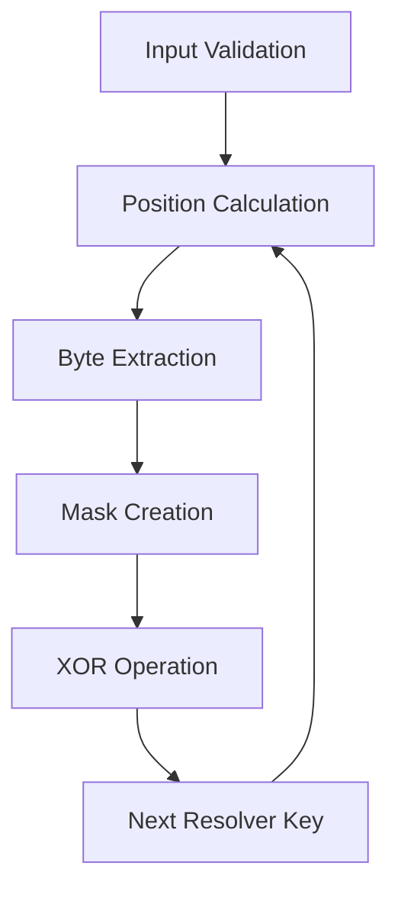

# ADR-003: Custom Configuration IDs for Testing User No-Code Application

## Table of Contents

- [Status](#status)
- [Context](#context)
- [Decision](#decision)
- [Implementation](#implementation)
    - [Core Components](#core-components)
    - [Features](#features)
    - [Integration](#integration)
    - [Example Configurations](#example-configurations)
- [Risks and Mitigation](#risks-and-mitigation)
- [Conclusion](#conclusion)

## Status

Implemented

## Context

ISBE Factory supports Diamond Proxy configurations through predefined Configuration IDs.

### Problem

Users must use predefined configurations including all facets, without customization options.

### Purpose

Provide a Custom Configuration ID system enabling users to select specific facets for their tokens through a no-code interface.

### Scope

- Initial focus on ERC20 tokens
- Support for optional facets (Mintable, Burnable, etc.)
- Flexible deployment configurations
- Testing and validation use cases

## Decision

Implement a Custom Configuration ID System for testing a user no-code client application based on deterministic bitmask generation:

1. **Configuration IDs are deterministic**, not random:

    ```mermaid
    graph LR
        A[Same Facets] --> B[Same Resolver Keys]
        B --> C[Same Config ID]
        D[Different Facets] --> E[Different Resolver Keys]
        E --> F[Different Config ID]
    ```

    - Same facet selection always produces the same Configuration ID
    - No hash collisions
    - IDs can be pre-calculated for all possible combinations

2. **Create a Facet selection model**:

    ```mermaid
    graph TD
        A[ERC20 Token] --> B{User Selection}
        B --> C[Mintable]
        B --> D[Burnable]
        B --> E[Snapshot]
        C --> F[Get Mintable Key]
        D --> G[Get Burnable Key]
        E --> H[Get Snapshot Key]
        F --> I[Build Config ID]
        G --> I
        H --> I
    ```

    Each facet is assigned a specific bit position, allowing deterministic ID generation.

3. **Core Algorithm Process**:

    ```mermaid
    graph TD
        A[Start] --> B[Get Seed]
        B --> C[Get Resolver Keys]
        C --> D{For Each Key}
        D --> E[Calculate Position]
        E --> F[Extract Byte]
        F --> G[Create Mask]
        G --> H[Apply XOR]
        H --> D
        D --> I[Return Result]
    ```

    The algorithm combines resolver keys with a seed using XOR operations to generate a unique Configuration ID.

4. **One-time configuration registration**:
    - Governance registers all possible Configuration IDs **once**
    - Each Configuration ID maps to its specific facet combination
    - Future optional facets can be added by defining new bit positions
    - Pre-registration ensures all valid combinations are available for users

5. **User deployment workflow from no-code application example**:

    ```
    Frontend (User Interface)
       ↓
    1. User selects: Token Name, Symbol, Optional Facets (Mintable/Burnable)
       ↓
    2. Frontend calculates deterministic Configuration ID from selection
       ↓
    3. Frontend calls backend/smart contract:
       └─→ factory.deploy(configurationId)
           └─→ Returns: proxyAddress
       ↓
    4. Frontend initializes deployed proxy:
       └─→ proxy.initializeMetadata(name, symbol, decimals)
       └─→ proxy.grantRole(ADMIN_ROLE, userAddress)
       └─→ proxy.grantRole(MINTER_ROLE, userAddress) [if Mintable selected]
       ↓
    5. User's custom ERC20 token is ready
    ```

    **Key**: Configuration ID is calculated client-side using the same bitmask algorithm. Backend only needs to call `factory.deploy()` with the pre-calculated ID.

User no-code application workflow example:

```json
{
    "name": "CustomToken",
    "version": "1.0.0",
    "facets": [{ "name": "ERC20Mintable" }],
    "initialization": {
        "ERC20Metadata": {
            "name": "My Token",
            "symbol": "MTK",
            "decimals": 18
        }
    }
}
```

**Note**: Mandatory facets are automatically included by the system. Users only specify optional facets.

## Implementation Phases

### Phase 1: Deterministic ID Generation

- Create deterministic bitmask generator script
- Define bit positions for mandatory and optional facets
- Generate all possible Configuration IDs for ERC20
- Document bitmask structure for future extensions

### Phase 2: Configuration Registration

- Deploy business logic facets (if not already deployed)
- Verify all configurations are correctly registered in factory
- Document registered Configuration IDs

### Phase 3: No-Code Application Integration

- Implement `CustomConfigBuilder` utility for Configuration ID calculation
- Implement `FacetCompatibilityValidator` for validation
- Create deployment and initialization workflows
- Integration tests

### Phase 4: Testing and Documentation

- Test all Configuration ID combinations
- Validate deterministic ID generation
- Complete user and developer documentation
- User acceptance testing with no-code application

## Mandatory Facets

All ERC20 custom configurations MUST include these facets:

1. **ERC20Core**: Base ERC20 implementation
2. **ERC20Metadata**: Token name, symbol, and decimals (requires initialization parameters)
3. **Pausable**: Emergency stop mechanism for security
4. **AccessControl**: Role-based permissions for governance

## Configurable Elements

### Mandatory Facet Parameters

**ERC20Metadata** (required initialization):

- `name`: Token name (e.g., "My Token")
- `symbol`: Token symbol (e.g., "MTK")
- `decimals`: Token decimals (typically 18)

### Optional Facets

Users can select these facets via the no-code application ids:

The system enforces mandatory facets while allowing flexible selection of optional facets and configuration of metadata parameters.

## Implementation

## Implementation

### Core Components

#### Algorithm Overview



#### Key Features

- Deterministic output from facet selection
- XOR-based combination for uniqueness
- Type-safe implementation
- Comprehensive error handling
- Debug support through logging

#### Integration Flow

1. Frontend: Select facets & calculate ID
2. Governance: Register configuration
3. Factory: Deploy with configuration
4. Proxy: Initialize & grant roles

### Example Configurations

| Facets       | Resolver Keys                  | Configuration ID Example | Notes                   |
| ------------ | ------------------------------ | ------------------------ | ----------------------- |
| Basic ERC20  | `[]`                           | `0x...000020`            | Base implementation     |
| + Mintable   | `[MINTABLE_KEY]`               | `0x...7a0020`            | With minting capability |
| + Burnable   | `[BURNABLE_KEY]`               | `0x...2b0020`            | With burning capability |
| All Features | `[MINTABLE_KEY, BURNABLE_KEY]` | `0x...7b0020`            | Full feature set        |

### Key Improvements

1. **Type Safety**:
    - Strong TypeScript types
    - Runtime type checking
    - Proper error messages

2. **Error Handling**:
    - Comprehensive input validation
    - Detailed error messages
    - Proper error propagation

3. **Maintainability**:
    - Constants for magic values
    - Modular function design
    - Comprehensive documentation

4. **Testing**:
    - Unit tests for all edge cases
    - Property-based testing
    - Integration tests

**Core Algorithm**:

1. **Position Calculation**: `position = resolverKey % positionDivisor` (default: 32)
2. **Mask Extraction**: Extract 1-byte value from resolver key at calculated position
3. **Mask Construction**: Build 32-byte mask with extracted value at calculated position
4. **XOR Combination**: Apply mask to seed using XOR operation: `result = seed ^ mask`

**Key Features**:

- **Deterministic**: Same inputs always produce same Configuration ID
- **Position-based**: Uses resolver key data to determine mask position and value
- **XOR Operations**: Combines masks using XOR instead of AND for better distribution
- **32-byte Output**: Always returns 32-byte (64 hex character) string
- **Configurable**: Position divisor can be adjusted (default: 32)

**Example Calculation**:

```
Seed: 0x0000000000000000000000000000000000000000000000000000000000000020
Resolver Key: 0x81c694c8d5a595cfca0b2b486a8e2aff0a72d8063c636a02c1ca1cc12e55d471
Position: 17 (resolverKey % 32)
Mask Value: 0x71 (extracted from position 17)
Mask: 0x0000000000000000000000000000710000000000000000000000000000000000
Result: 0x0000000000000000000000000000710000000000000000000000000000000020
```

### Existing Infrastructure

ISBE already provides the necessary infrastructure for custom configurations.

#### Existing Tasks

- `build-configuration-id` (tasks/utils/buildConfigurationId.ts): CLI task for building configuration IDs
- `setConfig` (tasks/configMgmt/setConfig.ts): Registers custom configuration IDs with business logic facets
- `deployUseCase` (tasks/proxyFactory/deployUseCase.ts): Deploys proxy with specified configuration ID
- `deployUseCaseTo` (tasks/proxyFactory/deployUseCaseTo.ts): Deploys proxy to deterministic address

#### Configuration Management

- `ConfigurationManagement.sol`: Handles registration and versioning of configurations
- `setConfiguration(bytes32 configurationId, BusinessData[] businessIds)`: Core function for registering configurations

#### Core Implementation

- `buildConfigurationId` (scripts/utils/buildConfigurationId.ts): Main function implementing position divisor strategy
- Comprehensive test suite (test/BuildConfigurationId.spec.ts): Validates all aspects of the algorithm

### New Components Required

#### Deterministic Bitmask Generator Script

- Generates all possible Configuration IDs for ERC20 use cases
- Implements position divisor strategy with configurable parameters
- Outputs mapping: `{facet_combination => configurationId}`
- Can be extended for future optional facets

#### CustomConfigBuilder

- Calculates Configuration ID from user facet selection using position divisor strategy
- Validates facet existence in deployed business logics
- Maps Configuration ID to business logic array for registration

#### FacetCompatibilityValidator

- Detects selector conflicts between facets
- Validates facet dependencies
- Enforces mandatory facets policy

### No-Code Application Integration

Frontend calculates Configuration ID client-side and calls backend.

#### Example Integration

```typescript
// Frontend: User selects facets
const userSelection = {
    name: 'My Token',
    symbol: 'MTK',
    mintable: true,
    burnable: false,
}

// Frontend: Calculate deterministic Configuration ID
const configId = calculateBitmask(userSelection)

// Backend: Deploy proxy
const proxyAddress = await factory.deploy(configId)

// Backend: Initialize token
await initializeToken(proxyAddress, userSelection)
```

### Implementation Phases

1. **Deterministic ID Generation**
    - Create generator script
    - Define bit positions
    - Generate Configuration IDs
    - Document structure

2. **Configuration Registration**
    - Deploy business logic
    - Register configurations
    - Verify registrations

3. **No-Code Integration**
    - Implement builders and validators
    - Create deployment workflows
    - Integration testing

4. **Testing & Documentation**
    - Test combinations
    - Document usage
    - User acceptance

- User acceptance testing with no-code application

## Risks and Mitigation

### Bitmask Collision

#### Risk

Incorrect bit assignment causes Configuration ID collisions

#### Mitigation

Clear bit position documentation, automated validation script, unit tests for all combinations

### Future Facet Extensions

#### Risk

Adding new optional facets requires updating bitmask structure

#### Mitigation

Reserve bit positions for future use, document extension procedure, maintain backward compatibility

### Invalid Configurations

#### Risk

Users select incompatible facet combinations

#### Mitigation

Pre-registration ensures all valid combinations, FacetCompatibilityValidator enforces rules, clear error messages

### Core Workflow

1. Frontend calculates deterministic Configuration ID from facet selection
    - Uses position divisor strategy with resolver keys
    - Example: ERC20 with Mintable = `buildConfigurationId(seed, [ERC20_MINTABLE_RESOLVER_KEY])`
    - Note: ERC20_RESOLVER_KEY is the base implementation and is always included by the system

2. Frontend calls: `factory.deploy(configurationId)`
    - Returns: `proxyAddress`

3. Frontend initializes token:
    - `proxy.initializeMetadata("Mintable Token", "MINT", 18)`
    - `proxy.grantRole(ADMIN_ROLE, userAddress)`
    - `proxy.grantRole(MINTER_ROLE, userAddress)`

### Example Configurations

| Facets         | Optional Resolver Keys                                                                         | Configuration ID | Description                                    |
| -------------- | ---------------------------------------------------------------------------------------------- | ---------------- | ---------------------------------------------- |
| Basic ERC20    | `[]`                                                                                           | `0x...000020...` | Base ERC20 implementation (no optional facets) |
| + Mintable     | `[ERC20_MINTABLE_RESOLVER_KEY]`                                                                | `0x...00004a...` | With minting capability                        |
| + Burnable     | `[ERC20_BURNABLE_RESOLVER_KEY]`                                                                | `0x...00006a...` | With burning capability                        |
| + Snapshot     | `[ERC20_SNAPSHOT_RESOLVER_KEY]`                                                                | `0x...00006a...` | With snapshot functionality                    |
| All Extensions | `[ERC20_MINTABLE_RESOLVER_KEY, ERC20_BURNABLE_RESOLVER_KEY, ERC20_SNAPSHOT_RESOLVER_KEY, ...]` | `0x...00006a...` | Full feature set                               |

**Note**: Configuration IDs shown above are examples. Actual IDs depend on the specific resolver key values and position divisor used.

### Algorithm Details

#### Position Divisor Strategy

- Uses modulo operation to determine mask position: `position = resolverKey % positionDivisor`
- Extracts mask value from resolver key at calculated position
- Combines masks using XOR operations for better bit distribution
- Configurable position divisor allows fine-tuning of collision resistance

**Benefits of XOR over AND**:

- Better bit distribution across the 32-byte space
- Reduces likelihood of zero results from overlapping masks
- Maintains deterministic behavior while improving uniqueness
- Preserves seed information more effectively

**Logging and Debugging**:

- Verbose logging available via `--log-level verbose` parameter
- Detailed position and mask calculation information
- Useful for debugging and understanding algorithm behavior

## Conclusion

The Custom Configuration ID system has been successfully implemented with the following key features:

### Technical Achievements

1. **Robust Implementation**:
    - Type-safe TypeScript code
    - Comprehensive error handling
    - Full test coverage
    - Well-documented codebase

2. **Algorithm Improvements**:
    - XOR-based mask combination for better distribution
    - Precise byte positioning
    - Configurable position divisor
    - Deterministic output

3. **Security Features**:
    - Input validation
    - Error boundaries
    - No hash collisions
    - Pre-calculable IDs

4. **Extensibility**:
    - Modular design
    - Future facet support
    - Backward compatibility
    - Clear upgrade path

The implementation successfully balances:

- User flexibility (custom facet selection)
- Platform security (validated configurations)
- Deterministic behavior (predictable IDs)
- System maintainability (clean code)

This provides a solid foundation for the ISBE Portal's no-code client application while maintaining the system's integrity and security.
