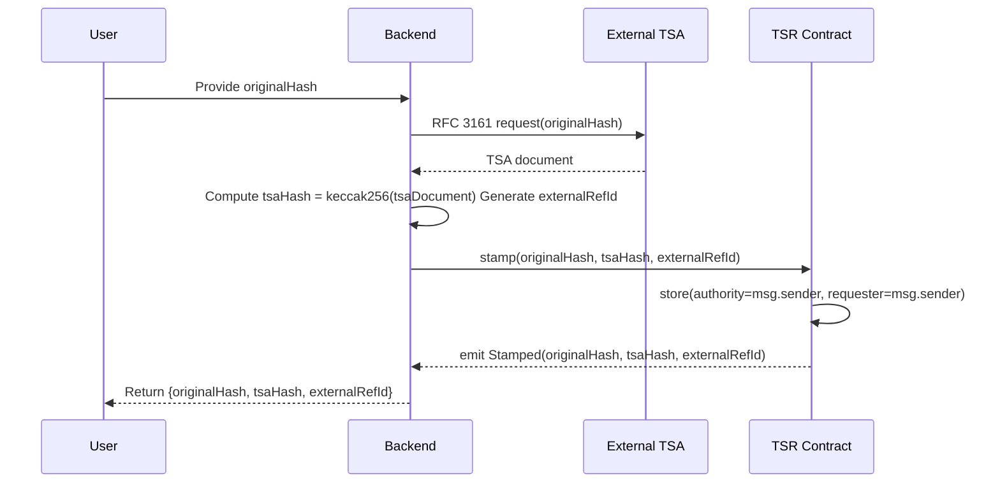
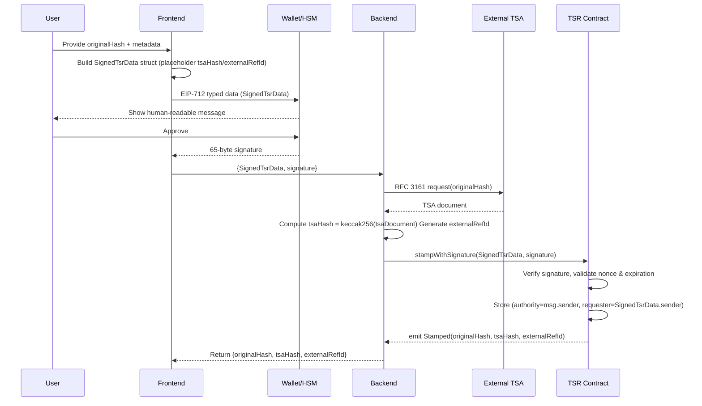
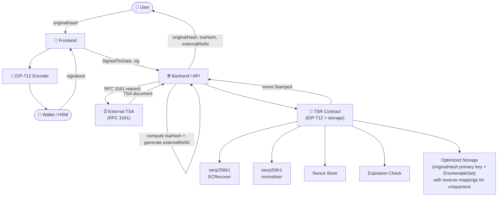

# **ADR – Time-Stamping Registry (TSR) with EIP-712 Signing & External TSA Integration**

---

## 1. Introduction

This ADR describes a **Time-Stamping Registry (TSR)** smart contract that provides on-demand timestamping registry services, integrating with external RFC 3161 compliant Time-Stamping Authorities (TSA).

**Complete Flow:**

1. User provides `originalHash` (input data hash)
2. Backend calls external TSA with `originalHash` → receives TSA document
3. Backend computes `tsaHash = keccak256(tsaDocument)`
4. Backend generates `externalReferenceId`
5. Backend calls TSR contract: `stamp(originalHash, tsaHash, externalReferenceId)`
6. Backend responds to user with all three values

**Key Features:**

- Stores complete traceability: `originalHash` + `tsaHash` + `externalReferenceId`
- Supports direct stamping (`stamp`) and gas-less meta-transactions (`stampWithSignature`) via EIP-712
- Dual-curve support (secp256k1 / secp256r1) with nonce/expiration replay protection
- Role separation: authority (msg.sender) vs requester (data owner) based on call method
- Optimized storage with originalHash as primary key and EnumerableSet for efficient pagination
- **Comprehensive validation framework** with systematic 4-layer testing approach for enhanced security

---

## 2. New Core Interface (Solidity)

```solidity
// SPDX-License-Identifier: MIT
pragma solidity ^0.8.28;

interface ITimeStampingRegistry {
    // Structs
    struct TsrData {
        bytes32 originalHash; // Hash of original data (input to TSA)
        bytes32 tsaHash; // Hash of RFC 3161 Timestamp Response (keccak256(tsaDocument))
        bytes32 externalReferenceId; // Generated by backend for off-chain linkage
    }
    struct SignedTsrData {
        TsrData tsrData;
        address sender; // Requester identity submitting the stamp
        uint256 nonce; // Monotonically increasing per-sender
        uint256 expirationTimestamp; // Deadline for signature validity
    }

    // Events (no requester needed)
    event Stamped(
        bytes32 indexed originalHash,
        bytes32 indexed tsaHash,
        bytes32 indexed externalReferenceId
    );

    // Mutators
    function stamp(
        bytes32 originalHash,
        bytes32 tsaHash,
        bytes32 externalReferenceId
    ) external;
    function stampWithSignature(
        SignedTsrData calldata tsrData,
        bytes calldata signature
    ) external;

    // Views
    function isOriginalHashRegistered(
        bytes32 originalHash
    ) external view returns (bool);
    function isExternalReferenceIdRegistered(
        bytes32 externalReferenceId
    ) external view returns (bool);
    function isTsaHashRegistered(bytes32 tsaHash) external view returns (bool);
    function getTsrRecordFromOriginalHash(
        bytes32 originalHash
    )
        external
        view
        returns (TsrData memory tsrData, address authority, address requester);
    function getStampedSize() external view returns (uint256 size);
    function getPaginatedStamped(
        uint256 pageSize,
        uint256 pageIndex
    ) external view returns (TsrData[] memory datas);
}
```

---

## 3. Sequence Diagrams

### 3.1 Direct stamping (backend pays gas)



---

### 3.2 Stamping via EIP-712 signature (gas-less)



---

## 4. Component Diagram (Complete TSR Architecture)



---

## 5. EIP-712 Typed Data (TSR Contract Domain)

```json
{
    "types": {
        "TsrData": [
            { "name": "originalHash", "type": "bytes32" },
            { "name": "tsaHash", "type": "bytes32" },
            { "name": "externalReferenceId", "type": "bytes32" }
        ],
        "SignedTsrData": [
            { "name": "tsrData", "type": "TsrData" },
            { "name": "sender", "type": "address" },
            { "name": "nonce", "type": "uint256" },
            { "name": "expirationTimestamp", "type": "uint256" }
        ]
    },
    "primaryType": "SignedTsrData",
    "domain": {
        /* name: "TimeStampingRegistry", version: "1", chainId, verifyingContract */
    }
}
```

---

## 6. Final TSR Architecture Implementation

The implemented solution uses a **hybrid storage approach** optimized for `originalHash` as the primary key:

```solidity
struct TimestampingRegistryStorage {
    // Primary enumerable set for efficient pagination
    EnumerableSet.Bytes32Set originalHashes;
    // Direct record lookup by originalHash (primary key)
    mapping(bytes32 originalHash => TsrRecord record) records;
    // Reverse mappings for uniqueness enforcement
    mapping(bytes32 tsaHash => bytes32 originalHash) tsaHashToOriginal;
    mapping(bytes32 externalReferenceId => bytes32 originalHash) externalRefToOriginal;
    // Nonce management for replay protection
    mapping(address sender => uint256 nonce) nonces;
}

struct TsrRecord {
    TsrData data; // Complete TSR data (originalHash, tsaHash, externalReferenceId)
    uint256 timestamp; // Block timestamp when stamped
    address authority; // msg.sender (who executed the transaction)
    address requester; // msg.sender (stamp) or SignedTsrData.sender (stampWithSignature)
}
```

**Key Implementation Decisions:**

- **Primary Key**: `originalHash` for optimal query performance (main use case)
- **Pagination**: EnumerableSet provides O(1) enumeration without separate arrays
- **Uniqueness**: All three fields (originalHash, tsaHash, externalReferenceId) enforced via reverse mappings
- **Gas Optimization**: Direct record lookup + reverse mappings minimize storage operations
- **EIP-712**: Updated typehash includes `originalHash` in signature verification

---

## 7. Security & Compliance Notes

- **Nonce** → single-use, per-sender, monotonically increasing replay protection
- **Expiration** → deadline-based signature validity prevents replay attacks and stale signatures
- **Signer recovery** → supports both secp256k1 (Ethereum wallets) and secp256r1 (eID cards); DER→65-byte conversion handled off-chain
- **Optimized storage** → originalHash primary key with EnumerableSet for pagination and reverse mappings for uniqueness enforcement
- **Role separation** → authority (msg.sender) vs requester (data owner) enables delegation patterns
- **External validation** → backend enforces origin data validation and TSA integration before contract interaction
- **TSA compliance** → integrates with RFC 3161 compliant external Time-Stamping Authorities
- **Complete traceability** → stores full chain: originalHash → TSA → tsaHash → externalReferenceId

---

## 8. Comprehensive Validation Framework

The TSR implementation follows a systematic validation approach with four distinct layers of testing to ensure robustness and security:

### 8.1 Validation Layer Structure

The validation framework is organized in priority order to catch issues early and provide clear failure feedback:

1. FORMAT VALIDATIONS (First Priority)
2. DOMAIN INVARIANTS (Second Priority)
3. PAUSE AND RBAC (Third Priority)
4. SUCCESS SCENARIOS (Final Priority)

### 8.2 Format Validations

**Purpose**: Validate input data format and structure before processing

- **Empty Hash Validation**: Prevents zero bytes32 values for `originalHash`, `tsaHash`, and `externalReferenceId`
- **Signature Format Validation**: Ensures proper EIP-712 signature format and length
- **Data Structure Validation**: Validates `SignedTsrData` struct completeness

**Validation Points**:

```solidity
// Applied to both stamp() and stampWithSignature()
modifier bytes32IsNotZero(bytes32 value) {
    if (value == bytes32(0)) revert EmptyBytes32();
    _;
}
```

### 8.3 Domain Invariants

**Purpose**: Enforce business rules and data integrity constraints

- **Hash Uniqueness**: Ensures `originalHash`, `tsaHash`, and `externalReferenceId` are globally unique
- **Nonce Management**: Validates monotonically increasing nonces per sender
- **Deadline Enforcement**: Prevents expired signature usage
- **Storage Consistency**: Maintains reverse mapping integrity

**Core Invariants**:

```solidity
// Uniqueness enforcement with custom error messages
function _checkOriginalHash(bytes32 originalHash) internal view {
    if (isOriginalHashRegistered(originalHash)) {
        revert HashAlreadyExists(originalHash);
    }
}

function _checkNonceAndDeadline(
    uint256 nonce,
    uint256 deadline,
    address sender
) internal {
    if (nonce <= nonces[sender]) revert WrongNonce(nonce, sender);
    if (block.timestamp > deadline) revert ExpiredDeadline(deadline);
}
```

### 8.4 Access Control & Pause Mechanism

**Purpose**: Enforce role-based permissions and emergency controls

- **Role Validation**: `TIMESTAMPING_REGISTRY_ROLE` required for all stamping operations
- **Pause Protection**: Global pause capability via `PAUSER_ROLE` for emergency scenarios
- **Authority Tracking**: Proper separation of `authority` (msg.sender) vs `requester` (data owner)

**Security Controls**:

```solidity
modifier onlyRole(bytes32 role) {
    if (!hasRole(role, msg.sender)) {
        revert AccountHasNoRole(msg.sender, role);
    }
    _;
}

modifier whenNotPaused() {
    if (paused()) revert IsPaused();
    _;
}
```

### 8.5 Success Scenarios & Query Functions

**Purpose**: Validate successful operations and data retrieval

- **Event Emission**: Proper `Stamped` event emission with all parameters
- **Storage Verification**: Correct record storage with all metadata
- **Query Functions**: Efficient data retrieval and pagination
- **Signature Validation**: Complete EIP-712 signature verification flow
- **Nonce Increment**: Proper nonce management after successful operations

**Success Path Validation**:

```solidity
// Successful stamp operation emits event and stores record
function stamp(
    bytes32 originalHash,
    bytes32 tsaHash,
    bytes32 externalReferenceId
)
    external
    onlyRole(TIMESTAMPING_REGISTRY_ROLE)
    whenNotPaused
    bytes32IsNotZero(originalHash)
    bytes32IsNotZero(tsaHash)
    bytes32IsNotZero(externalReferenceId)
{
    _checkOriginalHash(originalHash);
    _checkTsaHash(tsaHash);
    _checkExternalReferenceId(externalReferenceId);
    _stamp(originalHash, tsaHash, externalReferenceId, msg.sender, msg.sender);
    emit Stamped(originalHash, tsaHash, externalReferenceId);
}
```

### 8.6 Testing Coverage Strategy

The validation framework ensures comprehensive test coverage across all failure and success paths:

- **Format Layer**: ~15 test cases covering all input validation scenarios
- **Domain Layer**: ~25 test cases covering business rule enforcement
- **Security Layer**: ~10 test cases covering pause and RBAC scenarios
- **Success Layer**: ~20 test cases covering all successful operations
- **Edge Cases**: ~10 test cases covering boundary conditions and internal functions

**Total Coverage**: 80+ test cases providing complete validation of all contract functionality.

### 8.7 Validation Benefits

This systematic validation approach provides:

1. **Early Failure Detection**: Format validations catch issues before expensive operations
2. **Clear Error Messages**: Custom errors with specific parameters for debugging
3. **Gas Efficiency**: Ordered validation minimizes gas waste on invalid operations
4. **Security Assurance**: Comprehensive coverage of all attack vectors
5. **Maintainability**: Organized test structure facilitates future enhancements
6. **Compliance**: Structured validation supports audit requirements

---

## 9. Conclusion

The `TimeStampingRegistry` contract provides a comprehensive on-chain registry for RFC 3161 timestamp anchors with complete traceability and systematic validation. By integrating external TSA services through a backend orchestrator, it achieves regulatory compliance while maintaining gas efficiency through originalHash-optimized storage with EnumerableSet pagination.

Key achievements of this implementation:

- **Comprehensive Validation**: Four-layer validation framework ensuring input format, domain invariants, access control, and successful operations
- **Security-First Design**: Early validation prevents gas waste and provides clear error messages for debugging
- **Enterprise Ready**: Role-based access control, pause mechanisms, and audit-compliant test coverage
- **Gas Optimization**: Ordered validation and optimized storage architecture minimize transaction costs
- **Developer Experience**: Systematic test organization and comprehensive coverage facilitate maintenance and extensions

Supports both direct stamping and gas-less meta-transactions with dual-curve signing, role separation, and gas-optimized storage architecture, making it suitable for enterprise timestamping services and Web3 applications alike.

The systematic validation approach with 80+ test cases provides confidence in contract security and reliability, supporting both development efficiency and audit requirements.

---

**Status**: Implemented with Comprehensive Validation Framework
**Version**: 2.2
**Date**: 2025-10-20
**Last Updated**: 2025-10-20 (Added systematic validation framework)

```

```
