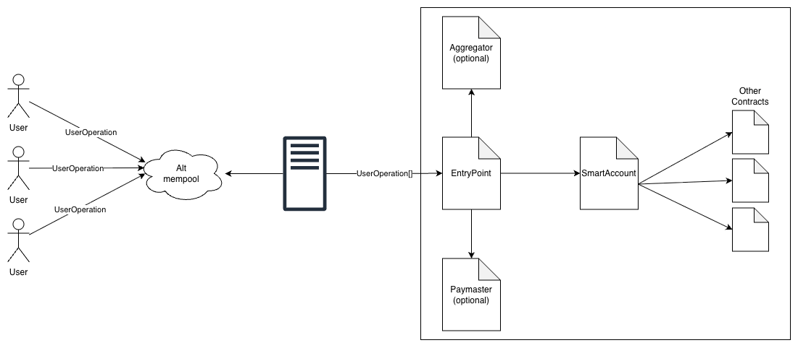
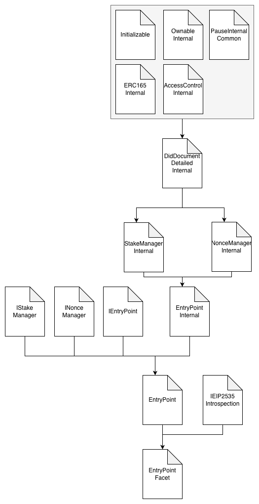
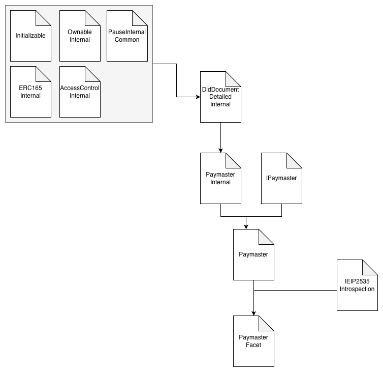
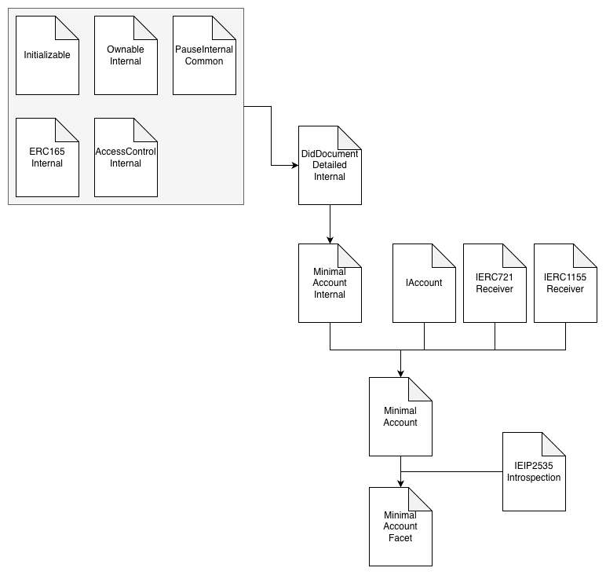

# ADR: Account Abstraction

## Table of Contents

1. [Status](#status)
2. [Context](#context)
3. [Proposal](#proposal)
    1. [Entry Point](#entrypoint)
    2. [Paymaster](#paymaster)
    3. [Minimal Smart Account](#minimal-smart-account)
4. [Future Improvements](#future-improvements)

## Status

DRAFT

## Context

Traditionally, transactions on Ethereum could only be initiated by Externally Owned Accounts (EOAs), meaning that only the holder of a wallet’s private key could operate within the network. This design introduces a major security and usability challenge: if a private key is lost, the account is unrecoverable, and if it’s stolen, the attacker gains full control over all assets. These limitations make onboarding and secure wallet management difficult for end-users, motivating the adoption of Smart Accounts in our ecosystem.

**Smart Accounts** address these limitations and represent the next evolution of blockchain wallet technology. They enable accounts to operate under programmable logic rather than being strictly bound to a single private key.

The **[EIP-4337](https://eips.ethereum.org/EIPS/eip-4337) standard** (also known as Account Abstraction or AA) defines the architecture and set of contracts that enable Smart Accounts without requiring changes to Ethereum’s core protocol. This makes it possible to adopt Smart Accounts in existing projects using standard tooling and infrastructure.
This standard introduces several key components that work together:

- **UserOperation** – A new data structure describing an action a user wants to perform.
- **Bundler** – An off-chain service that collects UserOperations and submits them in batches.
- **EntryPoint** – An on-chain smart contract that validates and executes bundled operations.
- **Paymaster** – An optional contract that sponsors gas fees or enables token-based gas payments.
- **Aggregator** – An optional contract and off-chain service that verifies aggregated signatures for multiple users to save gas.

This ADR defines the minimal requirements for supporting Account Abstraction through EIP-4337 in ISBE’s project, focusing on a simple, secure, and extensible Smart Account design.

## Proposal

To ensure compliance with EIP-4337, we will adopt the official [Account Abstraction reference repository](https://github.com/eth-infinitism/account-abstraction) as a project dependency. This approach allows ISBE to reuse audited interfaces and base contracts while adapting their implementation to our own architecture and security requirements.

The goal of this proposal is to define and implement the core components required for a minimal Account Abstraction setup, following the standard and ensuring compatibility with existing bundler infrastructure.

The initial implementation will include the following components:

- EntryPoint – central contract that supports all core functionalities required by EIP-4337.
- Paymaster – minimal Paymaster implementation that sponsors all UserOperations unconditionally
- Minimal Smart Account – basic account implementation providing signature validation and execution logic.

Since the Aggregator role and its implementation are not yet widely adopted and are not mandatory for compliance with EIP-4337, they are kept out of scope for this ADR.

The following subsections describe the implementation approach for each of the core components in detail.

> - All contracts will follow the development guidelines described [here](https://github.com/alastria/isbe-contracts/blob/main/docs/Development-guidelines.md#general-guidelines).
> - All contracts will implement unstructured storage pattern to define how their attributes are saved in the EVM.
> - We will use v 0.8.0 of the account abstraction repository.

### EntryPoint

For the initial version, we will implement an EntryPoint that supports all core functionalities required by EIP-4337, ensuring full compatibility with standard bundlers and Smart Account flows.
This implementation will include:

- Handling and validation of UserOperation bundles.
- Integration with the NonceManager for replay protection.
- Integration with the StakeManager for deposits and staking logic.
- Support for Paymaster-based sponsorships.
- Gas and fee accounting mechanisms as defined in the standard.

> The following features are explicitly excluded from the initial version:
>
> - Aggregator support (signature aggregation and batch validation).
> - Any custom extensions or off-standard optimization logic.

This EntryPoint implementation provides the necessary foundation to validate and execute Smart Account operations securely. It will serve as the base for future enhancements such as aggregator integration, performance optimization, and protocol extensions once the core functionality has been validated and audited.

#### Smart Contracts Architecture

1. Nonce Manager
    1. NonceManagerInternal - implements required business logic to support nonce management. All methods are internal.
    2. NonceManager - implements [INonceManager](https://github.com/eth-infinitism/account-abstraction/blob/develop/contracts/interfaces/INonceManager.sol) interface from the standard and uses internal functions defined in NonceManagerInternal.
2. Stake Manager
    1. StakeManagerInternal - implements required business logic to support stake deposits and management. All methods are internal.
    2. StakeManager - implements [IStakeManager](http://github.com/eth-infinitism/account-abstraction/blob/develop/contracts/interfaces/IStakeManager.sol) interface from the standard and uses internal functions defined in StakeManagerInternal.
3. Entry Point
    1. EntryPointInternal - implements required business logic to support entry point functionality. All methods are internal.
    2. EntryPoint - implements [IEntryPoint](https://github.com/eth-infinitism/account-abstraction/blob/develop/contracts/interfaces/IEntryPoint.sol) interface from the standard and uses internal functions defined in EntryPointInternal. In addition, it extends NonceManager and StakeManager contracts.
    3. EntryPointFacet - required facet to be included into the corresponding diamond proxy, extending EntryPoint and IEIP2535Introspection contracts.

### Paymaster

For the initial version, we will implement a Basic Paymaster that:

- Sponsors all UserOperations unconditionally.
- Ensures gas costs are correctly accounted for and deducted from the Paymaster’s deposit held in the EntryPoint.
- Locks collateral (stake) in the EntryPoint to prevent abuse and ensure Paymaster accountability.

This minimal implementation serves as the foundation for validating the full Account Abstraction flow — from UserOperation submission to execution — and for integration testing with the bundler.

> Future iterations will introduce more advanced sponsorship logic to improve efficiency and security, such as:
>
> - Whitelist or policy-based sponsorship (specific users, dApps, or operation types).
> - Token-based fee payments (ERC-20 settlement or swap mechanisms).
> - Quota or rate limiting to prevent abuse.
> - Dynamic gas price estimation or refund rules.
>
> This progressive approach ensures a simple, auditable initial release while allowing iterative enhancement without breaking compatibility with the EntryPoint or bundler standards.

#### Smart Contracts Architecture

- PaymasterInternal - implements required business logic to support paymaster functionality. All methods are internal.
- Paymaster - implements [IPaymaster](https://github.com/eth-infinitism/account-abstraction/blob/v0.8.0/contracts/interfaces/IPaymaster.sol) interface from the standard and uses internal functions defined in PaymasterInternal.
- PaymasterFacet - required facet to be included into the corresponding diamond proxy, extending Paymaster and IEIP2535Introspection contracts.

### Minimal Smart Account

The proposed Smart Account implementation serves as the foundation for Account Abstraction in the project, implementing only the core mechanisms required for interoperability with the EntryPoint.

This minimal design prioritizes simplicity, auditability, and compliance with the EIP-4337 standard while leaving room for future modular extensions.

For this initial version, we will implement a Minimal Smart Account that:

- Defines ownership and authorization based on a single signer model.
- Validates UserOperations through the validateUserOp method.
    - Callable only by the EntryPoint.
    - The operation is considered valid only if the signer of the UserOperation matches the account owner.
    - The signature is validated according to [EIP-712](https://eips.ethereum.org/EIPS/eip-712).
- Executes user-defined calls during the execute phase.
    - Callable only by the EntryPoint and the owner of the Smart Account.
- Handles deposits and gas fee payments through the EntryPoint.
- Supports token transfers, including receiving and withdrawing ERC-721 and ERC-1155 assets (via IERC721Receiver and IERC1155Receiver).

> The following features are out of scope for the initial implementation and will be addressed in future iterations:
>
> - Multisignature or session key support.
> - Modular validation and plugin systems (e.g., [ERC-6900](https://eips.ethereum.org/EIPS/eip-6900)).
> - Social recovery or guardian mechanisms.
> - Advanced signature schemes or aggregator integrations.
>
> This minimal version ensures full compatibility with existing bundler infrastructure and provides the foundation for end-to-end validation and execution testing of Smart Account transactions within the project.

#### Smart Contracts Architecture

- MinimalAccountInternal - implements required business logic to support minimal account functionality. All methods are internal.
- MinimalAccount
    - Implements [IAccount](https://github.com/eth-infinitism/account-abstraction/blob/v0.8.0/contracts/interfaces/IAccount.sol) interface from the standard and existing IERC721Receiver interface. IERC1155Receiver interface shall be implemented.
    - Uses internal functions defined in MinimalAccountInternal.
- MinimalAccountFacet - required facet to be included into the corresponding diamond proxy, extending MinimalAccount and IEIP2535Introspection contracts.

## Future improvements

While this ADR defines the minimal implementation required to support Account Abstraction (EIP-4337), several enhancements can be introduced in future iterations to extend functionality, optimize performance, and improve flexibility.

### Aggregator Support

Implement support for signature aggregation ([ERC-7766](https://eips.ethereum.org/EIPS/eip-7766)) to reduce transaction data size and gas costs during batch validation. This would enable compatibility with bundlers and accounts using aggregated signature schemes.

### ERC-1271 (Contract-based signatures)

Implement isValidSignature(bytes32,bytes) ([ERC-1271](https://eips.ethereum.org/EIPS/eip-1271)) so dapps that expect smart-walletsignatures (e.g., permit flows, off-chain attestations, WalletConnect integrations)recognize the account as a valid signer. This does not change the 4337 validation path,but improves dapp compatibility. Can be implemented natively or as a validator module in afuture modular design.

### ERC-6492 (Signatures for not-yet-deployed accounts)

Support the [ERC-6492](https://eips.ethereum.org/EIPS/eip-6492) “envelope” to verify signatures from counterfactual accounts duringoff-chain flows and gasless onboarding. Requires coordination with the account factory(deployment data) and relayer/bundler. Limit accepted factories/bytecode hashes for safety.

### Modular Smart Accounts

Introduce a modular architecture based on [ERC-6900](https://eips.ethereum.org/EIPS/eip-6900) to allow Smart Accounts to dynamically register and manage validation and execution modules. This would support use cases such as multisig, social recovery, and custom authorization flows.

> [ERC-7579](https://eips.ethereum.org/EIPS/eip-7579) may be taken as a reference for defining the structure and behavior of modular Smart Accounts.

### Paymaster Extensions

Extend the Basic Paymaster with advanced sponsorship policies, including:

- Token-based gas payments (ERC-20 settlement or swaps).
- Whitelist or rule-based sponsorships.
- Rate limits and quota management.
- Dynamic gas pricing and refund strategies.
