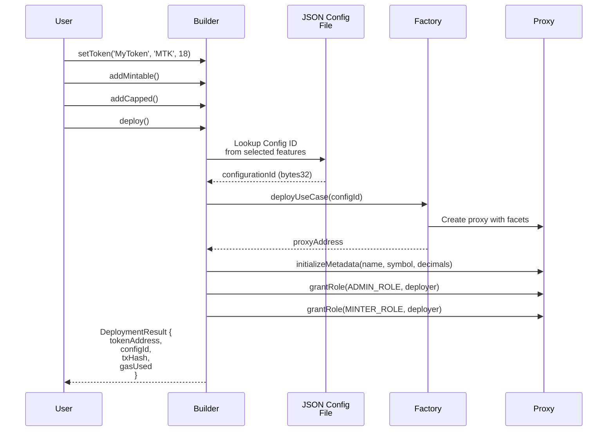
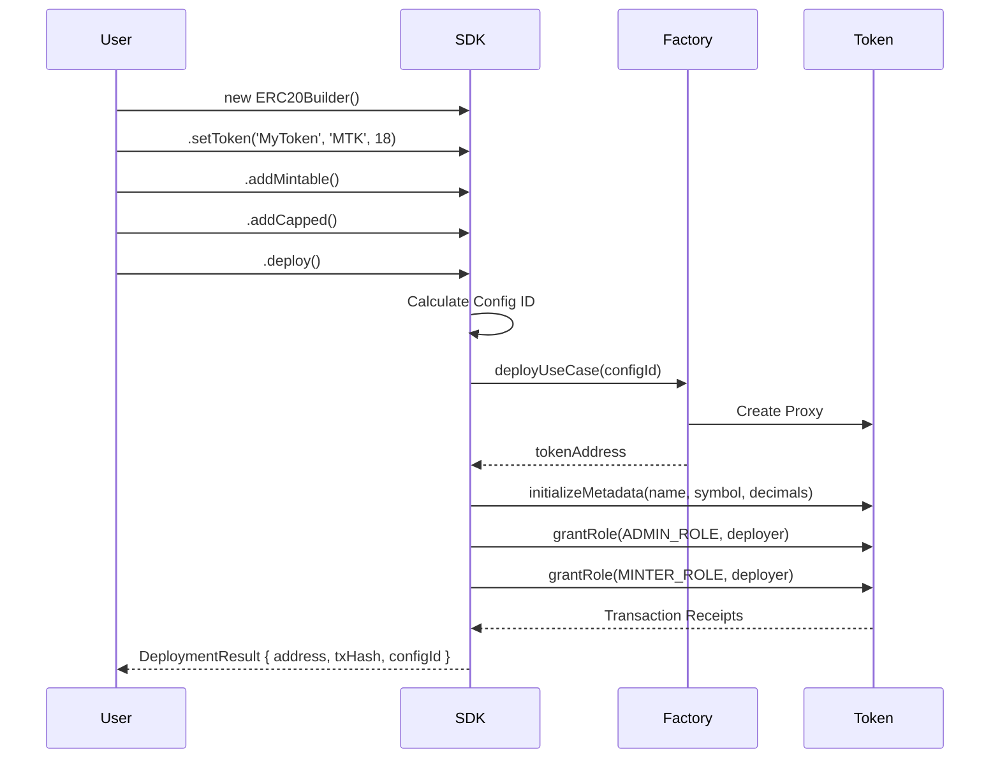
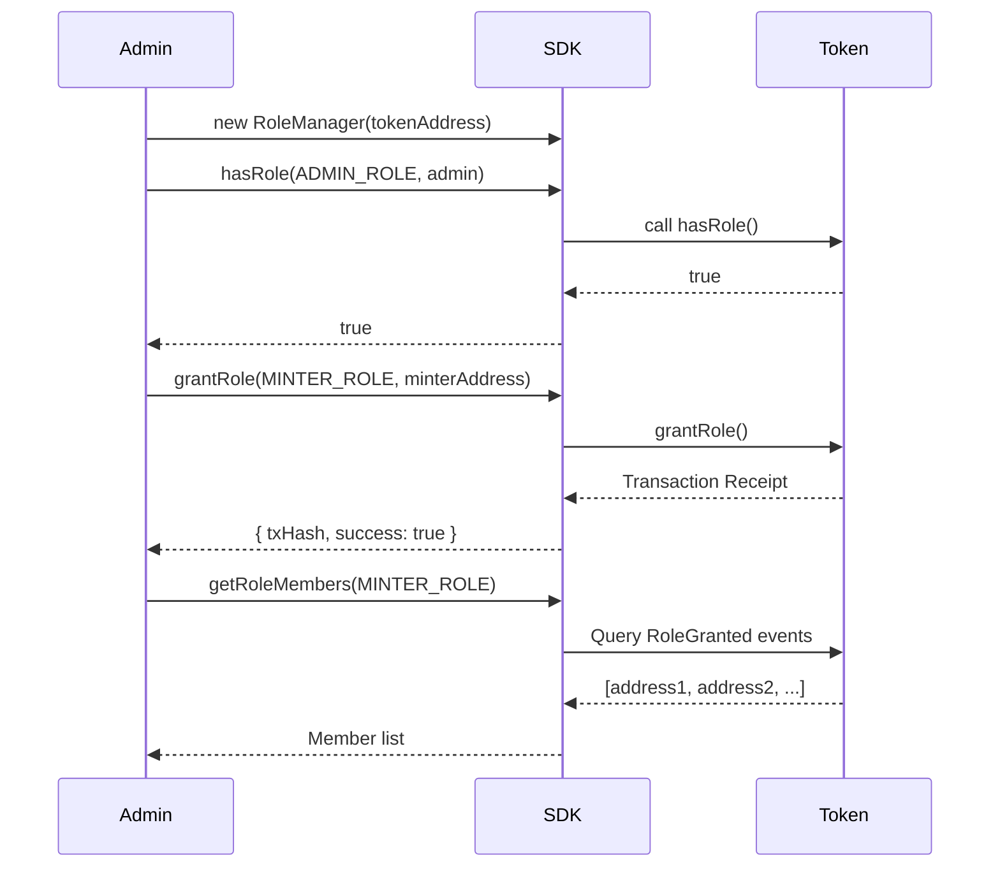
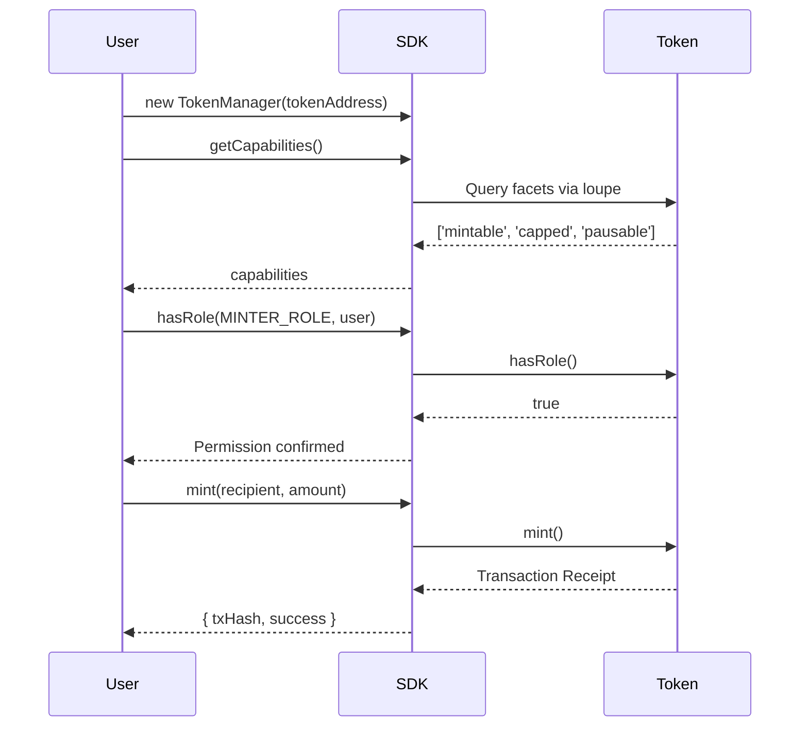

# ADR-009: SDK for ISBE Portal No-Code Application

## Table of Contents

- [Status](#status)
- [Context](#context)
- [Decision](#decision)
- [Implementation](#implementation)
    - [SDK Architecture](#sdk-architecture)
    - [Core Components](#core-components)
    - [Integration with Portal](#integration-with-portal)
    - [Workflow Examples](#workflow-examples)
- [Technical Design](#technical-design)
    - [Builder Pattern](#builder-pattern)
    - [Role Management](#role-management)
    - [Configuration System](#configuration-system)
- [Security Considerations](#security-considerations)
- [Risks and Mitigation](#risks-and-mitigation)
- [Conclusion](#conclusion)

## Status

Implemented ALFA version. (developer proposal)

## Context

### Problem

ISBE Portal requires a no-code interface for deploying custom use case (ERC20, ERC721). End users need to:
- Deploy tokens through a web interface without writing code
- Select optional features through button clicks, Example: (Mintable, Burnable, Capped, etc.)
- Initialize tokens with custom metadata (name, symbol, decimals)
- Manage roles and permissions post-deployment
- Perform administrative operations (minting, pausing, role grants)

Current challenges:
- Direct interaction with Factory Diamond requires understanding of:
  - Configuration ID calculation (bitmask algorithm no deployed)
  - Business Logic resolver keys
  - Diamond proxy patterns
  - Role-based access control (RBAC)
- No unified API for token lifecycle management
- Complex initialization sequences for different token types
- Manual role management after deployment

### Purpose

Provide a TypeScript SDK that abstracts the complexity of the Factory Diamond system, enabling:
1. **Simple deployment API**: Fluent builder pattern for token creation
2. **Feature selection**: Declarative API for adding optional facets
3. **Automatic initialization**: Handle metadata, roles, and permissions
4. **Post-deployment management**: Unified interface for admin operations
5. **Portal integration**: Backend-ready API for no-code application

### Scope

- **Token Standards**: ERC20 and ERC721, pending (ERC3643)
- **Deployment**: Factory-based proxy deployment with configuration selection
- **Administration**: Role management, minting, burning, pausing operations
- **Utilities**: Contract connection, ABI loading, transaction handling
- **Target Users**: ISBE Portal backend developers, SDK consumers

## Decision

Implement a comprehensive TypeScript SDK with three core layers:

### 1. **Builder Layer** (Token Deployment)

API for declarative token creation:

```typescript
// ERC20 Example
const result = await new ERC20Builder(provider, signer, factoryAddress)
  .setToken('MyToken', 'MTK', 18)
  .addMintable()
  .addCapped()
  .addBurnable()
  .deploy();

// ERC721 Example  
const result = await new ERC721Builder(provider, signer, factoryAddress)
  .setToken('MyNFT', 'MNFT')
  .addCapped()
  .addEnumerable()
  .deploy();
```

**Key Features**:
- Configuration ID lookup from pre-generated JSON files (not calculated)
- Mandatory facets included by default (Core, Metadata, Pausable, AccessControl)
- Type-safe feature composition
- Transaction simulation and gas estimation

### 2. **Admin Layer** (Post-Deployment Management)

Unified interface for administrative operations:

```typescript
// Role Management
const roleManager = new RoleManager(provider, signer, tokenAddress);
await roleManager.grantRole('MINTER_ROLE', minterAddress);
await roleManager.grantBatchRoles(['MINTER_ROLE', 'PAUSER_ROLE'], addresses);

// Token Operations
const tokenManager = new TokenManager(provider, signer, tokenAddress);
await tokenManager.mint(recipient, amount);
await tokenManager.pause();
await tokenManager.setCap(newCap);
```

**Key Features**:
- Role discovery and validation
- Batch operations support
- Permission checking before transactions
- Error handling with descriptive messages

### 3. **Utility Layer** (Infrastructure)

Helper utilities for contract interaction:

```typescript
// Contract Connector
const connector = new ContractConnector(provider, signer);
const token = await connector.connectERC20(tokenAddress);
const balance = await token.balanceOf(userAddress);

// Configuration utilities
const configId = calculateConfigurationId(resolverKeys, version);
const facets = await getConfigurationFacets(factoryAddress, configId);
```

**Key Features**:
- Dynamic ABI loading based on deployed facets
- Type-safe contract interfaces (using typechain-types)
- Network configuration management
- Transaction receipt parsing

## Implementation

### SDK Architecture

```mermaid
graph TB
    Portal[" ISBE Portal<br/>(No-Code UI)"]
    Backend[" Backend API<br/>(Node.js/Express)"]
    
    subgraph SDK[" ISBE SDK"]
        Builder["Builder Layer<br/>ERC20Builder<br/>ERC721Builder"]
        Admin["Admin Layer<br/>RoleManager<br/>TokenManager"]
        Utility["Utility Layer<br/>ContractConnector<br/>ConfigUtils"]
    end
    
    subgraph Blockchain[" Blockchain"]
        Factory["Factory Diamond<br/>(Governance)"]
        BL["Business Logics<br/>(24 Facets)"]
        Proxy["Token Proxies<br/>(User Tokens)"]
    end
    
    Portal -->|User Selections| Backend
    Backend -->|Deploy Token| Builder
    Backend -->|Manage Roles| Admin
    Backend -->|Query State| Utility
    
    Builder -->|deployUseCase()| Factory
    Admin -->|grantRole(), mint()| Proxy
    Utility -->|Read Configuration| Factory
    
    Factory -->|Assigns Facets| Proxy
    Proxy -->|delegatecall| BL
```

### Core Components

#### 1. ERC20Builder

**Purpose**:  ERC20 token deployment with optional features.

**Architecture**:

```typescript
class ERC20Builder {
  private tokenConfig: TokenConfig;
  private selectedFeatures: Set<Feature>;
  
  constructor(
    private provider: Provider,
    private signer: Signer,
    private factoryAddress: string
  ) {}
  
  // Configuration
  setToken(name: string, symbol: string, decimals: number): this;
  
  // Feature Selection
  addMintable(): this;
  addCapped(): this;
  addBurnable(): this;
  addPausable(): this;
  addSnapshot(): this;
  addController(): this;
  
  // Deployment
  async deploy(): Promise<DeploymentResult>;
}
```

**Internal Flow**:



**Mandatory vs Optional Facets**:

| Type | Facets | Always Included |
|------|--------|-----------------|
| **Mandatory** | IsbeCut, IsbeLoupeFacet, AccessControlFacet, ISBEPauseFacet | ✅ |
| **Core** | ERC20Facet (transfer, approve, balanceOf) | ✅ |
| **Metadata** | ERC20MetadataFacet (name, symbol, decimals) | ✅ |
| **Optional** | ERC20MintableFacet (mint) | User selects |
| **Optional** | ERC20CappedFacet (cap, setCap) | User selects |
| **Optional** | ERC20BurnableFacet (burn, burnFrom) | User selects |
| **Optional** | ERC20SnapshotFacet (snapshot) | User selects |
| **Optional** | ERC20ControllerFacet (controllerTransfer) | User selects |

**Configuration ID Calculation**:

> **⚠️ IMPORTANT - Current Implementation**: 
> In this ALFA version, the SDK **does NOT calculate** configuration IDs dynamically. Instead, it uses a **pre-generated JSON file** (`sdk/config/erc20-configurations.json` and `sdk/config/erc721-configurations.json`) that contains all possible configuration combinations with their corresponding configIds.
>
> **How it works**:
> 1. User selects features (e.g., `addMintable()`, `addCapped()`)
> 2. SDK queries the JSON file to find matching configuration
> 3. JSON lookup: `features → configId`
> 4. SDK uses the pre-calculated `configId` from JSON
>
> **Future Implementation**: Automatic calculation using the bitmask algorithm (see [Future Implementations](#future-implementations))

```typescript
// Current implementation (ALFA version)
export class ConfigurationResolver {
  private erc20Data: ConfigurationData;
  
  constructor() {
    // Load pre-generated configurations from JSON
    this.erc20Data = require('../../config/erc20-configurations.json');
  }
  
  /**
   * Find configuration by features (JSON lookup)
   */
  findByFeatures(standard: 'ERC20', features: string[]): TokenConfiguration | null {
    const sortedFeatures = [...features].sort().join('+');
    const configId = this.erc20Data.index.byFeatures[sortedFeatures];
    
    if (!configId) return null;
    
    return this.erc20Data.configurations.find(c => c.configId === configId);
  }
}

// Example JSON structure (erc20-configurations.json):
{
  "configurations": [
    {
      "configId": "0xfb174b17a554e0b8c9ff139e2ded13b01a80c502cfe07f299bf1b2c06dc72ac1",
      "name": "ERC20 Capped",
      "features": ["base", "capped"],
      "businessLogics": ["0x2428f2...", "0x94ece6..."],
      "facetCount": 2
    }
  ],
  "index": {
    "byFeatures": {
      "base+capped": "0xfb174b17a554e0b8c9ff139e2ded13b01a80c502cfe07f299bf1b2c06dc72ac1"
    }
  }
}
```

#### 2. ERC721Builder

**Purpose**: Simplify ERC721 NFT deployment with optional features.

**Architecture**:

```typescript
class ERC721Builder {
  private tokenConfig: NFTConfig;
  private selectedFeatures: Set<NFTFeature>;
  
  constructor(
    private provider: Provider,
    private signer: Signer,
    private factoryAddress: string
  ) {}
  
  // Configuration
  setToken(name: string, symbol: string): this;
  
  // Feature Selection
  addCapped(): this;        // Includes mint functionality
  addBurnable(): this;
  addEnumerable(): this;
  addRoyalty(): this;
  addSnapshot(): this;
  addController(): this;
  
  // Deployment
  async deploy(): Promise<DeploymentResult>;
}
```

**ERC721 Feature Matrix**:

| Feature | Resolver Key | Functions Added | Use Case |
|---------|--------------|-----------------|----------|
| **Core** (mandatory) | `0x90e014...` | `ownerOf`, `transferFrom`, `approve` | Basic NFT |
| **Metadata** (mandatory) | `0x5a5e9d...` | `name`, `symbol`, `tokenURI` | NFT info |
| **Capped** | `0x562609...` | `mint`, `cap`, `setCap` | Limited supply |
| **Burnable** | `0x206b0e...` | `burn` | Destroyable NFTs |
| **Enumerable** | `0xedb7f9...` | `totalSupply`, `tokenByIndex` | Indexing |
| **Royalty** | `0x93a54f...` | `setRoyalty`, `royaltyInfo` (EIP-2981) | Creator fees |
| **Snapshot** | `0xf1a2b0...` | `snapshot`, `ownerAtSnapshot` | Historical state |
| **Controller** | `0x3151ba...` | `controllerTransferFrom` | Admin control |

#### 3. RoleManager

**Purpose**: Role-based access control operations.

**Architecture**:

```typescript
class RoleManager {
  constructor(
    private provider: Provider,
    private signer: Signer,
    private tokenAddress: string
  ) {}
  
  // Role Discovery
  async getRoles(): Promise<string[]>;
  async hasRole(role: string, account: string): Promise<boolean>;
  async getRoleMembers(role: string): Promise<string[]>;
  
  // Role Management
  async grantRole(role: string, account: string): Promise<TransactionReceipt>;
  async revokeRole(role: string, account: string): Promise<TransactionReceipt>;
  async renounceRole(role: string): Promise<TransactionReceipt>;
  
  // Batch Operations
  async grantBatchRoles(
    roles: string[], 
    accounts: string[]
  ): Promise<TransactionReceipt>;
  
  // Admin Operations
  async transferAdmin(newAdmin: string): Promise<TransactionReceipt>;
}
```

**Role Constants** (from `constants/roles.sol`):

**Usage Example** (Portal Backend):

```typescript
// After deployment, grant roles to specific addresses
const roleManager = new RoleManager(provider, adminSigner, tokenAddress);

// Grant minting permission to treasury
await roleManager.grantRole(ROLES.MINTER_ROLE, treasuryAddress);

// Grant pausing permission to security team
await roleManager.grantBatchRoles(
  [ROLES.PAUSER_ROLE, ROLES.EMERGENCY_PAUSER_ROLE],
  [securityTeamAddress]
);

// Check if user has permission
const canMint = await roleManager.hasRole(ROLES.MINTER_ROLE, userAddress);
```

#### 4. TokenManager

**Purpose**: Perform token-specific administrative operations.

**Architecture**:

```typescript
class TokenManager {
  constructor(
    private provider: Provider,
    private signer: Signer,
    private tokenAddress: string,
    private tokenType: 'ERC20' | 'ERC721'
  ) {}
  
  // ERC20 Operations
  async mint(to: string, amount: BigNumber): Promise<TransactionReceipt>;
  async burn(amount: BigNumber): Promise<TransactionReceipt>;
  async setCap(newCap: BigNumber): Promise<TransactionReceipt>;
  async snapshot(): Promise<TransactionReceipt>;
  
  // ERC721 Operations
  async mintNFT(to: string, tokenId: BigNumber): Promise<TransactionReceipt>;
  async burnNFT(tokenId: BigNumber): Promise<TransactionReceipt>;
  async setTokenURI(tokenId: BigNumber, uri: string): Promise<TransactionReceipt>;
  async setRoyalty(
    tokenId: BigNumber, 
    receiver: string, 
    feeNumerator: number
  ): Promise<TransactionReceipt>;
  
  // Common Operations
  async pause(): Promise<TransactionReceipt>;
  async unpause(): Promise<TransactionReceipt>;
  async isPaused(): Promise<boolean>;
  
  // Query Operations
  async getTokenInfo(): Promise<TokenInfo>;
  async getCapabilities(): Promise<string[]>;
}
```

**Feature Detection**:

```typescript
// TokenManager automatically detects available features
const manager = new TokenManager(provider, signer, tokenAddress, 'ERC20');

// Get available capabilities
const capabilities = await manager.getCapabilities();
// Returns: ['mintable', 'capped', 'burnable', 'pausable']

// Operations only work if feature is available
if (capabilities.includes('capped')) {
  await manager.setCap(ethers.parseEther('1000000'));
}
```

#### 5. ContractConnector

**Purpose**: Provide type-safe contract instances with automatic ABI resolution.

**Architecture**:

```typescript
class ContractConnector {
  constructor(
    private provider: Provider,
    private signer: Signer
  ) {}
  
  // Factory Connection
  async connectFactory(address: string): Promise<FactoryDiamond>;
  
  // Token Connection (auto-detects facets)
  async connectERC20(address: string): Promise<ERC20Token>;
  async connectERC721(address: string): Promise<ERC721Token>;
  
  // Generic Connection
  async connectProxy(address: string): Promise<DiamondProxy>;
  
  // Facet Introspection
  async getFacets(proxyAddress: string): Promise<FacetInfo[]>;
  async getSupportedInterfaces(proxyAddress: string): Promise<string[]>;
}
```

**ABI Loading**:

```typescript
// ContractConnector uses DiamondLoupe to discover facets
const connector = new ContractConnector(provider, signer);

// Step 1: Query facets via loupe
const facets = await connector.getFacets(tokenAddress);
// Returns: [
//   { facetAddress: '0xe10d...', functionSelectors: ['0xa9059cbb', ...] },
//   { facetAddress: '0x6410...', functionSelectors: ['0x40c10f19', ...] },
//   ...
// ]

// Step 2: Build combined ABI from typechain-types
const combinedABI = buildABIFromFacets(facets);

// Step 3: Create typed contract instance
const token = new Contract(tokenAddress, combinedABI, signer) as ERC20Token;

// Step 4: Type-safe operations
const balance = await token.balanceOf(userAddress); // ✅ Type-checked
await token.mint(recipient, amount); // ✅ Type-checked
```

### Integration with Portal

The SDK is designed to be integrated into the ISBE Portal backend, providing a simplified interface for token deployment and management. The portal will use the SDK builders and managers to handle all blockchain interactions.

### Workflow Examples

#### Complete Deployment Flow



#### Role Management Flow



#### Minting Flow (Post-Deployment)



## Technical Design

### Builder Pattern

The SDK uses the **Fluent Builder Pattern** to provide an intuitive API for token configuration:

**Benefits**:
1. **Readability**: Code reads like natural language
2. **Type Safety**: Method chaining ensures correct usage
3. **Flexibility**: Optional features can be added in any order
4. **Validation**: Compile-time checks for required configuration

**Implementation**:

```typescript
export class ERC20Builder {
  private config: {
    name?: string;
    symbol?: string;
    decimals?: number;
    features: Set<ERC20Feature>;
  };
  
  constructor(
    private provider: Provider,
    private signer: Signer,
    private factoryAddress: string
  ) {
    this.config = {
      features: new Set(),
    };
  }
  
  /**
   * Set token metadata (required)
   */
  setToken(name: string, symbol: string, decimals: number): this {
    this.config.name = name;
    this.config.symbol = symbol;
    this.config.decimals = decimals;
    return this; // Return 'this' for chaining
  }
  
  /**
   * Add mintable functionality
   */
  addMintable(): this {
    this.config.features.add('mintable');
    return this;
  }
  
  /**
   * Add capped functionality (includes mint)
   * Note: Capped automatically includes mintable
   */
  addCapped(): this {
    this.config.features.add('capped');
    this.config.features.add('mintable'); // Auto-add dependency
    return this;
  }
  
  /**
   * Validate configuration and deploy
   */
  async deploy(): Promise<DeploymentResult> {
    // Validation
    if (!this.config.name || !this.config.symbol) {
      throw new Error('Token name and symbol are required. Call setToken() first.');
    }
    
    // Get configuration from JSON (not calculated)
    const configId = this.getConfigIdFromJSON();
    
    // Deploy via factory
    const factory = await this.connectFactory();
    const tx = await factory.deployUseCase(configId);
    const receipt = await tx.wait();
    
    // Extract proxy address from events
    const proxyAddress = this.extractProxyAddress(receipt);
    
    // Initialize metadata
    await this.initializeToken(proxyAddress);
    
    // Setup roles
    await this.setupRoles(proxyAddress);
    
    return {
      tokenAddress: proxyAddress,
      configId,
      txHash: receipt.transactionHash,
      gasUsed: receipt.gasUsed.toString(),
    };
  }
  
  private getConfigIdFromJSON(): string {
    // Use ConfigurationResolver to lookup configId from JSON
    const resolver = new ConfigurationResolver();
    const featuresArray = Array.from(this.config.features);
    const config = resolver.findByFeatures('ERC20', featuresArray);
    
    if (!config) {
      throw new Error(
        `No configuration found for features: ${featuresArray.join('+')}. ` +
        `This combination is not registered in the configuration JSON file.`
      );
    }
    
    return config.configId;
  }
  
  private async initializeToken(tokenAddress: string): Promise<void> {
    const token = await this.connectToken(tokenAddress);
    
    // Initialize metadata
    await token.initializeMetadata(
      this.config.name,
      this.config.symbol,
      this.config.decimals
    );
  }
  
  private async setupRoles(tokenAddress: string): Promise<void> {
    const roleManager = new RoleManager(
      this.provider,
      this.signer,
      tokenAddress
    );
    
    const deployerAddress = await this.signer.getAddress();
    
    // Grant admin role
    await roleManager.grantRole(ROLES.DEFAULT_ADMIN_ROLE, deployerAddress);
    
    // Grant feature-specific roles
    if (this.config.features.has('mintable') || this.config.features.has('capped')) {
      await roleManager.grantRole(ROLES.MINTER_ROLE, deployerAddress);
    }
    if (this.config.features.has('snapshot')) {
      await roleManager.grantRole(ROLES.SNAPSHOT_ROLE, deployerAddress);
    }
  }
}
```

### Configuration System

> **⚠️ Current Implementation (ALFA)**: The SDK uses **pre-generated JSON files** instead of dynamic calculation.

The SDK includes utilities for working with Factory configurations through JSON lookup:

```typescript
// sdk/src/core/ConfigurationResolver.ts
export class ConfigurationResolver {
  private erc20Data: ConfigurationData;
  private erc721Data: ConfigurationData;
  
  constructor() {
    // Load pre-generated configurations from JSON files
    this.erc20Data = require('../../config/erc20-configurations.json');
    this.erc721Data = require('../../config/erc721-configurations.json');
  }
  
  /**
   * Get all configurations for a standard
   */
  getAllConfigurations(standard: 'ERC20' | 'ERC721'): TokenConfiguration[] {
    return standard === 'ERC20' 
      ? this.erc20Data.configurations 
      : this.erc721Data.configurations;
  }
  
  /**
   * Find configuration by features (JSON lookup, not calculation)
   */
  findByFeatures(standard: 'ERC20' | 'ERC721', features: string[]): TokenConfiguration | null {
    const data = standard === 'ERC20' ? this.erc20Data : this.erc721Data;
    
    // Sort features to match index key format
    const sortedFeatures = [...features].sort().join('+');
    const configId = data.index.byFeatures[sortedFeatures];
    
    if (!configId) {
      throw new Error(
        `Configuration not found for features: ${sortedFeatures}. ` +
        `Available configurations must be pre-registered in JSON file.`
      );
    }
    
    const index = data.index.byConfigId[configId];
    return data.configurations[index] || null;
  }
  
  /**
   * Get configuration by config ID
   */
  getByConfigId(standard: 'ERC20' | 'ERC721', configId: string): TokenConfiguration | null {
    const data = standard === 'ERC20' ? this.erc20Data : this.erc721Data;
    const index = data.index.byConfigId[configId];
    
    if (index === undefined) return null;
    
    return data.configurations[index] || null;
  }
  
  /**
   * Check if configuration exists (JSON lookup)
   */
  configurationExists(standard: 'ERC20' | 'ERC721', features: string[]): boolean {
    const config = this.findByFeatures(standard, features);
    return config !== null;
  }
}
```

**JSON File Structure** (`erc20-configurations.json`):

```json
{
  "generated": "2025-11-03T05:50:28.731Z",
  "network": "dev",
  "factoryAddress": "0xeF7FCccE809437ba23D8D9b25CeC127cEC19f0de",
  "standard": "ERC20",
  "algorithm": "ADR-007: keccak256(abi.encodePacked(sortedResolverKeys))",
  "totalConfigurations": 16,
  "configurations": [
    {
      "configId": "0xa5d562f7e76b654357cf73ec0becae9cfe5f39850abe3dc2004d0e224350b500",
      "name": "ERC20 Basic",
      "standard": "ERC20",
      "features": ["base"],
      "businessLogics": ["0x2428f215905ecd05cc26794e218b9fad455e6ae2ca828b2f1c1903e8770265ad"],
      "facetCount": 1,
      "description": "ERC20 token with basic functionality only",
      "requiredRoles": ["DEFAULT_ADMIN_ROLE"]
    },
    {
      "configId": "0xfb174b17a554e0b8c9ff139e2ded13b01a80c502cfe07f299bf1b2c06dc72ac1",
      "name": "ERC20 Capped",
      "features": ["base", "capped"],
      "businessLogics": ["0x2428f2...", "0x94ece6..."],
      "facetCount": 2,
      "requiredRoles": ["DEFAULT_ADMIN_ROLE", "MINTER_ROLE", "CAP_ROLE"]
    }
  ],
  "index": {
    "byFeatures": {
      "base": "0xa5d562f7e76b654357cf73ec0becae9cfe5f39850abe3dc2004d0e224350b500",
      "base+capped": "0xfb174b17a554e0b8c9ff139e2ded13b01a80c502cfe07f299bf1b2c06dc72ac1"
    },
    "byName": {
      "ERC20 Basic": "0xa5d562f7e76b654357cf73ec0becae9cfe5f39850abe3dc2004d0e224350b500",
      "ERC20 Capped": "0xfb174b17a554e0b8c9ff139e2ded13b01a80c502cfe07f299bf1b2c06dc72ac1"
    },
    "byConfigId": {
      "0xa5d562f7e76b654357cf73ec0becae9cfe5f39850abe3dc2004d0e224350b500": 0,
      "0xfb174b17a554e0b8c9ff139e2ded13b01a80c502cfe07f299bf1b2c06dc72ac1": 1
    }
  }
}
```

**Usage**:

```typescript
// Check if configuration exists before deployment
const resolver = new ConfigurationResolver();

const features = ['base', 'capped', 'burnable'];
const config = resolver.findByFeatures('ERC20', features);

if (!config) {
  throw new Error(
    `Configuration not found for features: ${features.join('+')}. ` +
    `This combination is not registered in the JSON file. ` +
    `Available configurations can be listed with getAllConfigurations().`
  );
}

console.log(`Using configuration: ${config.name}`);
console.log(`Config ID: ${config.configId}`);
console.log(`Required roles: ${config.requiredRoles.join(', ')}`);

// Proceed with deployment using the found configId
const builder = new ERC20Builder(factoryAddress, signer);
builder.setTokenInfo('MyToken', 'MTK', 18);
builder.addCapped(ethers.parseEther('1000000'));
builder.addBurnable();
await builder.deploy(); // Uses config.configId from JSON lookup
```

## Security Considerations

### 1. **Role Management**

**Risk**: Improper role assignment could lead to unauthorized operations.

**Mitigation**:
- SDK validates role existence before granting
- Backend verifies requester has admin rights before role operations
- Automatic role setup during deployment (deployer gets DEFAULT_ADMIN_ROLE)
- Option to transfer ownership after deployment

```typescript
// SDK validates roles
class RoleManager {
  async grantRole(role: string, account: string): Promise<TransactionReceipt> {
    // Check if role exists in contract
    const roleExists = await this.roleExists(role);
    if (!roleExists) {
      throw new Error(`Role ${role} does not exist in contract`);
    }
    
    // Check if caller has permission
    const callerAddress = await this.signer.getAddress();
    const hasPermission = await this.hasRole(ROLES.DEFAULT_ADMIN_ROLE, callerAddress);
    if (!hasPermission) {
      throw new Error('Caller does not have admin role');
    }
    
    // Grant role
    const tx = await this.accessControl.grantRole(role, account);
    return tx.wait();
  }
}
```

### 2. **Configuration ID Validation**

**Risk**: Deploying with unregistered configuration ID will fail.

**Mitigation**:
- SDK checks configuration existence before deployment
- ConfigurationRegistry provides validation utilities
- Clear error messages guide users to register configurations

```typescript
class ERC20Builder {
  async deploy(): Promise<DeploymentResult> {
    const configId = this.calculateConfigId();
    
    // Validate configuration exists
    const registry = new ConfigurationRegistry(this.provider, this.factoryAddress);
    const exists = await registry.configurationExists(configId);
    
    if (!exists) {
      throw new Error(
        `Configuration ${configId} is not registered in the factory. ` +
        `Please contact the governance team to register this configuration.`
      );
    }
    
    // Proceed with deployment
    // ...
  }
}
```

### 3. **Transaction Simulation**

**Risk**: Failed transactions waste gas and confuse users.

**Mitigation**:
- SDK simulates transactions before sending (using `callStatic`)
- Provides gas estimation
- Validates preconditions (balance, permissions, paused state)

```typescript
class TokenManager {
  async mint(to: string, amount: BigNumber): Promise<TransactionReceipt> {
    // Simulate transaction
    try {
      await this.token.callStatic.mint(to, amount);
    } catch (error) {
      throw new Error(`Mint simulation failed: ${error.message}. Transaction will not be sent.`);
    }
    
    // Estimate gas
    const gasEstimate = await this.token.estimateGas.mint(to, amount);
    
    // Send transaction with buffer
    const tx = await this.token.mint(to, amount, {
      gasLimit: gasEstimate.mul(120).div(100), // 20% buffer
    });
    
    return tx.wait();
  }
}
```

### 4. **Private Key Management**

**Risk**: Backend signer has powerful roles (PROXY_DEPLOYER_ROLE).

**Mitigation**:
- Backend uses separate signer for deployments (not DEFAULT_ADMIN_ROLE of factory)
- Backend renounces admin role after transferring to user
- Recommend using HSM or key management service for production
- Environment variable validation at startup

```typescript
// backend/config/signer.ts
import { ethers } from 'ethers';

export function getBackendSigner(): ethers.Wallet {
  const privateKey = process.env.BACKEND_PRIVATE_KEY;
  
  if (!privateKey) {
    throw new Error('BACKEND_PRIVATE_KEY not set in environment');
  }
  
  if (!privateKey.match(/^0x[0-9a-fA-F]{64}$/)) {
    throw new Error('Invalid BACKEND_PRIVATE_KEY format');
  }
  
  const provider = new ethers.JsonRpcProvider(process.env.RPC_URL);
  const signer = new ethers.Wallet(privateKey, provider);
  
  console.log(`Backend signer address: ${signer.address}`);
  
  return signer;
}
```

### 5. **Input Validation**

**Risk**: Invalid inputs cause transaction failures or vulnerabilities.

**Mitigation**:
- SDK validates all inputs (addresses, amounts, strings)
- Backend validates user inputs before calling SDK
- Type safety via TypeScript

```typescript
class ERC20Builder {
  setToken(name: string, symbol: string, decimals: number): this {
    // Validate name
    if (!name || name.trim().length === 0) {
      throw new Error('Token name cannot be empty');
    }
    if (name.length > 50) {
      throw new Error('Token name too long (max 50 characters)');
    }
    
    // Validate symbol
    if (!symbol || symbol.trim().length === 0) {
      throw new Error('Token symbol cannot be empty');
    }
    if (symbol.length > 10) {
      throw new Error('Token symbol too long (max 10 characters)');
    }
    
    // Validate decimals
    if (decimals < 0 || decimals > 18) {
      throw new Error('Decimals must be between 0 and 18');
    }
    
    this.config.name = name.trim();
    this.config.symbol = symbol.trim().toUpperCase();
    this.config.decimals = decimals;
    
    return this;
  }
}
```

## Risks and Mitigation

### Risk 1: Configuration Drift

**Problem**: SDK's hardcoded resolver keys become outdated if factory upgrades business logics.

**Mitigation**:
- SDK reads resolver keys from factory dynamically (fallback mode)
- Documentation process for updating SDK when factory upgrades
- Versioning system for SDK tied to factory version

```typescript
// sdk/src/config/resolverKeys.ts
export class ResolverKeyRegistry {
  private cache: Map<string, string> = new Map();
  
  constructor(
    private provider: Provider,
    private factoryAddress: string
  ) {}
  
  /**
   * Get resolver key with fallback to on-chain query
   */
  async getResolverKey(facetName: string): Promise<string> {
    // Try cache
    if (this.cache.has(facetName)) {
      return this.cache.get(facetName)!;
    }
    
    // Try hardcoded constants
    if (RESOLVER_KEYS[facetName]) {
      this.cache.set(facetName, RESOLVER_KEYS[facetName]);
      return RESOLVER_KEYS[facetName];
    }
    
    // Query factory (fallback)
    const factory = await this.connectFactory();
    const logic = await factory.getBusinessLogicByName(facetName);
    
    if (!logic || logic.implementation === ethers.ZeroAddress) {
      throw new Error(`Business logic ${facetName} not found in factory`);
    }
    
    this.cache.set(facetName, logic.resolverKey);
    return logic.resolverKey;
  }
}
```

### Risk 2: Gas Estimation Errors

**Problem**: Complex diamond calls may fail gas estimation, blocking deployments.

**Mitigation**:
- Manual gas limits for known expensive operations
- Retry logic with increased gas
- Monitoring and alerts for failed estimations

```typescript
class ERC20Builder {
  async deploy(): Promise<DeploymentResult> {
    const configId = this.calculateConfigId();
    const factory = await this.connectFactory();
    
    // Try gas estimation
    let gasLimit: BigNumber;
    try {
      gasLimit = await factory.estimateGas.deployUseCase(configId);
      gasLimit = gasLimit.mul(130).div(100); // 30% buffer
    } catch (error) {
      console.warn('Gas estimation failed, using fixed limit:', error);
      gasLimit = BigNumber.from(5000000); // 5M gas fallback
    }
    
    // Deploy with calculated/fallback gas limit
    const tx = await factory.deployUseCase(configId, { gasLimit });
    return tx.wait();
  }
}
```

### Risk 3: Network Congestion

**Problem**: Transactions may be stuck in mempool during high gas prices.

**Mitigation**:
- Configurable gas price strategies (fast, medium, slow)
- Transaction status monitoring
- Replace-by-fee (RBF) support for stuck transactions

```typescript
// sdk/src/utils/gasStrategy.ts
export interface GasStrategy {
  maxFeePerGas: BigNumber;
  maxPriorityFeePerGas: BigNumber;
}

export class GasManager {
  constructor(private provider: Provider) {}
  
  async getGasStrategy(priority: 'fast' | 'medium' | 'slow'): Promise<GasStrategy> {
    const feeData = await this.provider.getFeeData();
    
    const baseFee = feeData.maxFeePerGas || BigNumber.from(0);
    const priorityFee = feeData.maxPriorityFeePerGas || BigNumber.from(0);
    
    const multipliers = {
      fast: { base: 1.2, priority: 1.5 },
      medium: { base: 1.1, priority: 1.2 },
      slow: { base: 1.0, priority: 1.0 },
    };
    
    const { base, priority } = multipliers[priority];
    
    return {
      maxFeePerGas: baseFee.mul(Math.floor(base * 100)).div(100),
      maxPriorityFeePerGas: priorityFee.mul(Math.floor(priority * 100)).div(100),
    };
  }
}

// Usage in builders
class ERC20Builder {
  private gasStrategy: 'fast' | 'medium' | 'slow' = 'medium';
  
  setGasStrategy(strategy: 'fast' | 'medium' | 'slow'): this {
    this.gasStrategy = strategy;
    return this;
  }
  
  async deploy(): Promise<DeploymentResult> {
    const gasManager = new GasManager(this.provider);
    const gasConfig = await gasManager.getGasStrategy(this.gasStrategy);
    
    const tx = await factory.deployUseCase(configId, {
      maxFeePerGas: gasConfig.maxFeePerGas,
      maxPriorityFeePerGas: gasConfig.maxPriorityFeePerGas,
    });
    
    return tx.wait();
  }
}
```

### Risk 4: ABI Compatibility

**Problem**: Typechain-generated ABIs may not match deployed facets if versions mismatch.

**Mitigation**:
- SDK includes ABI artifacts from contract compilation
- Runtime verification of function selectors
- Fallback to generic Contract interface if types unavailable

```typescript
class ContractConnector {
  async connectERC20(tokenAddress: string): Promise<ERC20Token> {
    // Get deployed facets
    const facets = await this.getFacets(tokenAddress);
    
    // Verify expected functions exist
    const expectedSelectors = [
      '0xa9059cbb', // transfer(address,uint256)
      '0x095ea7b3', // approve(address,uint256)
      '0x70a08231', // balanceOf(address)
    ];
    
    const allSelectors = facets.flatMap(f => f.functionSelectors);
    
    for (const selector of expectedSelectors) {
      if (!allSelectors.includes(selector)) {
        throw new Error(
          `ERC20 function ${selector} not found. Token may not be ERC20 compliant.`
        );
      }
    }
    
    // Build ABI
    const abi = this.buildABIFromFacets(facets);
    
    // Create contract instance
    return new Contract(tokenAddress, abi, this.signer) as ERC20Token;
  }
}
```

## Future Implementations

### 1. Automatic Configuration ID Calculation

**Current Limitation**: The ALFA version uses pre-generated JSON files with all configuration combinations. This approach has limitations:
- ❌ Requires manual JSON update for each new configuration
- ❌ JSON files must be kept in sync with Factory contracts
- ❌ No support for custom or ad-hoc configurations of a client

**Future Implementation**: Implement automatic calculation using the bitmask algorithm (ADR-007):

```typescript
// Future: Dynamic calculation
export class ConfigurationCalculator {
  /**
   * Calculate configuration ID from resolver keys
   * Using ADR-007 algorithm: keccak256(abi.encodePacked(sortedResolverKeys))
   */
  calculateConfigId(resolverKeys: string[], version: number = 1): string {
    // Sort resolver keys for deterministic result
    const sortedKeys = [...resolverKeys].sort();
    
    // Encode and hash (ADR-007 algorithm)
    return keccak256(
      defaultAbiCoder.encode(
        ['bytes32[]', 'uint256'],
        [sortedKeys, version]
      )
    );
  }
  
  /**
   * Build resolver keys from features
   */
  private buildResolverKeys(
    tokenType: 'ERC20' | 'ERC721',
    features: string[]
  ): string[] {
    const keys: string[] = [
      MANDATORY_FACETS.ISBE_CUT,
      MANDATORY_FACETS.ISBE_LOUPE,
      MANDATORY_FACETS.ACCESS_CONTROL,
      MANDATORY_FACETS.ISBE_PAUSE,
    ];
    
    if (tokenType === 'ERC20') {
      keys.push(ERC20_FACETS.CORE, ERC20_FACETS.METADATA);
      
      features.forEach(feature => {
        if (ERC20_FACETS[feature.toUpperCase()]) {
          keys.push(ERC20_FACETS[feature.toUpperCase()]);
        }
      });
    }
    
    return keys;
  }
}

// Usage:
const calculator = new ConfigurationCalculator();
const features = ['base', 'capped', 'burnable'];
const resolverKeys = calculator.buildResolverKeys('ERC20', features);
const configId = calculator.calculateConfigId(resolverKeys, 1);
```

**Benefits**:
- ✅ Support for any feature combination
- ✅ No dependency on pre-generated files
- ✅ Automatic sync with Factory
- ✅ Enable dynamic configuration creation

### 2. ERC3643 Builder Support

**Current Status**: SDK supports ERC20 and ERC721 only.

**Future Implementation**: Add ERC3643Builder for compliant security tokens:

```typescript
export class ERC3643Builder {
  private features: Set<string> = new Set(['base']);
  
  constructor(
    private factoryAddress: string,
    private signer: ethers.Signer
  ) {}
  
  // ERC3643 specific configuration
  setToken(name: string, symbol: string): this;
  setOnchainID(onchainIDAddress: string): this;
  setIdentityRegistry(registryAddress: string): this;
  setComplianceContract(complianceAddress: string): this;
  
  // ERC3643 optional modules
  addMaxBalanceCompliance(): this;
  addDayMonthLimitsCompliance(): this;
  addFreeze(): this;
  addPause(): this;
  
  async deploy(): Promise<DeploymentResult>;
}
```

**Use Case**: Enable Portal to deploy regulated security tokens with:
- Identity verification (OnchainID)
- Transfer restrictions (Compliance modules)
- KYC/AML integration
- Regulatory compliance (T-REX framework)

**Example**:

```typescript
const erc3643 = new ERC3643Builder(factoryAddress, signer);

await erc3643
  .setToken('Security Token', 'SEC')
  .setOnchainID(onchainIDAddress)
  .setIdentityRegistry(identityRegistryAddress)
  .addMaxBalanceCompliance()
  .addDayMonthLimitsCompliance()
  .addFreeze()
  .deploy();
```

### 3. Hybrid Approach: JSON Fallback + Calculation

**Optimal Solution**: Combine both approaches for maximum flexibility:

```typescript
export class HybridConfigurationResolver {
  private jsonResolver: ConfigurationResolver;
  private calculator: ConfigurationCalculator;
  
  async getConfigId(standard: 'ERC20' | 'ERC721', features: string[]): Promise<string> {
    // 1. Try JSON lookup first (fast)
    const jsonConfig = this.jsonResolver.findByFeatures(standard, features);
    if (jsonConfig) {
      return jsonConfig.configId;
    }
    
    // 2. Calculate dynamically if not in JSON (fallback)
    console.warn('Configuration not found in JSON, calculating dynamically...');
    const resolverKeys = this.calculator.buildResolverKeys(standard, features);
    const calculatedId = this.calculator.calculateConfigId(resolverKeys, 1);
    
    // 3. Verify configuration exists in Factory
    const exists = await this.verifyConfigInFactory(calculatedId);
    if (!exists) {
      throw new Error(
        `Configuration ${calculatedId} not registered in Factory. ` +
        `Please register this configuration before deployment.`
      );
    }
    
    return calculatedId;
  }
}
```

**Benefits**:
- ✅ Fast lookup for common configurations (JSON)
- ✅ Flexibility for custom configurations (calculation)
- ✅ Backward compatibility
- ✅ Gradual migration path

### 4. Configuration Registry Sync Tool

**Tool**: Script to automatically generate/update JSON files from Factory state:

```bash
# Generate configuration JSONs from deployed Factory
npx isbe-sdk sync-configs --factory 0xeF7F... --network dev --output sdk/config/

# Output:
# ✅ Found 16 ERC20 configurations
# ✅ Found 8 ERC721 configurations
# ✅ Generated erc20-configurations.json
# ✅ Generated erc721-configurations.json
```

**Implementation**:

```typescript
export class ConfigurationSyncTool {
  async syncFromFactory(factoryAddress: string): Promise<void> {
    const factory = await this.connectFactory(factoryAddress);
    
    // Query all registered configurations
    const configIds = await factory.getAllConfigurationIds();
    
    // Build JSON structure
    const erc20Configs = [];
    const erc721Configs = [];
    
    for (const configId of configIds) {
      const config = await factory.getConfiguration(configId);
      const standard = this.detectStandard(config.businessIds);
      
      const configObj = {
        configId,
        name: this.generateName(config),
        standard,
        features: this.extractFeatures(config.businessIds),
        businessLogics: config.businessIds,
        facetCount: config.businessIds.length,
        requiredRoles: this.extractRoles(config),
      };
      
      if (standard === 'ERC20') {
        erc20Configs.push(configObj);
      } else if (standard === 'ERC721') {
        erc721Configs.push(configObj);
      }
    }
    
    // Write JSON files
    await this.writeJSON('erc20-configurations.json', erc20Configs);
    await this.writeJSON('erc721-configurations.json', erc721Configs);
  }
}
```

## Conclusion

ADR-009 establishes a comprehensive TypeScript SDK that enables the ISBE Portal to provide a no-code token deployment experience. The SDK abstracts the complexity of the Factory Diamond system while maintaining security, type safety, and flexibility.

**Key Achievements**:
1. ✅ **Simplified API**: Fluent builders reduce deployment to 5-10 lines of code
2. ✅ **Portal-Ready**: Backend integration examples demonstrate production readiness
3. ✅ **Type Safety**: Full TypeScript support with typechain-generated types
4. ✅ **Feature Flexibility**: Declarative feature selection matches UI requirements
5. ✅ **Role Management**: Comprehensive RBAC utilities for post-deployment admin
6. ✅ **Error Handling**: Validation, simulation, and clear error messages
7. ✅ **Security**: Input validation, permission checks, transaction simulation
8. ✅ **Documentation**: Complete examples for frontend, backend, and SDK usage

**Next Steps**:
1. Publish SDK as npm package (`@isbe/sdk`)
2. Create comprehensive API documentation (TypeDoc)
3. Develop integration tests with Portal backend
4. Build example applications (tutorials)
5. **Implement automatic configuration ID calculation** (replace JSON lookup)
6. **Add ERC3643Builder support** for security tokens
7. Develop configuration sync tool for JSON generation
8. Monitor production usage and gather feedback for v2

**Impact**:
The SDK reduces token deployment complexity from ~200 lines of boilerplate to ~10 lines of builder calls, enabling rapid development of the ISBE Portal no-code application and empowering end users to deploy custom tokens without blockchain expertise.
