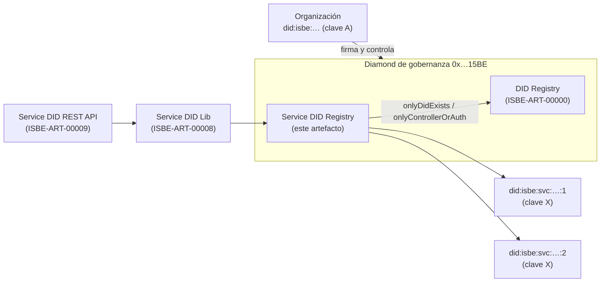
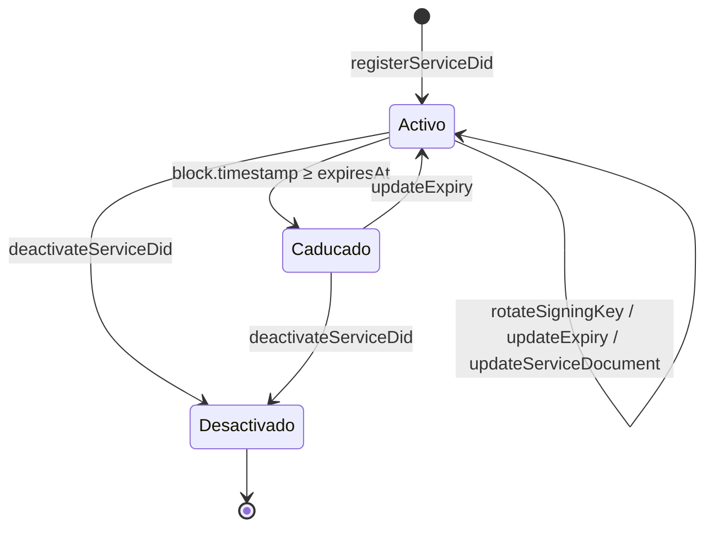

# ISBE-ART-00007 — Service DID Registry Contract (contracts/identity/servicedidregistry)

---

## 1. Identificación del Artefacto

| Campo                     | Valor                                                                                                                                       |
| ------------------------- | ------------------------------------------------------------------------------------------------------------------------------------------- |
| **Nombre del artefacto**  | ISBE-ART-00007 — Service DID Registry Contract (contracts/identity/servicedidregistry)                                                      |
| **Origen**                | Repositorio oficial de Smart Contracts de ISBE. Faceta del Diamond de gobernanza (EIP-2535) que extiende el registro did:isbe (ISBE-ART-00000). |
| **Estado**                | Borrador                                                                                                                                    |
| **Versión del documento** | 0.1.0                                                                                                                                       |
| **Fecha**                 | 2026-10-09                                                                                                                                  |
| **Repositorio**           | [https://github.com/red-isbe/isbe-contracts](https://github.com/red-isbe/isbe-contracts/tree/main/contracts/identity/servicedidregistry)   |
| **Commit**                | `ab3c2646d35158f76b27a2e01b72725840c71e01`                                                                                                  |

---

## 2. Propósito del Artefacto

### Objetivo funcional:

Permitir que una organización ya registrada con un `did:isbe` emita **identidades operativas** propias para sus servicios, pipelines y agentes autónomos, bajo el subespacio `did:isbe:svc:`. Cada identidad de servicio queda ligada para siempre a su DID de organización, tiene su propia clave de firma y un ciclo de vida programático (alta, rotación de clave, caducidad y desactivación), sin que el servicio tenga nunca acceso a las claves de la organización.

### Beneficio para ISBE:

- **Cadena de confianza sin onboarding adicional**: eIDAS → `did:isbe` (organización) → `did:isbe:svc` (servicio). El servicio hereda la confianza de su organización.
- **Delegación segura**: la organización da identidad a un servicio o a un agente de IA sin compartir su clave; la clave del servicio solo se registra, nunca firma por la organización.
- **Revocación inmediata y atribución**: cada firma de un servicio es atribuible a su organización y la organización puede rotar la clave o desactivar el servicio en cualquier momento.
- **Identificadores deterministas y trazables** a su controlador, reproducibles fuera de la cadena.
- **Integración nativa en el Diamond de gobernanza**: misma dirección que el registro did:isbe, sin contrato adicional que desplegar.

### Stakeholders clave:

- GT de Identidad y GT de Smart Contracts
- Organizaciones que operan servicios, pipelines o agentes en ISBE
- Equipos de las librerías y APIs consumidoras (ISBE-ART-00008, ISBE-ART-00009) y del faucet (ISBE-ART-07000)
- Auditores, reguladores y verificadores de firmas

---

## 3. Alcance y Ciclo de Vida

### Fases cubiertas:

✅ **Definición**: Subespacio `did:isbe:svc:`, modelo de datos del registro, reglas de unicidad de clave y decisiones de diseño (D1–D10) recogidas en la NatSpec de `IServiceDidRegistry`.  
✅ **Desarrollo**: Faceta `ServiceDidRegistryFacet` integrada en el Diamond de gobernanza, con tests unitarios y de upgrade sobre un Diamond existente.  
✅ **Validación**: Suite `test/identity/ServiceDidRegistry.spec.ts`, cobertura del 100 % y análisis estático (solhint, slither) en CI.  
⬜ **Mantenimiento**: Evolutivos aditivos (nuevas funciones al final de la interfaz y miembros nuevos al final del storage).

### Dependencias:

- **ISBE-ART-00000** — did:isbe Registry Contract: el controlador de cada servicio debe existir en él y la autorización de escritura se decide sobre sus controladores.
- **ISBE-ART-01000** — Proxies EIP-2535 e ISBE Proxy: la faceta se incorpora al Diamond de gobernanza (`0x00000000000000000000000000000000000015BE`).
- **ISBE-ART-02003** — Comprobación EOAs contra lista de identidades: por diseño (decisión D1), una clave de servicio **no** satisface `onlyKnownDid`.

### Mantenimiento:

Cambios aditivos mediante upgrade de la faceta. El storage es de posición fija (`_SERVICE_DID_REGISTRY_STORAGE_POSITION`) y solo admite añadir miembros al final de la estructura.

---

## 4. Definición del Artefacto

### 4.1. Artefacto de arquitectura de referencia:



La faceta comparte el Diamond con el registro did:isbe. Sus escrituras las firma un controlador del DID de organización; el servicio solo aporta su clave pública.

### 4.2. Trazabilidad:

| Requisito                                                        | Cobertura en el contrato                                                         |
| ---------------------------------------------------------------- | -------------------------------------------------------------------------------- |
| Identidad operativa ligada a una organización                    | `controllerDid` inmutable en cada registro                                       |
| Alta y gestión solo por la organización                          | `onlyDidExists` + `onlyControllerOrAuth` sobre el DID de organización            |
| Revocación por la organización                                   | `deactivateServiceDid` (irreversible) y `updateExpiry`                           |
| Rotación de clave sin solape                                     | `rotateSigningKey` (atómica)                                                     |
| Atribución inequívoca de firmas                                  | Unicidad de clave entre organizaciones (`SigningKeyAlreadyInUse`)                |
| Separación entre identidad de organización y de servicio         | `SigningKeyBoundToDid` y decisión D1                                             |
| Soporte de las dos curvas de ISBE                                | `ellipticType` por clave (secp256k1 y P-256)                                     |
| Metadatos libres por servicio                                    | Service document (máx. 4096 bytes)                                               |

### 4.3. Descripción funcional detallada:

**Principales flujos y casos de uso:**

- **Alta de un servicio** (`registerServiceDid` / `registerServiceDidWithDocument`): un controlador del DID de organización registra la clave pública del servicio, la curva, una etiqueta (se guarda su hash) y una caducidad opcional. El identificador se asigna en cadena con el nonce del controlador y se lee del evento `ServiceDidRegistered`.
- **Rotación de clave** (`rotateSigningKey`): sustituye la clave del servicio de forma atómica. La clave anterior deja de ser válida en el mismo bloque.
- **Caducidad** (`updateExpiry`): fija o elimina (`0`) la fecha de caducidad.
- **Desactivación** (`deactivateServiceDid`): irreversible. Un servicio sustituto es un alta nueva, con nonce nuevo.
- **Service document** (`updateServiceDocument`, `getServiceDocument`): JSON libre de hasta 4096 bytes que la resolución añade al DID Document.
- **Consultas**: `getServiceDid`, `getServiceDidsByController` (paginada), `isServiceDidActive`, `signingKeyAddressOf`, `computeServiceDid`.

**El identificador.** En cadena, un servicio se indexa por `keccak256(abi.encode(controllerDid, uint64 nonce))`, con nonce empezando en 1. La forma legible `did:isbe:svc:<red>:<segmento de la organización>:<nonce>` lleva su propia preimagen, de modo que se convierte al `bytes32` sin llamadas a la red. El nonce que consumirá un alta no se puede predecir (dos altas concurrentes leen el mismo contador), por lo que el identificador se lee siempre del evento (decisión D10).

**La clave.** El registro guarda las coordenadas `x` e `y` de la clave pública, no una dirección: una dirección es un hash truncado y no permite reconstruir el `JsonWebKey2020` que el resolver necesita para claves P-256. La dirección se deriva al leer (`signingKeyAddressOf`), igual que en el registro de organizaciones, de forma que nunca puede desincronizarse de la clave.

**Fragmento de código (registro de un servicio):**

```solidity
function registerServiceDid(
    bytes32 _controllerDid,
    bytes memory _publicKey,
    IDidDocumentDetailed.EllipticType _ellipticType,
    bytes32 _labelHash,
    uint256 _expiresAt
)
    external
    override
    whenNotPaused
    bytes32IsNotZero(_controllerDid)
    emptyBytes(_publicKey)
    validateEllipticType(_ellipticType)
    onlyDidExists(_controllerDid)
    onlyControllerOrAuth(_controllerDid)
    returns (bytes32 serviceDid)
```

### 4.4. Modelos o diagramas específicos:

**Registro en storage** (`IServiceDidRegistry.ServiceDidRecord`, seis slots):

| Slot | Campos                                                                       |
| ---- | ---------------------------------------------------------------------------- |
| 0    | `controllerDid`                                                              |
| 1    | `labelHash`                                                                  |
| 2    | `pubKeyX`                                                                    |
| 3    | `pubKeyY`                                                                    |
| 4    | `expiresAt`, `ellipticType`, `nonce`, `deactivated`, `exists`, `registeredAt` |
| 5    | `updatedAt`                                                                  |

**Storage de la faceta** (`ServiceDidRegistryStorage`): `records`, `serviceDidsByController`, `nonceByController`, `serviceDidByPublicKeyHash` y `documents`.

**Ciclo de vida:**



### 4.5. Reglas de negocio asociadas:

| Regla                                                                                         | Error                         |
| --------------------------------------------------------------------------------------------- | ----------------------------- |
| El DID de organización debe existir y quien firma debe ser su controlador o estar autorizado | Errores del DID Registry      |
| El Diamond no debe estar en pausa                                                             | `IsPaused`                    |
| La caducidad es `0` (sin caducidad) o un instante futuro que cabe en `uint64`                 | `InvalidExpiry`               |
| La clave no puede ser la de ningún DID de organización                                        | `SigningKeyBoundToDid`        |
| La clave no puede estar en uso por un servicio de **otra** organización                       | `SigningKeyAlreadyInUse`      |
| Una rotación no puede apuntar a la clave ya vigente                                           | `SigningKeyAlreadyInUse`      |
| Servicios de la **misma** organización sí pueden compartir clave                              | —                             |
| Un servicio desactivado no admite más escrituras                                              | `ServiceDidIsDeactivated`     |
| Operar sobre un identificador no registrado                                                   | `ServiceDidNotFound`          |
| El service document no puede superar 4096 bytes                                               | `ServiceDocumentTooLarge`     |
| `initializeServiceDidRegistry` solo una vez y solo con `DEFAULT_ADMIN_ROLE`                   | Errores del initializer / rol |

**Decisión D1.** Una identidad de servicio **no** se resuelve en cadena: su clave nunca se escribe en el índice de direcciones del registro de organizaciones, así que `didOf` devuelve cero y no satisface `onlyKnownDid` ni puede tener roles basados en DID. Las identidades de servicio existen para firmar fuera de la cadena y se verifican a través del resolver.

**Cascada de la organización.** `isServiceDidActive` no evalúa si la organización sigue operativa; esa cascada la aplica el resolver (ISBE-ART-00008).

### 4.6. Interfaces y puntos de integración:

**Interfaz pública** (`IServiceDidRegistry`, 13 selectores, *resolver key* `_SERVICE_DID_REGISTRY_RESOLVER_KEY`):

| Función                                     | Tipo  | Descripción                                                                |
| ------------------------------------------- | ----- | -------------------------------------------------------------------------- |
| `initializeServiceDidRegistry()`            | Write | Inicializa la faceta (una vez, `DEFAULT_ADMIN_ROLE`)                       |
| `registerServiceDid(...)`                   | Write | Alta de un servicio                                                        |
| `registerServiceDidWithDocument(...)`       | Write | Alta con service document                                                  |
| `rotateSigningKey(serviceDid, key, curve)`  | Write | Rotación atómica de la clave                                               |
| `updateExpiry(serviceDid, expiresAt)`       | Write | Cambio o eliminación de la caducidad                                       |
| `updateServiceDocument(serviceDid, doc)`    | Write | Sustituye o borra el service document                                      |
| `deactivateServiceDid(serviceDid)`          | Write | Desactivación irreversible                                                 |
| `getServiceDid(serviceDid)`                 | View  | Registro completo (revierte si no existe)                                  |
| `getServiceDocument(serviceDid)`            | View  | Service document                                                           |
| `getServiceDidsByController(did, page, n)`  | View  | Servicios de una organización, paginados                                   |
| `isServiceDidActive(serviceDid)`            | View  | Existe, no desactivado y no caducado (no revierte)                         |
| `signingKeyAddressOf(serviceDid)`           | View  | Dirección derivada de la clave vigente                                     |
| `computeServiceDid(controllerDid, nonce)`   | Pure  | Reproduce un identificador                                                 |

**Eventos:** `ServiceDidRegistryInitialized`, `ServiceDidRegistered`, `ServiceDidKeyRotated`, `ServiceDidExpiryUpdated`, `ServiceDidDeactivated`, `ServiceDidDocumentUpdated`. `ServiceDidRegistered` incluye todo lo necesario para construir el método de verificación W3C desde el propio log.

> **Evolutivo en curso (ISBECORE-354, pendiente de merge):** `getServiceDidsByAddress(address, page, pageSize)`, búsqueda por dirección sin cambios de storage. Deriva la dirección de cada clave guardada recorriendo, página a página, la lista global de DIDs de organización y sus servicios. La paginación es sobre organizaciones, no sobre resultados. Es la consulta que usa el faucet (ISBE-ART-07000) para fondear a los agentes.

**Consumidores:** Service DID Lib (ISBE-ART-00008), Service DID REST API (ISBE-ART-00009) y Faucet (ISBE-ART-07000).

### 4.7. Normativas y requisitos regulatorios:

- **eIDAS2**: la confianza del servicio se apoya en la de su organización, identificada según eIDAS.
- **RGPD**: en cadena solo se guardan claves públicas, el hash de la etiqueta y el service document. El service document es público y permanente en el historial de la cadena: no debe contener datos personales.
- **W3C DID Core**: el modelo de datos permite construir DID Documents conformes para ambas curvas.

### 4.8. Criterios de calidad específicos:

- Cobertura del 100 % (sentencias, ramas, funciones y líneas) exigida en CI.
- Sin hallazgos de severidad media o alta en slither.
- Coste de alta independiente de la longitud de la etiqueta (se guarda su hash).
- Upgrade verificado sobre un Diamond existente sin colisiones de selectores.

---

## 5. Desarrollo del Artefacto

### 5.1. Componentes del artefacto:

- `contracts/identity/servicedidregistry/interfaces/IServiceDidRegistry.sol` — interfaz, modelo de datos, eventos y errores.
- `contracts/identity/servicedidregistry/ServiceDidRegistryInternal.sol` — storage y lógica interna.
- `contracts/identity/servicedidregistry/ServiceDidRegistry.sol` — funciones externas y modificadores.
- `contracts/identity/servicedidregistry/ServiceDidRegistryFacet.sol` — introspección de la faceta (selectores, interfaces y *business id*).
- `contracts/testwrapper/identity/servicedidregistry/` — wrappers y sonda de storage para tests.
- `test/identity/ServiceDidRegistry.spec.ts` y `test/fixtures/servicedidregistry.ts` — tests y fixtures de upgrade.

### 5.2. Lista de elementos clave producidos:

| Nombre                  | Descripción                                      | Enlace                                                                                                                |
| ----------------------- | ------------------------------------------------ | --------------------------------------------------------------------------------------------------------------------- |
| Código                  | Faceta del Service DID Registry                  | [contracts/identity/servicedidregistry](https://github.com/red-isbe/isbe-contracts/tree/main/contracts/identity/servicedidregistry) |
| Tests                   | Suite de la faceta y fixtures de upgrade         | [test/identity/ServiceDidRegistry.spec.ts](https://github.com/red-isbe/isbe-contracts/blob/main/test/identity/ServiceDidRegistry.spec.ts) |
| Constantes              | Resolver key, posición de storage y versión      | `contracts/constants/` (`resolverKeys.sol`, `storagePositions.sol`, `facetVersions.sol`)                              |
| Manual                  | Este documento y la NatSpec de la interfaz       | [ISBE-ART-00007.md](./ISBE-ART-00007.md)                                                                              |
| Última versión liberada | Versiones y etiquetado de release                | [Releases](https://github.com/red-isbe/isbe-contracts/releases)                                                       |

### 5.3. Frameworks, librerías o tecnologías acordadas:

- **Solidity** ^0.8.28
- **Hardhat**, **ethers v6**, **TypeChain**
- **EIP-2535** (Diamond) con la infraestructura de proxies de ISBE
- **solidity-coverage**, **solhint**, **slither**, **prettier-plugin-solidity**

### 5.4. Buenas prácticas aplicables:

- Storage en posición fija y solo ampliable al final.
- Errores personalizados en lugar de cadenas de texto.
- Modificadores para pausa, autorización y existencia; validaciones dependientes de datos en funciones internas.
- Datos derivados (dirección de la clave) calculados al leer, nunca duplicados en storage.
- Nuevas funciones dentro de `IServiceDidRegistry`, no en interfaces aparte (estructura del Diamond).

### 5.5. Criterios de validación del desarrollo:

| Test / Escenario                                   | Resultado esperado                                         |
| -------------------------------------------------- | ---------------------------------------------------------- |
| Corte de la faceta en un Diamond existente         | Sin colisiones; todos los selectores enrutan a la faceta   |
| Alta del primer y segundo servicio                 | Nonce 1 y 2, identificadores distintos                     |
| Lectura del registro                               | Todos los campos coinciden con lo enviado                  |
| Alta por quien no controla la organización         | Revierte                                                   |
| Alta con organización inexistente o caducidad pasada | Revierte                                                 |
| Clave compartida en la misma organización          | Se acepta                                                  |
| Clave de otra organización o de un DID de organización | Revierte (`SigningKeyAlreadyInUse` / `SigningKeyBoundToDid`) |
| Rotación                                           | La clave cambia y `signingKeyAddressOf` sigue a la nueva   |
| Desactivación                                      | Toda escritura posterior revierte                          |
| Caducidad alcanzada                                | `isServiceDidActive` devuelve `false`                      |
| Paginación por controlador                         | Páginas base 1, total correcto                             |
| Service document en el límite y por encima         | Se acepta 4096 bytes; 4097 revierte                        |
| Pausa del Diamond                                  | Todas las escrituras revierten                             |

```bash
npx hardhat test test/identity/ServiceDidRegistry.spec.ts
npm run test:coverage
```

### 5.6. Alineación con requisitos legales:

- **RGPD**: minimización de datos en cadena; la etiqueta legible se guarda fuera de la cadena (solo su hash en el registro).
- **eIDAS2**: trazabilidad de cada servicio hasta una organización identificada.

### 5.7. Dependencias técnicas o de infraestructura:

- Diamond de gobernanza de ISBE con el DID Registry desplegado e inicializado.
- Upgrade de facetas con la tarea `updateDiamondFacets` de `isbe-contracts` (todas las facetas por defecto). Añadir funciones a `IServiceDidRegistry` cambia su identificador ERC-165, por lo que el registro de interfaces se actualiza en el mismo upgrade.
- Node.js y Hardhat para compilar, testear y desplegar.

### 5.8. Limitaciones temporales:

- Desplegado en la red de desarrollo (DEV). Despliegue en PRE y PRO por confirmar.
- Sin enumeración global de servicios: solo por organización (`getServiceDidsByController`). La búsqueda por dirección de ISBECORE-354 escala con el número de organizaciones y está pensada para lecturas fuera de la cadena.

### 5.9. Limitaciones por versiones, licencias o configuraciones:

- Licencia Apache-2.0.
- Las curvas admitidas son las del enumerado `EllipticType` del DID Registry.
- `isServiceDidActive` no aplica la cascada de la organización; un verificador debe usar el resolver.

---

## 6. Reglas de Control y Actualización

- **Política de gestión de versiones**: versionado de la faceta mediante `_SERVICE_DID_REGISTRY_FACET_VERSION` y SemVer para este documento.
- **Actualización tras la entrega**: por el GT propietario, mediante Pull Request y upgrade de facetas del Diamond.
- **Frecuencia de revisión**: con cada evolutivo de la faceta o del DID Registry del que depende.
- **Herramienta de control de cambios**: repositorio GitHub `red-isbe/isbe-contracts`.

| Tipo de cambio  | Versionado | Flujo de aprobación                    | Documentación requerida              |
| --------------- | ---------- | -------------------------------------- | ------------------------------------ |
| Evolutivo mayor | X+1.0      | Pull Request + revisión Comité Técnico | Informe de impacto y release notes   |
| Evolutivo menor | X.Y+0.1    | Pull Request + revisión GT             | Release notes detalladas             |
| Correctivo      | X.Y.Z+1    | Pull Request + revisión GT             | Descripción del fix en release notes |

---

Copyright © 2025 Comunidad de Madrid & Alastria
