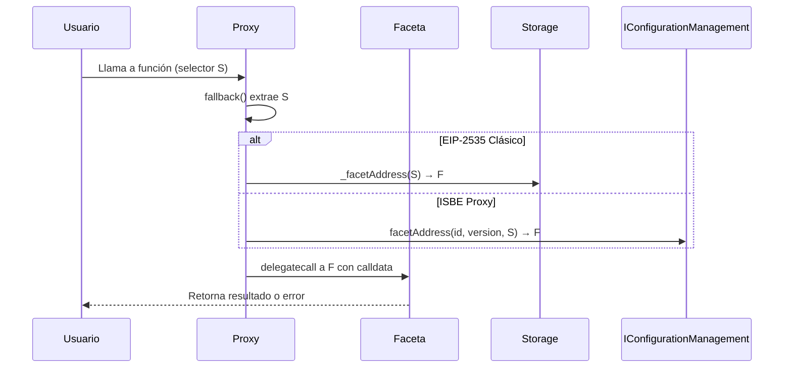
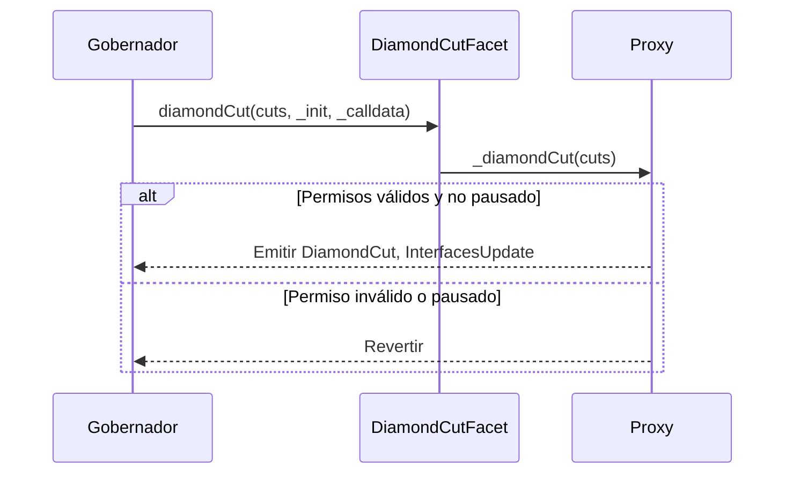
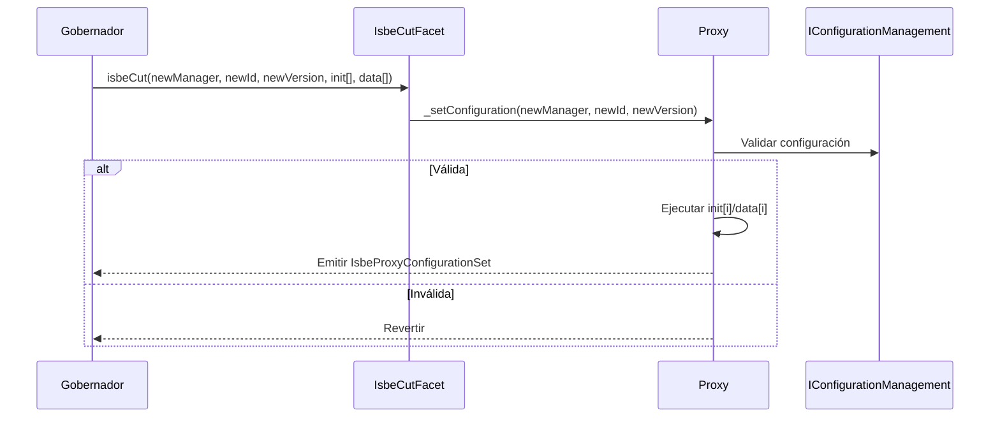

# ISBE-ART-01000 — Proxies EIP‑2535 e ISBE Proxy

---

## 1. Identificación del Artefacto

| Campo                       | Valor                                                                                                                                                                                 |
| --------------------------- | ------------------------------------------------------------------------------------------------------------------------------------------------------------------------------------- |
| **Nombre del artefacto**    | ISBE-ART-01000 — Proxies EIP‑2535 e ISBE Proxy                                                                                                                                        |
| **Origen**                  | Documento derivado del repositorio oficial de Smart Contracts, consolidando información técnica en un formato comprensible para administraciones públicas y organismos financiadores. |
| **Estado**                  | Validado                                                                                                                                                                              |
| **Versión del documento**   | 0.1.1                                                                                                                                                                                 |
| **Fecha**                   | 2025-08-11                                                                                                                                                                            |
| **Repositorio (congelado)** | [https://github.com/alastria/isbe-contracts](https://github.com/alastria/isbe-contracts)                                                                                              |
| **Commit**                  | `2c3a2accef78bbf723c970c8139df34a4d3137c8`                                                                                                                                            |

---

## 2. Propósito del Artefacto

### Objetivo funcional:

Definir cómo se gestionan y actualizan de forma segura los "proxies" (componentes de software que permiten cambiar funcionalidades sin interrumpir el servicio) en la red ISBE, garantizando trazabilidad, control de accesos y adaptación a nuevas normativas.

### Beneficio para ISBE:

- **Actualización sin interrupción**: Permite introducir mejoras o corregir errores en contratos inteligentes sin afectar la operatividad ni la dirección del contrato.
- **Auditoría y gobernanza**: Aporta mecanismos de registro y control exigidos por reglamentos europeos como **eIDAS2**, **NIS2** y **RGPD**.
- **Interoperabilidad**: Favorece la integración con redes europeas como **EBSI** (European Blockchain Services Infrastructure), reduciendo riesgos regulatorios y técnicos.
- **Flexibilidad arquitectónica**: Soporta múltiples modelos de gobierno (por propiedad o roles) y permite externalizar la lógica de enrutamiento mediante configuraciones versionadas.

### Stakeholders clave:

- Equipos técnicos de desarrollo y operaciones.
- Auditores de seguridad y cumplimiento normativo.
- Órganos de gobernanza técnica.
- Administraciones públicas y organismos reguladores.
- Entidades emisoras de credenciales y servicios digitales.

---

## 3. Alcance y Ciclo de Vida

### Fases cubiertas:

✅ **Definición**: Descripción funcional y estratégica de cómo operan los proxies, qué flujos soportan y qué requisitos de control deben cumplir.  
✅ **Desarrollo**: Implementación y pruebas sobre entornos de referencia, incluyendo ejemplos de integración.  
🟡 **Validación**: Pruebas unitarias y de integración (por confirmar en el commit).  
🟡 **Mantenimiento**: Actualización alineada con evoluciones del estándar y normativas.

### Inicio de fases y paquetes relacionados:

- Pertenece al **PT1 (Diseño y desarrollo del cliente ISBE)**, Tarea **T1.4 (Desarrollo de artefactos)**.
- Módulos base: `proxies/eip2535` (EIP‑2535 clásico), `proxies/isbeproxy` (ISBE Proxy).

### Dependencias:

- Contratos base: EIP‑2535 (Diamond, Cut, Loupe), OpenZeppelin.
- Componente externo: `IConfigurationManagement` (gestión centralizada de configuraciones).
- Estándares: EIP‑2535 (Diamond), ERC‑165 (introspección), IEIP2535Introspection (extensión ISBE).

### Mantenimiento:

- Revisión anual o ante cambios regulatorios (NIS2, eIDAS2).
- Actualización de configuraciones mediante versionado en `IConfigurationManagement`.

---

## 4. Definición del Artefacto

### 4.1. Artefacto de arquitectura de referencia

El artefacto se apoya en la arquitectura ISBE basada en **Hyperledger Besu**, con un patrón de diseño modular que permite aislar, actualizar y auditar funcionalidades.

#### EIP‑2535 "clásico":

- **Diamante (Diamond)**: Contrato proxy que enruta llamadas a múltiples "facetas" (contratos) mediante el selector de función.
- **Facetas**: Contratos que implementan funciones específicas (e.g., gestión de tokens, identidad).
- **Fallback**: Resuelve la faceta destino por selector y delega la ejecución mediante `delegatecall`.

#### ISBE Proxy:

- **Enrutamiento externalizado**: La resolución de facetas no está almacenada en el proxy, sino delegada a un contrato externo `IConfigurationManagement`.
- **Configuración versionada**: El proxy utiliza un `(configurationId, version)` para determinar qué conjunto de facetas está activo.
- **Inicialización encadenada**: Soporta múltiples llamadas de inicialización (`init[]`, `data[]`) durante el despliegue o actualización.

> ✅ **Ventaja clave**: Permite "rollbacks" de configuración y unificación del control en un gestor centralizado.

---

### 4.2. Trazabilidad

Este artefacto se alinea con:

- **ENT_1 – Evaluación de necesidades** (30/06/2025): Requisitos de trazabilidad, gobernanza y cumplimiento.
- **ENT_2 – Análisis de requerimientos** (30/06/2025): Requisito 2.6 (actualización modular), 6.1 (control de cambios).
- **Arquitectura de Referencia de ISBE**: Epígrafe 5.6.3 (definición de proxies) y 18.2 (requisitos regulatorios).

Para trazabilidad fina, se recomienda vincular cada función con un ID de requisito en futuras iteraciones.

---

### 4.3. Descripción funcional detallada

#### 4.3.1. EIP‑2535 Clásico (Diamante)

- **Almacenamiento interno**: Mapeo `selector → faceta` almacenado en el diamante.
- **Facetas de gobierno**:
    - `DiamondCutOwnableFacet`: Control por propiedad (`onlyOwner`).
    - `DiamondCutAccessControlFacet`: Control por roles (`onlyRole(GOVERNANCE_MANAGER_ROLE)`).
- **Pausa**: Operaciones de corte están sujetas a `whenNotPaused`.

#### 4.3.2. ISBE Proxy

- **Constructor (`IsbeProxyArgs`)**:
    - Parámetros: `configurationManagement`, `configurationId`, `version`, `init[]`, `data[]`.
    - Comportamiento: Valida la configuración en `IConfigurationManagement`, establece estado activo y ejecuta inicializadores en orden.
- **API pública**: No añade funciones externas; expone funcionalidad a través de facetas.

---

### 4.4. Diferencias clave y ventajas frente a soluciones estándar

| Característica                 | EIP‑2535 Clásico                         | ISBE Proxy                                                           |
| ------------------------------ | ---------------------------------------- | -------------------------------------------------------------------- |
| **Almacenamiento de enrutado** | En el diamante (on-chain, local)         | Externalizado en `IConfigurationManagement` (on-chain, centralizado) |
| **Gobierno**                   | Facetas `Cut` (propiedad o RBAC)         | Faceta `IsbeCutFacet` que cambia `(manager, id, versión)`            |
| **Migraciones/Init**           | `_init`/`_calldata` en `diamondCut`      | Listas `init[]`/`data[]` aplicadas al cambiar configuración          |
| **Rollback**                   | Manual (requiere nuevo corte)            | Automático (cambiar a versión anterior)                              |
| **Operativa**                  | Compleja, riesgo de estado inconsistente | Coherente por versión, pero depende del gestor externo               |
| **Auditoría**                  | Eventos `DiamondCut`, `InterfacesUpdate` | Evento `IsbeProxyConfigurationSet`                                   |

> ✅ **Ventaja ISBE**: Coherencia por versión, trazabilidad centralizada, menor riesgo de errores en actualizaciones.

---

### 4.5. Flujos de ejecución

#### 4.5.1. Enrutamiento de llamadas (ambos proxies)



#### 4.5.2. Actualización de facetas (EIP‑2535 clásico)



#### 4.5.3. Cambio de configuración (ISBE Proxy)



---

### 4.6. Reglas de negocio asociadas

| Contrato/Faceta              | Función                                      | Permiso requerido                   | Pausa afecta         |
| ---------------------------- | -------------------------------------------- | ----------------------------------- | -------------------- |
| DiamondCutOwnableFacet       | `diamondCut`, `interfaceCut`, `facetUpdates` | `onlyOwner`                         | Sí (`whenNotPaused`) |
| DiamondCutAccessControlFacet | `diamondCut`, `interfaceCut`, `facetUpdates` | `onlyRole(GOVERNANCE_MANAGER_ROLE)` | Sí                   |
| IsbeCutFacet                 | `isbeCut`                                    | `onlyRole(ISBE_GOVERNANCE_ROLE)`    | Sí                   |
| IsbeProxyInternal            | `_facetAddress`                              | Ninguno (resolución)                | No                   |
| Base EIP‑2535 / ISBE         | `fallback()`                                 | Ninguno                             | No                   |

> ⚠️ **Nota**: Identificador exacto del rol (`GOVERNANCE_MANAGER_ROLE`) por confirmar en el commit.

---

### 4.7. Interfaces y puntos de integración

#### 4.7.1. Interfaces clave

**EIP‑2535 Estándar**

- `IDiamondCut`: `diamondCut`, `interfaceCut`, `facetUpdates`
- `IDiamondLoupe`: `facetAddress`, `facetAddresses`, `facetFunctionSelectors`, `facets`, `supportsInterface`
- `IEIP2535Introspection` (ISBE extensión): `interfacesIntrospection`, `businessIdIntrospection`, `selectorsIntrospection`

**ISBE Proxy**

- `IIsbeCut`: `isbeCut(configurationManagement, configurationId, version, initAddresses, initData)`
- `IConfigurationManagement`: `facets(id, version) → Facet[]`, `facetAddress(id, version, selector) → address`

#### 4.7.2. Eventos

- `DiamondCut(cut, result, init, calldata)`
- `InterfacesUpdate(facet, interfaces)`
- `IsbeProxyConfigurationSet(manager, id, version, initAddresses, initData)`

#### 4.7.3. Errores destacados

- `FunctionNotFound(selector)`
- `NoSelectorsInFacet(address facet)`
- `CannotAddItemsToZeroAddress`
- `CannotAddItemToDiamondThatAlreadyExists`
- `RemoveFacetAddressMustBeZeroAddress`
- `NoItemsProvidedForUpdate`
- `ZeroItem`
- `CannotReplaceItemsFromFacetWithZeroAddress`
- `CannotReplaceImmutableItems`
- `CannotReplaceItemWithTheSameItemFromTheSameFacet`
- `CannotReplaceItemThatDoesNotExists`
- `CannotRemoveItemThatDoesNotExist`
- `CannotRemoveImmutableItem`

> ⚠️ **Estado**: Algunos errores y estructuras de almacenamiento están por completar (contenido truncado en el commit).

---

### 4.8. Normativas y requisitos regulatorios

- **eIDAS2**: Soporte para identidad verificable mediante trazabilidad de cambios de configuración.
- **NIS2**: Capacidad de auditoría completa mediante eventos (`DiamondCut`, `IsbeProxyConfigurationSet`).
- **RGPD**: Posibilidad de pausa en caso de incidentes o ejercicio de derechos (ej. supresión).
- **Transparencia**: Todos los cambios son inmutables y trazables en blockchain.

---

### 4.9. Criterios de calidad específicos

#### 4.9.1. Compatibilidad e interoperabilidad

- Cumple con **EIP‑2535** y **ERC‑165**.
- Compatible con herramientas de análisis y explorers que soportan introspección.
- Extensión `IEIP2535Introspection` facilita descubrimiento de interfaces y selectores por faceta.

#### 4.9.2. Buenas prácticas de uso

- **Validar antes de producir**:
    - En EIP‑2535: verificar `facetAddress(selector) != 0x0`.
    - En ISBE: validar off-chain que `(id, versión)` contiene las funciones requeridas.
- **Migraciones**:
    - Aglutinar cambios y usar inicializaciones atómicas.
    - Diseñar inicializadores idempotentes.
- **Gobernanza**:
    - Minimizar direcciones con permisos de corte/configuración.
    - Rotación periódica de claves.
- **Observabilidad**:
    - Monitorear eventos `DiamondCut`, `InterfacesUpdate`, `IsbeProxyConfigurationSet`.

---

## 5. Desarrollo del Artefacto

### 5.1. Componentes del artefacto

- **EIP‑2535 y facetas asociadas**:
    - `IDiamond`, `IDiamondCut`, `IDiamondLoupe`, `IEIP2535Introspection`
    - `DiamondCutOwnableFacet`, `DiamondCutAccessControlFacet`
    - `DiamondLoupeFacet`, `FacetAddressResolver`
    - `EIP2535` (proxy base), `EIP2535Internal` (internos)
    - `EIP2535Ownable`, `EIP2535AccessControl` (constructores)
- **ISBE Proxy**:
    - `IsbeProxy`, `IsbeProxyInternal`
    - `IIsbeCut`, `IsbeCutFacet`
    - `IsbeLoupeFacet`
    - `IConfigurationManagement` (dependencia crítica)

### 5.2. Componentes del artefacto y su interacción

El artefacto de proxies está compuesto por varios contratos inteligentes que trabajan conjuntamente para proporcionar un sistema completo de gestión de proxies con funcionalidades avanzadas de enrutamiento y actualización.

**1. Contratos base EIP-2535 (Diamond Standard)**

- **`EIP2535.sol`**: Contrato proxy base que implementa el patrón Diamond. Gestiona el almacenamiento interno del mapeo `selector → faceta` y ejecuta el fallback para delegar llamadas mediante `delegatecall`.
- **`EIP2535Internal.sol`**: Contiene la lógica interna para gestión del storage de facetas, incluyendo funciones como `_diamondCut`, `_facetAddress`, y validaciones de seguridad.
- **`EIP2535Ownable.sol`** y **`EIP2535AccessControl.sol`**: Versiones con diferentes modelos de gobernanza (propiedad única vs. control basado en roles).

**2. Facetas de gestión**

- **`DiamondCutOwnableFacet.sol`**: Permite actualizaciones del diamond mediante control de propiedad (`onlyOwner`).
- **`DiamondCutAccessControlFacet.sol`**: Versión con control basado en roles (`onlyRole(GOVERNANCE_MANAGER_ROLE)`).
- **`DiamondLoupeFacet.sol`**: Proporciona introspección del diamond, permitiendo consultar qué facetas y selectores están disponibles.

**3. Sistema ISBE Proxy**

- **`IsbeProxy.sol`**: Proxy que externaliza la resolución de facetas a `IConfigurationManagement`. Gestiona configuraciones versionadas mediante `(configurationId, version)`.
- **`IsbeProxyInternal.sol`**: Lógica interna para resolución externa de facetas y gestión del estado de configuración.
- **`IsbeCutFacet.sol`**: Permite cambiar la configuración activa del proxy ISBE.
- **`IsbeLoupeFacet.sol`**: Proporciona introspección para proxies ISBE.

**4. Interfaces y utilidades**

- **`FacetAddressResolver.sol`**: Utilidad para resolución eficiente de direcciones de facetas.
- **Interfaces estándar**: `IDiamondCut`, `IDiamondLoupe`, `IIsbeCut` definen los contratos estándar.
- **`IEIP2535Introspection`**: Extensión ISBE para introspección avanzada.

**Interacción entre los contratos:**

- Los proxies EIP-2535 utilizan `EIP2535Internal` para gestionar el almacenamiento local de facetas.
- Las facetas `Cut` permiten modificar la configuración de facetas activas, aplicando validaciones de permisos y pausa.
- Las facetas `Loupe` exponen información sobre la configuración actual para introspección.
- Los proxies ISBE delegan la resolución a `IConfigurationManagement`, permitiendo gestión centralizada y versionada.
- Todas las operaciones críticas están sujetas a controles de pausa y permisos basados en roles.

### 5.3. Frameworks, librerías o tecnologías acordadas

- **Hyperledger Besu** (EVM compatible).
- **Solidity** (contratos inteligentes).
- **OpenZeppelin Contracts** (seguridad y estándares).
- **Hardhat** (pruebas y despliegue).
- **ethers.js v6** (integración off-chain).

### 5.4. Buenas prácticas aplicables

- Seguridad por diseño.
- Auditoría continua.
- Modularidad y reutilización de código.
- Validación de inputs.
- Idempotencia en inicializadores.

### 5.5. Criterios de validación del desarrollo

La validación del desarrollo se ha realizado mediante pruebas unitarias que verifican el correcto funcionamiento de los sistemas de proxies. A continuación se detallan los tests implementados:

| Test / Escenario                       | Descripción                                              | Resultado esperado / Verificación                                                     |
| -------------------------------------- | -------------------------------------------------------- | ------------------------------------------------------------------------------------- |
| **Despliegue de Diamond**              | Se despliega un diamond con facetas iniciales.           | El diamond se despliega correctamente y las facetas están registradas.                |
| **Enrutamiento de llamadas**           | Se realizan llamadas a funciones a través del proxy.     | Las llamadas se enrutan correctamente a las facetas apropiadas.                       |
| **DiamondCut - Agregar facetas**       | Se agregan nuevas facetas al diamond.                    | Se emite el evento `DiamondCut`. Las nuevas facetas son accesibles.                   |
| **DiamondCut - Actualizar facetas**    | Se reemplazan selectores existentes con nuevas facetas.  | Los selectores apuntan a las nuevas facetas. Se mantiene consistencia.                |
| **DiamondCut - Eliminar facetas**      | Se eliminan selectores del diamond.                      | Los selectores eliminados no son accesibles. Se emiten eventos correctos.             |
| **DiamondCut con pausa**               | Se intenta modificar el diamond mientras está pausado.   | Las operaciones revierten con el error `EnforcedPause`.                               |
| **DiamondCut sin permisos**            | Se intenta modificar sin permisos adecuados.             | La transacción revierte con error de permisos.                                        |
| **Loupe - Consulta de facetas**        | Se consultan las facetas y selectores activos.           | `facets()`, `facetAddresses()`, `facetFunctionSelectors()` devuelven datos correctos. |
| **Introspección ERC-165**              | Se consulta el soporte de interfaces.                    | `supportsInterface()` devuelve `true` para interfaces soportadas.                     |
| **ISBE Proxy - Configuración**         | Se despliega un proxy ISBE con configuración específica. | El proxy se configura correctamente y resuelve facetas externamente.                  |
| **ISBE Cut - Cambio de configuración** | Se cambia la configuración activa del proxy ISBE.        | Se emite `IsbeProxyConfigurationSet`. La nueva configuración está activa.             |
| **ISBE Cut - Inicialización múltiple** | Se ejecutan múltiples inicializadores durante el cambio. | Todos los inicializadores se ejecutan en orden correcto.                              |
| **Resolución externa**                 | El proxy ISBE consulta `IConfigurationManagement`.       | Las llamadas se resuelven correctamente mediante el gestor externo.                   |
| **Configuración inválida**             | Se intenta usar una configuración no existente.          | Las operaciones revierten con error de configuración.                                 |
| **Rollback de configuración**          | Se revierte a una versión anterior de configuración.     | El proxy funciona con la configuración anterior.                                      |

Estas pruebas aseguran que los sistemas de proxies funcionen correctamente bajo condiciones normales y excepcionales, cumpliendo los criterios de seguridad, enrutamiento, actualización y gestión de configuraciones definidos en el desarrollo.

_Ejemplo del test de enrutamiento de llamadas_:

```ts
it('GIVEN a diamond with facets WHEN calling a function THEN it routes to correct facet', async () => {
    const result = await diamond.facetAddress(selector)
    expect(result).to.equal(expectedFacetAddress)

    const tx = await diamond[functionSignature](...args)
    await expect(tx).to.emit(expectedFacet, 'ExpectedEvent')
})
```

### 5.6. Alineación con requisitos legales

- **NIS2**: Registro de eventos y trazabilidad de cambios.
- **RGPD**: Pausabilidad como mecanismo de respuesta a incidentes.
- **eIDAS2**: Identidad verificable y trazabilidad de configuraciones.

### 5.7. Dependencias técnicas o de infraestructura

- `IConfigurationManagement` para resolución externalizada en ISBE Proxy.
- Facetas y contratos base de EIP‑2535 (Loupe, Cut, Introspección).

### 5.8. Descripción técnica de las funciones

#### **Funciones externas principales - EIP-2535**

| Función                                                       | Tipo      | Descripción                                                                                              |
| ------------------------------------------------------------- | --------- | -------------------------------------------------------------------------------------------------------- |
| `diamondCut(FacetCut[] cuts, address _init, bytes _calldata)` | Escritura | Modifica la configuración de facetas del diamond. Requiere permisos de gobernanza y que no esté pausado. |
| `facets()`                                                    | Lectura   | Devuelve todas las facetas y sus selectores asociados.                                                   |
| `facetAddress(bytes4 selector)`                               | Lectura   | Devuelve la dirección de la faceta que maneja un selector específico.                                    |
| `facetAddresses()`                                            | Lectura   | Devuelve un array con las direcciones de todas las facetas.                                              |
| `facetFunctionSelectors(address facet)`                       | Lectura   | Devuelve los selectores manejados por una faceta específica.                                             |
| `supportsInterface(bytes4 interfaceId)`                       | Lectura   | Indica si el contrato soporta una interfaz específica (ERC-165).                                         |

#### **Funciones externas principales - ISBE Proxy**

| Función                                                                                        | Tipo      | Descripción                                                                     |
| ---------------------------------------------------------------------------------------------- | --------- | ------------------------------------------------------------------------------- |
| `isbeCut(address configMgmt, bytes32 configId, uint256 version, address[] init, bytes[] data)` | Escritura | Cambia la configuración activa del proxy ISBE. Requiere permisos de gobernanza. |
| `getConfiguration()`                                                                           | Lectura   | Devuelve la configuración actual del proxy (manager, id, version).              |

#### **Funciones internas críticas**

| Función                                                           | Tipo      | Descripción                                                                         |
| ----------------------------------------------------------------- | --------- | ----------------------------------------------------------------------------------- |
| `_diamondCut(FacetCut[] cuts)`                                    | Escritura | Implementa la lógica interna para modificar facetas, con validaciones de seguridad. |
| `_facetAddress(bytes4 selector)`                                  | Lectura   | Resuelve internamente qué faceta maneja un selector específico.                     |
| `_setConfiguration(address manager, bytes32 id, uint256 version)` | Escritura | Establece la configuración activa en un proxy ISBE.                                 |

### 5.9. Descripción técnica de los datos

#### **Estructuras de datos principales**

| Nombre del struct  | Campos                                                                                                                                    | Descripción                                                                   |
| ------------------ | ----------------------------------------------------------------------------------------------------------------------------------------- | ----------------------------------------------------------------------------- |
| `DiamondStorage`   | `mapping(bytes4 => address) facetAddressAndSelectorPosition`<br/>`address[] facetAddresses`<br/>`mapping(address => FacetInfo) facetInfo` | Almacena el mapeo de selectores a facetas y metadatos asociados.              |
| `FacetCut`         | `address facetAddress`<br/>`FacetCutAction action`<br/>`bytes4[] functionSelectors`                                                       | Define una operación de modificación de faceta (agregar/reemplazar/eliminar). |
| `IsbeProxyStorage` | `address configurationManagement`<br/>`bytes32 configurationId`<br/>`uint256 version`                                                     | Almacena la configuración activa de un proxy ISBE.                            |

#### **Variables de almacenamiento críticas**

| Variable / Slot                | Tipo                 | Descripción                                                           |
| ------------------------------ | -------------------- | --------------------------------------------------------------------- |
| `_DIAMOND_STORAGE_POSITION`    | `bytes32` (constant) | Slot fijo donde se ubica `DiamondStorage` en el storage del contrato. |
| `_ISBE_PROXY_STORAGE_POSITION` | `bytes32` (constant) | Slot fijo para `IsbeProxyStorage` en proxies ISBE.                    |

### 5.10. Roles

- **`GOVERNANCE_MANAGER_ROLE`**: Permiso para ejecutar `diamondCut` en facetas con control de acceso.
- **`ISBE_GOVERNANCE_ROLE`**: Permiso para cambiar configuraciones en proxies ISBE mediante `isbeCut`.
- **`PAUSER_ROLE`**: Permiso para pausar y despausar operaciones críticas.
- **`DEFAULT_ADMIN_ROLE`**: Rol administrativo superior que puede gestionar otros roles.

### 5.11. Puntos "por completar"

- Interfaz completa de `IConfigurationManagement` (altas/bajas, versionado, gobernanza).
- Validaciones de atomicidad y orden en listas `init[]/data[]`.
- Identificador exacto del rol de gobernanza (`GOVERNANCE_MANAGER_ROLE`).
- Detalles de layout de almacenamiento e invariantes de estado.

---

## 6. Reglas de Control y Actualización

| Tipo de cambio  | Versionado | Flujo de aprobación            | Documentación requerida |
| --------------- | ---------- | ------------------------------ | ----------------------- |
| Evolutivo menor | X.Y+0.1    | Revisión técnica               | Notas de versión        |
| Evolutivo mayor | X+1.0      | Aprobación de gobierno técnico | Informe de impacto      |
| Hotfix          | X.Y.Z      | Aprobación urgente             | Evidencia de tests      |

- **Versionado**: Git con tags semánticos.
- **Aprobación**: Validación técnica y de gobernanza.
- **Frecuencia de revisión**: Mínima anual o ante cambios regulatorios.

---

## Anexos

### Anexo 1 – Ejemplos de Integración con ethers v6

#### 1. Consulta de facetas (EIP‑2535 Loupe)

```ts
import { ethers } from 'ethers'

const rpcUrl = 'https://<RPC_URL>'
const diamondAddress = '0x<Diamond_ADDRESS>'
const provider = new ethers.JsonRpcProvider(rpcUrl)

const loupeAbi = [
    'function facetAddress(bytes4 selector) view returns (address)',
    'function facetAddresses() view returns (address[])',
    'function facetFunctionSelectors(address facet) view returns (bytes4[])',
    'function facets() view returns ((address,bytes4[])[])',
]

const loupe = new ethers.Contract(diamondAddress, loupeAbi, provider)

// Obtener todas las facetas
const facets = await loupe.facets()
console.log(
    'Facets:',
    facets.map((f) => f[0])
)

// Obtener faceta por selector
const selector = '0x12345678' // bytes4 de una función
const facet = await loupe.facetAddress(selector)
console.log('Facet for selector:', facet)
```

#### 2. Cambio de configuración (ISBE Proxy)

```ts
// ABI de IsbeCutFacet
const isbeCutAbi = [
    'function isbeCut(address configurationManagement, bytes32 configurationId, uint256 version, address[] calldata initAddresses, bytes[] calldata initData)',
]

const signer = new ethers.Wallet('<PRIVATE_KEY>', provider)
const isbeCut = new ethers.Contract(diamondAddress, isbeCutAbi, signer)

const tx = await isbeCut.isbeCut(
    '0x<ConfigManager>',
    ethers.id('CONFIG_MAINNET_V2'),
    2n,
    [], // initAddresses
    [] // initData
)
await tx.wait()
console.log('Configuration updated')
```

#### 3. Escucha de eventos

```ts
loupe.on('DiamondCut', (cut, result, init, calldata) => {
    console.log('DiamondCut:', { cut, result, init: init.length, calldata })
})

loupe.on('IsbeProxyConfigurationSet', (manager, id, version, inits, datas) => {
    console.log('Config Set:', {
        manager,
        id: ethers.hexlify(id),
        version,
        inits,
        datas: datas.length,
    })
})
```

---

### Anexo 2 – Resumen mínimo de firmas y eventos

#### Firmas principales

- `diamondCut(cuts, _init, _calldata)`
- `isbeCut(configManager, configId, version, init[], data[])`
- `facetAddress(selector)`
- `facetAddresses()`

#### Eventos

- `DiamondCut(cut, result, init, calldata)`
- `InterfacesUpdate(facet, interfaces)`
- `IsbeProxyConfigurationSet(manager, id, version, initAddresses, initData)`

#### Errores destacados

- `FunctionNotFound(selector)`
- `CannotAddItemToDiamondThatAlreadyExists`
- `CannotRemoveImmutableItem`
- `RemoveFacetAddressMustBeZeroAddress`

---

### Anexo 3 – Referencias Bibliográficas

- **EIP‑2535 (Diamond)**: [https://eips.ethereum.org/EIPS/eip-2535](https://eips.ethereum.org/EIPS/eip-2535)
- **ERC‑165 (Introspección)**: [https://eips.ethereum.org/EIPS/eip-165](https://eips.ethereum.org/EIPS/eip-165)
- **OpenZeppelin Contracts**: [https://docs.openzeppelin.com/contracts](https://docs.openzeppelin.com/contracts)
- **Repositorio ISBE**: [https://github.com/alastria/isbe-contracts](https://github.com/alastria/isbe-contracts)

---
