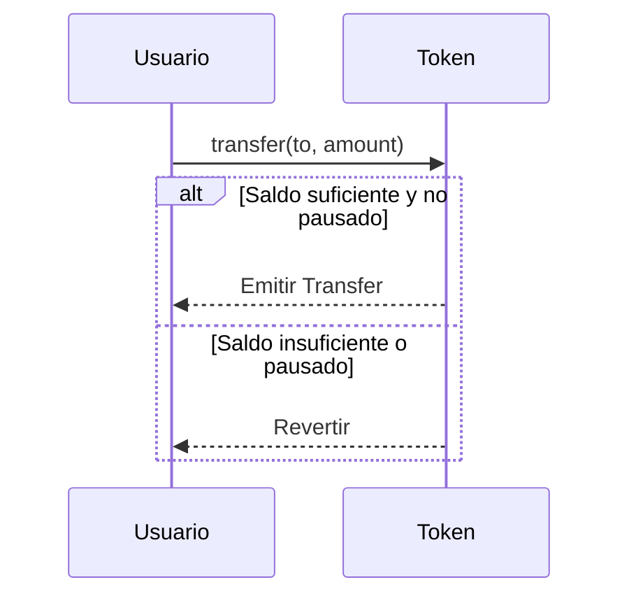
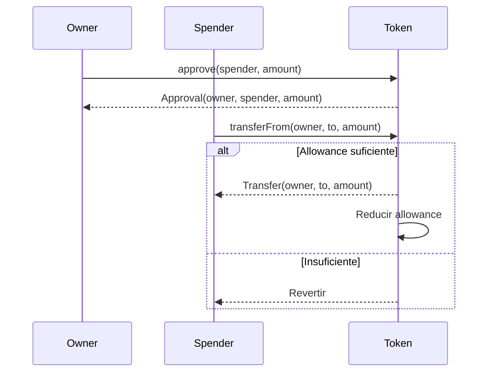
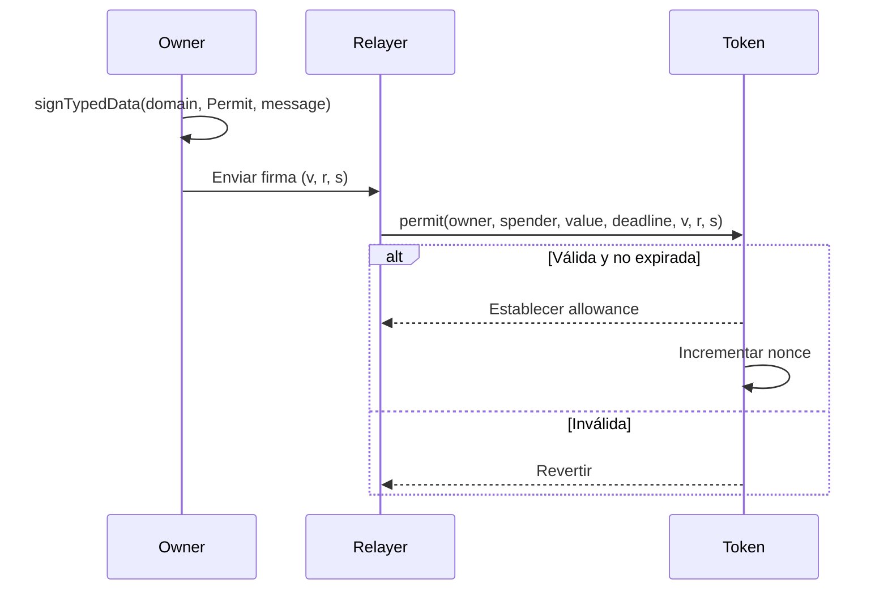

# ISBE-ART-01010 — Token ERC‑20 (contracts/tokens/erc20)

---

## 1. Identificación del Artefacto

| Campo                       | Valor                                                                                                                                             |
| --------------------------- | ------------------------------------------------------------------------------------------------------------------------------------------------- |
| **Nombre del artefacto**    | ISBE-ART-01010 — Token ERC‑20 (contracts/tokens/erc20)                                                                                            |
| **Origen**                  | Documento derivado del repositorio oficial de Smart Contracts, consolidando información técnica sobre la implementación de tokens ERC‑20 en ISBE. |
| **Estado**                  | Validado                                                                                                                                          |
| **Versión del documento**   | 0.1.1                                                                                                                                             |
| **Fecha**                   | 2025-08-11                                                                                                                                        |
| **Repositorio (congelado)** | [https://github.com/alastria/isbe-contracts](https://github.com/alastria/isbe-contracts)                                                          |
| **Commit**                  | `2c3a2accef78bbf723c970c8139df34a4d3137c8`                                                                                                        |

---

## 2. Propósito del Artefacto

### Objetivo funcional:

Definir las interfaces, comportamientos y mecanismos de control asociados a los contratos de **tokens ERC‑20** en la arquitectura ISBE, garantizando interoperabilidad, trazabilidad y cumplimiento normativo en escenarios de emisión, transferencia y gobernanza de activos digitales.

### Beneficio para ISBE:

- **Interoperabilidad**: Compatible con wallets, exchanges y sistemas europeos como EBSI.
- **Trasparencia y auditoría**: Eventos estandarizados permiten rastrear movimientos y aprobaciones.
- **Cumplimiento regulatorio**: Facilita el cumplimiento de **eIDAS2**, **NIS2** y **RGPD** mediante controles de acceso, pausa de operaciones y gestión de consentimientos (permit).
- **Flexibilidad operativa**: Soporte para acuñación (mint), quema (burn), snapshots y aprobaciones off-chain (EIP‑2612).

### Stakeholders clave:

- Equipos técnicos de desarrollo y operaciones.
- Auditores de seguridad y cumplimiento.
- Órganos de gobernanza técnica.
- Operadores de red y entidades emisoras de tokens.
- Entidades reguladoras y organismos de control.

---

## 3. Alcance y Ciclo de Vida

### Fases cubiertas:

✅ **Definición**: Descripción funcional de interfaces, eventos y extensiones soportadas.  
✅ **Desarrollo**: Especificación de flujos, permisos y buenas prácticas.  
🟡 **Validación**: Pruebas unitarias y de integración (por confirmar en el commit).  
🟡 **Mantenimiento**: Actualización alineada con evoluciones del estándar y normativas.

### Inicio de fases y paquetes relacionados:

- Pertenece al **PT1 (Diseño y desarrollo del cliente ISBE)**, Tarea **T1.4 (Desarrollo de artefactos)**.
- Módulo base: `contracts/tokens/erc20`.

### Dependencias:

- Contratos base de OpenZeppelin (ERC20, AccessControl, Pausable, Permit).
- Estándares EVM: ERC‑20 (EIP‑20), EIP‑2612 (Permit), ERC‑165 (introspección).
- Componentes de gobernanza: `AccessControl` o `Ownable`.

### Mantenimiento:

- Revisión anual o ante cambios regulatorios (NIS2, eIDAS2).
- Actualización de extensiones según necesidades de casos de uso (ej. snapshots para auditoría fiscal).

---

## 4. Definición del Artefacto

### 4.1. Artefacto de arquitectura de referencia

El token ERC‑20 en ISBE sigue un diseño modular basado en **patrones de herencia y extensiones estandarizadas**, permitiendo una implementación segura, auditada y adaptable.

- **Base**: `IERC20` + `IERC20Metadata` para funcionalidad mínima.
- **Extensiones comunes**:
    - `ERC20Burnable`: Destrucción de tokens.
    - `ERC20Pausable`: Suspensión temporal de operaciones.
    - `ERC20Permit`: Aprobación sin transacción (EIP‑2612).
    - `ERC20Capped`: Límite máximo de suministro.
    - `ERC20Snapshot`: Historial de balances.
    - `AccessControl`: Gobernanza basada en roles.

> ⚠️ **Nota**: La presencia exacta de estas extensiones en el commit congelado no está confirmada. Se asume un diseño modular basado en buenas prácticas.

---

### 4.2. Trazabilidad

Este artefacto se alinea con:

- **ENT_1 – Evaluación de necesidades** (30/06/2025): Requisitos de trazabilidad, gobernanza y cumplimiento.
- **ENT_2 – Análisis de requerimientos** (30/06/2025): Requisito 2.6 (actualización modular), 6.1 (control de cambios).
- **Arquitectura de Referencia de ISBE**: Epígrafe 5.6.3 (definición de proxies) y 18.2 (requisitos regulatorios).

Para trazabilidad fina, se recomienda vincular cada función con un ID de requisito en futuras iteraciones.

---

### 4.3. Descripción funcional detallada

#### Funcionalidades clave:

- **Transferencias estándar** (`transfer`, `transferFrom`).
- **Aprobación delegada** (`approve`, `allowance`).
- **Acuñación y quema** (`mint`, `burn`) bajo control de roles.
- **Pausa de operaciones** en caso de incidentes.
- **Aprobación off-chain** mediante firma digital (EIP‑2612).
- **Metadatos** (nombre, símbolo, decimales).
- **Snapshots** para auditoría histórica.

#### Glosario de términos

| Término               | Descripción                                                            |
| --------------------- | ---------------------------------------------------------------------- |
| **ERC‑20**            | Estándar de tokens fungibles en EVM (EIP‑20).                          |
| **IERC20**            | Interfaz mínima: `transfer`, `approve`, `allowance`, `balanceOf`.      |
| **IERC20Metadata**    | Extensión: `name`, `symbol`, `decimals`.                               |
| **Mint/Burn**         | Acuñación/quema de tokens, bajo control de roles.                      |
| **Pausable**          | Capacidad de suspender operaciones críticas.                           |
| **Permit (EIP‑2612)** | Aprobación por firma off-chain, evita transacción previa de `approve`. |
| **Capped**            | Tope máximo en la oferta total de tokens.                              |
| **Snapshot**          | Registro histórico de balances para auditoría.                         |
| **AccessControl**     | Modelo de gobernanza basado en roles (vs. propiedad única).            |

---

### 4.4. Diferencias clave y ventajas frente a estándares base

| Característica       | ERC‑20 Base                   | ISBE ERC‑20                       |
| -------------------- | ----------------------------- | --------------------------------- |
| **Gobierno**         | Sin gobernanza (solo `owner`) | Basado en roles (`AccessControl`) |
| **Pausa**            | No soportado                  | Soportado (`Pausable`)            |
| **Permit**           | Opcional                      | Recomendado para UX y privacidad  |
| **Quema**            | Manual                        | Soportado (`Burnable`)            |
| **Capacidad máxima** | Ilimitado                     | Soportado (`Capped`)              |
| **Auditoría**        | Solo eventos                  | Snapshots + eventos + roles       |
| **Compliance**       | Limitado                      | Alineado con eIDAS2, NIS2, RGPD   |

> ✅ **Ventaja ISBE**: Mayor trazabilidad, control y adaptabilidad a entornos regulados.

---

### 4.5. Flujos de ejecución

#### 4.5.1. Transferencia directa



#### 4.5.2. Patrón approve + transferFrom



#### 4.5.3. Permit (EIP‑2612)



---

### 4.6. Reglas de negocio asociadas

| Contrato/Faceta | Función                               | Permiso requerido         | Pausa afecta |
| --------------- | ------------------------------------- | ------------------------- | ------------ |
| ERC20Mintable   | `mint(to, amount)`                    | `onlyRole(MINTER_ROLE)`   | Sí           |
| ERC20Burnable   | `burn(amount)`                        | Cualquiera (saldo propio) | No           |
| ERC20Burnable   | `burnFrom(account, amount)`           | Allowance suficiente      | No           |
| ERC20Pausable   | `pause()`                             | `onlyRole(PAUSER_ROLE)`   | —            |
| ERC20Pausable   | `unpause()`                           | `onlyRole(PAUSER_ROLE)`   | —            |
| ERC20Snapshot   | `snapshot()`                          | `onlyRole(SNAPSHOT_ROLE)` | —            |
| ERC20Permit     | `permit(...)`                         | Ninguno (valida firma)    | No           |
| Base ERC20      | `transfer`, `approve`, `transferFrom` | Ninguno                   | Sí           |

> ⚠️ **Nota**: Nombres exactos de roles (`MINTER_ROLE`, `PAUSER_ROLE`, etc.) por confirmar en el commit.

---

### 4.7. Interfaces y puntos de integración

#### 4.7.1. Interfaces y funciones clave

**IERC20**

- `totalSupply() → uint256`
- `balanceOf(account) → uint256`
- `transfer(to, amount) → bool`
- `allowance(owner, spender) → uint256`
- `approve(spender, amount) → bool`
- `transferFrom(from, to, amount) → bool`

**IERC20Metadata**

- `name() → string`
- `symbol() → string`
- `decimals() → uint8`

**Extensiones (si disponibles)**

- `mint(to, amount)`
- `burn(amount)`
- `pause()` / `unpause()`
- `permit(owner, spender, value, deadline, v, r, s)`
- `snapshot() → uint256`
- `cap() → uint256`

#### 4.7.2. Eventos

- `Transfer(from, to, value)`
- `Approval(owner, spender, value)`
- `Paused(account)`
- `Unpaused(account)`
- `Snapshot(id)`

#### 4.7.3. Errores destacados

- `ERC20InsufficientBalance(account, balance, needed)`
- `ERC20InsufficientAllowance(spender, allowance, needed)`
- `ERC20InvalidSpender(address)`
- `EnforcedPause()`
- `AccountNotPaused(address)`
- `ERC20PermitExpired()`
- `ERC20PermitInvalidSignature()`

---

### 4.8. Normativas y requisitos regulatorios

- **eIDAS2**: Soporte para firma digital (EIP‑712 en `permit`) alinea con identidad verificable.
- **NIS2**: Capacidad de pausa y auditoría de eventos cumple con requisitos de respuesta a incidentes.
- **RGPD**: Posibilidad de quemar tokens asociados a datos personales (derecho al olvido).
- **Transparencia**: Todos los cambios son trazables mediante eventos en blockchain.

---

### 4.9. Criterios de calidad específicos

#### 4.9.1. Compatibilidad e interoperabilidad

- Cumple con **ERC‑20** y **EIP‑2612**.
- Compatible con wallets (MetaMask), explorers (Etherscan) y sistemas EBSI.
- Soporta introspección ERC‑165 si se implementa.

#### 4.9.2. Buenas prácticas de uso

- **Validar antes de producir**:
    - Verificar `allowance` antes de `transferFrom`.
    - Usar `increaseAllowance`/`decreaseAllowance` para evitar race conditions.
- **Migraciones**:
    - Diseñar funciones de inicialización idempotentes.
    - Usar `init` en despliegue para asignar suministro inicial.
- **Gobernanza**:
    - Minimizar direcciones con roles privilegiados.
    - Rotar claves periódicamente.
- **Observabilidad**:
    - Monitorear eventos `Transfer`, `Approval`, `Paused`, `Snapshot`.

---

## 5. Desarrollo del Artefacto

### 5.1. Componentes del artefacto

- `IERC20Isbe.sol` (interfaz principal)
- `ERC20.sol` (implementación base)
- `ERC20Internal.sol` (lógica interna)
- `ERC20Facet.sol` (faceta EIP-2535)
- `ERC20InternalCommon.sol` (funcionalidad común)
- Extensiones:
    - `burn/`: `IERC20Burnable.sol`, `ERC20Burnable.sol`, `ERC20BurnableFacet.sol`
    - `cap/`: `IERC20Capped.sol`, `ERC20Capped.sol`, `ERC20CappedInternal.sol`, `ERC20CappedFacet.sol`
    - `controller/`: `IERC20Controller.sol`, `ERC20Controller.sol`, `ERC20ControllerFacet.sol`
    - `snapshot/`: `IERC20Snapshot.sol`, `ERC20Snapshot.sol`, `ERC20SnapshotInternal.sol`, `ERC20SnapshotFacet.sol`

### 5.2. Componentes del artefacto y su interacción

El artefacto de tokens ERC20 está compuesto por varios contratos inteligentes que trabajan conjuntamente para proporcionar un sistema completo de tokens fungibles con funcionalidades avanzadas de gobernanza y control.

**1. `IERC20Isbe.sol`**  
Este contrato es la interfaz principal del sistema. Define las funciones públicas que cualquier implementación debe ofrecer, extendiendo las interfaces estándar `IERC20` e `IERC20Metadata` de OpenZeppelin. Incluye la función de inicialización `initializeErc20`, el evento `Erc20Initialized` y errores personalizados como `DecreasedAllowanceBellowZero`, `TransferAmountExceedsBalance`, `BurnAmountExceedsBalance` e `InsufficientAllowance`. Su función principal es estandarizar la interacción con el sistema y permitir la introspección de interfaces.

**2. `ERC20Internal.sol`**  
Contrato abstracto que contiene la lógica interna para gestionar los tokens ERC20. Incluye:

- El **struct `ERC20Storage`**, que almacena balances, allowances, totalSupply y metadatos del token.
- Funciones internas `_transfer`, `_approve`, `_spendAllowance`, `_mint`, `_burn` para manipular y validar los datos del storage.
- Función `_erc20Storage` que devuelve la ubicación del storage mediante un slot fijo en la blockchain.
- Validaciones de seguridad como verificación de direcciones cero y balances suficientes.

**3. `ERC20.sol`**  
Contrato abstracto que implementa la interfaz `IERC20Isbe` y hereda de `ERC20InternalCommon`. Se encarga de exponer las funciones externas estándar (`transfer`, `approve`, `transferFrom`, `increaseAllowance`, `decreaseAllowance`) aplicando controles de pausabilidad (`whenNotPaused`). También incluye la función de inicialización `initializeErc20` que configura el token con nombre, símbolo y decimales.

**4. `ERC20Facet.sol`**  
Contrato que funciona como **faceta EIP-2535 (Diamond Standard)**. Hereda de `ERC20` y añade introspección de interfaces y selectores (`interfacesIntrospection`, `selectorsIntrospection`, `businessIdIntrospection`) para sistemas modulares que utilicen el patrón diamante. Su propósito es permitir la extensión del sistema sin modificar la lógica interna del contrato base.

**5. Extensiones especializadas**:

- **Burn**: Permite quemar tokens (`burn`, `burnFrom`) con validaciones de balance y allowance.
- **Cap**: Establece un límite máximo de suministro (`cap`) con funciones de configuración y validación.
- **Controller**: Proporciona funciones de control forzado (`forceBurn`, `forceTransfer`) para casos regulatorios.
- **Snapshot**: Permite crear instantáneas de balances para auditoría histórica.

**Interacción entre los contratos**:

- `ERC20Facet` utiliza `ERC20` para exponer las funciones externas y facilitar la introspección.
- `ERC20` utiliza `ERC20Internal` para realizar la lógica de transferencias, aprobaciones y gestión de balances.
- Las extensiones se integran con el contrato base para añadir funcionalidades específicas.
- Todo el sistema depende de `IERC20Isbe` para garantizar que cualquier contrato que implemente esta funcionalidad cumpla con la interfaz estándar.

En conjunto, estos contratos permiten crear tokens ERC20 completos con funcionalidades avanzadas de gobernanza, control de acceso y auditoría, proporcionando introspección y modularidad para futuras extensiones.

### 5.3. Frameworks, librerías o tecnologías acordadas

- **Hyperledger Besu** (EVM compatible).
- **Solidity** (contratos inteligentes).
- **OpenZeppelin Contracts** (seguridad y estándares).
- **Hardhat** (pruebas y despliegue).
- **ethers.js v6** (integración off-chain).

### 5.4. Buenas prácticas aplicables

- Seguridad por diseño.
- Auditoría continua.
- Modularidad y reutilización.
- Validación de inputs.
- Idempotencia en inicializadores.

### 5.5. Criterios de validación del desarrollo

La validación del desarrollo se ha realizado mediante pruebas unitarias que verifican el correcto funcionamiento de los contratos ERC20. A continuación se detallan los tests implementados:

| Test / Escenario            | Descripción                                                               | Resultado esperado / Verificación                                                                                                   |
| --------------------------- | ------------------------------------------------------------------------- | ----------------------------------------------------------------------------------------------------------------------------------- |
| Despliegue e inicialización | Se despliega y inicializa un token ERC20 con nombre, símbolo y decimales. | Se emite el evento `Erc20Initialized` con los parámetros correctos. `name()`, `symbol()`, `decimals()` devuelven valores correctos. |
| Inicialización duplicada    | Se intenta inicializar un token ya inicializado.                          | La transacción revierte con el error `ContractIsAlreadyInitialized`.                                                                |
| Aprobaciones (Allowance)    | Se aprueban tokens a una dirección y se gestionan allowances.             | Se emite el evento `Approval` con los parámetros correctos. `allowance()` devuelve el valor apropiado.                              |
| Aprobación a dirección cero | Se intenta aprobar tokens a la dirección cero.                            | La transacción revierte con el error `AddressZero`.                                                                                 |
| Operaciones pausadas        | Se intentan operaciones mientras el token está pausado.                   | Las transacciones revierten con el error `IsPaused`.                                                                                |
| Acuñación (Mint)            | Se acuñan tokens a una dirección con el rol MINTER_ROLE.                  | Se emite el evento `Transfer` desde dirección cero. El balance y totalSupply se actualizan correctamente.                           |
| Acuñación sin permisos      | Se intenta acuñar tokens sin el rol MINTER_ROLE.                          | La transacción revierte con el error `AccountHasNoRole`.                                                                            |
| Límite de suministro (Cap)  | Se configura un límite máximo y se valida que no se exceda.               | Se emite el evento `CapSet`. Las acuñaciones que excedan el cap revierten con `CapExceeded`.                                        |
| Quema (Burn)                | Se queman tokens del balance propio o de otra dirección con allowance.    | Se emite el evento `Transfer` hacia dirección cero. Los balances y totalSupply se reducen correctamente.                            |
| Transferencias              | Se transfieren tokens entre direcciones.                                  | Se emite el evento `Transfer` con los parámetros correctos. Los balances se actualizan apropiadamente.                              |
| Transferencias sin balance  | Se intenta transferir más tokens de los disponibles.                      | La transacción revierte con el error `TransferAmountExceedsBalance`.                                                                |
| TransferFrom                | Se transfieren tokens usando el patrón approve + transferFrom.            | Se emite el evento `Transfer` y se actualiza el allowance correctamente.                                                            |
| Snapshots                   | Se crean instantáneas de balances para auditoría.                         | Se emite el evento `Snapshot`. `balanceOfAt()` y `totalSupplyAt()` devuelven valores históricos correctos.                          |
| Control forzado             | Se realizan operaciones de control forzado (forceBurn, forceTransfer).    | Se emiten eventos `ForceBurn` y `ForceTransfer`. Los balances se modifican sin requerir allowance.                                  |

Estas pruebas aseguran que el sistema ERC20 funcione correctamente bajo condiciones normales y excepcionales, cumpliendo los criterios de seguridad, control de acceso, gestión de balances y manejo de casos límite definidos en el desarrollo.

_Ejemplo del test `Despliegue e inicialización`_:

```ts
it('GIVEN an ERC20 WHEN it is deployed THEN name, symbol and decimals can be retrieved', async () => {
    await deploy()
    await expect(erc20.initializeErc20(name, symbol, decimals))
        .to.emit(erc20, 'Erc20Initialized')
        .withArgs(name, symbol, decimals)

    expect(await erc20.decimals()).to.equal(decimals)
    expect(await erc20.name()).to.equal(name)
    expect(await erc20.symbol()).to.equal(symbol)

    expect(await erc20.totalSupply()).to.equal(0)
    expect(await erc20.balanceOf(ownerAddress)).to.equal(0)
    expect(await erc20.allowance(ownerAddress, ownerAddress)).to.equal(0)
})
```

### 5.6. Alineación con requisitos legales

- **NIS2**: Registro de eventos y capacidad de pausa para respuesta a incidentes.
- **RGPD**: Quema de tokens como mecanismo de supresión de datos personales.
- **eIDAS2**: Soporte para firma digital en operaciones de aprobación.

### 5.7. Dependencias técnicas o de infraestructura

- OpenZeppelin Contracts (IERC20, IERC20Metadata, AccessControl).
- Infraestructura EVM (nodos Besu).

### 5.8. Descripción técnica de las funciones

#### Funciones externas principales

| Función                                                         | Tipo      | Descripción                                                                                                                                         |
| --------------------------------------------------------------- | --------- | --------------------------------------------------------------------------------------------------------------------------------------------------- |
| `initializeErc20(string, string, uint8)`                        | Escritura | Inicializa el token con nombre, símbolo y decimales. Solo puede llamarse una vez y requiere que el contrato no esté ya inicializado.                |
| `transfer(address _to, uint256 _amount)`                        | Escritura | Transfiere tokens a la dirección especificada. Requiere balance suficiente y que el contrato no esté pausado.                                       |
| `approve(address _spender, uint256 _amount)`                    | Escritura | Aprueba que una dirección gaste tokens en nombre del remitente. Requiere que el spender no sea la dirección cero y que el contrato no esté pausado. |
| `transferFrom(address _from, address _to, uint256 _amount)`     | Escritura | Transfiere tokens desde una dirección a otra usando allowance. Requiere allowance suficiente, balance suficiente y que el contrato no esté pausado. |
| `increaseAllowance(address _spender, uint256 _addedValue)`      | Escritura | Aumenta el allowance de una dirección de forma segura.                                                                                              |
| `decreaseAllowance(address _spender, uint256 _subtractedValue)` | Escritura | Disminuye el allowance de una dirección de forma segura. No puede resultar en un valor negativo.                                                    |

_Ejemplo de la función `transfer(address _to, uint256 _amount)`_:

```solidity
function transfer(
    address _to,
    uint256 _amount
) external override whenNotPaused returns (bool) {
    _transfer(_msgSender(), _to, _amount);
    return true;
}
```

#### Funciones externas de introspección

El contrato `ERC20Facet` implementa funciones de introspección que permiten conocer de forma dinámica los interfaces y selectores que soporta, así como su identificador de negocio. Las funciones principales son:

| Función                     | Tipo    | Descripción                                                                                                                                                                    |
| --------------------------- | ------- | ------------------------------------------------------------------------------------------------------------------------------------------------------------------------------ |
| `interfacesIntrospection()` | Lectura | Devuelve un array de los `interfaceId` que implementa el contrato, permitiendo conocer dinámicamente qué interfaces soporta.                                                   |
| `businessIdIntrospection()` | Lectura | Retorna un `bytes32` que identifica el negocio o módulo del contrato, definido como `_ERC20_RESOLVER_KEY`.                                                                     |
| `selectorsIntrospection()`  | Lectura | Devuelve un array con los selectores de las funciones públicas relevantes: `transfer`, `approve`, `transferFrom`, `increaseAllowance`, `decreaseAllowance`, `initializeErc20`. |

_Ejemplo de la función `selectorsIntrospection()`_:

```solidity
function selectorsIntrospection()
    external
    pure
    returns (bytes4[] memory selectors_)
{
    uint256 selectorsLength = 6;
    selectors_ = new bytes4[](selectorsLength);
    selectors_[--selectorsLength] = this.transfer.selector;
    selectors_[--selectorsLength] = this.approve.selector;
    selectors_[--selectorsLength] = this.transferFrom.selector;
    selectors_[--selectorsLength] = this.increaseAllowance.selector;
    selectors_[--selectorsLength] = this.decreaseAllowance.selector;
    selectors_[--selectorsLength] = this.initializeErc20.selector;
}
```

#### Funciones internas

| Función                                                              | Tipo      | Descripción                                                                                                    |
| -------------------------------------------------------------------- | --------- | -------------------------------------------------------------------------------------------------------------- |
| `_transfer(address _from, address _to, uint256 _amount)`             | Escritura | Implementa la lógica interna para transferir tokens entre direcciones, validando balances y emitiendo eventos. |
| `_approve(address _owner, address _spender, uint256 _amount)`        | Escritura | Implementa la lógica interna para aprobar gastos de tokens, emitiendo el evento `Approval`.                    |
| `_spendAllowance(address _owner, address _spender, uint256 _amount)` | Escritura | Consume el allowance de una dirección, reduciendo el valor aprobado.                                           |
| `_mint(address _to, uint256 _amount)`                                | Escritura | Acuña nuevos tokens a una dirección, aumentando el totalSupply y el balance.                                   |
| `_burn(address _from, uint256 _amount)`                              | Escritura | Quema tokens de una dirección, reduciendo el totalSupply y el balance.                                         |
| `_erc20Storage()`                                                    | Lectura   | Devuelve la estructura de almacenamiento donde se guardan balances, allowances y metadatos del token.          |

_Ejemplo de la función `_transfer(address _from, address _to, uint256 _amount)`_:

```solidity
function _transfer(
    address _from,
    address _to,
    uint256 _amount
) internal virtual {
    if (_from == address(0)) {
        revert ERC20InvalidSender(address(0));
    }
    if (_to == address(0)) {
        revert ERC20InvalidReceiver(address(0));
    }
    _update(_from, _to, _amount);
}
```

### 5.9. Descripción técnica de los datos

#### Estructuras de datos (`structs`)

| Nombre del struct | Campos                                                        | Descripción                                                             |
| ----------------- | ------------------------------------------------------------- | ----------------------------------------------------------------------- |
| `ERC20Storage`    | `mapping(address => uint256) _balances`                       | Almacena los balances de tokens de cada dirección.                      |
|                   | `mapping(address => mapping(address => uint256)) _allowances` | Almacena los allowances entre direcciones (owner => spender => amount). |
|                   | `uint256 _totalSupply`                                        | Total de tokens en circulación.                                         |
|                   | `string _name`                                                | Nombre del token.                                                       |
|                   | `string _symbol`                                              | Símbolo del token.                                                      |
|                   | `uint8 _decimals`                                             | Número de decimales del token.                                          |

**Detalles:**

- `ERC20Storage` organiza internamente todos los datos del token de forma eficiente.
- Permite gestionar balances, allowances y metadatos del token de manera segura.
- Se utiliza internamente por todas las funciones de transferencia, aprobación y consulta.

---

#### Variables de almacenamiento (`storage`)

| Variable / Slot                 | Tipo                                              | Alcance                    | Descripción                                                                       |
| ------------------------------- | ------------------------------------------------- | -------------------------- | --------------------------------------------------------------------------------- |
| `_ERC20_STORAGE_POSITION`       | `bytes32` (constant)                              | Interna                    | Slot fijo donde se ubica la estructura `ERC20Storage` en el storage del contrato. |
| `_balances`                     | `mapping(address => uint256)`                     | Interna (dentro de struct) | Mapping que almacena el balance de tokens de cada dirección.                      |
| `_allowances`                   | `mapping(address => mapping(address => uint256))` | Interna (dentro de struct) | Mapping anidado que almacena los allowances entre direcciones.                    |
| `_totalSupply`                  | `uint256`                                         | Interna (dentro de struct) | Variable que mantiene el total de tokens en circulación.                          |
| `_name`, `_symbol`, `_decimals` | `string`, `string`, `uint8`                       | Interna (dentro de struct) | Metadatos del token (nombre, símbolo, decimales).                                 |

**Detalles:**

- La variable `_ERC20_STORAGE_POSITION` define la ubicación del struct en el storage usando inline assembly.
- `_balances` permite consultar y modificar los balances de tokens de cada dirección.
- `_allowances` gestiona las aprobaciones de gasto entre direcciones.
- Todas las operaciones de lectura y escritura se realizan a través de `_erc20Storage()` para garantizar consistencia y encapsulamiento.

### 5.10. Roles

- `MINTER_ROLE`: permiso para acuñar nuevos tokens en el contrato.
- `CAP_ROLE`: permiso para configurar y modificar el límite máximo de suministro.
- `SNAPSHOT_ROLE`: permiso para crear instantáneas de balances para auditoría.
- `CONTROLLER_ROLE`: permiso para realizar operaciones de control forzado (forceBurn, forceTransfer).

---

## Anexos

### Anexo 1 – Ejemplos de Integración con ethers v6

#### 1. Consultas y transferencia básica

```ts
import { ethers } from 'ethers'

const rpcUrl = 'https://<RPC_URL>'
const tokenAddress = '0x<TOKEN_ADDRESS>'
const provider = new ethers.JsonRpcProvider(rpcUrl)

// ABI mínima ERC-20
const erc20Abi = [
    'function name() view returns (string)',
    'function symbol() view returns (string)',
    'function decimals() view returns (uint8)',
    'function totalSupply() view returns (uint256)',
    'function balanceOf(address) view returns (uint256)',
    'function transfer(address to, uint256 amount) returns (bool)',
]

const token = new ethers.Contract(tokenAddress, erc20Abi, provider)

// Lecturas
const [name, symbol, decimals, totalSupply] = await Promise.all([
    token.name(),
    token.symbol(),
    token.decimals(),
    token.totalSupply(),
])

console.log({ name, symbol, decimals: Number(decimals), totalSupply })

// Transferencia
const signer = new ethers.Wallet('<PRIVATE_KEY>', provider)
const tokenWithSigner = token.connect(signer)
const to = '0x<RECIPIENT>'
const humanAmount = '1.5'
const amount = ethers.parseUnits(humanAmount, decimals)

const tx = await tokenWithSigner.transfer(to, amount)
const receipt = await tx.wait()
console.log('Transfer hash:', receipt.hash)
```

#### 2. Approve + transferFrom

```ts
// ... (mismo setup)
const owner = new ethers.Wallet('<PRIVATE_KEY_OWNER>', provider)
const spender = '0x<SPENDER>'

const tokenAsOwner = token.connect(owner)
const amount = ethers.parseUnits('10', await token.decimals())

await (await tokenAsOwner.approve(spender, amount)).wait()
const allowance = await token.allowance(await owner.getAddress(), spender)
console.log('Allowance:', allowance.toString())

// Spender realiza transferencia
const spenderWallet = new ethers.Wallet('<PRIVATE_KEY_SPENDER>', provider)
const tokenAsSpender = token.connect(spenderWallet)
await (
    await tokenAsSpender.transferFrom(
        await owner.getAddress(),
        '0x<RECIPIENT>',
        ethers.parseUnits('3', await token.decimals())
    )
).wait()
```

#### 3. Permit (EIP‑2612)

```ts
const permitAbi = [
    ...erc20Abi,
    'function permit(address owner, address spender, uint256 value, uint256 deadline, uint8 v, bytes32 r, bytes32 s) public',
    'function nonces(address owner) view returns (uint256)',
    'function DOMAIN_SEPARATOR() view returns (bytes32)',
]

const token = new ethers.Contract(tokenAddress, permitAbi, provider)

const [name, chainId, nonce] = await Promise.all([
    token.name(),
    provider.getNetwork().then((net) => net.chainId),
    token.nonces(owner.address),
])

const value = ethers.parseUnits('5', 18)
const deadline = Math.floor(Date.now() / 1000) + 3600 // 1h

const domain = {
    name,
    version: '1',
    chainId,
    verifyingContract: tokenAddress,
}

const types = {
    Permit: [
        { name: 'owner', type: 'address' },
        { name: 'spender', type: 'address' },
        { name: 'value', type: 'uint256' },
        { name: 'nonce', type: 'uint256' },
        { name: 'deadline', type: 'uint256' },
    ],
}

const message = { owner: owner.address, spender, value, nonce, deadline }
const signature = await owner.signTypedData(domain, types, message)
const { v, r, s } = ethers.Signature.from(signature)

const tx = await token
    .connect(owner)
    .permit(owner.address, spender, value, deadline, v, r, s)
await tx.wait()
```

---

### Anexo 2 – Resumen mínimo de firmas y eventos

#### Firmas principales

- `transfer(to, amount)`
- `approve(spender, amount)`
- `transferFrom(from, to, amount)`
- `mint(to, amount)`
- `burn(amount)`
- `permit(...)`

#### Eventos

- `Transfer(from, to, value)`
- `Approval(owner, spender, value)`
- `Paused(account)`
- `Unpaused(account)`
- `Snapshot(id)`

#### Errores destacados

- `ERC20InsufficientBalance`
- `ERC20InsufficientAllowance`
- `ERC20PermitExpired`
- `ERC20PermitInvalidSignature`

---

### Anexo 3 – Referencias Bibliográficas

- **ERC‑20 (EIP‑20)**: [https://eips.ethereum.org/EIPS/eip-20](https://eips.ethereum.org/EIPS/eip-20)
- **EIP‑2612 (Permit)**: [https://eips.ethereum.org/EIPS/eip-2612](https://eips.ethereum.org/EIPS/eip-2612)
- **OpenZeppelin Contracts**: [https://docs.openzeppelin.com/contracts](https://docs.openzeppelin.com/contracts)
- **Repositorio ISBE**: [https://github.com/alastria/isbe-contracts](https://github.com/alastria/isbe-contracts)

---
