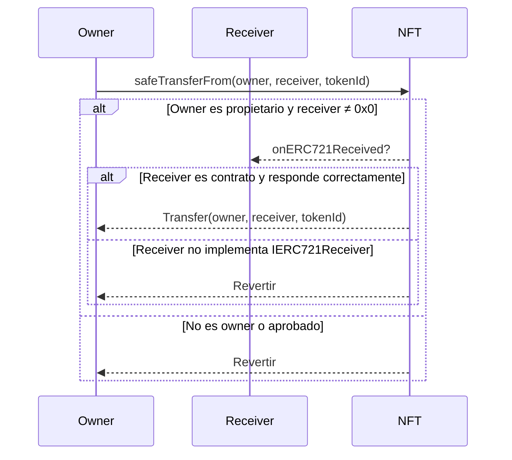
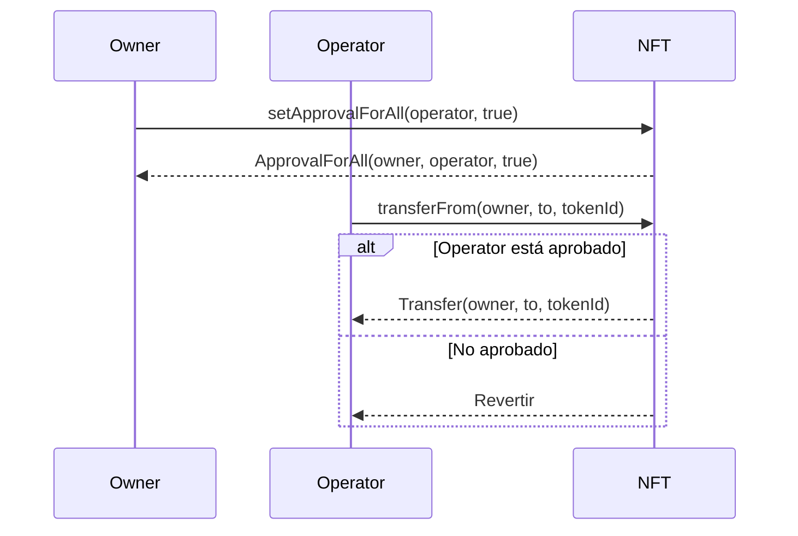
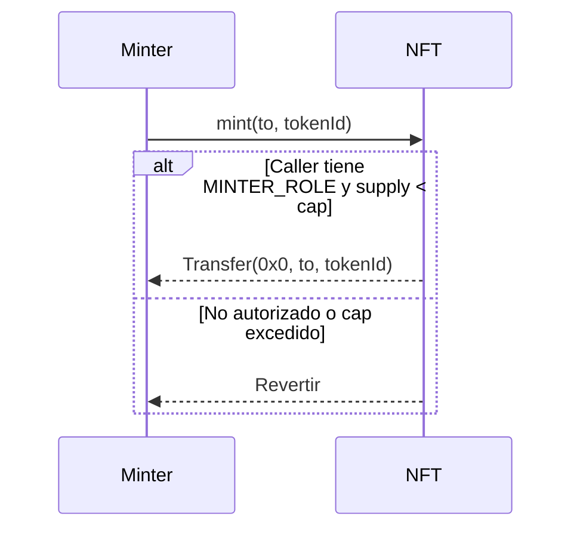
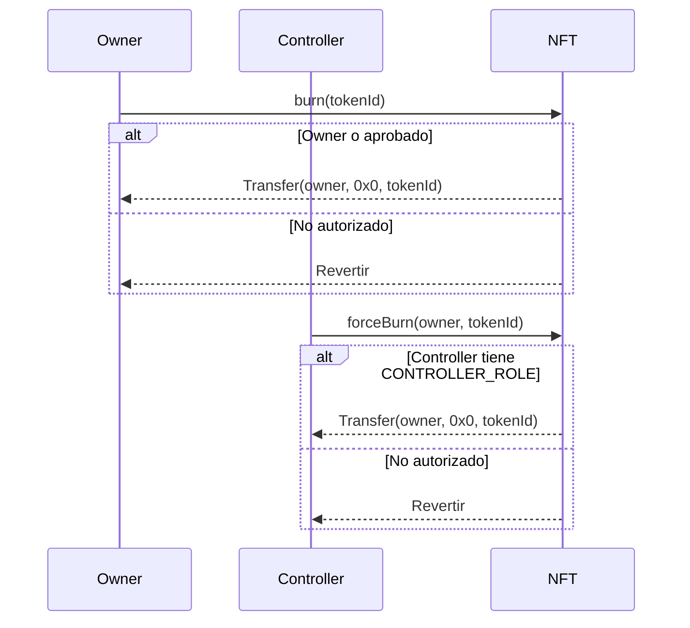
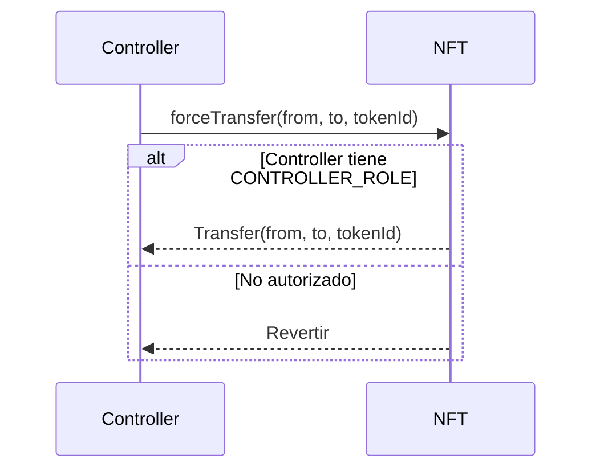
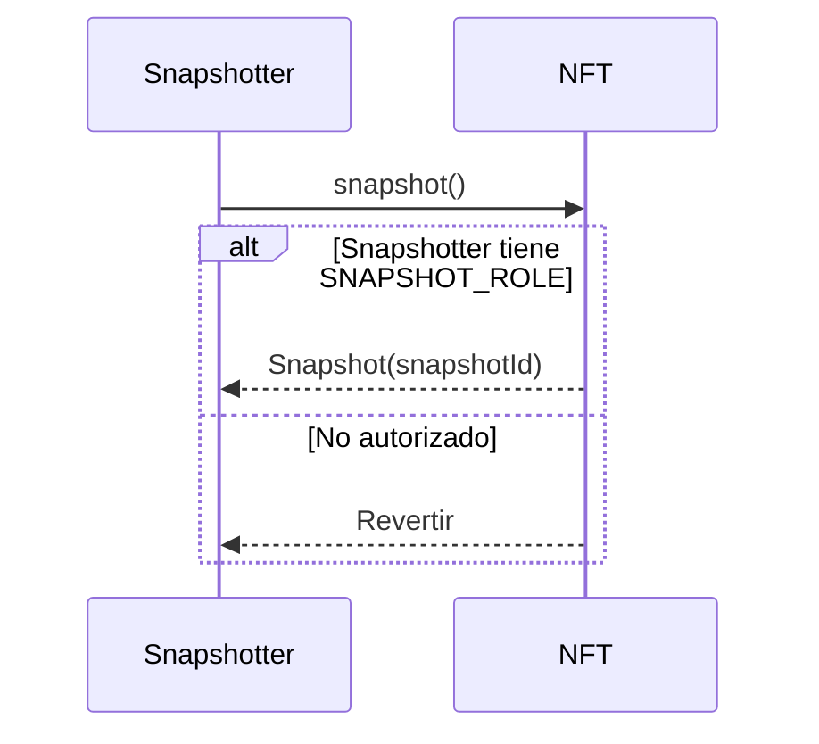

# ISBE-ART-01011 — Token ERC‑721 (contracts/tokens/erc721)

---

## 1. Identificación del Artefacto

| Campo                       | Valor                                                                                                                                                          |
| --------------------------- | -------------------------------------------------------------------------------------------------------------------------------------------------------------- |
| **Nombre del artefacto**    | ISBE-ART-01011 — Token ERC‑721 (contracts/tokens/erc721)                                                                                                       |
| **Origen**                  | Documento derivado del repositorio oficial de Smart Contracts, consolidando información técnica sobre la implementación de tokens no fungibles (NFTs) en ISBE. |
| **Estado**                  | Validado                                                                                                                                                       |
| **Versión del documento**   | 0.1.1                                                                                                                                                          |
| **Fecha**                   | 2025-08-11                                                                                                                                                     |
| **Repositorio (congelado)** | [https://github.com/alastria/isbe-contracts](https://github.com/alastria/isbe-contracts)                                                                       |
| **Commit**                  | `2c3a2accef78bbf723c970c8139df34a4d3137c8`                                                                                                                     |

---

## 2. Propósito del Artefacto

### Objetivo funcional:

Definir las interfaces, comportamientos y mecanismos de control asociados a los contratos de **tokens no fungibles (ERC‑721)** en la arquitectura ISBE, garantizando trazabilidad, identificación única de activos y cumplimiento normativo en escenarios de emisión, transferencia y gobernanza de NFTs.

### Beneficio para ISBE:

- **Identidad verificable**: Soporta la emisión de credenciales digitales no transferibles (ej. diplomas, licencias).
- **Interoperabilidad**: Compatible con wallets, marketplaces y sistemas europeos como EBSI.
- **Cumplimiento regulatorio**: Facilita el cumplimiento de **eIDAS2**, **NIS2** y **RGPD** mediante controles de acceso, pausa de operaciones y gestión de metadatos.
- **Flexibilidad**: Soporta metadatos, regalías, aprobaciones off-chain (EIP‑4494) y restricciones de transferencia (soulbound).

### Stakeholders clave:

- Equipos técnicos de desarrollo y operaciones.
- Auditores de seguridad y cumplimiento.
- Órganos de gobernanza técnica.
- Entidades emisoras de credenciales (universidades, administraciones).
- Entidades reguladoras y organismos de control.

---

## 3. Alcance y Ciclo de Vida

### Fases cubiertas:

✅ **Definición**: Descripción funcional de interfaces, eventos y extensiones soportadas.  
✅ **Desarrollo**: Especificación de flujos, permisos y buenas prácticas.  
🟡 **Validación**: Pruebas unitarias y de integración (por confirmar en el commit).  
🟡 **Mantenimiento**: Actualización alineada con evoluciones del estándar y normativas.

### Inicio de fases y paquetes relacionados:

- Pertenece al **PT1 (Diseño y desarrollo del cliente ISBE)**, Tarea **T1.4 (Desarrollo de artefactos)**.
- Módulo base: `contracts/tokens/erc721`.

### Dependencias:

- Contratos base de OpenZeppelin (ERC721, AccessControl, Pausable, Royalty, Permit).
- Estándares EVM: ERC‑721 (EIP‑721), EIP‑2981 (Regalías), EIP‑4494 (Permit para NFT), ERC‑165 (introspección).
- Componentes de gobernanza: `AccessControl` o `Ownable`.

### Mantenimiento:

- Revisión anual o ante cambios regulatorios (NIS2, eIDAS2).
- Actualización de extensiones según necesidades de casos de uso (ej. soulbound para credenciales).

---

## 4. Definición del Artefacto

### 4.1. Artefacto de arquitectura de referencia

El token ERC‑721 en ISBE sigue un diseño modular basado en **patrones de herencia y extensiones estandarizadas**, permitiendo una implementación segura, auditada y adaptable a escenarios de identidad digital y activos no fungibles.

- **Base**: `IERC721` + `IERC721Metadata` para funcionalidad mínima.
- **Extensiones comunes**:
    - `ERC721Burnable`: destrucción de NFTs.
    - `ERC721Controller`: control avanzado de emisión y operaciones.
    - `ERC721Capped`: límite máximo de supply.
    - `ERC721Snapshot`: snapshots de balances y ownership.
    - `ERC721Enumerable`: enumeración de tokens.
    - `ERC721Royalty`: regalías en reventas (EIP-2981).
    - `ERC721Consecutive`: mint masivo optimizado (EIP-2309).
    - **Gobernanza y control mediante módulos externos** Access, Ownable y Pause.

---

### 4.2. Trazabilidad

Este artefacto se alinea con:

- **ENT_1 – Evaluación de necesidades** (30/06/2025): Requisitos de trazabilidad, gobernanza y cumplimiento.
- **ENT_2 – Análisis de requerimientos** (30/06/2025): Requisito 2.6 (actualización modular), 6.1 (control de cambios).
- **Arquitectura de Referencia de ISBE**: Epígrafe 5.6.3 (definición de proxies) y 18.2 (requisitos regulatorios).

Para trazabilidad fina, se recomienda vincular cada función con un ID de requisito en futuras iteraciones.

---

### 4.3. Descripción funcional detallada

#### Funcionalidades clave:

- **Transferencias seguras** (`safeTransferFrom`) con validación de contratos receptores.
- **Aprobación individual y global** (`approve`, `setApprovalForAll`).
- **Acuñación y quema** (`mint`, `burn`, `burnFrom`) bajo control de roles.
- **Transferencias y quema forzadas** (`forceTransfer`, `forceBurn`) por entidades con rol de control.
- **Supply limitado** mediante cap inicializable y modificable.
- **Acuñación consecutiva** para emisión masiva optimizada.
- **Enumeración** de tokens y balances (`totalSupplyEnumerable`, `tokenByIndex`).
- **Snapshots históricos** de balances, supply y ownership.
- **Regalías configurables** a nivel global o por token.
- **Gobernanza y control** mediante pausa global y gestión de roles (`MINTER`, `CAP`, `SNAPSHOT`, `ROYALTY`, `CONTROLLER`).

#### Glosario de términos

#### Glosario de términos

| Término              | Descripción                                                                                              |
| -------------------- | -------------------------------------------------------------------------------------------------------- |
| **ERC-721**          | Estándar de tokens no fungibles en EVM: define transferencias, aprobaciones y ownership único por token. |
| **Mint**             | Acuñación de un nuevo token, asignando su propiedad inicial a una dirección.                             |
| **Burn**             | Destrucción de un token, reduciendo el supply y liberando su identificador.                              |
| **ForceTransfer**    | Transferencia forzada de un token sin aprobación previa, ejecutada por una entidad con rol de control.   |
| **ForceBurn**        | Quema forzada de un token desde una cuenta, ejecutada por una entidad con rol de control.                |
| **Cap**              | Límite máximo de tokens que pueden acuñarse en un contrato.                                              |
| **Mint consecutivo** | Acuñación masiva de múltiples tokens en una sola operación.                                              |
| **Enumerable**       | Capacidad de listar tokens existentes y tokens poseídos por cada dirección.                              |
| **Snapshot**         | Registro histórico de balances, ownership y supply en un bloque concreto.                                |
| **Regalías**         | Porcentaje de reventa de un token que se destina a un beneficiario definido.                             |
| **Pausa**            | Mecanismo de suspensión temporal de operaciones del contrato.                                            |
| **AccessControl**    | Sistema de gobernanza basado en roles con permisos diferenciados.                                        |
| **Ownable**          | Sistema de gobernanza basado en un único propietario del contrato.                                       |

---

### 4.4. Diferencias clave y ventajas frente a estándares base

| Característica    | ERC-721 Base                  | ISBE ERC-721                         |
| ----------------- | ----------------------------- | ------------------------------------ |
| **Gobierno**      | Sin gobernanza (solo `owner`) | Basado en roles (`AccessControl`)    |
| **Pausa**         | No soportado                  | Soportado (`Pause`)                  |
| **Quema**         | Manual                        | Soportado (`Burnable`, `Controller`) |
| **Transferencia** | Solo voluntaria               | Incluye transferencias forzadas      |
| **Supply**        | Ilimitado                     | Supply limitado (`Capped`)           |
| **Mint**          | Individual                    | También consecutivo optimizado       |
| **Enumeración**   | No soportado                  | Soportado (`Enumerable`)             |
| **Snapshots**     | No soportado                  | Soportado (`Snapshot`)               |
| **Regalías**      | No soportado                  | Soportado (`Royalty`)                |
| **Compliance**    | Limitado                      | Alineado con eIDAS2, NIS2, RGPD      |

> ✅ **Ventaja ISBE**: Mayor trazabilidad, control y adaptabilidad a entornos regulados.

---

### 4.5. Flujos de ejecución

#### 4.5.1. Transferencia segura (safeTransferFrom)



#### 4.5.2. Aprobación global (setApprovalForAll)



#### 4.5.3. Acuñación (mint)



#### 4.5.4. Quema (burn / forceBurn)



#### 4.5.5. Transferencia forzada (forceTransfer)



#### 4.5.6. Snapshot (snapshot)



---

### 4.6. Reglas de negocio asociadas

| Contrato / Faceta | Función                                                            | Permiso requerido           | Pausa afecta |
| ----------------- | ------------------------------------------------------------------ | --------------------------- | ------------ |
| ERC721            | `approve`, `setApprovalForAll`, `transferFrom`, `safeTransferFrom` | Ninguno (owner o aprobado)  | Sí           |
| ERC721Burnable    | `burn(tokenId)`                                                    | Owner o aprobado            | Sí           |
| ERC721Burnable    | `burnFrom(owner, tokenId)`                                         | Aprobado u operador         | Sí           |
| ERC721Controller  | `forceTransfer(from, to, tokenId)`                                 | `onlyRole(CONTROLLER_ROLE)` | Sí           |
| ERC721Controller  | `forceBurn(from, tokenId)`                                         | `onlyRole(CONTROLLER_ROLE)` | Sí           |
| ERC721Capped      | `mint(to, tokenId)`                                                | `onlyRole(MINTER_ROLE)`     | Sí           |
| ERC721Capped      | `setCap(newCap)`                                                   | `onlyRole(CAP_ROLE)`        | Sí           |
| ERC721Consecutive | `mintConsecutive(to, quantity)`                                    | `onlyRole(MINTER_ROLE)`     | Sí           |
| ERC721Royalty     | `setDefaultRoyalty(receiver, fee)`                                 | `onlyRole(ROYALTY_ROLE)`    | Sí           |
| ERC721Royalty     | `deleteDefaultRoyalty()`                                           | `onlyRole(ROYALTY_ROLE)`    | Sí           |
| ERC721Royalty     | `setTokenRoyalty(tokenId, receiver, fee)`                          | `onlyRole(ROYALTY_ROLE)`    | Sí           |
| ERC721Royalty     | `resetTokenRoyalty(tokenId)`                                       | `onlyRole(ROYALTY_ROLE)`    | Sí           |
| ERC721Royalty     | `setFeeDenominator(newDenominator)`                                | `onlyRole(ROYALTY_ROLE)`    | Sí           |
| ERC721Snapshot    | `snapshot()`                                                       | `onlyRole(SNAPSHOT_ROLE)`   | Sí           |

Nota: además de las funciones listadas, todos los contratos incluyen funciones de solo lectura (p.ej. `ownerOf`, `balanceOf`, `cap`, `royaltyInfo`, `feeDenominator`, `balanceOfAt`, etc.), que no requieren permisos ni están afectadas por `Pause`.

---

### 4.7. Interfaces y puntos de integración

#### 4.7.1. Interfaces y funciones clave

**IERC721**

- `balanceOf(owner) → uint256`
- `ownerOf(tokenId) → address`
- `safeTransferFrom(from, to, tokenId)`
- `safeTransferFrom(from, to, tokenId, data)`
- `transferFrom(from, to, tokenId)`
- `approve(to, tokenId)`
- `getApproved(tokenId) → address`
- `setApprovalForAll(operator, approved)`
- `isApprovedForAll(owner, operator) → bool`

**IERC721Metadata**

- `name() → string`
- `symbol() → string`
- `tokenURI(tokenId) → string`

**IERC721Receiver**

- `onERC721Received(operator, from, tokenId, data) → bytes4`

**IERC721Isbe**

- `initializeErc721(newName, newSymbol)`

**IERC721Burnable**

- `burn(tokenId)`
- `burnFrom(owner, tokenId)`

**IERC721Controller**

- `forceTransfer(from, to, tokenId)`
- `forceBurn(from, tokenId)`

**IERC721Capped**

- `initializeCap(cap)`
- `cap() → uint256`

**IERC721Consecutive**

- `mintConsecutive(to, quantity)`

**IERC721Enumerable**

- `totalSupplyEnumerable() → uint256`
- `tokenByIndex(index) → uint256`
- `tokenOfOwnerByIndex(owner, index) → uint256`

**IERC721Snapshot**

- `snapshot()`
- `balanceOfAt(account, snapshotId) → uint256`
- `totalSupply(snapshotId) → uint256`
- `ownerOfAt(tokenId, snapshotId) → address`

**IERC721Royalty**

- `royaltyInfo(tokenId, salePrice) → (address receiver, uint256 amount)`

**IERC165**

- `supportsInterface(interfaceId) → bool`

#### 4.7.2. Eventos

- `Transfer(from, to, tokenId)`
- `Approval(owner, approved, tokenId)`
- `ApprovalForAll(owner, operator, approved)`
- `ForceTransfer(operator, from, to, tokenId)`
- `ForceBurn(operator, from, tokenId)`
- `CapSet(operator, newCap)`
- `ConsecutiveTransfer(fromTokenId, toTokenId, from, to)`
- `Snapshot(id)`

#### 4.7.3. Errores destacados

- `TokenAlreadyMinted()`
- `CallerNotOwnerNorApproved()`
- `TransferToNonERC721ReceiverImplementer()`
- `NewCapIsLessThanTotalSupply(cap, totalSupply)`
- `CapExceeded()`
- `ForceBurnNotTokenOwner()`
- `OwnerIndexOutOfBounds()`
- `GlobalIndexOutOfBounds()`
- `NonExistentSnapshotId()`
- `FeeExceedsDenominator()`

---

### 4.8. Normativas y requisitos regulatorios

- **eIDAS2**: Soporte para firma digital (EIP‑712 en `permit`) alinea con identidad verificable.
- **NIS2**: Capacidad de pausa y auditoría de eventos cumple con requisitos de respuesta a incidentes.
- **RGPD**: Posibilidad de quemar NFTs asociados a datos personales (derecho al olvido).
- **Transparencia**: Todos los cambios son trazables mediante eventos en blockchain.

---

### 4.9. Criterios de calidad específicos

#### 4.9.1. Compatibilidad e interoperabilidad

- Cumple con **ERC‑721**, **EIP‑2981**, **EIP‑4494**.
- Compatible con wallets (MetaMask), explorers (Etherscan) y sistemas EBSI.
- Soporta introspección ERC‑165 si se implementa.

#### 4.9.2. Buenas prácticas de uso

- **Usar `safeTransferFrom`** siempre que el receptor pueda ser un contrato.
- **Revocar `setApprovalForAll`** cuando ya no sea necesario.
- **Limitar cambios de metadatos** y considerar inmutabilidad.
- **Minimizar uso de `Enumerable`** en colecciones grandes por costo de gas.
- **Validar `chainId`, `deadline` y `nonce`** en `permit`.

---

## 5. Desarrollo del Artefacto

### 5.1. Componentes del artefacto

- `IERC721Isbe.sol` (interfaz principal)
- `IERC721.sol` (interfaz estándar)
- `IERC721Metadata.sol` (interfaz de metadatos)
- `IERC721Receiver.sol` (interfaz de receptor)
- `ERC721.sol` (implementación base)
- `ERC721Internal.sol` (lógica interna)
- `ERC721Facet.sol` (faceta EIP-2535)
- `ERC721InternalCommon.sol` (funcionalidad común)

### 5.2. Componentes del artefacto y su interacción

El artefacto de tokens ERC721 está compuesto por varios contratos inteligentes que trabajan conjuntamente para proporcionar un sistema completo de tokens no fungibles (NFTs) con funcionalidades avanzadas de gobernanza y control.

**1. `IERC721Isbe.sol`**  
Este contrato es la interfaz principal del sistema. Define las funciones públicas que cualquier implementación debe ofrecer, extendiendo las interfaces estándar `IERC721` e `IERC721Metadata`. Incluye la función de inicialización `initializeErc721`, el evento `Erc721Initialized` y errores personalizados como `TokenAlreadyMinted`, `CallerNotOwnerNorApproved` y `TransferToNonERC721ReceiverImplementer`. Su función principal es estandarizar la interacción con el sistema y permitir la introspección de interfaces.

**2. `ERC721Internal.sol`**  
Contrato abstracto que contiene la lógica interna para gestionar los tokens ERC721. Incluye:

- El **struct `ERC721Storage`**, que almacena balances, owners, approvals, operator approvals, metadatos y totalSupply.
- Funciones internas `_transfer`, `_approve`, `_setApprovalForAll`, `_mint`, `_burn` para manipular y validar los datos del storage.
- Función `_erc721Storage` que devuelve la ubicación del storage mediante un slot fijo en la blockchain.
- Validaciones de seguridad como verificación de direcciones cero, ownership y approvals.

**3. `ERC721.sol`**  
Contrato abstracto que implementa la interfaz `IERC721Isbe` y hereda de `ERC721InternalCommon`. Se encarga de exponer las funciones externas estándar (`approve`, `setApprovalForAll`, `transferFrom`, `safeTransferFrom`, `ownerOf`, `balanceOf`, `totalSupply`) aplicando controles de seguridad. También incluye la función de inicialización `initializeErc721` que configura el token con nombre y símbolo.

**4. `ERC721Facet.sol`**  
Contrato que funciona como **faceta EIP-2535 (Diamond Standard)**. Hereda de `ERC721` y añade introspección de interfaces y selectores (`interfacesIntrospection`, `selectorsIntrospection`, `businessIdIntrospection`) para sistemas modulares que utilicen el patrón diamante. Su propósito es permitir la extensión del sistema sin modificar la lógica interna del contrato base.

**5. Interfaces estándar**:

- **IERC721**: Define las funciones básicas de transferencia y aprobación.
- **IERC721Metadata**: Define las funciones de metadatos (name, symbol, tokenURI).
- **IERC721Receiver**: Define la interfaz que deben implementar los contratos que reciben NFTs.

**Interacción entre los contratos**:

- `ERC721Facet` utiliza `ERC721` para exponer las funciones externas y facilitar la introspección.
- `ERC721` utiliza `ERC721Internal` para realizar la lógica de transferencias, aprobaciones y gestión de ownership.
- Las interfaces estándar garantizan la compatibilidad con el ecosistema ERC721.
- Todo el sistema depende de `IERC721Isbe` para garantizar que cualquier contrato que implemente esta funcionalidad cumpla con la interfaz estándar.

En conjunto, estos contratos permiten crear tokens ERC721 completos con funcionalidades avanzadas de gobernanza, control de acceso y auditoría, proporcionando introspección y modularidad para futuras extensiones.

**Nota:** Sobre esta base se integran extensiones opcionales como `Capped`, `Enumerable`, `Snapshot` o `Royalty`, que amplían el estándar con capacidades adicionales sin alterar el núcleo del sistema.

### 5.3. Frameworks, librerías o tecnologías acordadas

- **Hyperledger Besu** (EVM compatible).
- **Solidity** (contratos inteligentes).
- **OpenZeppelin Contracts** (seguridad y estándares).
- **Hardhat** (pruebas y despliegue).
- **ethers.js v6** (integración off-chain).

### 5.4. Buenas prácticas aplicables

- Seguridad por diseño.
- Auditoría continua.
- Modularidad y reutilización.
- Validación de inputs.
- Idempotencia en inicializadores.

### 5.5. Criterios de validación del desarrollo

La validación del desarrollo se ha realizado mediante pruebas unitarias que verifican el correcto funcionamiento de los contratos ERC721. A continuación se detallan los tests implementados:

### 5.5. Criterios de validación del desarrollo

La validación del desarrollo se ha realizado mediante pruebas unitarias que verifican el correcto funcionamiento de los contratos ERC721 y sus extensiones. A continuación se detallan los tests implementados:

| Test / Escenario                          | Descripción                                                        | Resultado esperado / Verificación                                               |
| ----------------------------------------- | ------------------------------------------------------------------ | ------------------------------------------------------------------------------- |
| **Despliegue e inicialización**           | Se despliega y se inicializa el token ERC721.                      | Se emite `Erc721Initialized`. `name()`, `symbol()` devuelven valores correctos. |
| Inicialización duplicada                  | Se intenta inicializar un token ya inicializado.                   | Reversión con `ContractIsAlreadyInitialized`.                                   |
| **Mint**                                  | Se acuñan tokens a una dirección válida.                           | Se emite `Transfer` desde dirección cero. Ownership y balance se actualizan.    |
| Mint con tokenId = 0                      | Se intenta acuñar con identificador 0.                             | Reversión con `EmptyUint`.                                                      |
| Mint a dirección cero                     | Se intenta acuñar a `ZeroAddress`.                                 | Reversión con `AddressZero`.                                                    |
| Mint duplicado                            | Se intenta acuñar un token ya existente.                           | Reversión con `TokenAlreadyMinted`.                                             |
| **Burn**                                  | Se quema un token del balance propio.                              | Se emite `Transfer` hacia `ZeroAddress`. `ownerOf` devuelve `ZeroAddress`.      |
| Burn con aprobación                       | Se quema un token con aprobación activa.                           | La aprobación se resetea a `ZeroAddress`.                                       |
| Burn sin permisos                         | Se intenta quemar sin ser owner ni aprobado.                       | Reversión con `CallerNotOwnerNorApproved`.                                      |
| Burn en pausa                             | Se intenta quemar estando el contrato pausado.                     | Reversión con `IsPaused`.                                                       |
| **BurnFrom**                              | El owner o aprobado llama a `burnFrom`.                            | Token quemado y `Transfer` emitido.                                             |
| BurnFrom sin permisos                     | Se intenta ejecutar `burnFrom` sin ser owner ni aprobado.          | Reversión con `CallerNotOwnerNorApproved`.                                      |
| BurnFrom en pausa                         | Se ejecuta `burnFrom` estando pausado.                             | Reversión con `IsPaused`.                                                       |
| **Transfer**                              | Se transfiere un token desde el owner correcto.                    | Se emite `Transfer` y ownership se actualiza.                                   |
| Transfer desde owner incorrecto           | Se intenta transferir desde dirección no propietaria.              | Reversión con `CallerNotOwnerNorApproved`.                                      |
| Transfer a dirección cero                 | Se intenta transferir a `ZeroAddress`.                             | Reversión con `AddressZero`.                                                    |
| **Approvals**                             | Se aprueba un token a otra dirección.                              | Se emite `Approval`. `getApproved()` devuelve dirección correcta.               |
| Approve como owner                        | El owner aprueba correctamente.                                    | Aprobación registrada.                                                          |
| Approve como approved                     | El aprobado reasigna la aprobación.                                | Aprobación actualizada.                                                         |
| Approve como operator                     | Un operator aprueba un token.                                      | Aprobación establecida.                                                         |
| Approve sin permisos                      | Se intenta aprobar sin ser owner ni operator.                      | Reversión con `CallerNotOwnerNorApproved`.                                      |
| setApprovalForAll                         | Se activa aprobación global.                                       | Emite `ApprovalForAll`. `isApprovedForAll()` devuelve true.                     |
| setApprovalForAll con cero operator       | Se intenta aprobar a `ZeroAddress`.                                | Reversión con `AddressZero`.                                                    |
| Approve / setApprovalForAll en pausa      | Se intentan aprobaciones estando pausado.                          | Reversión con `IsPaused`.                                                       |
| **transferFrom**                          | Owner transfiere usando `transferFrom`.                            | Transferencia exitosa.                                                          |
| transferFrom como approved                | Un aprobado ejecuta la transferencia.                              | Transferencia exitosa.                                                          |
| transferFrom como operator                | Un operator ejecuta la transferencia.                              | Transferencia exitosa.                                                          |
| transferFrom sin permisos                 | Se intenta transferir sin ser owner ni aprobado ni operator.       | Reversión con `CallerNotOwnerNorApproved`.                                      |
| transferFrom desde owner incorrecto       | Se intenta transferir desde dirección no propietaria.              | Reversión con `CallerNotOwnerNorApproved`.                                      |
| Reset de aprobación                       | Después de transferir, la aprobación se resetea.                   | `getApproved()` devuelve `ZeroAddress`.                                         |
| transferFrom en pausa                     | Se ejecuta estando pausado.                                        | Reversión con `IsPaused`.                                                       |
| **safeTransferFrom**                      | Se transfiere de forma segura a EOA o contrato válido.             | Se emite `Transfer` y receptor válido acepta.                                   |
| safeTransferFrom con datos                | Se transfiere usando variante con `bytes data`.                    | Transferencia correcta y datos transmitidos.                                    |
| safeTransferFrom a contrato inválido      | Receptor devuelve selector incorrecto o no implementa.             | Reversión con `TransferToNonERC721ReceiverImplementer`.                         |
| safeTransferFrom sin permisos / incorrect | Se intenta ejecutar sin autorización o desde dirección equivocada. | Reversión con `CallerNotOwnerNorApproved`.                                      |
| safeTransferFrom como operator / approved | Operador o aprobado ejecuta la transferencia.                      | Transferencia exitosa.                                                          |
| safeTransferFrom en pausa                 | Se ejecuta estando pausado.                                        | Reversión con `IsPaused`.                                                       |
| **Metadatos**                             | Consulta de `tokenURI` y `baseURI`.                                | Devuelven cadena vacía por defecto.                                             |
| **Cap**                                   | Inicialización del límite de supply.                               | Reversión si cap = 0. Cap consultable con `cap()`.                              |
| Mint sobre cap                            | Se intenta acuñar más allá del límite.                             | Reversión con `CapExceeded`.                                                    |
| Reducir cap bajo supply                   | Se intenta fijar cap menor al supply actual.                       | Reversión con `NewCapIsLessThanTotalSupply`.                                    |
| setCap sin permisos                       | Una cuenta sin `CAP_ROLE` intenta modificar.                       | Reversión con `AccountHasNoRole`.                                               |
| setCap / mint en pausa                    | Se ejecuta estando pausado.                                        | Reversión con `IsPaused`.                                                       |
| **Snapshot**                              | Se consulta un snapshot inexistente.                               | Reversión con `EmptyUint` o `NonExistentSnapshotId`.                            |
| Snapshot sin rol                          | Una cuenta sin `SNAPSHOT_ROLE` intenta crear snapshot.             | Reversión con `AccountHasNoRole`.                                               |
| Snapshot en pausa                         | Se intenta crear snapshot estando pausado.                         | Reversión con `IsPaused`.                                                       |
| Snapshot válido                           | Se crea un snapshot con balances y supply correctos.               | Evento `Snapshot` emitido y consultas históricas coherentes.                    |
| **Controller**                            | `forceBurn` / `forceTransfer` sin permisos.                        | Reversión con `AccountHasNoRole`.                                               |
| forceBurn con owner incorrecto            | Se intenta forzar quema desde dirección equivocada.                | Reversión con `ForceBurnNotTokenOwner`.                                         |
| forceBurn / forceTransfer en pausa        | Se intenta ejecutar estando pausado.                               | Reversión con `IsPaused`.                                                       |
| forceBurn / forceTransfer válido          | Controlador autorizado ejecuta operación.                          | Evento `ForceBurn` o `ForceTransfer` emitido.                                   |
| **Enumerable**                            | `totalSupplyEnumerable` refleja tokens acuñados.                   | Valor correcto según supply.                                                    |
| tokenOfOwnerByIndex                       | Devuelve IDs correctos para cada owner.                            | Resultados coherentes con tokens poseídos.                                      |
| tokenByIndex                              | Devuelve IDs globales correctos.                                   | Resultados coherentes con supply total.                                         |
| tokenOfOwnerByIndex out of bounds         | Consulta fuera de rango.                                           | Reversión con `OwnerIndexOutOfBounds`.                                          |
| tokenByIndex out of bounds                | Consulta fuera de rango.                                           | Reversión con `GlobalIndexOutOfBounds`.                                         |
| Transfer y Burn actualizan índices        | Movimientos actualizan índices de owner y global correctamente.    | Tokens reorganizados sin inconsistencias.                                       |
| **Royalty**                               | setDefaultRoyalty y consulta con `royaltyInfo`.                    | Devuelve receiver y amount correctos.                                           |
| deleteDefaultRoyalty                      | Se eliminan regalías por defecto.                                  | `royaltyInfo` devuelve cero.                                                    |
| setTokenRoyalty                           | Se establecen regalías por token.                                  | Consulta devuelve valores configurados.                                         |
| resetTokenRoyalty                         | Se resetean regalías de un token a default.                        | Consulta devuelve default.                                                      |
| setFeeDenominator                         | Se cambia denominador de cálculo.                                  | Nuevo valor aplicado en `feeDenominator()`.                                     |
| Numerador > denominador                   | Se intenta fijar regalías inválidas.                               | Reversión con `FeeExceedsDenominator`.                                          |
| Royalty sin rol                           | Una cuenta sin `ROYALTY_ROLE` gestiona regalías.                   | Reversión con `AccountHasNoRole`.                                               |
| setRoyalty en pausa                       | Se intenta gestionar regalías estando pausado.                     | Reversión con `IsPaused`.                                                       |
| **Consecutive**                           | mintConsecutive con cantidad = 0 o a `ZeroAddress`.                | Reversión con `EmptyUint` o `AddressZero`.                                      |
| mintConsecutive sin rol                   | Una cuenta sin `MINTER_ROLE` lo intenta.                           | Reversión con `AccountHasNoRole`.                                               |
| mintConsecutive válido                    | Emite `ConsecutiveTransfer`. Tokens asignados al owner.            | Tokens transferidos en bloque y ownership correcto.                             |
| mintConsecutive múltiple                  | Se realizan varias emisiones consecutivas.                         | TokenIds incrementan correctamente.                                             |
| mintConsecutive + transfer                | Tokens emitidos en bloque pueden transferirse.                     | Ownership actualizado tras `Transfer`.                                          |
| mintConsecutive + burn                    | Tokens emitidos en bloque pueden quemarse.                         | Ownership actualizado a `ZeroAddress`.                                          |
| mintConsecutive en pausa                  | Se intenta ejecutar estando pausado.                               | Reversión con `IsPaused`.                                                       |

Estas pruebas aseguran que el sistema ERC721 funcione correctamente bajo condiciones normales y excepcionales, cumpliendo los criterios de seguridad, control de acceso, gestión de ownership y manejo de casos límite definidos en el desarrollo.

_Ejemplo del test `Despliegue e inicialización`_:

```ts
it('GIVEN an ERC721 WHEN deployed THEN name and symbol are correct', async () => {
    await deploy()
    await erc721.initializeErc721(name, symbol)
    expect(await erc721.name()).to.equal(name)
    expect(await erc721.symbol()).to.equal(symbol)
})
```

### 5.6. Alineación con requisitos legales

- **NIS2**: Registro de eventos y capacidad de pausa para respuesta a incidentes.
- **RGPD**: Quema de NFTs como mecanismo de supresión de datos personales.
- **eIDAS2**: Soporte para firma digital en operaciones de aprobación.

### 5.7. Dependencias técnicas o de infraestructura

- OpenZeppelin Contracts (IERC721, IERC721Metadata, IERC721Receiver).
- Infraestructura EVM (nodos Besu).

### 5.8. Descripción técnica de las funciones

#### Funciones externas principales

| Función                                                                   | Tipo      | Descripción                                                                                                   |
| ------------------------------------------------------------------------- | --------- | ------------------------------------------------------------------------------------------------------------- |
| `initializeErc721(string name, string symbol)`                            | Escritura | Inicializa el token con nombre y símbolo. Solo puede llamarse una vez (`ContractIsAlreadyInitialized`).       |
| `approve(address to, uint256 tokenId)`                                    | Escritura | Aprueba que una dirección transfiera un token específico. Requiere ser owner u operator.                      |
| `setApprovalForAll(address operator, bool approved)`                      | Escritura | Aprueba o revoca a un operator para gestionar todos los tokens del caller.                                    |
| `transferFrom(address from, address to, uint256 tokenId)`                 | Escritura | Transfiere un token entre direcciones. Requiere ser owner, approved o operator.                               |
| `safeTransferFrom(address from, address to, uint256 tokenId)`             | Escritura | Transfiere un token de forma segura, validando `onERC721Received` en contratos destino.                       |
| `safeTransferFrom(address from, address to, uint256 tokenId, bytes data)` | Escritura | Igual que la anterior pero con datos adicionales.                                                             |
| `mint(address to, uint256 tokenId)`                                       | Escritura | Acuña un nuevo token. Requiere rol `MINTER_ROLE`. Valida `AddressZero`, `TokenAlreadyMinted` y `CapExceeded`. |
| `burn(uint256 tokenId)`                                                   | Escritura | Quema un token propio. Actualiza supply y resetea approvals.                                                  |
| `burnFrom(address from, uint256 tokenId)`                                 | Escritura | Quema un token como owner, approved o operator.                                                               |
| `forceBurn(address from, uint256 tokenId)`                                | Escritura | Quema un token de forma forzada. Solo disponible para `CONTROLLER_ROLE`.                                      |
| `forceTransfer(address from, address to, uint256 tokenId)`                | Escritura | Transfiere un token de forma forzada. Solo disponible para `CONTROLLER_ROLE`.                                 |
| `snapshot()`                                                              | Escritura | Crea un snapshot de balances y supply. Requiere `SNAPSHOT_ROLE`.                                              |
| `setCap(uint256 newCap)`                                                  | Escritura | Modifica el límite máximo de supply. Requiere `CAP_ROLE`. Valida `NewCapIsLessThanTotalSupply`.               |
| `initializeCap(uint256 cap)`                                              | Escritura | Inicializa el límite máximo de supply (una sola vez).                                                         |
| `setDefaultRoyalty(address receiver, uint96 feeNumerator)`                | Escritura | Define una regalía por defecto. Requiere `ROYALTY_ROLE`. Valida `AddressZero` y `FeeExceedsDenominator`.      |
| `deleteDefaultRoyalty()`                                                  | Escritura | Elimina la regalía por defecto. Requiere `ROYALTY_ROLE`.                                                      |
| `setTokenRoyalty(uint256 tokenId, address receiver, uint96 feeNumerator)` | Escritura | Define regalía específica para un token. Requiere `ROYALTY_ROLE`.                                             |
| `resetTokenRoyalty(uint256 tokenId)`                                      | Escritura | Restablece la regalía de un token al valor por defecto. Requiere `ROYALTY_ROLE`.                              |
| `setFeeDenominator(uint256 denominator)`                                  | Escritura | Configura el denominador de cálculo de regalías. Requiere `ROYALTY_ROLE`.                                     |
| `mintConsecutive(address to, uint96 quantity)`                            | Escritura | Acuña múltiples tokens consecutivos en una sola operación. Requiere `MINTER_ROLE`.                            |
| `ownerOf(uint256 tokenId)`                                                | Lectura   | Devuelve el propietario de un token.                                                                          |
| `balanceOf(address owner)`                                                | Lectura   | Devuelve el número de tokens que posee una dirección.                                                         |
| `totalSupply()`                                                           | Lectura   | Devuelve el número total de tokens acuñados.                                                                  |
| `totalSupplyEnumerable()`                                                 | Lectura   | Devuelve el número total de tokens existentes (ERC721Enumerable).                                             |
| `tokenOfOwnerByIndex(address owner, uint256 index)`                       | Lectura   | Devuelve el token ID en una posición específica de la lista de un owner.                                      |
| `tokenByIndex(uint256 index)`                                             | Lectura   | Devuelve el token ID en una posición específica del listado global.                                           |
| `getApproved(uint256 tokenId)`                                            | Lectura   | Devuelve la dirección aprobada para un token.                                                                 |
| `isApprovedForAll(address owner, address operator)`                       | Lectura   | Indica si un operator está aprobado globalmente por un owner.                                                 |
| `name()`                                                                  | Lectura   | Devuelve el nombre del token.                                                                                 |
| `symbol()`                                                                | Lectura   | Devuelve el símbolo del token.                                                                                |
| `tokenURI(uint256 tokenId)`                                               | Lectura   | Devuelve la URI de metadatos de un token.                                                                     |
| `baseURI()`                                                               | Lectura   | Devuelve la base URI definida en el contrato.                                                                 |
| `balanceOfAt(address owner, uint256 snapshotId)`                          | Lectura   | Devuelve el balance de un owner en un snapshot histórico.                                                     |
| `totalSupply(uint256 snapshotId)`                                         | Lectura   | Devuelve el total supply en un snapshot histórico.                                                            |
| `ownerOfAt(uint256 tokenId, uint256 snapshotId)`                          | Lectura   | Devuelve el owner de un token en un snapshot histórico.                                                       |
| `royaltyInfo(uint256 tokenId, uint256 salePrice)`                         | Lectura   | Devuelve la información de regalía (receptor y monto) para un token.                                          |
| `feeDenominator()`                                                        | Lectura   | Devuelve el denominador actual usado para el cálculo de regalías.                                             |

_Ejemplo de la función `approve(address _to, uint256 _tokenId)`_:

```solidity
function approve(address to, uint256 tokenId) external override {
    address owner = _ownerOf(tokenId);
    _checkIsApprovedOrOwner(_msgSender(), owner, tokenId);
    _approve(to, tokenId);
}
```

#### Funciones externas de introspección

El contrato `ERC721Facet` implementa funciones de introspección que permiten conocer de forma dinámica los interfaces y selectores que soporta, así como su identificador de negocio. Las funciones principales son:

| Función                     | Tipo    | Descripción                                                                                                                                                                 |
| --------------------------- | ------- | --------------------------------------------------------------------------------------------------------------------------------------------------------------------------- |
| `interfacesIntrospection()` | Lectura | Devuelve un array de los `interfaceId` que implementa el contrato, permitiendo conocer dinámicamente qué interfaces soporta.                                                |
| `businessIdIntrospection()` | Lectura | Retorna un `bytes32` que identifica el negocio o módulo del contrato, definido como `_ERC721_RESOLVER_KEY`.                                                                 |
| `selectorsIntrospection()`  | Lectura | Devuelve un array con los selectores de las funciones públicas relevantes: `approve`, `setApprovalForAll`, `transferFrom`, `safeTransferFrom`, `ownerOf`, `balanceOf`, etc. |

_Ejemplo de la función `selectorsIntrospection()`_:

```solidity
function selectorsIntrospection()
    external
    pure
    returns (bytes4[] memory selectors_)
{
    uint256 selectorsLength = 14;
    selectors_ = new bytes4[](selectorsLength);
    selectors_[--selectorsLength] = this.initializeErc721.selector;
    selectors_[--selectorsLength] = this.approve.selector;
    selectors_[--selectorsLength] = this.setApprovalForAll.selector;
    selectors_[--selectorsLength] = this.transferFrom.selector;
    selectors_[--selectorsLength] = _SAFE_TRANSFER_FROM_SELECTOR_1;
    selectors_[--selectorsLength] = _SAFE_TRANSFER_FROM_SELECTOR_2;
    selectors_[--selectorsLength] = this.tokenURI.selector;
    selectors_[--selectorsLength] = this.name.selector;
    selectors_[--selectorsLength] = this.symbol.selector;
    selectors_[--selectorsLength] = this.ownerOf.selector;
    selectors_[--selectorsLength] = this.balanceOf.selector;
    selectors_[--selectorsLength] = this.totalSupply.selector;
    selectors_[--selectorsLength] = this.getApproved.selector;
    selectors_[--selectorsLength] = this.isApprovedForAll.selector;
}
```

#### Funciones internas

##### Núcleo ERC721 (`ERC721Internal`)

| Función                                                               | Tipo      | Descripción                                                        |
| --------------------------------------------------------------------- | --------- | ------------------------------------------------------------------ |
| `_initialize(string newName, string newSymbol)`                       | Escritura | Inicializa nombre y símbolo del token en storage interno.          |
| `_transfer(address from, address to, uint256 id)`                     | Escritura | Transfiere un token y actualiza balances, ownership y approvals.   |
| `_mint(address to, uint256 id)`                                       | Escritura | Acuña un token nuevo. Valida `AddressZero` y `TokenAlreadyMinted`. |
| `_burn(uint256 id)`                                                   | Escritura | Destruye un token, limpia approvals y actualiza balances y supply. |
| `_approve(address to, uint256 id)`                                    | Escritura | Asigna aprobación sobre un token.                                  |
| `_setApprovalForAll(address owner, address operator, bool approved)`  | Escritura | Gestiona approvals globales por owner.                             |
| `_safeTransferFrom(address from, address to, uint256 id, bytes data)` | Escritura | Transfiere de forma segura validando `onERC721Received`.           |
| `_beforeTokenTransfer(address from, address to, uint256 id)`          | Hook      | Extensible: ejecutado antes de cada transferencia.                 |
| `_afterTokenTransfer(address from, address to, uint256 id)`           | Hook      | Extensible: ejecutado después de cada transferencia.               |
| `_name()`                                                             | Lectura   | Devuelve el nombre del token desde storage.                        |
| `_symbol()`                                                           | Lectura   | Devuelve el símbolo del token desde storage.                       |
| `_ownerOf(uint256 id)`                                                | Lectura   | Devuelve el propietario de un token.                               |
| `_balanceOf(address owner)`                                           | Lectura   | Devuelve el número de tokens de un owner.                          |
| `_getApproved(uint256 id)`                                            | Lectura   | Devuelve la dirección aprobada de un token.                        |
| `_isApprovedForAll(address owner, address operator)`                  | Lectura   | Indica si un operador tiene aprobación global.                     |
| `_totalSupply()`                                                      | Lectura   | Devuelve el supply total actual.                                   |
| `_checkIsApprovedOrOwner(address spender, address owner, uint256 id)` | Lectura   | Valida si `spender` es owner, approved o operator, si no revierte. |

---

##### ERC721CappedInternal

| Función                          | Tipo      | Descripción                                                  |
| -------------------------------- | --------- | ------------------------------------------------------------ |
| `_mint(address to, uint256 id)`  | Escritura | Sobrescribe `_mint` y valida que no se exceda el `cap`.      |
| `_setCap(uint256 newCap)`        | Escritura | Almacena el nuevo límite de supply.                          |
| `_cap()`                         | Lectura   | Devuelve el límite actual de supply.                         |
| `_checkValidNewCap(uint256 cap)` | Lectura   | Valida que el nuevo cap no sea inferior al supply existente. |
| `_checkAllowedCap(uint256 amt)`  | Lectura   | Valida que la operación no exceda el cap actual.             |

---

##### ERC721ConsecutiveInternal

| Función                                          | Tipo      | Descripción                                                                            |
| ------------------------------------------------ | --------- | -------------------------------------------------------------------------------------- |
| `_mintConsecutive(address to, uint256 quantity)` | Escritura | Acuña un rango consecutivo de tokens, actualiza storage y emite `ConsecutiveTransfer`. |

---

##### ERC721EnumerableInternal

| Función                                                      | Tipo    | Descripción                                                                |
| ------------------------------------------------------------ | ------- | -------------------------------------------------------------------------- |
| `_beforeTokenTransfer(address from, address to, uint256 id)` | Hook    | Actualiza índices de `allTokens` y `ownedTokens` en mint, transfer y burn. |
| `_totalSupplyEnumerable()`                                   | Lectura | Devuelve el número total de tokens en `allTokens`.                         |
| `_tokenOfOwnerByIndex(address owner, uint256 index)`         | Lectura | Devuelve el token ID en la posición `index` de un owner. Valida límites.   |
| `_tokenByIndex(uint256 index)`                               | Lectura | Devuelve el token ID en la posición `index` del listado global.            |

---

##### ERC721RoyaltyInternal

| Función                                                      | Tipo      | Descripción                                                             |
| ------------------------------------------------------------ | --------- | ----------------------------------------------------------------------- |
| `_setDefaultRoyalty(address receiver, uint96 feeNumerator)`  | Escritura | Define regalía por defecto. Valida que el fee no supere el denominador. |
| `_deleteDefaultRoyalty()`                                    | Escritura | Elimina regalía por defecto.                                            |
| `_setTokenRoyalty(uint256 id, address receiver, uint96 fee)` | Escritura | Define regalía específica por token. Valida `AddressZero` y fee válido. |
| `_resetTokenRoyalty(uint256 id)`                             | Escritura | Elimina la regalía específica de un token.                              |
| `_setFeeDenominator(uint96 newDenominator)`                  | Escritura | Define denominador para cálculo de regalías.                            |
| `_royaltyInfo(uint256 id, uint256 salePrice)`                | Lectura   | Devuelve receptor y monto de regalía aplicable a un token y venta.      |
| `_feeDenominator()`                                          | Lectura   | Devuelve el denominador actual o 10000 por defecto.                     |

---

##### ERC721SnapshotInternal

| Función                                                      | Tipo      | Descripción                                              |
| ------------------------------------------------------------ | --------- | -------------------------------------------------------- |
| `_snapshot()`                                                | Escritura | Crea un nuevo snapshot, incrementa id y emite evento.    |
| `_beforeTokenTransfer(address from, address to, uint256 id)` | Hook      | Actualiza snapshots de balances, supply y ownership.     |
| `_balanceOfAt(address owner, uint256 snapshotId)`            | Lectura   | Devuelve balance histórico de un owner en snapshotId.    |
| `_totalSupplyAt(uint256 snapshotId)`                         | Lectura   | Devuelve total supply histórico en snapshotId.           |
| `_ownerOfAt(uint256 id, uint256 snapshotId)`                 | Lectura   | Devuelve owner histórico de un token en snapshotId.      |
| `_getCurrentSnapshotId()`                                    | Lectura   | Devuelve el último snapshotId creado.                    |
| `_valueAt(uint256 snapshotId, Snapshots storage)`            | Lectura   | Devuelve valor histórico (balance/supply) en snapshotId. |
| `_ownerAt(uint256 snapshotId, TokenOwnerSnapshots s)`        | Lectura   | Devuelve owner histórico de un token en snapshotId.      |
| `_checkSnapshotIdExists(uint256 snapshotId)`                 | Lectura   | Valida que un snapshotId exista.                         |

---

**Nota**:  
Los contratos `ERC721Burnable` y `ERC721Controller` no definen funciones internas adicionales; sus operaciones delegan en `_burn` y `_transfer` de `ERC721Internal`, controladas por roles.

_Ejemplo de la función `_transfer(address _from, address _to, uint256 _tokenId)`_:

```solidity
function _transfer(
    address from,
    address to,
    uint256 tokenId
) internal addressIsNotZero(from) addressIsNotZero(to) {
    ERC721Storage storage $ = _erc721Storage();
    _checkIsApprovedOrOwner(_msgSender(), from, tokenId);

    _beforeTokenTransfer(from, to, tokenId);

    // Clear approvals from the previous owner
    delete $.tokenApprovals[tokenId];

    unchecked {
        --$.balances[from];
        ++$.balances[to];
    }

    $.owners[tokenId] = to;

    emit IERC721.Transfer(from, to, tokenId);

    _afterTokenTransfer(from, to, tokenId);
}
```

### 5.9. Descripción técnica de los datos

#### Estructuras de datos (`structs`)

| Nombre del struct          | Campos                                                                                                                                                                                                                                                      | Descripción                                                                             |
| -------------------------- | ----------------------------------------------------------------------------------------------------------------------------------------------------------------------------------------------------------------------------------------------------------- | --------------------------------------------------------------------------------------- |
| `ERC721Storage`            | `string name`, `string symbol`, `uint256 totalSupply`<br>`mapping(uint256 => address) owners`<br>`mapping(address => uint256) balances`<br>`mapping(uint256 => address) tokenApprovals`<br>`mapping(address => mapping(address => bool)) operatorApprovals` | Estructura principal que gestiona balances, ownership, approvals y metadatos del token. |
| `ERC721CappedStorage`      | `uint256 cap`                                                                                                                                                                                                                                               | Almacena el límite máximo de tokens (`cap`) que se pueden acuñar.                       |
| `ERC721ConsecutiveStorage` | `uint256 _currentConsecutiveTokenId`                                                                                                                                                                                                                        | Controla el último ID utilizado en acuñaciones consecutivas (EIP-2309).                 |
| `EnumerableStorage`        | `uint256[] allTokens`<br>`mapping(uint256 => uint256) allTokensIndex`<br>`mapping(address => uint256[]) ownedTokens`<br>`mapping(uint256 => uint256) ownedTokensIndex`                                                                                      | Mantiene arrays y mappings para enumerar tokens globales y por dirección.               |
| `ERC721RoyaltyStorage`     | `RoyaltyInfo defaultRoyalty`<br>`mapping(uint256 => RoyaltyInfo) tokenRoyalty`<br>`uint96 feeDenominator`                                                                                                                                                   | Maneja regalías globales y específicas por token (EIP-2981).                            |
| `RoyaltyInfo`              | `address receiver`, `uint96 royaltyFraction`                                                                                                                                                                                                                | Define receptor y fracción de regalía para un token o configuración global.             |
| `ERC721SnapshotStorage`    | `mapping(address => Snapshots) accountBalanceSnapshots`<br>`Snapshots totalSupplySnapshots`<br>`mapping(uint256 => TokenOwnerSnapshots) tokenOwnerSnapshots`<br>`Counters.Counter currentSnapshotId`                                                        | Administra snapshots de balances, supply y ownership históricos.                        |
| `Snapshots`                | `uint256[] ids`, `uint256[] values`                                                                                                                                                                                                                         | Guarda valores históricos (balances o supply) asociados a snapshotIds.                  |
| `TokenOwnerSnapshots`      | `uint256[] ids`, `address[] owners`                                                                                                                                                                                                                         | Guarda histórico de propietarios de cada token por snapshotId.                          |

---

#### Variables de almacenamiento (`storage`)

| Variable / Slot                        | Tipo                                           | Alcance                              | Descripción                                               |
| -------------------------------------- | ---------------------------------------------- | ------------------------------------ | --------------------------------------------------------- |
| `_ERC721_STORAGE_POSITION`             | `bytes32 (constant)`                           | Interna                              | Slot fijo donde se ubica `ERC721Storage`.                 |
| `_ERC721_CAPPED_STORAGE_POSITION`      | `bytes32 (constant)`                           | Interna                              | Slot fijo donde se ubica `ERC721CappedStorage`.           |
| `_ERC721_CONSECUTIVE_STORAGE_POSITION` | `bytes32 (constant)`                           | Interna                              | Slot fijo donde se ubica `ERC721ConsecutiveStorage`.      |
| `_ERC721_ENUMERABLE_STORAGE_POSITION`  | `bytes32 (constant)`                           | Interna                              | Slot fijo donde se ubica `EnumerableStorage`.             |
| `_ERC721_ROYALTY_STORAGE_POSITION`     | `bytes32 (constant)`                           | Interna                              | Slot fijo donde se ubica `ERC721RoyaltyStorage`.          |
| `_ERC721_SNAPSHOT_STORAGE_POSITION`    | `bytes32 (constant)`                           | Interna                              | Slot fijo donde se ubica `ERC721SnapshotStorage`.         |
| `owners`                               | `mapping(uint256 => address)`                  | Dentro de `ERC721Storage`            | Propietario de cada tokenId.                              |
| `balances`                             | `mapping(address => uint256)`                  | Dentro de `ERC721Storage`            | Balance de tokens por dirección.                          |
| `tokenApprovals`                       | `mapping(uint256 => address)`                  | Dentro de `ERC721Storage`            | Aprobaciones individuales de tokens.                      |
| `operatorApprovals`                    | `mapping(address => mapping(address => bool))` | Dentro de `ERC721Storage`            | Aprobaciones globales de operadores.                      |
| `name`, `symbol`                       | `string`                                       | Dentro de `ERC721Storage`            | Metadatos básicos del token.                              |
| `totalSupply`                          | `uint256`                                      | Dentro de `ERC721Storage`            | Total de tokens acuñados.                                 |
| `cap`                                  | `uint256`                                      | Dentro de `ERC721CappedStorage`      | Límite máximo de supply.                                  |
| `_currentConsecutiveTokenId`           | `uint256`                                      | Dentro de `ERC721ConsecutiveStorage` | Último id usado en mint consecutivo.                      |
| `allTokens`                            | `uint256[]`                                    | Dentro de `EnumerableStorage`        | Lista global de todos los tokens.                         |
| `allTokensIndex`                       | `mapping(uint256 => uint256)`                  | Dentro de `EnumerableStorage`        | Índice de cada token en `allTokens`.                      |
| `ownedTokens`                          | `mapping(address => uint256[])`                | Dentro de `EnumerableStorage`        | Tokens poseídos por cada dirección.                       |
| `ownedTokensIndex`                     | `mapping(uint256 => uint256)`                  | Dentro de `EnumerableStorage`        | Índice de un token en el array de un owner.               |
| `defaultRoyalty`                       | `RoyaltyInfo`                                  | Dentro de `ERC721RoyaltyStorage`     | Configuración de regalía por defecto.                     |
| `tokenRoyalty`                         | `mapping(uint256 => RoyaltyInfo)`              | Dentro de `ERC721RoyaltyStorage`     | Configuración de regalía por token.                       |
| `feeDenominator`                       | `uint96`                                       | Dentro de `ERC721RoyaltyStorage`     | Denominador para cálculo de regalías (por defecto 10000). |
| `accountBalanceSnapshots`              | `mapping(address => Snapshots)`                | Dentro de `ERC721SnapshotStorage`    | Histórico de balances por snapshot.                       |
| `totalSupplySnapshots`                 | `Snapshots`                                    | Dentro de `ERC721SnapshotStorage`    | Histórico del total supply por snapshot.                  |
| `tokenOwnerSnapshots`                  | `mapping(uint256 => TokenOwnerSnapshots)`      | Dentro de `ERC721SnapshotStorage`    | Histórico de ownership de tokens.                         |
| `currentSnapshotId`                    | `Counters.Counter`                             | Dentro de `ERC721SnapshotStorage`    | Contador incremental de snapshots.                        |

---

**Detalles:**

- Cada módulo (`ERC721`, `Capped`, `Enumerable`, `Royalty`, `Snapshot`, `Consecutive`) mantiene su propio **slot fijo** para compatibilidad con arquitecturas _diamond_ y _facets_.
- Los `structs` agrupan datos relacionados (balances, regalías, snapshots, etc.) para reducir colisiones en el storage.
- El acceso siempre se hace mediante funciones internas (`_erc721Storage()`, `_erc721CappedStorage()`, etc.), lo que encapsula la lógica y asegura consistencia.

### 5.10. Roles

- `MINTER_ROLE`: permiso para acuñar nuevos tokens en el contrato.
- `BURNER_ROLE`: permiso para quemar tokens existentes.
- `METADATA_ROLE`: permiso para modificar metadatos de tokens.
- `PAUSER_ROLE`: permiso para pausar y despausar operaciones del contrato.

---

## 6. Reglas de Control y Actualización

| Tipo de cambio  | Versionado | Flujo de aprobación            | Documentación requerida |
| --------------- | ---------- | ------------------------------ | ----------------------- |
| Evolutivo menor | X.Y+0.1    | Revisión técnica               | Notas de versión        |
| Evolutivo mayor | X+1.0      | Aprobación de gobierno técnico | Informe de impacto      |
| Hotfix          | X.Y.Z      | Aprobación urgente             | Evidencia de tests      |

- **Versionado**: Git con tags semánticos.
- **Aprobación**: Validación técnica y de gobernanza.
- **Frecuencia de revisión**: Mínima anual o ante cambios regulatorios.

---

## Anexos

### Anexo 1 – Ejemplos de Integración con ethers v6

#### 1. Lecturas básicas y transferencia segura

```ts
import { ethers } from 'ethers'

const rpcUrl = 'https://<RPC_URL>'
const nftAddress = '0x<NFT_ADDRESS>'
const provider = new ethers.JsonRpcProvider(rpcUrl)

const erc721Abi = [
    'function name() view returns (string)',
    'function symbol() view returns (string)',
    'function balanceOf(address) view returns (uint256)',
    'function ownerOf(uint256) view returns (address)',
    'function tokenURI(uint256) view returns (string)',
    'function safeTransferFrom(address from, address to, uint256 tokenId)',
]

const nft = new ethers.Contract(nftAddress, erc721Abi, provider)

// Lecturas
const [name, symbol] = await Promise.all([nft.name(), nft.symbol()])
console.log({ name, symbol })

// Transferencia segura
const signer = new ethers.Wallet('<PRIVATE_KEY>', provider)
const nftWithSigner = nft.connect(signer)
const tokenId = 123n
const from = await signer.getAddress()
const to = '0x<RECIPIENT>'

const tx = await nftWithSigner['safeTransferFrom(address,address,uint256)'](
    from,
    to,
    tokenId
)
const receipt = await tx.wait()
console.log('Transfer hash:', receipt.hash)
```

#### 2. Aprobación y transferencia por tercero

```ts
// ... (mismo setup)
const owner = new ethers.Wallet('<PRIVATE_KEY_OWNER>', provider)
const operator = new ethers.Wallet('<PRIVATE_KEY_OPERATOR>', provider)

const nftAsOwner = nft.connect(owner)
const nftAsOperator = nft.connect(operator)

// Aprobación por token
await (await nftAsOwner.approve(await operator.getAddress(), 123n)).wait()

// El operador realiza la transferencia
await (
    await nftAsOperator.transferFrom(
        await owner.getAddress(),
        '0x<RECIPIENT>',
        123n
    )
).wait()

// O bien aprobar globalmente
await (
    await nftAsOwner.setApprovalForAll(await operator.getAddress(), true)
).wait()
const ok = await nftAsOwner.isApprovedForAll(
    await owner.getAddress(),
    await operator.getAddress()
)
console.log('Operator approvedForAll:', ok)
```

#### 3. Permit para NFT (EIP‑4494)

```ts
const permitAbi = [
    ...erc721Abi,
    'function permit(address spender, uint256 tokenId, uint256 deadline, uint8 v, bytes32 r, bytes32 s) public',
    'function nonces(uint256 tokenId) view returns (uint256)',
    'function DOMAIN_SEPARATOR() view returns (bytes32)',
]

const nft = new ethers.Contract(nftAddress, permitAbi, provider)
const [name, chainId, nonce] = await Promise.all([
    nft.name(),
    provider.getNetwork().then((net) => net.chainId),
    nft.nonces(123n),
])

const tokenId = 123n
const spender = '0x<SPENDER>'
const deadline = Math.floor(Date.now() / 1000) + 3600

const domain = {
    name,
    version: '1',
    chainId,
    verifyingContract: nftAddress,
}

const types = {
    Permit: [
        { name: 'spender', type: 'address' },
        { name: 'tokenId', type: 'uint256' },
        { name: 'nonce', type: 'uint256' },
        { name: 'deadline', type: 'uint256' },
    ],
}

const message = { spender, tokenId, nonce, deadline }
const signature = await owner.signTypedData(domain, types, message)
const { v, r, s } = ethers.Signature.from(signature)

await (
    await nft.connect(owner).permit(spender, tokenId, deadline, v, r, s)
).wait()
```

---

### Anexo 2 – Referencias Bibliográficas

- **ERC‑721 (EIP‑71)**: [https://eips.ethereum.org/EIPS/eip-721](https://eips.ethereum.org/EIPS/eip-721)
- **EIP‑2981 (Royalties)**: [https://eips.ethereum.org/EIPS/eip-2981](https://eips.ethereum.org/EIPS/eip-2981)
- **EIP‑4494 (Permit para NFT)**: [https://eips.ethereum.org/EIPS/eip-4494](https://eips.ethereum.org/EIPS/eip-4494)
- **OpenZeppelin Contracts**: [https://docs.openzeppelin.com/contracts](https://docs.openzeppelin.com/contracts)
- **Repositorio ISBE**: [https://github.com/alastria/isbe-contracts](https://github.com/alastria/isbe-contracts)

---
