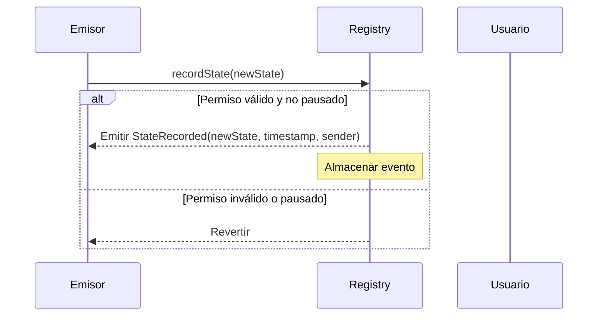
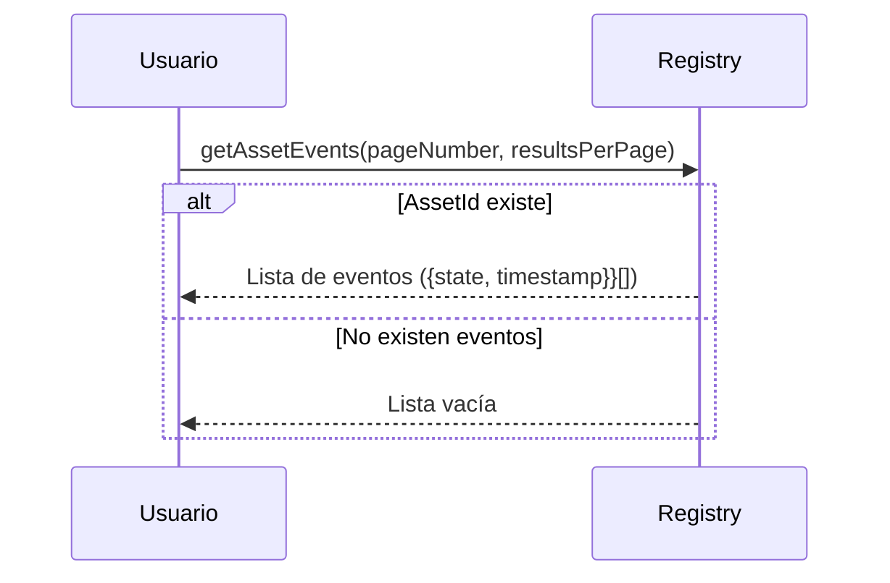
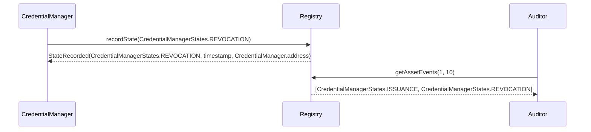

# ISBE-ART-01020 — Asset Event Tracker (contracts/assetevent)

---

## 1. Identificación del Artefacto

| Campo                       | Valor                                                                                                                                                              |
| --------------------------- | ------------------------------------------------------------------------------------------------------------------------------------------------------------------ |
| **Nombre del artefacto**    | ISBE-ART-01020 — Asset Event Tacker (contracts/assetevent)                                                                                                         |
| **Origen**                  | Documento derivado del repositorio oficial de Smart Contracts, consolidando información técnica sobre la gestión de eventos asociados a activos digitales en ISBE. |
| **Estado**                  | Validado                                                                                                                                                           |
| **Versión del documento**   | 0.1.1                                                                                                                                                              |
| **Fecha**                   | 2025-08-11                                                                                                                                                         |
| **Repositorio (congelado)** | [https://github.com/alastria/isbe-contracts](https://github.com/alastria/isbe-contracts)                                                                           |
| **Commit**                  | `2c3a2accef78bbf723c970c8139df34a4d3137c8`                                                                                                                         |

---

## 2. Propósito del Artefacto

### Objetivo funcional:

Definir un mecanismo estandarizado para **registrar, consultar y auditar eventos asociados a activos digitales** (por ejemplo, tokens ERC-721, credenciales, documentos) en la red ISBE, garantizando trazabilidad, integridad y cumplimiento normativo.

### Beneficio para ISBE:

- **Trazabilidad inmutable**: Registro de eventos (emisión, transferencia, revocación, auditoría) en blockchain.
- **Interoperabilidad**: Compatible con sistemas de verificación externos (EBSI, wallets, explorers).
- **Cumplimiento normativo**: Facilita el cumplimiento de **eIDAS2**, **NIS2** y **RGPD** mediante evidencia de auditoría y control de acceso.
- **Flexibilidad semántica**: Soporta metadatos estructurados (tipo de evento, contexto, justificación) para escenarios regulatorios y de gobernanza.

### Stakeholders clave:

- Equipos técnicos de desarrollo y operaciones.
- Auditores de seguridad y cumplimiento.
- Órganos de gobernanza técnica.
- Entidades emisoras de activos (universidades, administraciones).
- Entidades reguladoras y organismos de control.

---

## 3. Alcance y Ciclo de Vida

### Fases cubiertas:

✅ **Definición**: Descripción funcional de interfaces, eventos y estructuras de datos.  
🟡 **Desarrollo**: Especificación de flujos y buenas prácticas (estado: por confirmar en el commit).  
🟡 **Validación**: Pruebas unitarias y de integración (por confirmar en el commit).  
🟡 **Mantenimiento**: Actualización alineada con evoluciones del estándar y normativas.

### Inicio de fases y paquetes relacionados:

- Pertenece al **PT1 (Diseño y desarrollo del cliente ISBE)**, Tarea **T1.4 (Desarrollo de artefactos)**.
- Módulo base: `contracts/assetevent`.

### Dependencias:

- Contratos base: `AccessControl`, `Pausable`, `ERC165` (introspección).
- Estándares: Eventos EVM, posible integración con `IERC5623` (Event Registry) o `IERC1155Metadata`.
- Componentes de gobernanza: `Ownable` o `AccessControl`.

### Mantenimiento:

- Revisión anual o ante cambios regulatorios (NIS2, eIDAS2).
- Actualización de esquemas de metadatos según necesidades de casos de uso (ej. eventos de revocación).

---

## 4. Definición del Artefacto

### 4.1. Artefacto de arquitectura de referencia

El sistema **Asset Event** permite asociar eventos significativos a activos digitales (tokens, credenciales, NFTs), con un enfoque modular y trazable.

- **Registro centralizado**: Un contrato `AssetEventRegistry` registra eventos por `(assetId, eventType, timestamp)`.
- **Emisión descentralizada**: Contratos emisores (tokens, credenciales) pueden emitir eventos mediante `emitAssetEvent`.
- **Consulta eficiente**: Soporta búsquedas por `assetId`, `eventType`, rango de fechas, o emisor.
- **Metadatos estructurados**: Cada evento puede incluir `uri` o `data` con contexto adicional (justificación, documento soporte, firma).

---

### 4.2. Trazabilidad

Este artefacto se alinea con:

- **ENT_1 – Evaluación de necesidades** (30/06/2025): Requisitos de trazabilidad, gobernanza y cumplimiento.
- **ENT_2 – Análisis de requerimientos** (30/06/2025): Requisito 2.6 (actualización modular), 6.1 (control de cambios).
- **Arquitectura de Referencia de ISBE**: Epígrafe 5.6.3 (definición de proxies) y 18.2 (requisitos regulatorios).

Para trazabilidad fina, se recomienda vincular cada tipo de evento con un ID de requisito en futuras iteraciones.

---

### 4.3. Descripción funcional detallada

#### Funcionalidades clave:

- **Publicación de eventos** (`recodState`, `StateRecorded`).
- **Consulta de eventos** por el último producido o recuperación paginada.
- **Pausa de operaciones** en caso de incidentes.
- **Gobernanza basada en roles** para emisión crítica (revocación, auditoría).
- **Soporte para paginación** en consultas grandes.
- **Introspección ERC-165** para descubrimiento de interfaces.

#### Glosario de términos

| Término            | Descripción                                                                          |
| ------------------ | ------------------------------------------------------------------------------------ |
| **Asset Event**    | Evento asociado a un activo digital (emisión, transferencia, revocación, auditoría). |
| **AssetState**     | Conjunto de estados del activo.                                                      |
| **Event Registry** | Contrato que almacena y organiza eventos.                                            |
| **Emitter**        | Contrato autorizado a emitir eventos (e.g., token, credential manager).              |

---

### 4.4. Diferencias clave y ventajas frente a soluciones estándar

| Característica | Solución estándar (Eventos EVM) | ISBE Asset Event                             |
| -------------- | ------------------------------- | -------------------------------------------- |
| **Gobierno**   | Ninguno                         | Basado en roles (`ASSET_EVENT_TRACKER_ROLE`) |
| **Pausa**      | No aplicable                    | Soportado (`Pausable`)                       |
| **Auditoría**  | Solo logs                       | Registro centralizado + eventos              |
| **Compliance** | Limitado                        | Alineado con eIDAS2, NIS2, RGPD              |

> ✅ **Ventaja ISBE**: Mayor trazabilidad, estructura semántica y adaptabilidad a entornos regulados.

---

### 4.5. Flujos de ejecución

#### 4.5.1. Publicación de un evento



#### 4.5.2. Consulta de eventos por activo



#### 4.5.3. Revocación de credencial (caso de uso)



---

### 4.6. Reglas de negocio asociadas

| Contrato/Faceta    | Función                | Permiso requerido                                    | Pausa afecta |
| ------------------ | ---------------------- | ---------------------------------------------------- | ------------ |
| AssetEventRegistry | `recordState`          | `onlyRole(EVENT_MANAGER_ROLE)` o `isApprovedEmitter` | Sí           |
| AssetEventRegistry | `pause()`              | `onlyRole(PAUSER_ROLE)`                              | —            |
| AssetEventRegistry | `unpause()`            | `onlyRole(PAUSER_ROLE)`                              | —            |
| AssetEventRegistry | `getAssetEvents`       | Ninguno                                              | No           |
| AssetEventRegistry | `getLatestAssetEvent`  | Ninguno                                              | No           |
| AssetEventRegistry | `getCurrentState`      | Ninguno                                              | No           |
| AssetEventRegistry | `isStateChangeAllowed` | Ninguno                                              | No           |
| AssetEventEmitter  | `StateRecorded`        | Integrado con token/credential                       | No           |

---

### 4.7. Interfaces y puntos de integración

#### 4.7.1. Interfaces y funciones clave

**IAssetEventTracker**

- `recordState(uint256 _newState)`
- `getAssetEvents(uint256 _pageNumber, uint256 _resultsPerPage) → AssetEvent[]`
- `getLatestAssetEvent() → AssetEvent`
- `getCurrentState() → uint256`
- `isStateChangeAllowed(uint256 _newState) → bool`

**Struct AssetEvent**

```solidity
struct AssetEvent {
    uint256 state;
    uint256 timestamp;
}
```

#### 4.7.2. Eventos

- `StateRecorded(state, timestamp, sender)`

#### 4.7.3. Errores destacados

- `StateChangeNotAllowed(uint256 newState)`

---

### 4.8. Normativas y requisitos regulatorios

- **eIDAS2**: Soporte para URI de metadatos firmados (credenciales verificables).
- **NIS2**: Registro de eventos de seguridad (revocación, auditoría) como evidencia de cumplimiento.
- **RGPD**: Posibilidad de registrar el ejercicio de derechos (borrado, limitación) como evento trazable.
- **Transparencia**: Todos los eventos son inmutables y auditables.

---

### 4.9. Criterios de calidad específicos

#### 4.9.1. Compatibilidad e interoperabilidad

- Compatible con wallets, explorers y sistemas EBSI.
- Soporta introspección ERC-165 si se implementa.
- URI en formato estándar (IPFS, HTTPS, DID).

#### 4.9.2. Buenas prácticas de uso

- **Usar URIs estructuradas**: JSON-LD, esquemas W3C.
- **Firmar metadatos**: Incluir firma en `data` para autenticidad.
- **Paginar consultas**: Evitar timeouts en listas grandes.
- **Validar eventos críticos**: Revocación, auditoría, deben tener URI soporte.

---

## 5. Desarrollo del Artefacto

### 5.1. Componentes del artefacto

- `IAssetEventTracker.sol`
- `AssetEventTracker.sol` (implementación)
- `AccessControl` o `Ownable` para gobernanza.
- `Pausable` para control de emergencias.
- `ERC165` para introspección (opcional).

### 5.2. Componentes del artefacto y su interacción

El artefacto de Asset Event Tracker está compuesto por varios contratos inteligentes que trabajan conjuntamente para proporcionar un sistema seguro de registro de eventos de activos y cambios de estado.

**1. `IAssetEventTracker.sol`**  
Este contrato es la interfaz base del sistema. Define las funciones públicas que cualquier implementación debe ofrecer (`recordState`, `getAssetEvents`, `getLatestAssetEvent`, `getCurrentState`, `isStateChangeAllowed`), así como el evento `StateRecorded` y el error `StateChangeNotAllowed`. Su función principal es estandarizar la interacción con el sistema y permitir la introspección de interfaces.

**2. `AssetEventTrackerInternal.sol`**  
Contrato abstracto que contiene la lógica interna para gestionar los eventos de activos y sus estados. Incluye:

- El **struct `AssetEventStorage`**, que almacena un array de eventos y el estado actual.
- Modificadores como `onlyAllowedStateChange` para asegurar que solo se registren cambios permitidos.
- Funciones internas `_recordState`, `_getAssetEvents`, `_getLatestAssetEvent`, `_getCurrentState` y `_isStateChangeAllowed` para manipular y validar los datos del storage.
- Función `_assetEventStorage` que devuelve la ubicación del storage mediante un slot fijo en la blockchain.

**3. `AssetEventTracker.sol`**  
Contrato abstracto que implementa la interfaz `IAssetEventTracker` y hereda de `AssetEventTrackerInternal`. Se encarga de exponer las funciones externas (`recordState`, `getAssetEvents`, `getLatestAssetEvent`, `getCurrentState`, `isStateChangeAllowed`) aplicando controles de acceso y pausabilidad (`onlyRole(_ASSET_EVENT_TRACKER_ROLE)` y `whenNotPaused`). Básicamente conecta la lógica interna con los permisos de usuarios y el flujo seguro del sistema.

**4. `AssetEventTrackerFacet.sol`**  
Contrato que funciona como **faceta EIP-2535 (Diamond Standard)**. Hereda de `AssetEventTracker` y añade introspección de interfaces y selectores (`interfacesIntrospection`, `selectorsIntrospection`, `businessIdIntrospection`) para sistemas modulares que utilicen el patrón diamante. Su propósito es permitir la extensión del sistema sin modificar la lógica interna del contrato base.

**Interacción entre los contratos**:

- `AssetEventTrackerFacet` utiliza `AssetEventTracker` para exponer las funciones externas y facilitar la introspección.
- `AssetEventTracker` utiliza `AssetEventTrackerInternal` para realizar la lógica de registro y validación de eventos.
- Todo el sistema depende de `IAssetEventTracker` para garantizar que cualquier contrato que implemente esta funcionalidad cumpla con la interfaz estándar.

En conjunto, estos contratos permiten registrar eventos de activos y cambios de estado de manera segura, evitando cambios no permitidos y proporcionando introspección y modularidad para futuras extensiones.

### 5.3. Frameworks, librerías o tecnologías acordadas

- **Hyperledger Besu** (EVM compatible).
- **Solidity** (contratos inteligentes).
- **OpenZeppelin Contracts** (seguridad y estándares).
- **Hardhat** (pruebas y despliegue).
- **ethers.js v6** (integración off-chain).

### 5.4. Buenas prácticas aplicables

- Seguridad por diseño.
- Auditoría continua.
- Modularidad y reutilización.
- Validación de inputs.
- Idempotencia en inicializadores.

### 5.5. Criterios de validación del desarrollo

La validación del desarrollo se ha realizado mediante pruebas unitarias que verifican el correcto funcionamiento del contrato **Asset Event Tracker**. A continuación se detallan los tests implementados:

| Test / Escenario                  | Descripción                                                                      | Resultado esperado / Verificación                                                                                        |
| --------------------------------- | -------------------------------------------------------------------------------- | ------------------------------------------------------------------------------------------------------------------------ |
| Registro de estados               | Se registra un estado con `recordState`.                                         | Se emite el evento `StateRecorded` con estado, remitente y timestamp. `getCurrentState()` devuelve el estado registrado. |
| Estado no permitido               | Se intenta registrar un estado que no está permitido por la lógica del contrato. | La transacción revierte con el error `StateChangeNotAllowed`.                                                            |
| Contrato pausado                  | Se intenta registrar un estado mientras el contrato está pausado.                | La transacción revierte con el error `IsPaused`.                                                                         |
| Control de permisos               | Una cuenta sin el rol `ASSET_EVENT_TRACKER_ROLE` intenta registrar un estado.    | La transacción revierte con el error `AccountHasNoRole`.                                                                 |
| Comprobación de cambios de estado | Se verifica si un cambio de estado está permitido con `isStateChangeAllowed`.    | Devuelve `true` si el nuevo estado es mayor que el actual y `false` si es menor.                                         |
| Paginación de eventos             | Se consulta eventos con `getAssetEvents` por páginas.                            | Devuelve correctamente los eventos existentes o un array vacío si se consulta una página mayor que la disponible.        |

Estas pruebas aseguran que el **Asset Event Tracker** funcione correctamente bajo condiciones normales y excepcionales, cumpliendo los criterios de control de acceso, flujo de estados y manejo de casos límite definidos en el desarrollo.

_Ejemplo del test `Registro de estados`_:

```ts
it('GIVEN a Asset Event Tracker WHEN record a state THEN succeeds', async function () {
    await deploy()

    assetEventTracker = assetEventTracker.connect(adminAccount)
    mockTimestamp = mockTimestamp.connect(adminAccount)

    await mockTimestamp.setMockedTimestamp(BLOCK_TIMESTAMP)

    await expect(assetEventTracker.recordState(STATE_1))
        .to.emit(assetEventTracker, 'StateRecorded')
        .withArgs(STATE_1, BLOCK_TIMESTAMP, await adminAccount.getAddress())

    expect(await assetEventTracker.getLatestAssetEvent()).to.deep.equal([
        STATE_1,
        BLOCK_TIMESTAMP,
    ])
    expect(await assetEventTracker.getCurrentState()).to.equal(STATE_1)
    expect(await assetEventTracker.getAssetEvents(0, 10)).to.deep.equal([
        [STATE_1, BLOCK_TIMESTAMP],
    ])
})
```

### 5.6. Alineación con requisitos legales

- **NIS2**: Registro de eventos de seguridad.
- **RGPD**: Minimización de datos (solo estado y timestamp).
- **eIDAS2**: Soporte para pruebas electrónicas.

### 5.7. Dependencias técnicas o de infraestructura

- OpenZeppelin Contracts.
- Infraestructura EVM (nodos Besu).
- Herramientas de hashing (off-chain).

### 5.8. Descripción técnica de las funciones

#### Funciones externas

| Función                                         | Tipo      | Descripción                                                                                                                                                                                                 |
| ----------------------------------------------- | --------- | ----------------------------------------------------------------------------------------------------------------------------------------------------------------------------------------------------------- |
| `recordState(uint256 _newState)`                | Escritura | Registra un nuevo estado del activo con un timestamp asociado. Solo puede llamarla un usuario con el rol `ASSET_EVENT_TRACKER_ROLE` y si el contrato no está pausado, y el cambio de estado está permitido. |
| `getCurrentState()`                             | Lectura   | Devuelve el estado actual del activo.                                                                                                                                                                       |
| `getLatestAssetEvent()`                         | Lectura   | Devuelve el último evento registrado como `[estado, timestamp]`.                                                                                                                                            |
| `getAssetEvents(uint256 from, uint256 perPage)` | Lectura   | Devuelve un array de eventos paginados `[estado, timestamp]` desde el índice `from` con máximo `perPage` elementos.                                                                                         |
| `isStateChangeAllowed(uint256 _newState)`       | Lectura   | Comprueba si un cambio de estado al valor `_newState` está permitido según la lógica del contrato.                                                                                                          |

_Ejemplo de la función `recordState(uint256 _newState)`_:

```solidity
function recordState(
    uint256 _newState
)
    external
    override
    onlyAllowedStateChange(_newState)
    whenNotPaused
    onlyRole(_ASSET_EVENT_TRACKER_ROLE)
{
    _recordState(_newState);
}
```

#### Funciones externas de introspección

El contrato `AssetEventTracker` implementa funciones de introspección que permiten conocer de forma dinámica los interfaces y selectores que soporta, así como su identificador de negocio. Las funciones principales son:

| Función                     | Tipo    | Descripción                                                                                                                                                                    |
| --------------------------- | ------- | ------------------------------------------------------------------------------------------------------------------------------------------------------------------------------ |
| `interfacesIntrospection()` | Lectura | Devuelve un array de los `interfaceId` que implementa el contrato, permitiendo conocer dinámicamente qué interfaces soporta.                                                   |
| `businessIdIntrospection()` | Lectura | Retorna un `bytes32` que identifica el negocio o módulo del contrato, definido como `_ASSET_EVENT_TRACKER_KEY`.                                                                |
| `selectorsIntrospection()`  | Lectura | Devuelve un array con los selectores de las funciones públicas relevantes: `recordState`, `getCurrentState`, `getLatestAssetEvent`, `getAssetEvents` y `isStateChangeAllowed`. |

_Ejemplo de la función `selectorsIntrospection()`_:

```solidity
function selectorsIntrospection()
    external
    pure
    returns (bytes4[] memory selectors_)
{
    uint256 selectorsLength = 5;
    selectors_ = new bytes4[](selectorsLength);
    selectors_[--selectorsLength] = this.recordState.selector;
    selectors_[--selectorsLength] = this.getCurrentState.selector;
    selectors_[--selectorsLength] = this.getLatestAssetEvent.selector;
    selectors_[--selectorsLength] = this.getAssetEvents.selector;
    selectors_[--selectorsLength] = this.isStateChangeAllowed.selector;
}
```

#### Funciones internas

| Función                             | Tipo                 | Descripción                                                                                                |
| ----------------------------------- | -------------------- | ---------------------------------------------------------------------------------------------------------- |
| `_recordState(uint256 _state)`      | Escritura            | Implementa la lógica interna para registrar un estado con su timestamp y emitir el evento `StateRecorded`. |
| `_getAssetEventStorage()`           | Lectura              | Devuelve la estructura de almacenamiento donde se guardan los eventos `[estado, timestamp]`.               |
| `_checkStateChange(uint256 _state)` | Lectura / Validación | Valida que un cambio de estado está permitido; falla si no se puede cambiar al nuevo estado.               |
| `_blockTimestamp()`                 | Lectura              | Devuelve el timestamp actual del bloque (o mockeado para pruebas).                                         |

_Ejemplo de la función `_recordState(uint256 _state)`_:

```solidity
function _recordState(uint256 _newState) internal virtual {
    uint256 timestamp = _blockTimestamp();
    _assetEventTrackerStorage().assetEvents.push(
        IAssetEventTracker.AssetEvent({
            state: _newState,
            timestamp: timestamp
        })
    );
    emit IAssetEventTracker.StateRecorded(_newState, timestamp, msg.sender);
}
```

### 5.9. Descripción técnica de los datos

#### Estructuras de datos (`structs`)

| Nombre del struct   | Campos                            | Descripción                                                                          |
| ------------------- | --------------------------------- | ------------------------------------------------------------------------------------ |
| `AssetEventStorage` | `{state,timestamp}[] assetEvents` | Almacena todos los eventos registrados. Cada evento es un par `[estado, timestamp]`. |

**Detalles:**

- `AssetEventStorage` organiza internamente los eventos de los activos de forma eficiente.
- Permite registrar secuencias de estados con sus timestamps asociados.
- Se utiliza internamente por las funciones `_recordState`, `_getAssetEventStorage` y `_checkStateChange`.

---

#### Variables de almacenamiento (`storage`)

| Variable / Slot                 | Tipo                  | Alcance                    | Descripción                                                                            |
| ------------------------------- | --------------------- | -------------------------- | -------------------------------------------------------------------------------------- | --- |
| `_ASSET_EVENT_STORAGE_POSITION` | `bytes32` (constant)  | Interna                    | Slot fijo donde se ubica la estructura `AssetEventStorage` en el storage del contrato. |     |
| `assetEvents`                   | `{state,timestamp}[]` | Interna (dentro de struct) | Array que almacena todos los eventos `[estado, timestamp]` del activo.                 |

**Detalles:**

- La variable `_ASSET_EVENT_STORAGE_POSITION` define la ubicación del struct en el storage usando inline assembly.
- `assetEvents` permite consultar el historial completo de estados y timestamps.
- Todas las operaciones de lectura y escritura de estados se realizan a través de `_getAssetEventStorage()` para garantizar consistencia y encapsulamiento.

### 5.10. Roles

- `ASSET_EVENT_TRACKER_ROLE`: permiso para registrar nuevos estados en el contrato.

---

## 6. Reglas de Control y Actualización

| Tipo de cambio  | Versionado | Flujo de aprobación            | Documentación requerida |
| --------------- | ---------- | ------------------------------ | ----------------------- |
| Evolutivo menor | X.Y+0.1    | Revisión técnica               | Notas de versión        |
| Evolutivo mayor | X+1.0      | Aprobación de gobierno técnico | Informe de impacto      |
| Hotfix          | X.Y.Z      | Aprobación urgente             | Evidencia de tests      |

- **Versionado**: Git con tags semánticos.
- **Aprobación**: Validación técnica y de gobernanza.
- **Frecuencia de revisión**: Mínima anual o ante cambios regulatorios.

---

## Anexos

### Anexo 1 – Ejemplos de Integración con ethers v6

#### 1. Publicación de un evento

```ts
import { ethers } from 'ethers'

const rpcUrl = 'https://<RPC_URL>'
const registryAddress = '0x<REGISTRY_ADDRESS>'
const provider = new ethers.JsonRpcProvider(rpcUrl)
const RegistryStates = {
    NONE,
    ISSUANCE,
    REDEEM,
}

const registryAbi = [
    'function recordState(uint256 _newState) public',
    'event StateRecorded(uint256 state, uint256 timestamp, address indexed sender)',
]

const signer = new ethers.Wallet('<PRIVATE_KEY>', provider)
const registry = new ethers.Contract(registryAddress, registryAbi, signer)

const newState = RegistryStates.ISSUANCE

const tx = await registry.recordState(RegistryStates.ISSUANCE)
const receipt = await tx.wait()
console.log('Event published:', receipt)
```

#### 2. Consulta de eventos por activo

```ts
// ... (mismo setup)
const registryWithProvider = registry.connect(provider)

const events = await registryWithProvider.getAssetEvents(
    0, // page
    10 // size
)

console.log(
    'Events:',
    events.map((e) => ({
        state: e.state,
        timestamp: e.timestamp,
    }))
)
```

#### 3. Escucha de eventos

```ts
registryWithProvider.on('StateRecorded', (state, timestamp, sender) => {
    console.log('StateRecordedEvent:', {
        state,
        timestamp,
        sender,
    })
})
```

---

### Anexo 2 – Resumen mínimo de firmas y eventos

#### Firmas principales

- `recordState(netState)`
- `getAssetEvents(pageNumber, resultsPerPage)`
- `getLatestAssetEvent()`
- `getCurrentState()`
- `usStateChangeAllowed(newState)`

#### Eventos

- `StateRecorded(state, timestamp, sender)`

#### Errores destacados

- `StateChangeNotAllowed`

---

### Anexo 3 – Referencias Bibliográficas

- **ERC-165 (Introspección)**: [https://eips.ethereum.org/EIPS/eip-165](https://eips.ethereum.org/EIPS/eip-165)
- **W3C Verifiable Credentials**: [https://www.w3.org/TR/vc-data-model/](https://www.w3.org/TR/vc-data-model/)
- **IPFS**: [https://ipfs.tech/](https://ipfs.tech/)
- **OpenZeppelin Contracts**: [https://docs.openzeppelin.com/contracts](https://docs.openzeppelin.com/contracts)
- **Repositorio ISBE**: [https://github.com/alastria/isbe-contracts](https://github.com/alastria/isbe-contracts)

---
