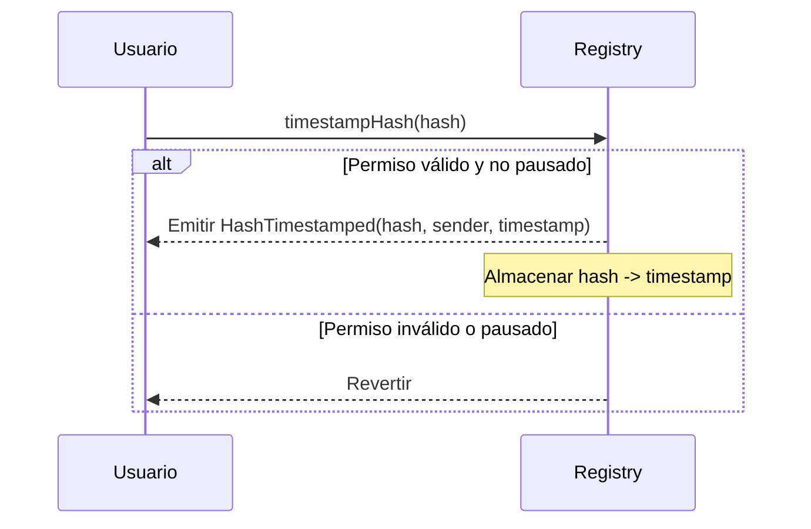
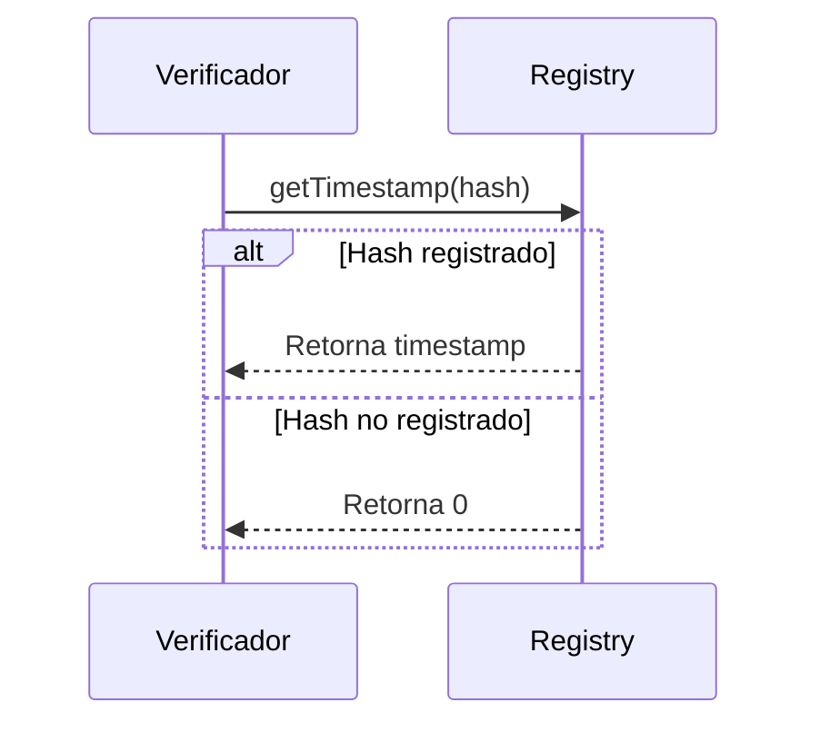
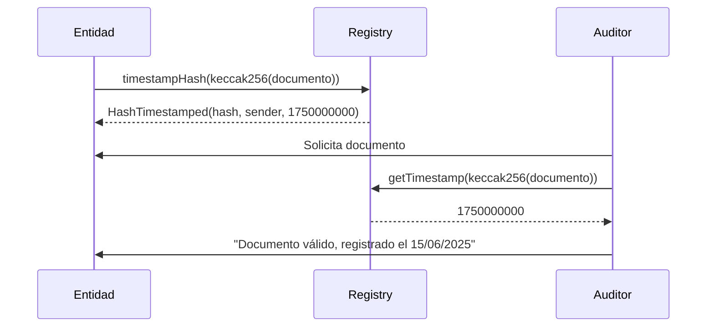

# ISBE-ART-01030 — Hash Timestamp (contracts/hashtimestamp)

---

## 1. Identificación del Artefacto

| Campo                       | Valor                                                                                                                                                                                  |
| --------------------------- | -------------------------------------------------------------------------------------------------------------------------------------------------------------------------------------- |
| **Nombre del artefacto**    | ISBE-ART-01030 — Hash Timestamp (contracts/hashtimestamp)                                                                                                                              |
| **Origen**                  | Documento derivado del repositorio oficial de Smart Contracts, consolidando información técnica sobre el mecanismo de anclaje de evidencias digitales mediante hash y marca de tiempo. |
| **Estado**                  | Validado                                                                                                                                                                               |
| **Versión del documento**   | 0.1.1                                                                                                                                                                                  |
| **Fecha**                   | 2025-08-11                                                                                                                                                                             |
| **Repositorio (congelado)** | [https://github.com/alastria/isbe-contracts](https://github.com/alastria/isbe-contracts)                                                                                               |
| **Commit**                  | `2c3a2accef78bbf723c970c8139df34a4d3137c8`                                                                                                                                             |

---

## 2. Propósito del Artefacto

### Objetivo funcional:

Definir un mecanismo **inmutable, verificable y trazable** para registrar la existencia de un documento, dato o estado digital en un momento determinado, mediante el almacenamiento de su **hash criptográfico** y una **marca de tiempo (timestamp)** en blockchain.

Este sistema permite demostrar **integridad y anterioridad** de información sin necesidad de almacenar el contenido completo en la cadena, protegiendo la privacidad y cumpliendo con principios de minimización de datos.

### Beneficio para ISBE:

- **Prueba de integridad**: Cualquier alteración del documento original es detectable.
- **No repudio**: El registro en blockchain establece una evidencia fehaciente de que un hash fue presentado en una fecha y hora específica.
- **Cumplimiento normativo**: Soporta requisitos de **NIS2**, **eIDAS2** (artículo 47 sobre pruebas electrónicas) y **RGPD** (principio de responsabilidad proactiva).
- **Interoperabilidad**: Compatible con sistemas europeos como **EBSI** para el intercambio de evidencias verificables.
- **Eficiencia**: Permite verificar documentos sin almacenarlos on-chain.

### Stakeholders clave:

- Equipos técnicos de desarrollo y operaciones.
- Auditores de seguridad y cumplimiento.
- Órganos de gobernanza técnica.
- Entidades emisoras de documentos (administraciones, universidades).
- Organismos reguladores y judiciales (como entidades de verificación de pruebas).

---

## 3. Alcance y Ciclo de Vida

### Fases cubiertas:

✅ **Definición**: Descripción funcional del patrón de anclaje, interfaces y eventos.  
🟡 **Desarrollo**: Especificación de flujos y buenas prácticas (estado: por confirmar en el commit).  
🟡 **Validación**: Pruebas unitarias y de integración (por confirmar en el commit).  
🟡 **Mantenimiento**: Actualización alineada con evoluciones del estándar y normativas.

### Inicio de fases y paquetes relacionados:

- Pertenece al **PT1 (Diseño y desarrollo del cliente ISBE)**, Tarea **T1.4 (Desarrollo de artefactos)**.
- Módulo base: `contracts/hashtimestamp`.

### Dependencias:

- Contratos base: `AccessControl`, `Pausable`, `ERC165` (introspección).
- Estándares: Eventos EVM, posible alineación con `EIP‑191` (firmas) o `EIP‑712` (datos estructurados).
- Componentes de gobernanza: `Ownable` o `AccessControl`.

### Mantenimiento:

- Revisión anual o ante cambios regulatorios (NIS2, eIDAS2).
- Actualización de políticas de pausa y auditoría.

---

## 4. Definición del Artefacto

### 4.1. Artefacto de arquitectura de referencia

El sistema **Hash Timestamp** implementa un **servicio de notarización digital** descentralizado, donde cualquier entidad autorizada puede registrar el hash de un documento junto con una marca de tiempo.

- **Registro centralizado en blockchain**: Un contrato `HashTimestamp` almacena pares `(hash, timestamp)`.
- **Verificación eficiente**: Cualquier usuario puede consultar si un hash fue registrado y cuándo.
- **Pausa de operaciones**: En caso de incidentes o auditorías, se puede suspender temporalmente el registro.
- **Gobernanza basada en roles**: Solo ciertos roles pueden registrar hashes (opcional, según diseño).

---

### 4.2. Trazabilidad

Este artefacto se alinea con:

- **ENT_1 – Evaluación de necesidades** (30/06/2025): Requisitos de trazabilidad, gobernanza y cumplimiento.
- **ENT_2 – Análisis de requerimientos** (30/06/2025): Requisito 2.6 (actualización modular), 6.1 (control de cambios).
- **Arquitectura de Referencia de ISBE**: Epígrafe 5.6.3 (definición de proxies) y 18.2 (requisitos regulatorios).

Para trazabilidad fina, se recomienda vincular cada tipo de evento con un ID de requisito en futuras iteraciones.

---

### 4.3. Descripción funcional detallada

#### Funcionalidades clave:

- **Registro de hash** (`timestampHash`) con marca de tiempo automática.
- **Consulta de existencia y momento** (`exists`, `getTimestamp`).
- **Pausa de operaciones** en caso de incidentes.
- **Gobernanza basada en roles** para control de quién puede registrar.
- **Introspección ERC-165** para descubrimiento de interfaces.

#### Glosario de términos

| Término                 | Descripción                                                                  |
| ----------------------- | ---------------------------------------------------------------------------- |
| **Hash**                | Resumen criptográfico (SHA-256, keccak256) del documento original.           |
| **Timestamp**           | Marca de tiempo en segundos desde la época Unix.                             |
| **Anclaje (anchoring)** | Proceso de registrar un hash en blockchain para probar su existencia previa. |
| **Integridad**          | Garantía de que un documento no ha sido alterado desde su registro.          |
| **Anterioridad**        | Prueba de que un documento existía antes de una fecha determinada.           |

---

### 4.4. Diferencias clave y ventajas frente a soluciones estándar

| Característica | Solución estándar (manual)          | ISBE Hash Timestamp                        |
| -------------- | ----------------------------------- | ------------------------------------------ |
| **Registro**   | Manual (copiar hash en transacción) | Automatizado vía contrato                  |
| **Consulta**   | Buscar en explorers                 | API estructurada (`getTimestamp`)          |
| **Gobierno**   | Ninguno                             | Basado en roles (`TIMESTAMP_MANAGER_ROLE`) |
| **Pausa**      | No aplicable                        | Soportado (`Pausable`)                     |
| **Auditoría**  | Limitada                            | Registro inmutable + eventos               |
| **Compliance** | Limitado                            | Alineado con eIDAS2, NIS2, RGPD            |

> ✅ **Ventaja ISBE**: Mayor trazabilidad, estructura semántica y adaptabilidad a entornos regulados.

---

### 4.5. Flujos de ejecución

#### 4.5.1. Registro de un hash



#### 4.5.2. Consulta de un hash



#### 4.5.3. Verificación de integridad (caso de uso)



---

### 4.6. Reglas de negocio asociadas

| Contrato/Faceta       | Función                  | Permiso requerido                         | Pausa afecta |
| --------------------- | ------------------------ | ----------------------------------------- | ------------ |
| HashTimestampRegistry | `timestampHash(bytes32)` | `onlyRole(_ASH_TIMESTAMP_ROLE)` o público | Sí           |
| HashTimestampRegistry | `pause()`                | `onlyRole(PAUSER_ROLE)`                   | —            |
| HashTimestampRegistry | `unpause()`              | `onlyRole(PAUSER_ROLE)`                   | —            |
| HashTimestampRegistry | `getTimestamp(bytes32)`  | Ninguno                                   | No           |
| HashTimestampRegistry | `exsists(bytes32)`       | Ninguno                                   | No           |

---

### 4.7. Interfaces y puntos de integración

#### 4.7.1. Interfaces y funciones clave

**IHashTimestampRegistry**

- `timestampHash(bytes32 hash)`
- `getTimestamp(bytes32 hash) → uint256`
- `exists(bytes32 hash) → bool`

#### 4.7.2. Eventos

- `HashRegistHashTimestampedered(bytes32 indexed hash, address indexed sender, uint256 timestamp)`

#### 4.7.3. Errores destacados

- `HashAlreadyExists(bytes32 hash)`

---

### 4.8. Normativas y requisitos regulatorios

- **eIDAS2**: Artículo 47 permite el uso de pruebas electrónicas basadas en blockchain. El hash timestamp actúa como evidencia de existencia previa.
- **NIS2**: Registro de eventos de seguridad (anclaje de logs, firmas) como evidencia de cumplimiento.
- **RGPD**: No almacena datos personales, solo hashes (minimización de datos).
- **Transparencia**: Todos los registros son inmutables y auditables.

---

### 4.9. Criterios de calidad específicos

#### 4.9.1. Compatibilidad e interoperabilidad

- Compatible con wallets, explorers y sistemas EBSI.
- Soporta introspección ERC-165 si se implementa.
- Funciones fáciles de integrar en flujos de verificación.

#### 4.9.2. Buenas prácticas de uso

- **Usar hashes criptográficos seguros**: SHA-256 o keccak256.
- **Firmar documentos antes de anclar**: Añadir firma al documento para no repudio.
- **Verificar off-chain antes de registrar**: Evitar duplicados o errores.
- **Documentar el contexto**: Aunque el hash no lo incluye, mantener metadatos en sistema externo.

---

## 5. Desarrollo del Artefacto

### 5.1. Componentes del artefacto

- `IHashTimestampRegistry.sol`
- `HashTimestamp.sol` (implementación)
- `AccessControl` o `Ownable` para gobernanza.
- `Pausable` para control de emergencias.
- `ERC165` para introspección (opcional).

### 5.2. Componentes del artefacto y su interacción

El artefacto de Hash Timestamp está compuesto por varios contratos inteligentes que trabajan conjuntamente para proporcionar un sistema seguro de registro de hashes con marca temporal.

**1. `IHashTimestamp.sol`**  
Este contrato es la interfaz base del sistema. Define las funciones públicas que cualquier implementación debe ofrecer (`timestampHash`, `exists`, `getTimestamp`), así como el evento `HashTimestamped` y el error `HashAlreadyExists`. Su función principal es estandarizar la interacción con el sistema y permitir la introspección de interfaces.

**2. `HashTimestampInternal.sol`**  
Contrato abstracto que contiene la lógica interna para gestionar los hashes y sus timestamps. Incluye:

- El **struct `HashTimestampStorage`**, que almacena un mapping de hashes a timestamps.
- Modificadores como `onlyNonExistentHash` para asegurar que no se registren hashes duplicados.
- Funciones internas `_timestampHash`, `_exists`, `_getTimestamp` y `_checkHash` para manipular y validar los datos del storage.
- Función `_hashTimestampStorage` que devuelve la ubicación del storage mediante un slot fijo en la blockchain.

**3. `HashTimestamp.sol`**  
Contrato abstracto que implementa la interfaz `IHashTimestamp` y hereda de `HashTimestampInternal`. Se encarga de exponer las funciones externas (`timestampHash`, `exists`, `getTimestamp`) aplicando controles de acceso y pausabilidad (`onlyRole(_HASH_TIMESTAMP_ROLE)` y `whenNotPaused`). Básicamente conecta la lógica interna con los permisos de usuarios y el flujo de uso seguro del sistema.

**4. `HashTimestampFacet.sol`**  
Contrato que funciona como **faceta EIP-2535 (Diamond Standard)**. Hereda de `HashTimestamp` y añade introspección de interfaces y selectores (`interfacesIntrospection`, `selectorsIntrospection`, `businessIdIntrospection`) para sistemas modulares que utilicen el patrón diamante. Su propósito es permitir la extensión del sistema sin modificar la lógica interna del contrato base.

**Interacción entre los contratos**:

- `HashTimestampFacet` utiliza `HashTimestamp` para exponer las funciones externas y facilitar la introspección.
- `HashTimestamp` utiliza `HashTimestampInternal` para realizar la lógica de registro y validación de hashes.
- Todo el sistema depende de `IHashTimestamp` para garantizar que cualquier contrato que implemente esta funcionalidad cumpla con la interfaz estándar.

En conjunto, estos contratos permiten registrar hashes con marca temporal de manera segura, evitando duplicados, y proporcionando introspección y modularidad para futuras extensiones.

### 5.3. Frameworks, librerías o tecnologías acordadas

- **Hyperledger Besu** (EVM compatible).
- **Solidity** (contratos inteligentes).
- **OpenZeppelin Contracts** (seguridad y estándares).
- **Hardhat** (pruebas y despliegue).
- **ethers.js v6** (integración off-chain).

### 5.4. Buenas prácticas aplicables

- Seguridad por diseño.
- Auditoría continua.
- Modularidad y reutilización.
- Validación de inputs.
- Idempotencia en inicializadores.

### 5.5. Criterios de validación del desarrollo

La validación del desarrollo se ha realizado mediante pruebas unitarias que verifican el correcto funcionamiento de los contratos de Hash Timestamp. A continuación se detallan los tests implementados:

| Test / Escenario                      | Descripción                                                                         | Resultado esperado / Verificación                                                                                              |
| ------------------------------------- | ----------------------------------------------------------------------------------- | ------------------------------------------------------------------------------------------------------------------------------ |
| Registro de hashes                    | Se registra un hash con `timestampHash`.                                            | Se emite el evento `HashTimestamped` con hash, remitente y timestamp. `exists(HASH)` = true, `getTimestamp(HASH)` = timestamp. |
| Hash duplicado                        | Se intenta registrar un hash que ya fue registrado.                                 | La transacción revierte con el error `HashAlreadyExists`.                                                                      |
| Contrato pausado                      | Se intenta registrar un hash mientras el contrato está pausado.                     | La transacción revierte con el error `IsPaused`.                                                                               |
| Control de permisos                   | Una cuenta sin el rol `HASH_TIMESTAMP_ROLE` intenta registrar un hash.              | La transacción revierte con el error `AccountHasNoRole`.                                                                       |
| Flujo completo con despliegue y roles | Simulación de despliegue (`deployGovernance`) y asignación de roles (`grantRole`).  | El contrato está correctamente configurado y los tests anteriores se ejecutan correctamente.                                   |
| Timestamp simulado                    | Se establece un timestamp fijo con `setMockedTimestamp` para pruebas deterministas. | Los valores de timestamp devueltos en `getTimestamp` son los esperados.                                                        |

Estas pruebas aseguran que el sistema de registro de hashes funcione correctamente bajo condiciones normales y excepcionales, cumpliendo los criterios de seguridad, control de acceso y manejo de casos límite definidos en el desarrollo.

_Ejemplo del test `Registro de hashes`_:

```ts
it('GIVEN a Hash Timestamp WHEN timestamp hash THEN succeeds', async function () {
    await deploy()

    hashTimestamp = hashTimestamp.connect(adminAccount)
    await hashTimestamp.setMockedTimestamp(BLOCK_TIMESTAMP)

    await expect(hashTimestamp.timestampHash(HASH))
        .to.emit(hashTimestamp, 'HashTimestamped')
        .withArgs(HASH, await adminAccount.getAddress(), BLOCK_TIMESTAMP)

    expect(await hashTimestamp.exists(HASH)).to.equal(true)
    expect(await hashTimestamp.getTimestamp(HASH)).to.equal(BLOCK_TIMESTAMP)
})
```

### 5.6. Alineación con requisitos legales

- **NIS2**: Registro de eventos de seguridad.
- **RGPD**: Minimización de datos (solo hash).
- **eIDAS2**: Soporte para pruebas electrónicas.

### 5.7. Dependencias técnicas o de infraestructura

- OpenZeppelin Contracts.
- Infraestructura EVM (nodos Besu).
- Herramientas de hashing (off-chain).

### 5.8. Descripcion tecnica de las funciones

#### Funciones externas

| Función                        | Tipo      | Descripción                                                                                                                                                                      |
| ------------------------------ | --------- | -------------------------------------------------------------------------------------------------------------------------------------------------------------------------------- |
| `timestampHash(bytes32 _hash)` | Escritura | Registra un hash en el contrato con un timestamp asociado. Solo puede llamarla un usuario con el rol `_HASH_TIMESTAMP_ROLE`, si el hash no existe y el contrato no está pausado. |
| `exists(bytes32 _hash)`        | Lectura   | Comprueba si un hash ya ha sido registrado. Devuelve `true` si existe.                                                                                                           |
| `getTimestamp(bytes32 _hash)`  | Lectura   | Devuelve el timestamp asociado a un hash registrado.                                                                                                                             |

_Ejemplo de la funcion `timestampHash(bytes32 _hash)`_:

```solidity
function timestampHash(
    bytes32 _hash
)
    external
    override
    onlyNonExistentHash(_hash)
    whenNotPaused
    onlyRole(_HASH_TIMESTAMP_ROLE)
{
    _timestampHash(_hash);
}
```

#### Funciones externas de instrospeccion

El contrato faceta `HashTimestampFacet` implementa funciones de introspección que permiten conocer de forma dinámica los interfaces y selectores que soporta, así como su identificador de negocio. Las funciones principales son:

| Función                     | Tipo    | Descripción                                                                                                                  |
| --------------------------- | ------- | ---------------------------------------------------------------------------------------------------------------------------- |
| `interfacesIntrospection()` | Lectura | Devuelve un array de los `interfaceId` que implementa el contrato, permitiendo conocer dinámicamente qué interfaces soporta. |
| `businessIdIntrospection()` | Lectura | Retorna un `bytes32` que identifica el negocio o módulo del contrato, definido como `_HASH_TIMESTAMP_RESOLVER_KEY`.          |
| `selectorsIntrospection()`  | Lectura | Devuelve un array con los selectores de las funciones públicas relevantes: `timestampHash`, `exists` y `getTimestamp`.       |

_Ejemplo de la funcion `selectorsIntrospection()`_:

```solidity
function selectorsIntrospection()
    external
    pure
    override
    returns (bytes4[] memory selectors_)
{
    uint256 selectorsLength = 3;
    selectors_ = new bytes4[](selectorsLength);
    selectors_[--selectorsLength] = this.timestampHash.selector;
    selectors_[--selectorsLength] = this.exists.selector;
    selectors_[--selectorsLength] = this.getTimestamp.selector;
}
```

#### Funciones internas

| Función                         | Tipo                 | Descripción                                                                                                |
| ------------------------------- | -------------------- | ---------------------------------------------------------------------------------------------------------- |
| `_timestampHash(bytes32 _hash)` | Escritura            | Implementa la lógica interna para registrar el hash con su timestamp y emitir el evento `HashTimestamped`. |
| `_exists(bytes32 _hash)`        | Lectura              | Comprueba internamente si un hash ha sido registrado. Devuelve `true` si existe.                           |
| `_getTimestamp(bytes32 _hash)`  | Lectura              | Devuelve internamente el timestamp de un hash.                                                             |
| `_checkHash(bytes32 _hash)`     | Lectura / Validación | Valida que un hash no exista previamente; falla si ya existe.                                              |
| `_hashTimestampStorage()`       | Lectura              | Devuelve la estructura de almacenamiento donde se guardan los hashes y sus timestamps.                     |
| `_implementedInterfaces()`      | Lectura              | Devuelve los interfaces implementados por el contrato (`IHashTimestamp`).                                  |

_Ejemplo de la funcion `_timestampHash(bytes32 _hash)`_:

```solidity
function _timestampHash(bytes32 _hash) internal virtual {
    uint256 timestamp = _blockTimestamp();
    _hashTimestampStorage().hashTimestamps[_hash] = timestamp;
    emit IHashTimestamp.HashTimestamped(_hash, msg.sender, timestamp);
}
```

### 5.9. Descripcion tecnica de los datos

#### Estructuras de datos (`structs`)

| Nombre del struct      | Campos                                       | Descripción                                                                                  |
| ---------------------- | -------------------------------------------- | -------------------------------------------------------------------------------------------- |
| `HashTimestampStorage` | `mapping(bytes32 => uint256) hashTimestamps` | Almacena los hashes registrados y sus timestamps asociados. Cada hash apunta a su timestamp. |

**Detalles:**

- `HashTimestampStorage` es la única estructura modelada hasta ahora.
- Permite organizar el almacenamiento de hashes de forma eficiente mediante un mapping.
- Se utiliza internamente por las funciones `_timestampHash`, `_exists` y `_getTimestamp`.

---

#### Variables de almacenamiento (`storage`)

| Variable / Slot                    | Tipo                          | Alcance                    | Descripción                                                                               |
| ---------------------------------- | ----------------------------- | -------------------------- | ----------------------------------------------------------------------------------------- |
| `_HASH_TIMESTAMP_STORAGE_POSITION` | `bytes32` (constant)          | Interna                    | Slot fijo donde se ubica la estructura `HashTimestampStorage` en el storage del contrato. |
| `hashTimestamps`                   | `mapping(bytes32 => uint256)` | Interna (dentro de struct) | Mapping que almacena cada hash con su timestamp correspondiente.                          |

**Detalles:**

- La variable `_HASH_TIMESTAMP_STORAGE_POSITION` define la ubicación del struct en el storage usando inline assembly.
- `hashTimestamps` es la variable clave para registrar y consultar hashes.
- Todas las operaciones de lectura y escritura de hashes se realizan a través de `_hashTimestampStorage()` para garantizar consistencia y encapsulamiento.

### 5.10. Roles

- `_HASH_TIMESTAMP_ROLE`: permiso para registrar nuevo hashes en el contrato

---

## 6. Reglas de Control y Actualización

| Tipo de cambio  | Versionado | Flujo de aprobación            | Documentación requerida |
| --------------- | ---------- | ------------------------------ | ----------------------- |
| Evolutivo menor | X.Y+0.1    | Revisión técnica               | Notas de versión        |
| Evolutivo mayor | X+1.0      | Aprobación de gobierno técnico | Informe de impacto      |
| Hotfix          | X.Y.Z      | Aprobación urgente             | Evidencia de tests      |

- **Versionado**: Git con tags semánticos.
- **Aprobación**: Validación técnica y de gobernanza.
- **Frecuencia de revisión**: Mínima anual o ante cambios regulatorios.

---

## Anexos

### Anexo 1 – Ejemplos de Integración con ethers v6

#### 1. Registro de un hash

```ts
import { ethers } from 'ethers'

const rpcUrl = 'https://<RPC_URL>'
const registryAddress = '0x<REGISTRY_ADDRESS>'
const provider = new ethers.JsonRpcProvider(rpcUrl)

const registryAbi = [
    'function timestampHash(bytes32 hash) public',
    'function getTimestamp(bytes32 hash) view returns (uint256)',
    'event HashTimestamped(bytes32 indexed hash, address indexed sender, uint256 timestamp)',
]

const signer = new ethers.Wallet('<PRIVATE_KEY>', provider)
const registry = new ethers.Contract(registryAddress, registryAbi, signer)

const document = 'Contenido del documento a anclar'
const hash = ethers.keccak256(ethers.toUtf8Bytes(document))

const tx = await registry.timestampHash(hash)
const receipt = await tx.wait()
console.log('Hash registrado:', hash, 'en bloque', receipt.blockNumber)
```

#### 2. Consulta de un hash

```ts
// ... (mismo setup)
const registryWithProvider = registry.connect(provider)

const timestamp = await registryWithProvider.getTimestamp(hash)
if (timestamp > 0) {
    console.log(
        'Hash registrado el:',
        new Date(Number(timestamp) * 1000).toISOString()
    )
} else {
    console.log('Hash no registrado.')
}
```

#### 3. Escucha de eventos

```ts
registryWithProvider.on('HashTimestamped', (hash, sender, timestamp) => {
    console.log('Nuevo hash anclado:', {
        hash: ethers.hexlify(hash),
        sender,
        timestamp: new Date(Number(timestamp) * 1000).toISOString(),
    })
})
```

---

### Anexo 2 – Resumen mínimo de firmas y eventos

#### Firmas principales

- `timestampHash(bytes32)`
- `exists(bytes32)`
- `getTimestamp(bytes32)`

#### Eventos

- `HashTimestamped(bytes32 indexed hash, address indexed sender, uint256 timestamp)`

#### Errores destacados

- `HashAlreadyExists`

---

### Anexo 3 – Referencias Bibliográficas

- **eIDAS2 (Reglamento UE 2023/1368)**: [https://eur-lex.europa.eu/eli/reg/2023/1368](https://eur-lex.europa.eu/eli/reg/2023/1368)
- **NIS2 Directive (2022/2555)**: [https://eur-lex.europa.eu/eli/dir/2022/2555](https://eur-lex.europa.eu/eli/dir/2022/2555)
- **RFC 3161 (Time-Stamp Protocol)**: [https://datatracker.ietf.org/doc/html/rfc3161](https://datatracker.ietf.org/doc/html/rfc3161)
- **OpenZeppelin Contracts**: [https://docs.openzeppelin.com/contracts](https://docs.openzeppelin.com/contracts)
- **Repositorio ISBE**: [https://github.com/alastria/isbe-contracts](https://github.com/alastria/isbe-contracts)

---

> **Documento generado por el Arquitecto Técnico Senior del Proyecto ISBE — 2025-08-11**
