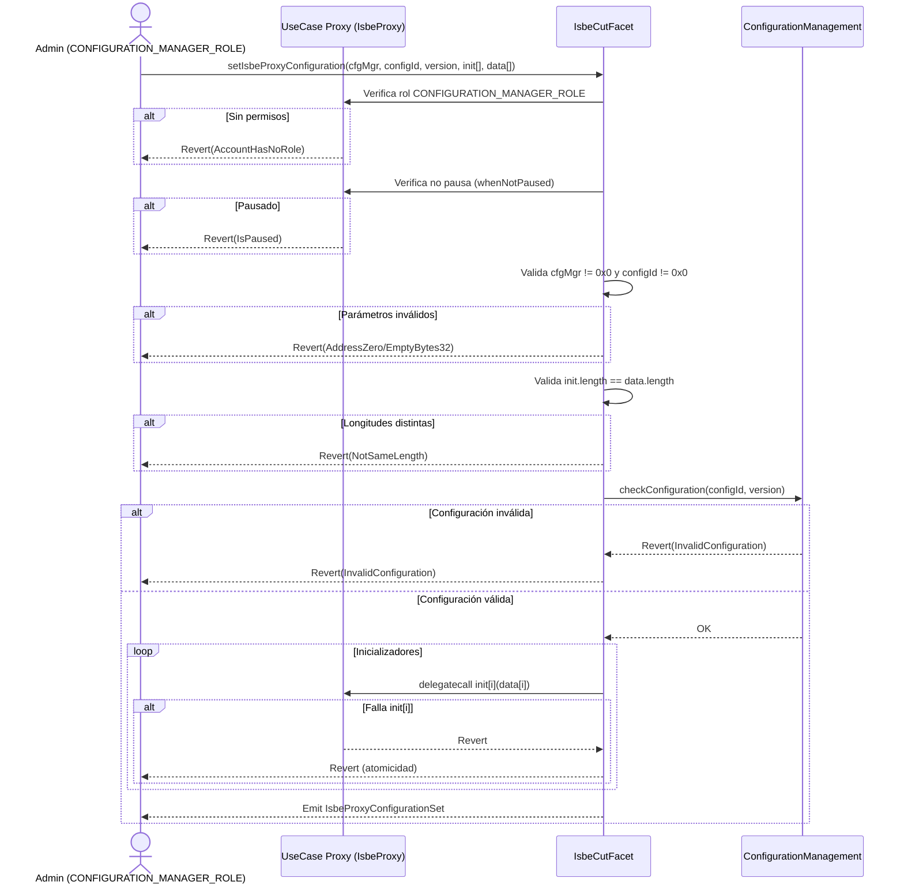

# ISBE-ART-01040 — Módulo Factory: gestión de configuraciones y despliegue de proxies (contracts/factory)

---

## 1. Identificación del Artefacto

| Campo                       | Valor                                                                                                                                                                             |
| --------------------------- | --------------------------------------------------------------------------------------------------------------------------------------------------------------------------------- |
| **Nombre del artefacto**    | ISBE-ART-01040 — Módulo Factory: gestión de configuraciones y despliegue de proxies (contracts/factory)                                                                           |
| **Origen**                  | Documento derivado del repositorio oficial de Smart Contracts, alineado con la documentación de proxies (ISBE‑ART‑01000) para asegurar consistencia en el apartado de desarrollo. |
| **Estado**                  | Validado                                                                                                                                                                          |
| **Versión del documento**   | 0.2.2                                                                                                                                                                             |
| **Fecha**                   | 2025-09-09                                                                                                                                                                        |
| **Repositorio (congelado)** | https://github.com/alastria/isbe-contracts                                                                                                                                        |
| **Commit**                  | `2c3a2accef78bbf723c970c8139df34a4d3137c8`                                                                                                                                        |

---

## 2. Propósito del Artefacto

### Objetivo funcional

Definir y estandarizar el despliegue de proxies (EIP‑2535 e ISBE Proxy) y la publicación/gestión de configuraciones versionadas de facetas a través de un gestor centralizado. El módulo Factory proporciona los contratos e interfaces para:

- Publicar configuraciones (catálogo de facetas y selectores) con control de versiones.
- Desplegar proxies de forma atómica y reproducible, vinculados a una configuración concreta.
- Auditar y gobernar cambios de configuración y despliegues.

### Beneficio para ISBE

- Despliegue seguro y repetible de proxies.
- Cohesión entre instancias al externalizar el enrutamiento en un gestor de configuraciones.
- Trazabilidad y auditoría completas de configuraciones y despliegues (cumplimiento eIDAS2, NIS2 y RGPD).
- Rollback simple mediante versiones.

### Stakeholders clave

- Equipos de desarrollo y operaciones.
- Órganos de gobernanza técnica.
- Auditores de seguridad y cumplimiento.
- Entidades emisoras/operadoras de servicios.
- Organismos reguladores.

---

## 3. Alcance y Ciclo de Vida

### Fases cubiertas

✅ Definición: patrón Factory y gestión centralizada de configuraciones.  
✅ Desarrollo: contratos, interfaces y flujos de despliegue.  
🟡 Validación: pruebas unitarias/integración (confirmación por commit).  
🟡 Mantenimiento: evolución alineada con estándares y normativas.

### Inicio de fases y paquetes relacionados

- PT1/T1.4 (Desarrollo de artefactos).
- Módulo base: `contracts/factory`.

### Dependencias

- Proxies EIP‑2535 e ISBE Proxy.
- Componentes de gobernanza (roles/propiedad).
- Estándares: ERC‑165, EIP‑2535.

### Mantenimiento

- Revisión anual o por cambios regulatorios (NIS2, eIDAS2).
- Versionado y políticas de publicación/deprecación de configuraciones.

---

## 4. Definición del Artefacto

### 4.1. Artefacto de arquitectura de referencia

El módulo Factory se estructura en dos pilares:

- Gestor centralizado de configuraciones (Configuration Management): registra versiones de facetas y selectores por `configurationId` y `version`.
- Fábricas de despliegue (ProxyFactory y derivadas): despliegan proxies con parámetros validados, enlazándolos a una configuración concreta.

Ventaja clave: coherencia por versión y trazabilidad centralizada de cambios y despliegues.

### 4.2. Trazabilidad

- ENT_1 – Evaluación de necesidades (trazabilidad, gobernanza, cumplimiento).
- ENT_2 – Requisitos 2.6 (actualización modular) y 6.1 (control de cambios).
- Arquitectura de Referencia ISBE: epígrafes de proxies y requisitos regulatorios.

Se recomienda trazabilidad fina por función/rol/evento en futuras iteraciones.

### 4.3. Descripción funcional detallada

#### Funcionalidades clave

- Publicación/actualización de configuraciones versionadas.
- Resolución externa de facetas para ISBE Proxy.
- Despliegue atómico de proxies con inicializadores encadenados.
- Auditoría completa mediante eventos de publicación y despliegue.
- Introspección de interfaces (cuando aplique).

#### Glosario

- ConfigurationId: identificador lógico del conjunto de facetas.
- Version: número de versión activa del conjunto (0 para “última” en consultas).
- BusinessId: identificador lógico de una lógica de negocio/faceta versionada.
- BusinessData: tupla `{businessId, version}` que compone una configuración.
- Facet: contrato con funciones y selectores concretos.
- Selector: bytes4 de la firma de función.

### 4.4. Diferencias y ventajas frente a despliegue manual

| Aspecto         | Manual              | Factory ISBE                     |
| --------------- | ------------------- | -------------------------------- |
| Despliegue      | Propenso a errores  | Estandarizado y gobernado        |
| Configuraciones | Dispersas o locales | Centralizadas y versionadas      |
| Rollback        | Costoso             | Cambio de versión                |
| Auditoría       | Limitada            | Eventos y catálogo on-chain      |
| Compliance      | Heterogéneo         | Diseñado para eIDAS2, NIS2, RGPD |

---

## 5. Desarrollo del Artefacto

### 5.1. Componentes del artefacto

- Gestión de configuraciones:
    - `IConfigurationManagement`
    - `ConfigurationManagement`
    - `ConfigurationManagementInternal` / `ConfigurationManagementFacet` (si aplica al patrón diamond)
- Fábricas de despliegue:
    - `IProxyFactory`
    - `ProxyFactory`
    - `ProxyFactoryInternal` / `ProxyFactoryFacet` (si aplica)
- Fábricas de lógicas de negocio:
    - `IBusinessLogicFactory`
    - `BusinessLogicFactory`
    - `BusinessLogicFactoryInternal` / `BusinessLogicFactoryFacet`
- Pausa global de ISBE:
    - `IGlobalIsbePause`
    - `GlobalIsbePause`
    - `GlobalIsbePauseInternal` / `GlobalIsbePauseFacet`
- Otros:
    - `IIsbeFactory` (interfaz agregada a nivel de módulo para gobernanza)

### 5.2. Componentes del artefacto y su interacción

El módulo Factory coordina la publicación de configuraciones y el despliegue de proxies:

1. Configuration Management

- Registra configuraciones como listas de `BusinessData { businessId, version }`.
- Ofrece consultas de introspección tipo Loupe por configuración/version (facets, selectors, supportsInterface).
- Permite pedir “última versión” con `_version = 0` en consultas/validaciones.
- Emite eventos de configuración (ver 5.8.1).

Reglas de validación destacadas en setConfiguration:

- No se admiten BusinessData con `businessId=0x0` (EmptyBytes32).
- No se admiten listas vacías de BusinessData (NotEmptyBusinessIds).
- No se admiten `businessId` duplicados (DuplicatedBusinessId).
- No se admiten businessIds de facetas “core” del sistema (p. ej. AccessControl, Pause, DiamondCut, DiamondLoupe) — FacetNotPermitted.
- Los `businessId` deben estar registrados previamente (CurrentIdNotRegistered).

2. Proxy Factory

- Despliega instancias de ISBE Proxy (Diamond adaptación) referenciando `(configurationId, version)` del gestor.
- Inicializa:
    - RBAC del proxy, añadiendo por defecto:
        - `DEFAULT_ADMIN_ROLE` para `msg.sender` y el proxy de gobernanza.
        - `ISBE_ROLE` para el proxy de gobernanza (no revocable).
        - `CONFIGURATION_MANAGER_ROLE` para el proxy de gobernanza.
    - Estado de pausa inicial según `_initPause`.
    - Inicializadores encadenados según `_initBusinessIds`/`_initData`, resolviendo direcciones vía configuración.
- Emite `UseCaseDeployed(configurationId, version, rbacs, proxy)`.

3. Business Logic Factory

- Despliega contratos de lógica de negocio (implementaciones) versionadas por `businessId`.
- Mantiene el registro de versiones y expone consultas por id/versión.

4. Global ISBE Pause

- Permite pausar/despausar proxies desplegados centralmente, con control de rol específico.
- Emite `IsbePaused(proxy, account)` / `IsbeUnpaused(proxy, account)`.

Flujo de alto nivel:

- setConfiguration → deployUseCase → (Opcional) inicializadores de negocio → Operación.

### 5.3. Frameworks, librerías o tecnologías acordadas

- Hyperledger Besu (EVM compatible).
- Solidity.
- OpenZeppelin (roles, pausas, utilidades).
- Hardhat (compilación, test, cobertura).
- ethers.js v6 (integración off‑chain).

### 5.4. Buenas prácticas aplicables

- Idempotencia en inicializadores.
- Validación estricta de inputs (direcciones, selectores, versiones).
- Registros/eventos exhaustivos para auditoría.
- Separación de roles (publicación, despliegue, operación).
- Minimizar privilegios y rotación de claves.
- Tests de regresión antes de publicar una versión.

### 5.5. Criterios de validación del desarrollo

| Test / Escenario                                 | Descripción                                                                             | Resultado esperado / Verificación                                                                         |
| ------------------------------------------------ | --------------------------------------------------------------------------------------- | --------------------------------------------------------------------------------------------------------- |
| Alta/actualización de configuración              | `setConfiguration(configurationId, BusinessData[])`                                     | Evento de configuración emitido; consultas `getConfiguration/facets/facetAddress` coherentes              |
| Consulta de configuración “última versión”       | Consultar con `_version = 0`                                                            | Devuelve la última versión publicada                                                                      |
| Configuración inexistente                        | Consultar/validar configuración no existente                                            | Reversión con `InvalidConfiguration`                                                                      |
| Despliegue de caso de uso                        | `deployUseCase(configurationId, version, rbacs, initPause, initBusinessIds, initData)`  | Evento `UseCaseDeployed`; proxy operativo, RBAC inicializado y pausa según bandera                        |
| Inicializadores encadenados                      | Ejecutar múltiples `init[i]/data[i]`                                                    | Todas las llamadas se ejecutan en orden; reversión si algún init falla (atomicidad)                       |
| Resolución de businessIds en inicialización      | `_initBusinessIds` deben existir en la configuración/version                            | Reversión con `FacetNotFound`/`CurrentIdNotRegistered` según corresponda                                  |
| Roles no inicializables por usuario              | Incluir `DEFAULT_ADMIN_ROLE`, `ISBE_ROLE` o `CONFIGURATION_MANAGER_ROLE` en `rbacs`     | Reversión con `ForbiddenRole(role)`                                                                       |
| Duplicidad de businessIds                        | Proveer ids duplicados                                                                  | Reversión con `DuplicatedBusinessId`                                                                      |
| Consulta de proxies por configuración            | `getDeployedProxiesByConfiguration(configurationId, version)`                           | Devuelve listado de direcciones coherente                                                                 |
| Consulta de configuración por proxy              | `getConfigurationByProxy(proxy)`                                                        | Devuelve `(configurationId, version)` correctos                                                           |
| Pausa global                                     | `pauseIsbe(proxy)` y `unpauseIsbe(proxy)`                                               | Eventos `IsbePaused/IsbeUnpaused`; error `InvalidProxy` o `AddressZero` si no corresponde                 |
| Seguridad de acceso                              | Operaciones restringidas a roles correspondientes                                       | Reversión por falta de permisos                                                                           |
| Rollback funcional                               | Desplegar nueva instancia con versión previa y operar                                   | Instancia operativa con la versión objetivo; trazabilidad de cambios en eventos                           |
| Cambio de configuración del proxy de caso de uso | `setIsbeProxyConfiguration(manager, configurationId, version, initAddresses, initData)` | Evento `IsbeProxyConfigurationSet`; verifica roles y validaciones; revierte en pausa o entradas inválidas |

### 5.6. Alineación con requisitos legales

- NIS2: Evidencia de cambios y respuesta a incidentes vía eventos y pausas.
- RGPD: Deprecación/retirada de configuraciones no conformes; control de inicializadores que procesen datos.
- eIDAS2: Trazabilidad de configuraciones como parte de la cadena de confianza.

### 5.7. Dependencias técnicas o de infraestructura

- OpenZeppelin (AccessControl, Pausable, Utils).
- Nodos Besu.
- Contratos base de proxies (EIP‑2535 / ISBE Proxy).

### 5.8. Descripción técnica de las funciones

#### 5.8.1. Configuration Management — funciones externas principales

| Firma                                                                                         | Tipo      | Descripción                                                                             |
| --------------------------------------------------------------------------------------------- | --------- | --------------------------------------------------------------------------------------- |
| `setConfiguration(bytes32 configurationId, BusinessData[] businessIds)`                       | Escritura | Crea o actualiza una configuración versionada; emite evento de configuración            |
| `getConfiguration(bytes32 configurationId, uint256 version) → BusinessData[]`                 | Lectura   | Devuelve la lista de `{businessId, version}`; con `version=0` retorna la última versión |
| `checkConfiguration(bytes32 configurationId, uint256 version)`                                | Lectura   | Verifica existencia (revierte con `InvalidConfiguration` si no existe)                  |
| `facets(bytes32 configurationId, uint256 version) → IDiamondLoupe.Facet[]`                    | Lectura   | Devuelve facetas y selectores de la configuración                                       |
| `facetFunctionSelectors(bytes32 configurationId, uint256 version, address facet) → bytes4[]`  | Lectura   | Devuelve los selectores de una faceta dada                                              |
| `facetAddresses(bytes32 configurationId, uint256 version) → address[]`                        | Lectura   | Devuelve las direcciones de facetas únicas                                              |
| `facetAddress(bytes32 configurationId, uint256 version, bytes4 selector) → address`           | Lectura   | Resuelve la faceta que atiende un selector                                              |
| `facetSupportsInterface(bytes32 configurationId, uint256 version, bytes4 interfaceId) → bool` | Lectura   | Indica si la configuración soporta una interfaz EIP‑165                                 |

- Eventos:
    - `ConfigurationSet(bytes32 configurationId, BusinessData[] businessData, uint256 version)` (interfaz agregada)
    - `UseCaseConfigured(bytes32 configurationId, BusinessData[] businessData, uint256 version)` (faceta de configuración)
- Errores:
    - `InvalidConfiguration(bytes32 configurationId, uint256 version)`
    - `EmptyBytes32()`
    - `NotEmptyBusinessIds()`
    - `FacetNotPermitted(bytes32 businessId)`
    - `CurrentIdNotRegistered(bytes32 businessId)`
    - `DuplicatedBusinessId(bytes32 businessId)`

#### 5.8.2. Proxy Factory — funciones externas principales

| Firma                                                                                                                                               | Tipo      | Descripción                                                                                                                                      |
| --------------------------------------------------------------------------------------------------------------------------------------------------- | --------- | ------------------------------------------------------------------------------------------------------------------------------------------------ |
| `deployUseCase(bytes32 configurationId, uint256 version, IAccessControl.Rbac[] rbacs, bool initPause, bytes32[] initBusinessIds, bytes[] initData)` | Escritura | Despliega un proxy de caso de uso enlazado a una configuración; inicializa RBAC por defecto, pausa inicial y ejecuta inicializadores encadenados |
| `getDeployedProxiesByConfiguration(bytes32 configurationId, uint256 version) → address[]`                                                           | Lectura   | Devuelve los proxies desplegados para una configuración/version                                                                                  |
| `getConfigurationByProxy(address proxy) → (bytes32 configurationId, uint256 version)`                                                               | Lectura   | Devuelve la configuración con la que se desplegó un proxy                                                                                        |

- Evento: `UseCaseDeployed(bytes32 configurationId, uint256 version, IAccessControl.Rbac[] rbacs, address proxy)`
- Errores: `ForbiddenRole(bytes32 role)`, `FacetNotPermitted(bytes32 businessId)`, `DuplicatedBusinessId(bytes32 businessId)`, `CurrentIdNotRegistered(bytes32 businessId)`, `FacetNotFound(bytes32 businessId)`, `InvalidConfiguration(bytes32 configurationId, uint256 version)`

Notas de inicialización RBAC en despliegue:

- El usuario no puede inicializar `DEFAULT_ADMIN_ROLE`, `ISBE_ROLE` ni `CONFIGURATION_MANAGER_ROLE` vía `rbacs` (revierte con `ForbiddenRole`).
- El despliegue añade por defecto:
    - `DEFAULT_ADMIN_ROLE` a `msg.sender` y al proxy de gobernanza.
    - `ISBE_ROLE` al proxy de gobernanza (no revocable por otros roles).
    - `CONFIGURATION_MANAGER_ROLE` al proxy de gobernanza.

#### 5.8.3. Business Logic Factory — funciones externas principales

| Firma                                                                    | Tipo      | Descripción                                                                                     |
| ------------------------------------------------------------------------ | --------- | ----------------------------------------------------------------------------------------------- |
| `deploy(bytes32 businessId, bytes bytecode)`                             | Escritura | Despliega una implementación de lógica de negocio y versiona por `businessId`; emite `Deployed` |
| `getBusinessLogicAddress(bytes32 businessId, uint256 version) → address` | Lectura   | Dirección de la implementación para una versión concreta                                        |
| `getBusinessLogics() → bytes32[]`                                        | Lectura   | Lista de todos los `businessId` registrados                                                     |
| `getBusinessLogicVersions(bytes32 businessId) → address[]`               | Lectura   | Todas las direcciones/versiones desplegadas para un `businessId`                                |

- Evento: `Deployed(bytes32 businessId, address businessAddress, uint256 version)`

#### 5.8.4. Global ISBE Pause — funciones externas principales

| Firma                               | Tipo      | Descripción                                 |
| ----------------------------------- | --------- | ------------------------------------------- |
| `pauseIsbe(address proxyAddress)`   | Escritura | Pausa un proxy de caso de uso autorizado    |
| `unpauseIsbe(address proxyAddress)` | Escritura | Despausa un proxy de caso de uso autorizado |

- Eventos: `IsbePaused(address proxy, address account)`, `IsbeUnpaused(address proxy, address account)`
- Errores: `InvalidProxy(address proxyAddress)`, `AddressZero()`

#### 5.8.5. Cambio de configuración on-chain (IsbeCutFacet en proxys de caso de uso)

- Propósito: Permitir que un proxy de caso de uso cambie su configuración activa a otro `(configurationId, version)` gestionado por el Configuration Management, aplicando inicializadores encadenados si procede.

- Firma principal:
    - `setIsbeProxyConfiguration(address configurationManagement, bytes32 configurationId, uint256 version, address[] initAddresses, bytes[] initData)` — Escritura

- Comportamiento:
    - Requiere permisos: `onlyRole(CONFIGURATION_MANAGER_ROLE)` en el proxy de caso de uso.
    - Valida que `configurationManagement != address(0)` y que `configurationId != 0x0`.
    - Valida coherencia de listas de inicialización: `initAddresses.length == initData.length`.
    - Verifica que la configuración existe en `configurationManagement` para la `version` indicada (permite `version=0` como alias de “última” si está implementado).
    - Aplica inicializadores encadenados: por cada `initAddresses[i]` ejecuta la llamada correspondiente con `initData[i]`, garantizando atomicidad (revierte si alguna falla).
    - Emite `IsbeProxyConfigurationSet(configurationManagement, configurationId, version, initAddresses, initData)` al finalizar correctamente.

- Errores típicos:
    - `AccountHasNoRole(address, bytes32)` cuando el llamador no tiene `CONFIGURATION_MANAGER_ROLE`.
    - `AddressZero()` si `configurationManagement` es la cero.
    - `EmptyBytes32()` si `configurationId` es cero.
    - `NotSameLength(uint256 expected, uint256 actual)` cuando difieren las longitudes de `initAddresses` y `initData`.
    - `InvalidConfiguration(bytes32 configurationId, uint256 version)` cuando no existe la configuración/versión.
    - `IsPaused()` si el proxy de caso de uso está pausado.

Diagrama de secuencia — setIsbeProxyConfiguration

### 5.9. Descripción técnica de los datos

#### Estructuras de datos principales

| Struct         | Campos                                                | Descripción                                           |
| -------------- | ----------------------------------------------------- | ----------------------------------------------------- |
| `BusinessData` | `bytes32 businessId` · `uint256 version`              | Par (lógica de negocio, versión) de una configuración |
| `Facet`        | `address facetAddress` · `bytes4[] functionSelectors` | Faceta e introspección de sus selectores              |

#### Variables de almacenamiento críticas

| Variable / Slot                            | Tipo      | Descripción                                                        |
| ------------------------------------------ | --------- | ------------------------------------------------------------------ |
| `_CONFIGURATION_MANAGEMENT_STORAGE_SLOT`\* | `bytes32` | Slot (si se usa almacenamiento dedicado) para catálogo y metadatos |
| (Registro de proxies por configuración)    | mapping   | `configurationId,version → address[] proxies`                      |

(\*) Detalles concretos pueden variar según implementación; mantener consistencia y no colisión con otros módulos.

### 5.10. Roles

Gobernanza:

- `GOVERNANCE_MANAGER_ROLE`: gestionar cortes del diamond de gobernanza.
- `BUSINESS_LOGIC_DEPLOYER_ROLE`: desplegar lógicas de negocio.
- `GOVERNANCE_CONFIGURATION_MANAGER_ROLE`: crear/actualizar configuraciones oficiales.
- `ISBE_PAUSER_ROLE`: pausar/despausar proxies a nivel global.
- `PROXY_DEPLOYER_ROLE`: desplegar nuevos proxies de casos de uso.

Comunes:

- `DEFAULT_ADMIN_ROLE`: administración de roles.
- `PAUSER_ROLE`: pausar operaciones críticas.

Casos de uso:

- `CONFIGURATION_MANAGER_ROLE`: gestionar configuración (id/versión) del proxy.
- `ISBE_ROLE`: rol del proxy de gobernanza dentro de cada caso de uso (no revocable por terceros).

Notas:

- Durante `deployUseCase`, `DEFAULT_ADMIN_ROLE` y `ISBE_ROLE` se asignan automáticamente.
- `CONFIGURATION_MANAGER_ROLE` se asigna al proxy de gobernanza en cada caso de uso.
- Intentar inicializar cualquiera de estos tres roles vía `rbacs` revierte con `ForbiddenRole`.

### 5.11. Puntos "por completar"

- Política de gas y límites en inicializadores encadenados (`initBusinessIds`/`initData`).
- Layout de almacenamiento y garantías de no colisión entre módulos/facetas.
- Políticas de publicación/deprecación organizativa (ciclo de vida de configuraciones) a nivel de gobernanza.

---

## 6. Reglas de Control y Actualización

| Tipo de cambio  | Versionado | Flujo de aprobación | Documentación requerida |
| --------------- | ---------- | ------------------- | ----------------------- |
| Evolutivo menor | X.Y+0.1    | Revisión técnica    | Notas de versión        |
| Evolutivo mayor | X+1.0      | Gobierno técnico    | Informe de impacto      |
| Hotfix          | X.Y.Z      | Aprobación urgente  | Evidencia de tests      |

- Versionado: SemVer + tags en Git.
- Aprobación: Validación técnica y de gobernanza.
- Revisión: Al menos anual o ante cambios regulatorios.

---

## Anexos

### Anexo 1 — Integración con ethers v6 (ejemplos)

- Alta/actualización de configuración (`setConfiguration`)
- Despliegue de caso de uso (`deployUseCase`)
- Cambio de configuración del proxy de caso de uso (`setIsbeProxyConfiguration`)
- Subscripción a eventos (`ConfigurationSet`/`UseCaseConfigured`, `UseCaseDeployed`, `IsbePaused`/`IsbeUnpaused`, `Deployed`, `IsbeProxyConfigurationSet`)

### Anexo 2 — Resumen mínimo de firmas, eventos y errores

- Firmas (principales):
    - `setConfiguration(configurationId, BusinessData[])`
    - `getConfiguration(configurationId, version)`
    - `deployUseCase(configurationId, version, rbacs, initPause, initBusinessIds, initData)`
    - `getDeployedProxiesByConfiguration(configurationId, version)`
    - `getConfigurationByProxy(proxy)`
    - `setIsbeProxyConfiguration(configurationManagement, configurationId, version, initAddresses, initData)`
    - `deploy(businessId, bytecode)`
    - `getBusinessLogicAddress(businessId, version)`
    - `pauseIsbe(proxy)` / `unpauseIsbe(proxy)`
- Eventos:
    - `ConfigurationSet(configurationId, businessData, version)` / `UseCaseConfigured(configurationId, businessData, version)`
    - `UseCaseDeployed(configurationId, version, rbacs, proxy)`
    - `IsbeProxyConfigurationSet(configurationManagement, configurationId, version, initAddresses, initData)`
    - `Deployed(businessId, businessAddress, version)` (Business Logic Factory)
    - `IsbePaused(proxy, account)` / `IsbeUnpaused(proxy, account)` (Global Pause)
- Errores destacados:
    - `InvalidConfiguration(configurationId, version)`
    - `EmptyBytes32()`
    - `NotEmptyBusinessIds()`
    - `FacetNotPermitted(businessId)`
    - `DuplicatedBusinessId(businessId)`
    - `CurrentIdNotRegistered(businessId)`
    - `FacetNotFound(businessId)`
    - `InvalidProxy(proxyAddress)`
    - `AddressZero()`
    - `NotSameLength(expected, actual)`
    - `IsPaused()`
    - `AccountHasNoRole(account, role)`

### Anexo 3 — Referencias

- EIP‑2535 (Diamond)
- ERC‑165 (Introspección)
- Documentación de OpenZeppelin
- Documentación de proxies ISBE (ISBE‑ART‑01000)

---
