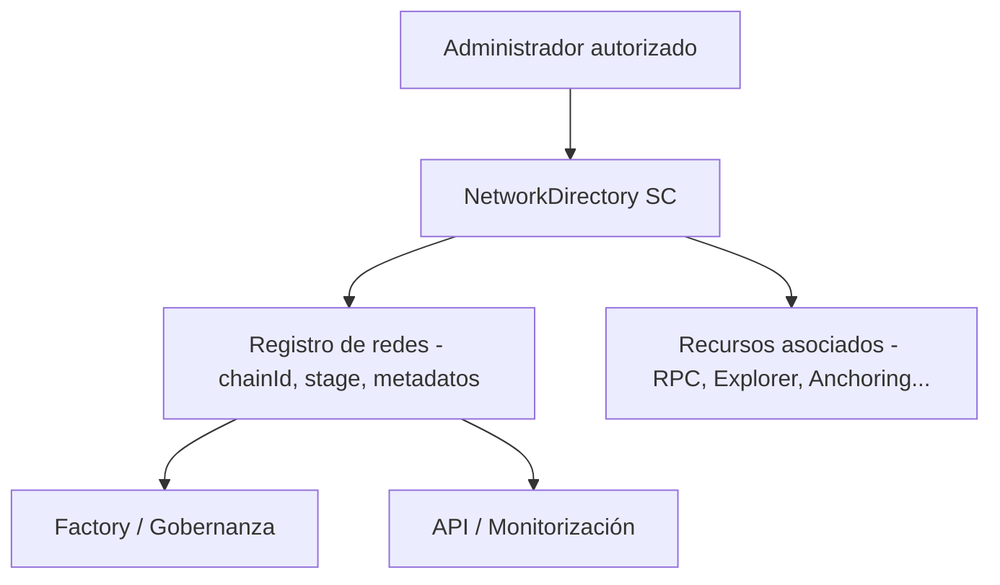

# ISBE-ART-01050 — Directorio de Redes (Network Resources)

## **1. Identificación del Artefacto**

| Campo                     | Valor                                                                                                  |
| ------------------------- | ------------------------------------------------------------------------------------------------------ |
| **Nombre del artefacto**  | ISBE-ART-01050 — _Smart Contract Directorio de Redes” (NetworkDirectory)_                              |
| **Origen**                | Derivado del documento técnico “PDR — Directorio de Redes” y de la Arquitectura de Referencia ISBE.    |
| **Estado**                | Validado                                                                                               |
| **Versión del documento** | 1.0                                                                                                    |
| **Fecha**                 | 2025-11-25                                                                                             |
| **Repositorio**           | Repositorio oficial ISBE Smart Contracts                                                               |
| **Commit**                | Rama feat/networkGovernance — integración de NetworkDirectory 7beeadb6444611232e29136b83acec2d6b40911b |

---

## **2. Propósito del Artefacto**

- **Objetivo funcional:**  
  Este artefacto define el _smart contract_ que actúa como **registro único y auditable de redes Blockchain** dentro del ecosistema ISBE.  
  Permite mantener información estructurada sobre las redes participantes (Bare, Casos de Uso), sus atributos técnicos, entornos (DEV, PRE, PROD) y recursos asociados.  
  Garantiza un control trazable y verificable de la configuración de red, alineado con las políticas de gobernanza de ISBE.

    El módulo de **Anchoring** utiliza este directorio como catálogo de redes de referencia para anclar bloques y estados entre cadenas certificadas.  
     De este modo, las pruebas de estado cross‑chain se apoyan en la información canonizada del NetworkDirectory (chainIds, entornos y metadatos técnicos).

- **Beneficio para ISBE:**
    - Centraliza la información de todas las redes certificadas.
    - Facilita la interoperabilidad y la gestión automatizada de entornos.
    - Refuerza la transparencia institucional y la auditabilidad del sistema.

- **Stakeholders clave:**  
  Squads de Smart Contracts, Arquitectura Blockchain, DevOps, QA, Gobernanza Técnica y auditores institucionales.

---

## **3. Alcance y Ciclo de Vida**

- **Fases cubiertas:**
    - **Definición:** Se describe la estructura del contrato, su modelo de datos y operaciones CRUD.
    - **Desarrollo:** Implementación prevista en Solidity ^0.8.x sobre Hyperledger Besu (QBFT).
    - **Liberación:** Planificada en la release técnica 2025-Q4 junto a los contratos base de gobernanza.

- **Dependencias:**
    - ISBE-ART-01000 — Proxy EIP‑2535 / ISBE Proxy.
    - ISBE-ART-01040 — Módulo Factory.
    - ISBE-ART-02070 — API de Acceso a Smart Contracts.

- **Mantenimiento:**  
  Actualizable mediante patrón _Diamond Proxy_. Versionado semántico y validación trimestral por el Comité Técnico ISBE.

---

## **4. Definición del Artefacto**

### **4.1. Artefacto de arquitectura de referencia**

Forma parte de la **capa de servicios básicos de red** definida en la Arquitectura de Referencia ISBE.  
Este contrato almacena la relación de redes certificadas y sirve como punto de referencia para módulos dependientes (Factory, API, Monitorización).

### **4.2. Trazabilidad**

- **Requisitos funcionales:** operaciones CRUD completas sobre redes y recursos.
- **Requisitos no funcionales:** eficiencia de gas, compatibilidad EVM, trazabilidad y seguridad.
- **Vinculación:** funcionalidad “Gestión on-chain de redes” priorizada en la Evaluación de Necesidades y formalizada en los Requerimientos Técnicos.

### **4.3. Descripción funcional detallada**

El contrato implementa operaciones para registrar, consultar y administrar redes dentro de ISBE.

**Funciones principales**

1. `createNetwork()` — Alta de una nueva red con `chainId`, metadatos técnicos (nombre, símbolo, algoritmo, stage) y recursos iniciales.  
   Valida unicidad de `chainId`, consistencia de datos y que no existan recursos duplicados antes de persistirlos en el directorio.

2. `updateNetwork()` — Actualización de atributos técnicos de una red existente (nombre, símbolo, algoritmo, stage).  
   No toca los recursos asociados; conserva el `chainId` como identificador inmutable y aplica validaciones de negocio previas al cambio.

3. `deleteNetwork()` — Eliminación lógica y en cascada de una red y todos sus recursos asociados.  
   Libera el `chainId` del directorio, actualiza contadores internos y garantiza que la red deje de estar disponible para consultas.

4. `getNetwork()` — Consulta detallada de una red concreta a partir de su `chainId`.  
   Devuelve la estructura completa `NetworkData`, incluyendo metadatos y el array de `resources` configurados.

5. `getAllNetworks()` — Listado completo de todas las redes registradas en el directorio.  
   Está orientado a escenarios de administración y auditoría, pudiendo ser costoso en gas para catálogos grandes.

6. `setResource()` / `deleteResource()` — Gestión de recursos asociados a una red (`RPC`, `EXPLORER`, `ANCHORING`, etc.).  
   Permiten crear/actualizar endpoints individuales por `resourceId` o eliminarlos, manteniendo la consistencia del catálogo de recursos por red.

7. `getNetworksByAlgorithm()` — Filtrado de redes según el algoritmo criptográfico (`SECP256K1`, `SECP256R1`).  
   Facilita localizar rápidamente las redes compatibles con un determinado perfil criptográfico o política de seguridad.

8. `getNetworksPaginated()` / `getNetworksCount()` — Paginación y conteo del Directorio.  
   Soportan exploración eficiente del catálogo en entornos con muchas redes, devolviendo metadatos de paginado (total, `howMany`, `prev`, `next`).

9. `getResourceKeys()` / `getResourceKeysPaginated()` / `getResourceCount()` — Listado de claves de recursos (`resourceId`) y métricas por red.  
   Permiten obtener el conjunto de recursos configurados de forma completa o paginada, junto con el número total de recursos por `chainId`.

A continuación se muestran fragmentos representativos de la API externa del `NetworkDirectory`.  
El objetivo no es documentar todos los detalles de implementación, sino ilustrar cómo se aplican las validaciones, el control de acceso y la pausa sobre las operaciones principales.  
Las funciones operan sobre las estructuras `NetworkData` y `UpdateNetworkData` descritas en el modelo de datos on‑chain, delegando la lógica interna en `NetworkDirectoryInternal`.

```bash
function createNetwork(
  NetworkData calldata network
)
  external
  override
  validateCreateNetworkData(network)
  whenNotPaused
  onlyRole(_NETWORK_DIRECTORY_ROLE)
  onlyNonExistentNetwork(network.chainId)
{
  _createNetwork(network);
  emit NetworkCreated(network);
}
```

Esta función expone el alta de una nueva red en el Directorio, recibiendo todos los metadatos y recursos iniciales en una única estructura `NetworkData`.  
Las validaciones de entrada (datos obligatorios, algoritmo y stage válidos, ausencia de recursos duplicados) se aplican antes de tocar el estado, y solo una cuenta con rol `_NETWORK_DIRECTORY_ROLE` puede ejecutarla mientras el módulo no esté pausado.

```bash
function updateNetwork(
  UpdateNetworkData calldata network
)
  external
  override
  validateUpdateNetworkData(network)
  whenNotPaused
  onlyRole(_NETWORK_DIRECTORY_ROLE)
  onlyExistentNetwork(network.chainId)
{
  _updateNetwork(network);
  emit NetworkUpdated(network);
}
```

En este caso se permite la actualización de los metadatos de una red ya existente sin afectar a los recursos asociados, que se gestionan por separado.  
La función requiere que el `chainId` exista previamente, mantiene dicho identificador como clave inmutable del registro y garantiza que solo se apliquen cambios coherentes bajo control de RBAC y pausa.



Este diagrama resume el flujo lógico entre el administrador autorizado y el contrato `NetworkDirectory`.  
Las operaciones de alta/actualización impactan en el registro on‑chain de redes y recursos, que es consumido posteriormente por otros componentes de gobernanza, despliegue y monitorización del ecosistema ISBE.

Cada operación emite un evento (`NetworkCreated`, `NetworkUpdated`, `NetworkDeleted`, `ResourceSet`, `ResourceDeleted`) que garantiza la trazabilidad y permite sincronización off‑chain.

**Modelo de datos on-chain**

```text
enum Stage { NONE, DEV, PRE, PROD }

enum Algorithm { NONE, SECP256K1, SECP256R1 }

struct Resource {
  bytes32 resourceId;
  string  resource;
}

struct NetworkData {
  uint256   chainId;
  bytes32   name;
  bytes32   symbol;
  Algorithm algorithm;
  Stage     stage;
  Resource[] resources;
}

struct UpdateNetworkData {
  uint256   chainId;
  bytes32   name;
  bytes32   symbol;
  Algorithm algorithm;
  Stage     stage;
}

struct NetworkStorageData {
  bytes32   name;
  bytes32   symbol;
  Algorithm algorithm;
  Stage     stage;
}
```

### **4.4. Modelos o diagramas específicos**

**Flujo lógico resumido**

```
[Administrador autorizado]
        |
        |-- create/update --> [NetworkDirectory SC] -- emit --> [Eventos on-chain]
                                                              |
                                                              --> [API / Monitorización]
```

**Esquema funcional**: registro → validación → evento → consulta pública.

### **4.5. Reglas de negocio asociadas**

- `chainId` único y mayor que cero.
- Campos `name`, `algorithm`, `symbol` obligatorios.
- Solo roles autorizados (`NETWORK_DIRECTORY_ROLE`) pueden modificar registros; las lecturas son públicas.
- Gestión de recursos por upsert: `setResource` crea o actualiza; `deleteResource` elimina.
- Todas las operaciones de mutación generan eventos on-chain para auditoría.

### **4.6. Interfaces y puntos de integración**

- **Interfaz Solidity / ABI:** expone funciones públicas y eventos.
- **API REST ISBE:** traduce operaciones CRUD on-chain para consumo externo.
- **Integración con Factory:** verifica redes certificadas antes de despliegues.
- **Indexador (The Graph):** planificado para consultas avanzadas y trazabilidad extendida.
- **Integración IPFS:** almacenamiento de documentación técnica y metadatos.

### **4.7. Normativas y requisitos regulatorios**

- Cumple RGPD (no se almacenan datos personales).
- Cumple eIDAS 2.0 y NIS2 mediante gestión de identidades verificadas y registro de eventos.
- Licencia de software Apache 2.0 conforme a la política de código abierto de ISBE.

### **4.8. Criterios de calidad específicos**

- **Eficiencia de gas:** uso optimizado de `bytes32`.
- **Resiliencia:** validaciones exhaustivas de entrada.
- **Auditabilidad:** trazabilidad completa de eventos.
- **Compatibilidad:** ejecución garantizada en redes EVM.
- **Pruebas:** cobertura ≥ 90 % prevista en fase de desarrollo.

---

## **5. Desarrollo del Artefacto**

### 5.1. Componentes del artefacto

- Contratos Solidity (carpeta `contracts/client/networkdirectory/`):
    - `INetworkDirectory.sol` — Interfaz pública, enums/structs, eventos y errores tipados.
    - `NetworkDirectoryInternal.sol` — Lógica interna y almacenamiento (patrón Diamond Storage) con validaciones y paginación.
    - `NetworkDirectory.sol` — Capa externa con RBAC y pausa; aplica validaciones y emite eventos.
    - `NetworkDirectoryFacet.sol` — Facet EIP‑2535 con introspección (interfaces/selectors) y utilidades de test.
- Constantes e integración Diamond:
    - `contracts/constants/storagePositions.sol` — Slot: `_NETWORK_DIRECTORY_STORAGE_POSITION`.
    - `contracts/constants/roles.sol` — Rol: `_NETWORK_DIRECTORY_ROLE`.
    - `contracts/constants/resolverKeys.sol` — Resolver key: `_NETWORK_DIRECTORY_RESOLVER_KEY`.
- Despliegue y wiring de gobernanza:
    - `tasks/deployment/deployers/CleanGovernanceDeployer.ts` — Incluye `NetworkDirectoryFacet` en el despliegue y otorga `_NETWORK_DIRECTORY_ROLE` al `accountAddress` de gobernanza.
- Pruebas y tipos:
    - `test/client/NetworkDirectory.spec.ts` — Suite completa: CRUD, recursos, filtrado, paginación y validaciones.
    - `typechain-types/` — Tipados generados de contratos.

### 5.2. Definición técnica y API efectiva

- Versión de Solidity: `^0.8.28`.
- Patrón: EIP‑2535 Diamond (facet `NetworkDirectoryFacet`).
- RBAC: `onlyRole(_NETWORK_DIRECTORY_ROLE)` en mutaciones; lectura pública.
- Pausa: `whenNotPaused` en mutaciones (respeta pausas globales/ISBE).
- Errores tipados (excerpt): `NetworkNotFound`, `NetworkAlreadyExists`, `InvalidChainId`, `EmptyField`, `InvalidStage`, `ResourceNotFound`, `ResourceAlreadyExists`, `InvalidPaginationParams`, `EmptyResourceId`, `InvalidResourceContent`.
- Eventos: `NetworkCreated`, `NetworkUpdated`, `NetworkDeleted`, `ResourceSet`, `ResourceDeleted`.
- Modelo de datos: las estructuras `Stage`, `Algorithm`, `Resource`, `NetworkData`, `UpdateNetworkData` y `NetworkStorageData` se detallan en el apartado **Modelo de datos on-chain**.
- API principal: ver descripción funcional y listado de funciones en el apartado **4.3. Descripción funcional detallada**.
- Introspección Diamond:
    - `businessIdIntrospection()` devuelve `_NETWORK_DIRECTORY_RESOLVER_KEY`.
    - `selectorsIntrospection()` expone 13 selectores correspondientes al API.

### **5.3. Almacenamiento y modelo de datos**

- Patrón Diamond Storage con slot fijo `_NETWORK_DIRECTORY_STORAGE_POSITION`.
- Layout principal (`NetworkDirectoryStorage`):
    - `EnumerableSet.UintSet chainIds` — conjunto de `chainId` registrados.
    - `mapping(Algorithm => uint256) networksByAlgorithm` — contador de redes por algoritmo criptográfico.
    - `mapping(uint256 => ChainIdData) networkData` — datos asociados a cada `chainId`.
- Detalle de `ChainIdData`:
    - `NetworkStorageData network` — metadatos básicos de la red (sin recursos).
    - `EnumerableSet.Bytes32Set resourceIds` — conjunto de identificadores de recurso configurados por red.
    - `mapping(bytes32 => string) resources` — contenido de cada recurso (`resourceId` → valor).
- Consideraciones de gas y seguridad:
    - Uso de `EnumerableSet` para iterar y paginar de forma eficiente sobre `chainIds` y `resourceIds`.
    - Evita copia memoria→storage de arrays dinámicos cargando recursos bajo demanda.
    - Validaciones exhaustivas de entrada y errores tipados para claridad de revert.

### 5.4. Reglas de negocio implementadas

- `chainId` > 0 y ≤ `type(uint64).max`. Unicidad garantizada.
- `name`, `algorithm`, `symbol` no vacíos (`bytes32 != 0x0`).
- `stage` válido en {`NONE`, `DEV`, `PRE`, `PROD`} con guardias de rango.
- Recursos: `resourceId != 0x0` y `len(resource) ∈ [1, 1024]` (con validaciones extra opcionales como URL para RPC/EXPLORER).
- Emisión de eventos en todas las operaciones de mutación. Lectura pública sin permisos.
- Paginación:
    - Redes: paginación por `getNetworksPaginated(pageSize, pageIndex)` usando helpers comunes de `LibCommon`.
    - Recursos: paginación por `getResourceKeysPaginated(chainId, pageSize, pageIndex)`.

### 5.5. Integración con Gobernanza ISBE

- Facet incluida en el despliegue limpio de gobernanza (`CleanGovernanceDeployer`), junto con resto de facets core.
- Rol `_NETWORK_DIRECTORY_ROLE` concedido al `accountAddress` de gobernanza al inicializar el diamante.
- Respeta pausas globales (`GlobalIsbePause`) y de módulo (`ISBEPause`).
- Introspección EIP‑165 vía `interfacesIntrospection()` y `implementedInterfaces()`.

### 5.6. Pruebas y cobertura

- Suite de pruebas `test/client/NetworkDirectory.spec.ts` con casos:
    - Alta/actualización/baja de redes y verificación de eventos.
    - Gestión de recursos: alta, actualización, borrado y listados (incl. paginación y conteos).
    - Filtros por `algorithm`, validación de `stage`, validación de campos vacíos y tamaños.
    - Comprobaciones de RBAC y pausa en rutas de mutación.
- Helpers de desarrollo expuestos en el facet para cubrir validaciones internas y rutas de error.
- Objetivo de cobertura: ≥ 90% para `contracts/networkresources`. Estado actual: pruebas completas ejecutadas localmente; ver `coverage/` y reporte HTML.

### 5.7. Lista de elementos clave producidos

| Nombre                       | Descripción                                | Ruta                                                             |
| ---------------------------- | ------------------------------------------ | ---------------------------------------------------------------- |
| Interfaz `INetworkDirectory` | API, modelos, eventos y errores            | `contracts/client/networkdirectory/INetworkDirectory.sol`        |
| Lógica interna               | CRUD, validaciones, paginación, storage    | `contracts/client/networkdirectory/NetworkDirectoryInternal.sol` |
| Capa externa                 | RBAC + pausa + invariantes y eventos       | `contracts/client/networkdirectory/NetworkDirectory.sol`         |
| Facet Diamond                | Introspección, businessId, helpers de test | `contracts/client/networkdirectory/NetworkDirectoryFacet.sol`    |
| Rol/resolver/storage         | Integración con gobernanza y slots         | `contracts/constants/{roles,resolverKeys,storagePositions}.sol`  |
| Deployer de gobernanza       | Orquesta facets y roles                    | `tasks/deployment/deployers/CleanGovernanceDeployer.ts`          |
| Suite de pruebas             | Casos funcionales y de borde               | `test/client/NetworkDirectory.spec.ts`                           |

### 5.8. Frameworks, librerías y tooling

- Hardhat + TypeScript, TypeChain para tipados.
- Patrón Diamond EIP‑2535 (introspección/routers de selectores).
- OpenZeppelin (inspiración en RBAC/pausable; integración propia en facets ISBE).
- ESLint/Prettier y hooks pre‑commit.

### 5.9. Buenas prácticas aplicadas

- Validaciones antes de efectos y emisión de eventos; errores tipados en vez de strings.
- Límite de paginación para evitar OOG y favorecer iteraciones cliente.
- Uso de `bytes32` para identificadores cortos (eficiencia de gas), `string` sólo donde aporta valor.
- Eliminación swap‑and‑pop en arrays de índices.
- Helpers de test no expuestos en entornos de producción.

### 5.10. Criterios de validación del desarrollo

- Build y compilación Solidity sin warnings críticos (0.8.28).
- Lint y type‑check TS en verde.
- Pruebas unitarias/integración verdes para CRUD, recursos, filtros y paginación.
- Verificación de introspección: 13 selectores y `businessId` publicados por el facet.
- Validación de RBAC y pausa en operaciones de mutación.

### 5.11. Dependencias técnicas o de infraestructura

- Red EVM (Hyperledger Besu QBFT) y entorno Hardhat.
- Facets de Gobernanza: AccessControl, Pausable, Diamond Cut/Loupe.
- Integración con `ISBE Factory` para despliegue inicial.

### 5.12. Limitaciones y consideraciones

- `getAllNetworks()` y `listResourceKeys()` pueden ser costosos en Directorios grandes: se recomienda usar las variantes paginadas en producción.
- `Stage.NONE` reservado para casos de laboratorio; políticas de uso definidas por gobernanza.
- No se implementa indexador on‑chain; para consultas avanzadas usar API/Indexador externo (véase ISBE‑ART‑02070).

---

## **6. Reglas de Control y Actualización**

- **Política de gestión de versiones:**  
  Versionado semántico (X.Y.Z). Cambios mayores sujetos a revisión por el Comité Técnico.

| Tipo de cambio         | Versionado | Flujo de aprobación              | Documentación requerida                        |
| ---------------------- | ---------- | -------------------------------- | ---------------------------------------------- |
| Evolutivo menor        | X.Y+0.1    | Pull Request + revisión técnica  | Release notes y resultados de test             |
| Evolutivo mayor        | X+1.0      | Comité Técnico ISBE              | Impacto documentado y trazabilidad actualizada |
| Hotfix / mantenimiento | X.Y.Z+1    | Validación Squad Smart Contracts | Registro de cambio en repositorio              |

Frecuencia de revisión: trimestral o tras cada cambio estructural en la arquitectura.
