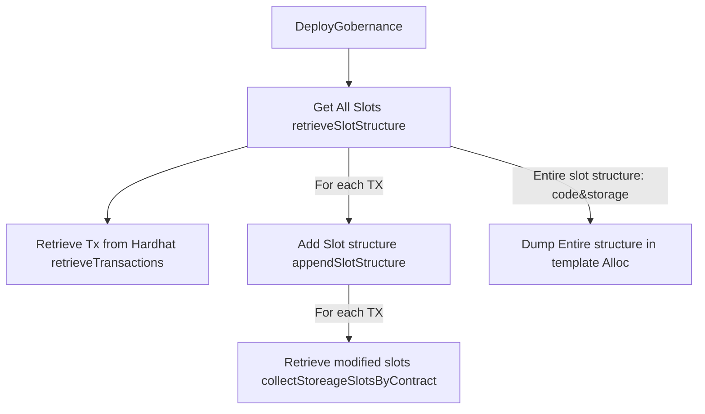

# ISBE-ARTEFACT-01060 - Proceso de generación de bloque génesis

## **1. Identificación del Artefacto**

| Campo                     | Valor                                                       |
| ------------------------- | ----------------------------------------------------------- |
| **Nombre del artefacto**  | ISBE-ART-01060 — Proceso de generación de bloque génesis    |
| **Origen**                | isbe-contracts: Necesario para poder arrancar cualquier red |
| **Estado**                | Validado                                                    |
| **Versión del documento** | _1.0.0_                                                     |
| **Fecha**                 | _2025-12-12_                                                |
| **Repositorio**           | https://github.com/alastria/isbe-network-builder            |
| **Commit**                | 1ea1358ff38bf518af12e170f32cc7bf286925a7                    |

## **2. Propósito del Artefacto**

- **Objetivo funcional:** Dado que no se permite el despliegue directo de contrato salvo a través del Diamante de Gobernanza, es necesario que este contrato preexista al arrancar la red o de otro modo no será posible desplegar ningún contrato (incluido el propio Diamante de Gobernanza). Este proceso incluye el Diamante de Gobernanza en el génesis generando toda su estructura de slots. Este proceso funciona tanto para las redes r1 como para las k1.
- **Beneficio para ISBE:** Disponer de un proceso unificado para generar el génesis, adaptable a distintos entornos (r1, k1, o ampliación del Diamante de Gobernanza)
- **Stakeholders clave:** Contract developers, Infrastructure Deployers

## **3. Alcance y Ciclo de Vida**

- **Fases cubiertas:**
    - ✅ **Definición:** Proceso unificado de generación y prueba de la generación del bloque génesis con el diamante de gobernanza predesplegado
    - ✅ **Desarrollo:** Desarrollo de un proceso que extraiga la información de slots a partir de las transacciones desplegadas en la red Hardhat.

- **Dependencias**: Si se modifica el diamante de gobernanza o se añaden nuevas facetas a éste, se debe regenerar los bloques tanto para la r1 como la k1
- **Mantenimiento:** Ejecución manual (mediante script de bash automatizado) ante cambios en la estructura del diamante de gobernanza. Mantenimiento correctivo en caso de encontrar errores. No se espera mantenimiento evolutivo en el proceso.

## **4. Definición del Artefacto**

- **4.1. Artefacto de arquitectura de referencia:**

El proceso unificado de generación y test se encuentra codificado en el script: **makeGenesis.sh**

- **4.2. Trazabilidad:**

    Este artefacto está alineado con el punto 3.5.2 Contrato Factory del documento Arquitectura de referencia de ISBE_definitivo.pdf.

- **4.3. Descripción funcional detallada:**
  Este proceso se ha realizado de forma genérica, de tal manera que pueda afrontar la generación del genesis ante cualquier tipo de despliegue por complejo que sea (y este es el caso del Diamante de Gobernanza). Se han considerado los siguientes escenarios:
    - **Despliegue básico**: Despliegue a partir de una EOA
    - **Despliegue con llamada a otros contratos:** En caso de que la EOA llame a otros contratos mediante OPCODES: CALL, DELEGATECALL, STATICCALL, el proceso extrae adecuadamente los slots modificados y los asocia correctamente al contrato en cuestión
    - **Llamada al Diamante de gobernanza con despliegue:** En este caso no es una transacción de despliegue, sino una llamada estándar que realiza uno o varios despliegues de contratos (OPCODE: CREATE y CREATE2). En este caso los slots también son asociados adecuadamente a cada contrato.

    Indicar que todos los flujos anteriores se pueden anidar y que el proceso de extracción gestiona estas circunstancias de forma adecuada.

- **4.4. Modelos o diagramas específicos:**

    Ya hemos presentado el flujo unificado para el proceso de generación y test del bloque génesis. Siendo más específico, el proceso de generación del bloque génesis queda descrito a continuación:

**Deploy governance:** El punto de entrada de esta funcionalidad es **genesis:generate**, ubicado en **task/genesisGeneration.ts**. Esta tarea procesa parámetros y lee los archivos involucrados en este proceso.

**Get All Slots:** Esta función (**retrieveSlotStructure()**) en el archivo **script/slotStractor.ts** realiza lo siguiente:

- Extrae todas las transacciones (solo hashes) **retrieveTransactions()**
- Para cada transacción, llama a **appendSlotStructure()**, que devuelve el código del contrato, el nombre del contrato, los _slots_ modificados y sus valores. Esta información se añade a la información previa. La información de cada transacción se fusiona con las transacciones anteriores, resultando en un agregado de todas las transacciones que han sido desplegadas en la red de Hardhat.
- La función **appendSlotStructure()** obtiene la información de los _slots_ modificados para cada contrato y añade a esa información el valor final de cada _slot_ modificado, el _bytecode_ desplegado del contrato y una etiqueta con el nombre del contrato. Esto último no es necesario, pero resulta muy informativo. Para obtener la lista de _slots_ modificados se invoca la función **collectStorageSlotsByContract()**. Debido a la complejidad de esta función y su importancia, se describirá por separado.

**Función collectStorageSlotsByContract():**  
Esta función es el núcleo de este proceso y es donde reside gran parte de la funcionalidad. En primer lugar, como se indica en el ADR 004, no existe una forma inmediata de extraer _slots_ asociados a contratos cuando la estructura de _storage_ es compleja. En este sentido, el uso del patrón _diamond_, que coloca información fuera de los _slots_ estándar, hace imposible utilizar la mayoría de los plugins.

El método usado para generar y detectar los _slots_ modificados consiste en revisar todo el _trace_ de cada transacción en busca del _OPCODE_ **SSTORE**, responsable de guardar datos en un _slot_ del estado de un contrato. Este método es muy efectivo para obtener la lista de _slots_ modificados. Sin embargo, es necesario saber a qué contrato pertenece cada _slot_. Responder a esta cuestión no es trivial, ya que requiere emular parcialmente el comportamiento de la EVM respecto a dos parámetros clave: _depth_ y _frames_.

La Máquina Virtual de Ethereum (EVM) ejecuta transacciones mediante una estructura de llamadas basada en pila (_stack_). Cada llamada o creación de contrato genera un nuevo _frame_ (o contexto) de ejecución, que encapsula su propio estado, incluyendo memoria, pila, contador de programa, gas y variables de entorno.

Para determinar a qué contrato se asocia la creación de cada slot, es necesario emular parcialmente la ejecución de la máquina virtual estableciendo la dirección del contrato receptor.

- **4.5. Reglas de negocio asociadas:**

    Este proceso es de tipo batch, para consumo de los Infrastructure Deployers y no será usado por el usuario final. Asimismo, una vez generado un génesis no se generarán en tanto en cuanto no hayan cambios en el diamante de gobernanza. Este proceso será lanzado de forma infrecuente.

- **4.6. Interfaces y puntos de integración:**

    Sólo tiene dos puntos de integración:
    - **GT Contratos:** Cambios en el Diamante de gobernanza requieren reejecutar este proceso
    - **GT de Infraestructura:** Son los consumidores finales del output (bloque génesis) de este proceso

    Para las pruebas necesita tener en local la herramienta de Besu Local [isbe-besu-local-deployer](https://github.com/alastria/isbe-besu-local-deployer)

- **4.7. Normativas y requisitos regulatorios:**

    No aplican.

- **4.8. Criterios de calidad específicos:**

    El rendimiento de este proceso es bajo y el consumo de recursos es muy alto. Este no es un problema grave dado que es un proceso que se lanzará en batch y bastante infrecuentemente.
    Los criterios de calidad son altísimos. Esto es debido a que el bloque génesis corresponde a los cimientos de toda la estructura. Un error en este proceso que genere un génesis incompleto tiene consecuencias muy graves. Este tema será descrito con mucho más detalle en secciones venideras.

## **5. Desarrollo del Artefacto**

- **5.1. Componentes del artefacto:**

    Básicamente se ha realizado:
    - Proceso unificado: makeGenesis.sh
        - Generación
        - Despliegue en entorno Besu
        - Pruebas
    - Documentación:
        - Manual del usuario: Cómo generar y probar el bloque génesis
        - Detalles técnicos: Orientado a desarrolladores que necesiten mantener este artefacto

    El detalle se encuentra a continuación.

- **5.2. Lista de elementos clave producidos: código, scripts, configuraciones, manuales:**

    Todos los elementos descritos se encuentran en el repositorio de contratos [isbe-contracts](https://github.com/alastria/isbe-contracts)
    | Nombre | Descripción | Enlace |
    |--------|-------------|--------|
    | makeGenesis | Script con el proceso unificado de generación | ./makeGenesis.sh |
    | genesis:generate | Task de hardhat que realiza la generación del genensis | ./tasks/genesisGeneration.ts |
    | genesis:validar | Task de hardhat que realiza la validación del genensis | ./tasks/genesisGeneration.ts |
    | Genesis Generator scripts | Conjunto de scripts para generar y validar la generación del génesis | ./scripts/genesisGenerator |

    En especial: **Slot Extractor**, ubicado en ./script/genesisGenerator, contiene un conjunto de funciones destinadas a extraer la estructura de slots y de código desde la red de Hardhat. **Esta es la funcionalidad core de este proceso**

- **5.3. Frameworks, librerías o tecnologías acordadas:**

    Han sido usadas estos frameworks públicos:
    - Libería Ethers v6
    - Hardhat tooling

    Asimismo, se han usado estas librerías desarrolladas especificamente para este proyecto:
    - Tooling de despliegue y gestión (tasks de hardhat _ad hoc_)
    - Entorno de besu local sobre el que desplegar y realizar las pruebas [isbe-besu-local-deployer](https://github.com/alastria/isbe-besu-local-deployer)

- **5.4. Buenas prácticas aplicables:**

    **Seguridad:** Dado que se trata de un proceso interno que no será utilizado por el usuario final, la seguridad no ha sido un requisito prioritario. Este proceso será ejecutado únicamente por los mantenedores de la red, quienes cuentan con permisos elevados y amplia experiencia en esta tecnología.

    **Rendimiento:** La extracción de la información de la cadena de bloques de Hardhat es un proceso intensivo que requiere grandes cantidades de memoria y se dilata en el tiempo. Este punto queda fuera del alcance de este proyecto ya que se invoca una funcionalidad de Hardhat sobre la cual este proyecto no tiene control. Dado que preocupa más la calidad del proceso que su rendimiento, se ha priorizado la primera.

    **Mantenibilidad:** Se ha mantenido un alto nivel de calidad en el código minimizando en lo posible la aparición de deuda técnica. No obstante, en el futuro se puede mejorar ciertos aspectos de la documentación y la salida de trazas.

    **Calidad:** Al tratarse del bloque génesis, cualquier error puede tener consecuencias muy graves. Por ello, se ha puesto un fuerte énfasis en la calidad del proceso. El código liberado realiza auto-verificaciones intensivas: durante la extracción se ejecutan múltiples puntos de control que, en caso de fallo, abortan inmediatamente la ejecución y muestran información detallada (depth, frame, stack, opcode, previousDepth). Esto garantiza que el génesis generado sea coherente y sin errores.

- **5.5. Criterios de validación del desarrollo:**

    Como se ha indicado anteriormente, la calidad de código y del resultado es fundamental en este proceso por las consecuencias que un bloque génesis erróneo puede acarrear. En este sentido se han realizado dos tipos de pruebas:

    ### Test del resultado

    El proceso unificado instala el bloque génesis generado en un Besu local y lo lanza. Hecho esto, se lanzan las pruebas para validar que el génesis es correcto usando genesis:validate. Estas pruebas permiten comprobar a quien ejecuta este proceso si aparece algún error. En este caso se lanzan dos tipos de prueba:
    - Pruebas sobre el diamante de gobernanza orientadas a chequear que la información es correcta: Obtención de Facets asociadas al diamante, pause y unpause, listado, revocación y otorgamiento de rol...
    - Despliegue completo de las facetas de los casos de uso. Se considera que si no aparece ningún error en este punto, el bloque genesis se ha generado correctamente.
    - Inicialmente se incluía el despliegue de los casos de uso, pero se desechó porque el proceso requería 50 minutos para su ejecución (100 en total 50 para la k1 y 50 para la r1) y el resultado no era especialmente relevante.

    ### Auditoría sobre el código

    El proceso de generación del bloque incluye una serie de autocheckeos que validan el resultado de cada operación y abortan la ejecución si la condición no se cumple. Estas validaciones ralentizan la ejecución y requieren más recursos para su ejecución, si bien, se considera un pequeño precio a pagar para garantizar la exactitud del proceso.

    En este sentido, resulta relevante comentar dos conceptos relativos al debugging. No es lo mismo **donde se produce el error** que **donde se detecta el error**. Como es obvio, cuanto más lejos estén el uno del otro más compleja es su detección. El caso que nos ocupa requiere la revisión de todos los opcodes de una transacción, más de 87.000 en algún caso, lo que requiere más de 87.000 iteraciones. Si el problema se detecta 5000 iteraciones después, la localización del error es inviable. Para agravar la situación, se manejan hashes y direcciones; datos que para un ser humano carecen de valor semántico.

    Por todo ello, se han incluido una serie de puntos de chequeo en el propio código (si se da cualquiera de estas circunstancias, el proceso aborta):
    - **TX Inexistente** Verifica que la transacción existe. Debe existir ya que se han extraido de Hardhat, salvo que haya algún error en el código
    - **Receipt inexistente** Verifica que el receipt de la transacción existe
    - **Transacción sin destino ni creación** Puede ser un despliegue y por tanto el valor de **contractAddress** debe ser no nulo o tener **to**, lo que denota una transacción de invocación. Si no esta presente un u otro el proceso se aborta.
    - **Stack no disponible:** La traza debe incluir pila. Si no es así lo más habitual es que se haya deshabilitado la extracción de traza del tracer.
    - **Memoria no disponible:** La traza debe incluir memoria.Si no es así lo más habitual es que se haya deshabilitado la extracción de la memoria del tracer.
    - **Profundidad inválida:** depth debe ser ≥ 1. Esto nunca debería suceder. Si sucede es por la existencia de un error y se aborta de inmediato
    - **CALL a contrato desconocido**: Cada contrato que se crea se incluye en un registro de contratos, el cual también gestiona sus nonces. Si la llamada es a un contrato no registrado hay un problema. Puede que el parámetro extraído de la pila no sea el adecuado y el contrato no existe o el contrato existe pero no se ha incluido en el registro.
    - **DELEGATECALL/CALLCODE a contrato desconocido:** El mismo caso que el anterior
    - **STATICCALL a contrato desconocido:** El mismo caso que el anterior
    - **CREATE con nonce desconocido:** El creador debe estar inicializado. Cuando se crea un contrato desde otro, el primer contrato debe existir en el registro de contratos. El nonce de ese cotrato se usa para precalcular la dirección del contrato.
    - **CREATE2 con nonce desconocido:** El creador debe estar en el registro de contratos. En este caso, si bien el nonce no se usa, debe ser incrementado
    - **Entrada a mayor profundidad desde opcode no permitido:** Solo CALL / DELEGATECALL / STATICCALL / CALLCODE / CREATE / CREATE2 pueden aumentar depth. Si se detecta otro OPCODE que aumente depth y que el proceso no sepa gestionar, el proceso se para.
    - **Salida sin owner almacenado:** En todo frame debe existir un owner del frame, si no es así existe un error en el código y se aborta.
    - **Salida de Frame anterior al mismo owner no permitida:** Al salir de un frame a otro, el contract owner debe recuperarse del frame anterior y debe ser distinto del actual;si no es así, existe un error en el código. En el caso de DELEGATECALL/CALLCODE esto no es así, el contract owner no cambia.
    - **Dirección devuelta en CREATE/CREATE2 incorrecta:** Debe coincidir con la precalculada. Los OPCODES CREATE Y CREATE2 no proporcionan la dirección del contrato sobre el cual operan, como sucede con CALL, DELEGATECALL y STATICCALL. Gestionar a posteriori la asignación del contract owner a cada SSTORE es muy complejo. Por ello, tanto en CREATE como en CREATE2 se precalculan las direcciones usando las reglas de la EVM. Al salir del frame y por tanto del constructor, la pila contiene la dirección devuelta. Esta dirección devuelta es comparada con la generada. Si no coinciden es que hay un error en el código.
    - **SSTORE en contrato no registrado:** El contrato debe existir en resultStorage recuperado del tracer de Hardhat.En caso contrario existe un error.
    - **SSTORE sin aparición en diff de storage:** El slot debe estar presente en el resultStorage recuperado del tracer de Hardhat.En caso contrario existe un error.

    Cuando se aborta por un error en el chequeo se lanza la función **errorInfo(...)** que lanza una excepción que incluye el volcado de los parámetros relevantes:
    - Depth actual
    - Depth anterior (anterior al opcode que se está procesando)
    - opcode procesado
    - Todas las frames con sus valores
    - Stack actual (parámetros del opcode y retorno del opcode anterior)
    - La actual estructura de slots
    - Un mensaje

- **5.6. Alineación con requisitos legales (GDPR, NIS2, etc.)**

    No aplica.

- **5.7. Dependencias técnicas o de infraestructura:**

    Para la generación, únicamente el repositorio de Hardhat es necesario. Si se desea ejecutar las pruebas, es necesario contar con el despliegue del entorno local de Besu.

- **5.8. Limitaciones temporales:**

    Conviene realizar una revisión para mejorar la calidad del código enfocada a:
    - Refactoring
    - Mejorar la salida de trazas
    - Añadir más documentación dentro del código

- **5.9. Limitaciones por versiones, licencias o configuraciones.**

    No aplica

## **6. Reglas de Control y Actualización**

- **Política de gestión de versiones para la fase de definición y desarrollo:** El desarrollo, salvo error, no debe ser modificado. No obstante, la generación de nuevos genesis está supeditada a cambios en el diamante de gobernanza.
- **Indicar si es actualizable tras la entrega, por quién y bajo qué condiciones.** El proceso se puede actualizar. El genesis generado, que se encuentra desplegado en una red, no se puede modificar.
- **Frecuencia de revisión o actualizaciones planificadas.** El proceso no tiene planificados eventos de actualización a corto plazo. La generación del génesis se realizará cada vez que se realicen cambios relevantes en el diamante de gobernanza.
- **Herramienta de control de cambios:** Se usa el repositorio de ISBE en Github, más en concreto el repositorio [isbe-contracts](https://github.com/alastria/isbe-contracts/tree/feat/129-genesis-gobernance-diamond)

| Tipo de cambio  | Versionado | Flujo de aprobación            | Documentación requerida              |
| --------------- | ---------- | ------------------------------ | ------------------------------------ |
| Evolutivo menor | X.Y+0.1    | Pull Request + revisión GT     | Release notes detalladas             |
| Evolutivo mayor | X+1.0      | Pull Request + revisión Comité | Informe de impacto y release notes   |
| Correctivo      | X.Y.Z+1    | Pull Request + revisión GT     | Descripción del fix en release notes |

Copyright © 2025 Comunidad de Madrid & Alastria
