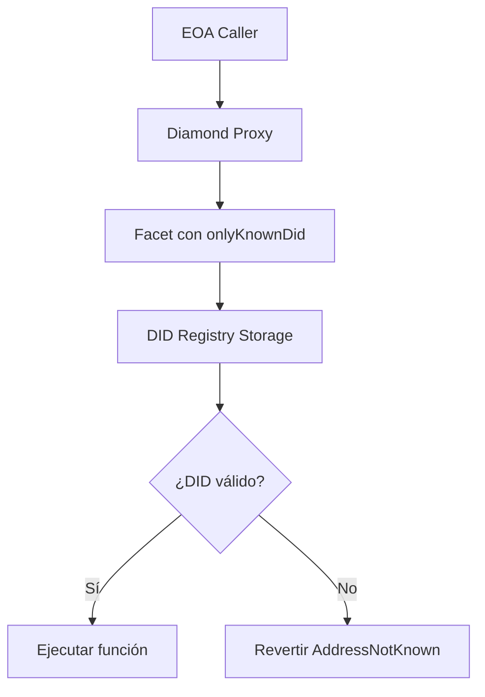
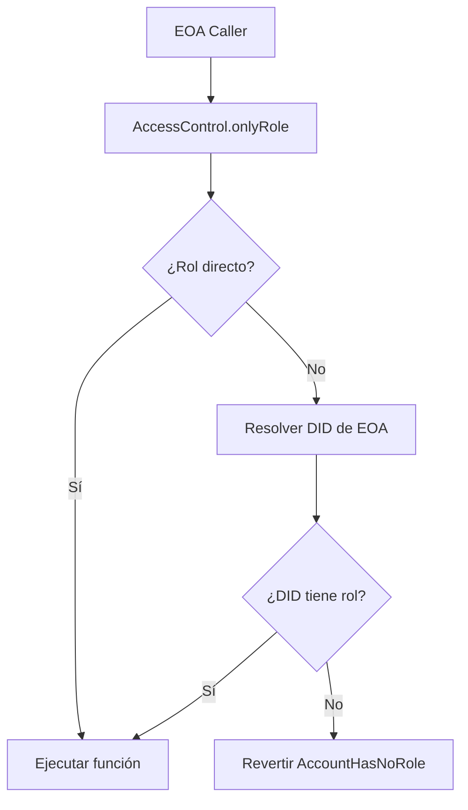
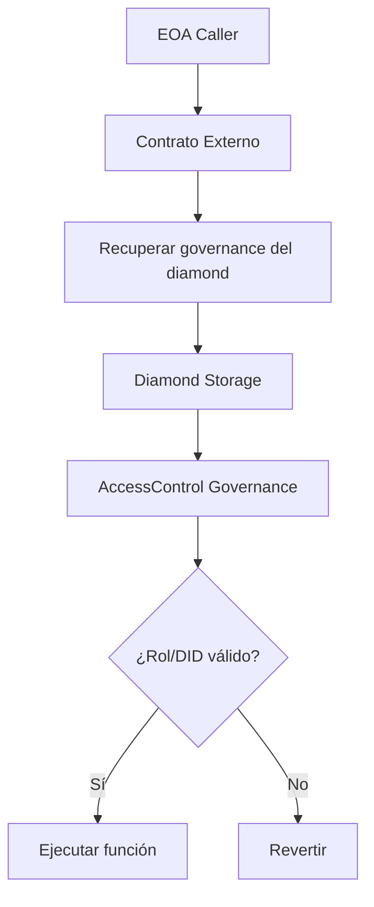
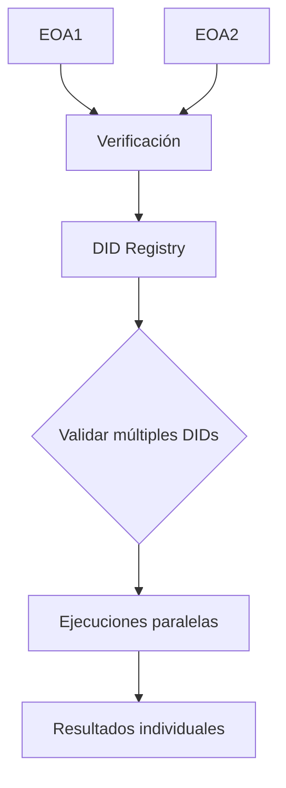

# ISBE-ART-02003 — Comprobación EOAs contra lista identidades

---

## 1. Identificación del Artefacto

| Campo                       | Valor                                                                                                                                                         |
| --------------------------- | ------------------------------------------------------------------------------------------------------------------------------------------------------------- |
| **Nombre del artefacto**    | ISBE-ART-02003 — Comprobación EOAs contra lista identidades                                                                                                   |
| **Origen**                  | Documento derivado del repositorio oficial de Smart Contracts, consolidando información técnica sobre la verificación de EOAs contra identidades DID en ISBE. |
| **Estado**                  | Validado                                                                                                                                                      |
| **Versión del documento**   | 1.0.0                                                                                                                                                         |
| **Fecha**                   | 2025-12-10                                                                                                                                                    |
| **Repositorio (congelado)** | [https://github.com/alastria/isbe-contracts](https://github.com/alastria/isbe-contracts)                                                                      |
| **Commit**                  | `2c3a2accef78bbf723c970c8139df34a4d3137c8`                                                                                                                    |

---

## 2. Propósito del Artefacto

### Objetivo funcional:

Definir los mecanismos de verificación de cuentas externas (EOAs) contra identidades DID registradas en el sistema ISBE, permitiendo control de acceso basado tanto en roles tradicionales como en identidades descentralizadas.

### Beneficio para ISBE:

- **Verificación dual**: Combina control de acceso por roles y por identidades DID
- **Interoperabilidad DID**: Compatibilidad con estándares W3C DID y verificación de identidades descentralizadas
- **Flexibilidad de acceso**: Permite verificaciones tanto internas como cruzadas entre contratos
- **Trazabilidad**: Auditoría completa de verificaciones de identidad y roles
- **Cumplimiento eIDAS2**: Alineación con regulaciones europeas de identidad digital

### Stakeholders clave:

- Equipos técnicos de desarrollo y operaciones
- Administradores de identidad y acceso
- Auditores de seguridad y cumplimiento
- Órganos de gobernanza técnica
- Entidades reguladoras

---

## 3. Alcance y Ciclo de Vida

### Fases cubiertas:

✅ **Definición**: Modificadores y funciones de verificación de EOAs vs identidades DID  
✅ **Desarrollo**: Implementación de `onlyKnownDid` y `onlyRole` con integración DID  
✅ **Validación**: Pruebas unitarias exhaustivas en `KnownDidTestWrapper.spec.ts` y `AccessControl.spec.ts`  
✅ **Mantenimiento**: Actualización alineada con evoluciones de estándares DID y eIDAS2

---

## 4. Descripción Técnica Detallada

### 4.1 Modificador `onlyKnownDid`

**Ubicación**: `contracts/identity/didregistry/DidDocumentDetailedInternal.sol`

**Propósito**: Verificar que una dirección Ethereum tiene una identidad DID registrada y activa en el sistema.

**Implementación**:

```solidity
modifier onlyKnownDid(address _address) {
    _checkKnownDid(_address);
    _;
}
```

**Comportamiento**:

- Verifica si la dirección tiene un DID registrado en el DID Registry
- Confirma que la invocación de capacidad (capability invocation) está activa (timestamps válidos)
- Emite evento `DidVerified` en caso exitoso
- Revertir con `AddressNotKnown` en caso de fallo

### 4.2 Modificador `onlyRole` con integración DID

**Ubicación**: `contracts/access/accessControl/AccessControlInternal.sol`

**Propósito**: Verificar que una dirección tiene un rol específico, incluyendo verificación a través de su identidad DID.

**Implementación**:

```solidity
modifier onlyRole(bytes32 _role) {
    _checkRole(_role);
    _;
}

function _checkRole(bytes32 _role, address _account) internal view virtual {
    if (!hasRole(_role, _account)) {
        revert AccountHasNoRole(_account, _role);
    }
}

function hasRole(bytes32 _role, address _account) public view virtual returns (bool) {
    return _hasEoaRole(_role, _account) || _hasDidRole(_role, _resolveDidOf(_account));
}
```

**Flujo de verificación**:

1. Primero verifica rol directo en la dirección EOA (`_hasEoaRole`)
2. Si falla, resuelve el DID de la dirección (`_resolveDidOf`)
3. Verifica si el DID tiene el rol (`_hasDidRole`)

---

## 5. Escenarios de Uso y Diagramas

### 5.1 Escenario 1: Verificación Interna en el Mismo Diamond



**Casos de prueba relevantes** (`KnownDidTestWrapper.spec.ts`):

- Dirección sin DID registrado → `AddressNotKnown`
- Dirección con DID activo → `DidVerified` emitido
- DID registrado pero invocación inactiva → `AddressNotKnown`

### 5.2 Escenario 2: Verificación de Rol con Fallback a DID



### 5.3 Escenario 3: Verificación Cruzada Recuperando Governance



### 5.4 Escenario 4: Verificación Multi-DID



**Ejemplo de prueba** (`KnownDidTestWrapper.spec.ts`):

```typescript
// Multiple addresses with DIDs should all succeed
await expect(knownDidTestWrapper.connect(admin).testOnlyKnownDid())
    .to.emit(knownDidTestWrapper, 'DidVerified')
    .withArgs(adminAddress)
```

---

## 6. Componentes y Dependencias

### 6.1 Contratos Principales

| Componente                    | Ubicación                                    | Responsabilidad                                  |
| ----------------------------- | -------------------------------------------- | ------------------------------------------------ |
| `DidDocumentDetailedInternal` | `contracts/identity/didregistry/`            | Modificador `onlyKnownDid` y verificación básica |
| `AccessControlInternal`       | `contracts/access/accessControl/`            | Modificador `onlyRole` con integración DID       |
| `KnownDidTestWrapper`         | `contracts/testwrapper/knownDidTestWrapper/` | Contrato de pruebas para verificación DID        |

### 6.2 Dependencias Externas

- **DID Registry**: Sistema de registro y gestión de identidades descentralizadas
- **Timestamp Facet**: Validación de ventanas temporales de invocación
- **AccessControl Governance**: Gestión centralizada de roles y permisos

### 6.3 Estructura de Storage

**DID Registry Storage**:

- Mapping de direcciones → DIDs
- Mapping de DIDs → documentos y metadatos
- Timestamps de invocación de capacidad

**AccessControl Storage**:

- Roles por dirección EOA
- Roles por DID hash
- Configuraciones de governance

---

## 7. Casos de Prueba y Validación

### 7.1 Pruebas Unitarias (`KnownDidTestWrapper.spec.ts`)

**Introspection Tests**:

- Verificación de business ID y selectores correctos
- Validación de interfaces implementadas

**Modifier Tests**:

- ✅ Dirección sin DID → `AddressNotKnown`
- ✅ Dirección con DID activo → `DidVerified`
- ✅ DID registrado pero invocación inactiva → `AddressNotKnown`
- ✅ Múltiples direcciones con DIDs → todas exitosas

### 7.2 Pruebas de Integración (`AccessControl.spec.ts`)

**Role Immutability Tests**:

- ✅ Intento de modificar rol ISBE → `RoleIsImmutable`
- ✅ Gestión normal de roles DEFAULT_ADMIN

**DID-Role Integration**:

- Verificación de `_hasDidRole` en contexto de resolución
- Integración con factory patterns para resolución DID

---

## 8. Consideraciones de Seguridad y Compliance

### 8.1 Aspectos de Seguridad

- **Verificación en tiempo de ejecución**: Todas las verificaciones son on-chain
- **Immutabilidad de roles críticos**: Roles ISBE no pueden ser modificados
- **Validación temporal**: Verificación de timestamps para invocaciones
- **Fallback seguro**: Sistema de verificación dual con failover controlado

### 8.2 Cumplimiento Normativo

- **eIDAS2**: Verificación de identidades digitales cualificadas
- **NIS2**: Control de acceso y auditoría de operaciones
- **RGPD**: Gestión responsable de datos de identidad
- **W3C DID**: Cumplimiento con estándares internacionales

### 8.3 Best Practices Implementadas

- Uso de modificadores para encapsular lógica de verificación
- Separación clara entre verificación EOA y DID
- Eventos emitidos para auditoría y trazabilidad
- Pruebas exhaustivas de todos los escenarios

---

## 9. Referencias y Enlaces

### 9.1 Documentación Relacionada

- [ISBE-ART-01000 — Proxies EIP‑2535 e ISBE Proxy](./ISBE-ART-01000.md)
- [ADR-008 — AccessControl-Did Integration](../adrs/ADR_008-AccessControl-Did-integration.md)
- [Documentación técnica DID Registry](../generated/identity/didregistry.md)

### 9.2 Implementaciones de Referencia

- `contracts/identity/didregistry/DidDocumentDetailedInternal.sol`
- `contracts/access/accessControl/AccessControlInternal.sol`
- `test/KnownDidTestWrapper.spec.ts`
- `test/AccessControl.spec.ts`

### 9.3 Estándares Aplicados

- **EIP-2535**: Diamond Proxy Pattern
- **W3C DID-Core**: Decentralized Identifiers
- **eIDAS2**: Electronic Identification and Trust Services

## **10. Reglas de Control y Actualización**

| Tipo de cambio      | Versionado | Flujo de aprobación                | Documentación requerida         |
|--------------------|------------|------------------------------------|---------------------------------|
| Evolutivo menor    | X.Y+0.1    | Pull Request + revisión GT         | Release notes detalladas        |
| Evolutivo mayor    | X+1.0      | Pull Request + revisión Comité     | Informe de impacto y release notes |
| Correctivo         | X.Y.Z+1    | Pull Request + revisión GT         | Descripción del fix en release notes |


Copyright © 2025 Comunidad de Madrid & Alastria