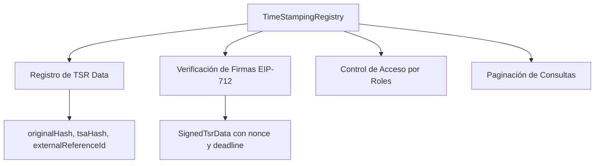
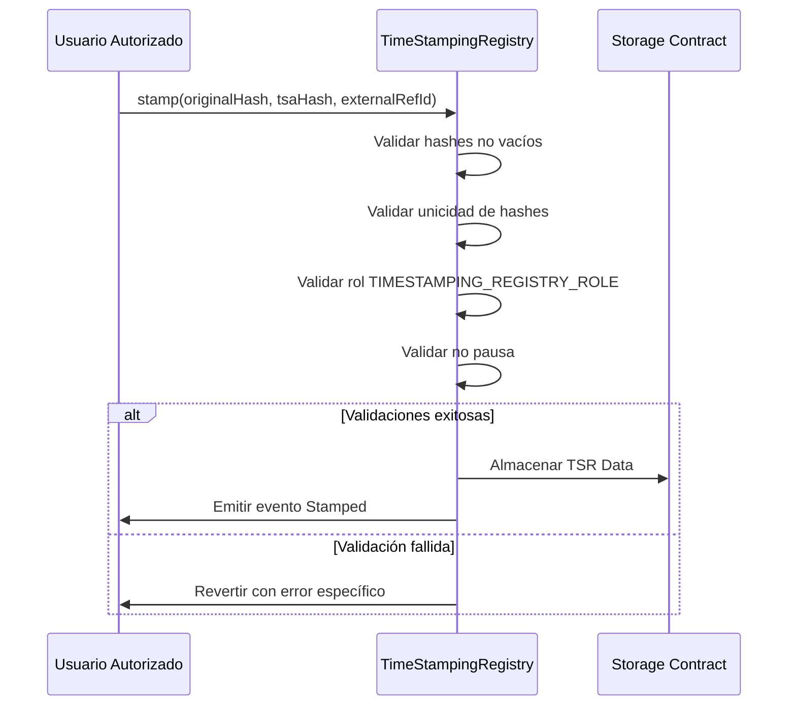
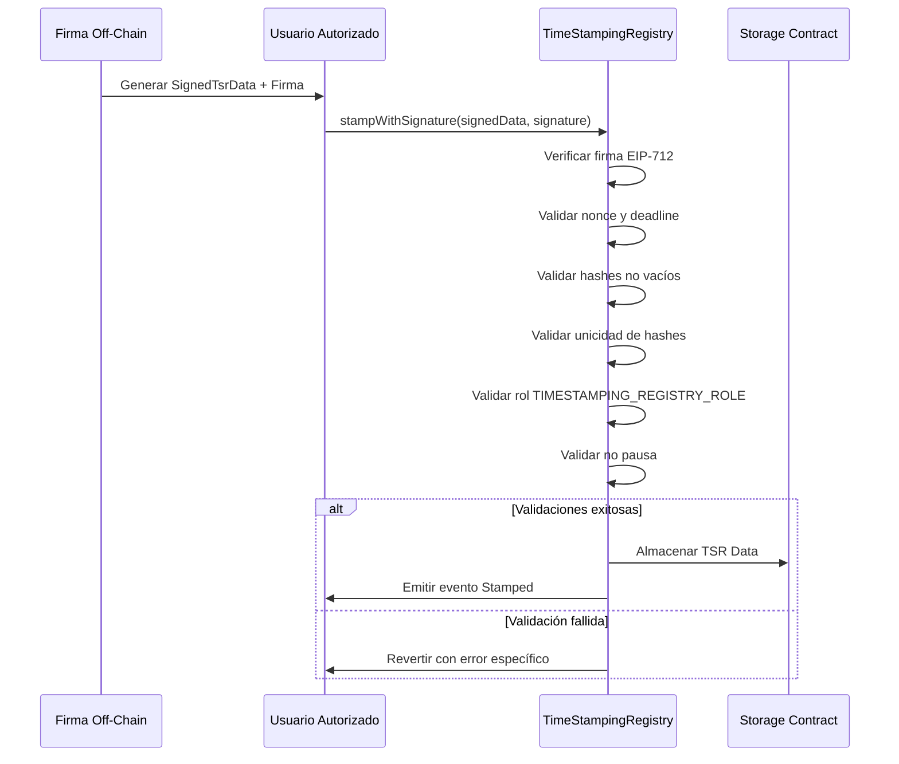
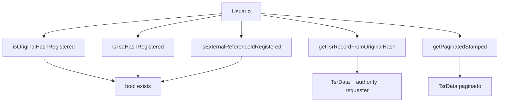

# ISBE-ART-02021 — Time Stamping Registry (contracts/tsr)

---

## 1. Identificación del Artefacto

| Campo                       | Valor                                                                                                                                          |
| --------------------------- | ---------------------------------------------------------------------------------------------------------------------------------------------- |
| **Nombre del artefacto**    | ISBE-ART-02021 — Time Stamping Registry (contracts/tsr)                                                                                        |
| **Origen**                  | Documento derivado del repositorio oficial de Smart Contracts, consolidando información técnica sobre el registro de marcas de tiempo en ISBE. |
| **Estado**                  | Validado                                                                                                                                       |
| **Versión del documento**   | 1.0.0                                                                                                                                          |
| **Fecha**                   | 2025-12-18                                                                                                                                     |
| **Repositorio (congelado)** | [https://github.com/alastria/isbe-contracts](https://github.com/alastria/isbe-contracts)                                                       |
| **Commit**                  | `2c3a2accef78bbf723c970c8139df34a4d3137c8`                                                                                                     |

---

## 2. Propósito del Artefacto

### Objetivo funcional:

Definir un sistema de registro de marcas de tiempo (timestamping) para documentos y datos digitales, permitiendo demostrar la existencia de información en un momento específico mediante el almacenamiento de hashes criptográficos y metadatos asociados en blockchain.

### Beneficio para ISBE:

- **Prueba de anterioridad**: Demostrar que un documento existía antes de una fecha concreta
- **Integridad verificable**: Cualquier alteración del documento original es detectable
- **Cumplimiento normativo**: Soporte para eIDAS2 (pruebas electrónicas) y NIS2 (trazabilidad de eventos)
- **Interoperabilidad**: Compatible con estándares RFC 3161 y sistemas de timestamping externos
- **Eficiencia**: Almacenamiento de hashes en lugar de documentos completos

### Stakeholders clave:

- Equipos técnicos de desarrollo y operaciones
- Auditores de seguridad y cumplimiento
- Órganos de gobernanza técnica
- Entidades emisoras de documentos
- Organismos reguladores y judiciales

---

## 3. Alcance y Ciclo de Vida

### Fases cubiertas:

✅ **Definición**: Arquitectura de registro de marcas de tiempo  
✅ **Desarrollo**: Implementación de interfaces y lógica de negocio  
✅ **Validación**: Pruebas unitarias exhaustivas en `TimeStampingRegistry.spec.ts`  
✅ **Mantenimiento**: Actualización alineada con estándares de timestamping

---

## 4. Descripción Técnica Detallada

### 4.1 Arquitectura del Sistema

El sistema Time Stamping Registry implementa un registro descentralizado de marcas de tiempo con las siguientes características:



### 4.2 Interfaces y Estructuras

#### **ITSRData** - Datos de Time Stamping Registry

```solidity
struct TsrData {
    bytes32 originalHash; // Hash del documento original (clave primaria)
    bytes32 tsaHash; // Hash de la respuesta RFC 3161
    bytes32 externalReferenceId; // ID de referencia externa
}
```

#### **SignedTsrData** - Datos firmados para verificación

```solidity
struct SignedTsrData {
    TsrData tsrData; // Datos TSR
    address sender; // Dirección del firmante
    uint256 deadline; // Expiración de la firma
    uint256 nonce; // Protección contra replay attacks
}
```

### 4.3 Funcionalidades Principales

#### **stamp()** - Registro directo de marcas de tiempo

```solidity
function stamp(
    bytes32 _originalHash,
    bytes32 _tsaHash,
    bytes32 _externalReferenceId
) external;
```

**Validaciones**:

- Todos los hashes deben ser no vacíos (`EmptyBytes32`)
- `originalHash` debe ser único (`HashAlreadyExists`)
- `tsaHash` debe ser único (`HashAlreadyExists`)
- `externalReferenceId` debe ser único (`ExternalReferenceIdAlreadyExists`)
- Solo accesible por roles autorizados (`TIMESTAMPING_REGISTRY_ROLE`)

#### **stampWithSignature()** - Registro con firma EIP-712

```solidity
function stampWithSignature(
    SignedTsrData calldata _tsrData,
    bytes calldata _signature
) external;
```

**Validaciones adicionales**:

- Verificación de firma EIP-712 con dominio y tipos específicos
- Validación de nonce y deadline
- Mismo conjunto de validaciones que `stamp()`

### 4.4 Control de Acceso y Gobernanza

**Roles definidos**:

- `TIMESTAMPING_REGISTRY_ROLE`: Permiso para registrar marcas de tiempo
- `PAUSER_ROLE`: Permiso para pausar el contrato

**Mecanismos de seguridad**:

- Pausa global de operaciones (`whenNotPaused`)
- Validación de roles (`onlyRole`)
- Protección contra replay attacks (nonce)
- Protección contra firmas expiradas (deadline)

---

## 5. Flujos de Operación y Diagramas

### 5.1 Flujo de Registro Directo



### 5.2 Flujo de Registro con Firma



### 5.3 Flujo de Consulta de Datos



---

## 6. Componentes y Dependencias

### 6.1 Contratos Principales

| Componente                     | Ubicación                                        | Responsabilidad                 |
| ------------------------------ | ------------------------------------------------ | ------------------------------- |
| `ITimeStampingRegistry`        | `contracts/tsr/ITimeStampingRegistry.sol`        | Interfaz principal del registro |
| `TimeStampingRegistry`         | `contracts/tsr/TimeStampingRegistry.sol`         | Implementación principal        |
| `TimeStampingRegistryFacet`    | `contracts/tsr/TimeStampingRegistryFacet.sol`    | Facet Diamond para integración  |
| `TimeStampingRegistryInternal` | `contracts/tsr/TimeStampingRegistryInternal.sol` | Lógica interna y almacenamiento |

### 6.2 Dependencias del Sistema

- **AccessControl**: Gestión de roles y permisos
- **ISBEPause**: Soporte para pausa global
- **EIP-712**: Verificación de firmas estructuradas
- **MockTimestamp**: Testing de timestamps en pruebas

### 6.3 Estructura de Storage

**TimeStampingRegistryStorage**:

- Mapping `originalHash → TsrData + authority + requester`
- Mapping `tsaHash → originalHash`
- Mapping `externalReferenceId → originalHash`
- Array de TSR Data para paginación

---

## 7. Casos de Prueba y Validación

### 7.1 Pruebas de Validación de Entradas

**Escenarios validados** (`TimeStampingRegistry.spec.ts`):

- ✅ Hashes vacíos → `EmptyBytes32`
- ✅ `originalHash` duplicado → `HashAlreadyExists`
- ✅ `tsaHash` duplicado → `HashAlreadyExists`
- ✅ `externalReferenceId` duplicado → `ExternalReferenceIdAlreadyExists`
- ✅ Firma inválida → `InvalidSignature`
- ✅ Nonce incorrecto → `WrongNonce`
- ✅ Firma expirada → `ExpiredDeadline`
- ✅ Longitud de firma incorrecta → `WrongSignatureLength`

### 7.2 Pruebas de Control de Acceso

**RBAC Validation**:

- ✅ Usuario con rol → operaciones permitidas
- ✅ Usuario sin rol → `AccountHasNoRole`
- ✅ Operaciones en pausa → `IsPaused`

### 7.3 Pruebas de Operaciones Exitosas

**Flujo completo**:

- ✅ `stamp()` con parámetros válidos → evento `Stamped` emitido
- ✅ `stampWithSignature()` con firma válida → evento `Stamped` emitido
- ✅ Consultas de existencia → resultados correctos
- ✅ Recuperación de registros → datos completos
- ✅ Paginación → resultados paginados correctos

---

## 8. Consideraciones de Seguridad y Compliance

### 8.1 Aspectos de Seguridad

- **Protección contra replay attacks**: Uso de nonce en firmas
- **Protección contra firmas expiradas**: Validación de deadline
- **Control de acceso granular**: Roles específicos para operaciones
- **Validación exhaustiva**: Todos los parámetros son validados
- **Eventos audivables**: Trazabilidad completa de operaciones

### 8.2 Cumplimiento Normativo

- **eIDAS2**: Soporte para pruebas electrónicas cualificadas
- **NIS2**: Registro de eventos de seguridad y trazabilidad
- **RFC 3161**: Compatibilidad con estándar de timestamping
- **RGPD**: Minimización de datos (solo hashes almacenados)

### 8.3 Best Practices Implementadas

- **Separación de concerns**: Lógica de negocio separada de almacenamiento
- **Paginación eficiente**: Soporte para grandes volúmenes de datos
- **Patrón Diamond**: Flexibilidad y upgradability
- **Testing exhaustivo**: Coverage completo de flujos críticos

---

## 9. Referencias y Enlaces

### 9.1 Documentación Relacionada

- [ISBE-ART-01000 — Proxies EIP‑2535 e ISBE Proxy](./ISBE-ART-01000.md)
- [RFC 3161 — Time-Stamp Protocol](https://datatracker.ietf.org/doc/html/rfc3161)
- [EIP-712 — Typed Structured Data Hashing and Signing](https://eips.ethereum.org/EIPS/eip-712)

### 9.2 Implementaciones de Referencia

- `contracts/tsr/ITimeStampingRegistry.sol`
- `contracts/tsr/TimeStampingRegistry.sol`
- `contracts/tsr/TimeStampingRegistryFacet.sol`
- `test/tsr/TimeStampingRegistry.spec.ts`

### 9.3 Estándares Aplicados

- **EIP-2535**: Diamond Proxy Pattern
- **EIP-712**: Typed Structured Data Hashing
- **RFC 3161**: Time-Stamp Protocol
- **Smart Contract Best Practices**: OpenZeppelin patterns

## 10. Reglas de Control y Actualización

| Tipo de cambio  | Versionado | Flujo de aprobación            | Documentación requerida              |
| --------------- | ---------- | ------------------------------ | ------------------------------------ |
| Evolutivo menor | X.Y+0.1    | Pull Request + revisión GT     | Release notes detalladas             |
| Evolutivo mayor | X+1.0      | Pull Request + revisión Comité | Informe de impacto y release notes   |
| Correctivo      | X.Y.Z+1    | Pull Request + revisión GT     | Descripción del fix en release notes |

---

Copyright © 2025 Comunidad de Madrid & Alastria
