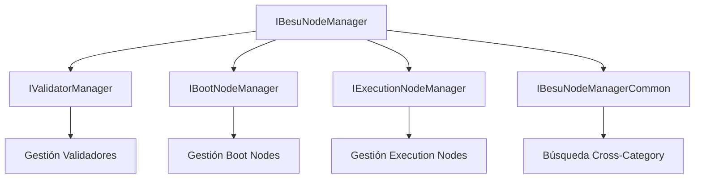
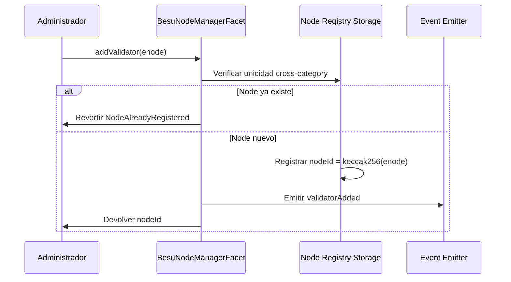
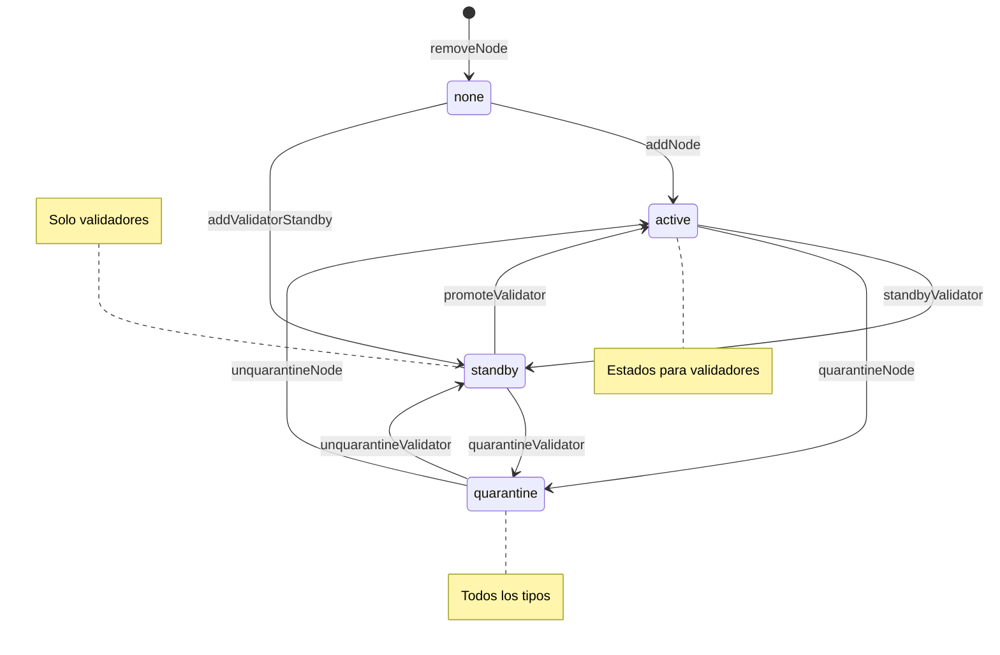
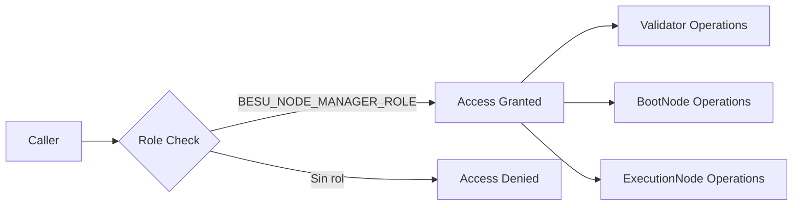
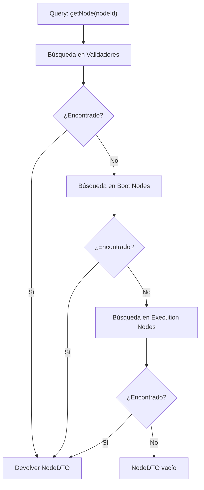

# ISBE-ART-02052 — SC Network governance

---

## 1. Identificación del Artefacto

| Campo                       | Valor                                                                                                                                               |
| --------------------------- | --------------------------------------------------------------------------------------------------------------------------------------------------- |
| **Nombre del artefacto**    | ISBE-ART-02052 — SC Network governance                                                                                                              |
| **Origen**                  | Documento derivado del repositorio oficial de Smart Contracts, consolidando información técnica sobre la gestión de nodos Hyperledger Besu en ISBE. |
| **Estado**                  | Validado                                                                                                                                            |
| **Versión del documento**   | 1.0.0                                                                                                                                               |
| **Fecha**                   | 2025-08-11                                                                                                                                          |
| **Repositorio (congelado)** | [https://github.com/alastria/isbe-contracts](https://github.com/alastria/isbe-contracts)                                                            |
| **Commit**                  | `2c3a2accef78bbf723c970c8139df34a4d3137c8`                                                                                                          |

---

## 2. Propósito del Artefacto

### Objetivo funcional:

Definir la arquitectura completa de gestión de nodos Hyperledger Besu mediante contratos inteligentes, implementando un sistema unificado para validadores, boot nodes y execution nodes con control de acceso basado en roles y capacidades de cuarentena.

### Beneficio para ISBE:

- **Gestión unificada**: Interfaz única para todos los tipos de nodos Besu
- **Control de acceso granular**: RBAC mediante rol `BESU_NODE_MANAGER_ROLE`
- **Estados de nodo**: Estados específicos por tipo (activo, standby, cuarentena)
- **Prevención de duplicados**: Enforce uniqueness across all node categories
- **Paginación eficiente**: Consultas optimizadas para redes de gran escala
- **Trazabilidad completa**: Eventos emitidos para todas las transiciones de estado

### Stakeholders clave:

- Operadores de red y administradores de nodos
- Equipos técnicos de desarrollo y operaciones
- Órganos de gobernanza técnica
- Auditores de seguridad y cumplimiento
- Entidades reguladoras

---

## 3. Alcance y Ciclo de Vida

### Fases cubiertas:

✅ **Definición**: Arquitectura modular con interfaces especializadas por tipo de nodo  
✅ **Desarrollo**: Implementación Diamond Facet con gestión unificada  
✅ **Validación**: Pruebas exhaustivas en `BesuNodeManager.spec.ts`  
✅ **Mantenimiento**: Evolución alineada con Hyperledger Besu y estándares ISBE

---

## 4. Descripción Técnica Detallada

### 4.1 Arquitectura Modular

El sistema sigue un patrón de diseño modular con interfaces especializadas:



### 4.2 Interfaces Especializadas

#### **IValidatorManager** - Gestión de Validadores

**Estados soportados**:

- `none` (0): No registrado
- `active` (1): Validando activamente
- `standby` (2): En espera para activación
- `quarantine` (3): En cuarentena por problemas

**Funciones clave**:

```solidity
// Lifecycle
addValidator(string enode) → bytes32 nodeId
addValidatorStandby(string enode) → bytes32 nodeId
promoteValidator(bytes32 nodeId) // standby → active
standbyValidator(bytes32 nodeId) // active → standby
quarantineValidator(bytes32 nodeId) // standby → quarantine
unquarantineValidator(bytes32 nodeId) // quarantine → standby
removeValidator(bytes32 nodeId) // any → none

// Queries
getValidatorState(bytes32 nodeId) → ValidatorState
isValidator(bytes32 nodeId) → bool
getTotalValidators(ValidatorState state) → uint256
getPaginatedValidators(state, pageSize, pageIndex) → NodeDTO[]
```

#### **IBootNodeManager** - Gestión de Boot Nodes

**Estados soportados**:

- `none` (0): No registrado
- `active` (1): Activo como punto de entrada
- `quarantine` (2): En cuarentena

**Funciones clave**:

```solidity
// Lifecycle
addBootNode(string enode) → bytes32 nodeId
quarantineBootNode(bytes32 nodeId) // active → quarantine
unquarantineBootNode(bytes32 nodeId) // quarantine → active
removeBootNode(bytes32 nodeId) // any → none

// Queries (similar pattern to validators)
```

#### **IExecutionNodeManager** - Gestión de Execution Nodes

**Estados soportados**:

- `none` (0): No registrado
- `active` (1): Ejecutando transacciones
- `quarantine` (2): En cuarentena

**Funciones clave**:

```solidity
// Lifecycle
addExecutionNode(string enode) → bytes32 nodeId
quarantineExecutionNode(bytes32 nodeId) // active → quarantine
unquarantineExecutionNode(bytes32 nodeId) // quarantine → active
removeExecutionNode(bytes32 nodeId) // any → none

// Queries (similar pattern to boot nodes)
```

### 4.3 Funcionalidad Cross-Category

**IBesuNodeManagerCommon** proporciona búsqueda unificada:

```solidity
function getNode(bytes32 nodeId) external view returns (NodeDTO memory)
```

**NodeDTO estructura**:

```solidity
struct NodeDTO {
    bytes32 nodeId; // keccak256(enode)
    string enode; // URL completa del nodo
    uint256 timestamp; // Fecha de registro
    NodeType nodeType; // VALIDATOR, BOOT_NODE, EXECUTION_NODE
    uint8 state; // Estado específico del tipo
}
```

### 4.4 Implementación Diamond Facet

**BesuNodeManagerFacet** unifica todas las interfaces:

```solidity
contract BesuNodeManagerFacet is
    BesuNodeManagerCommon, // Combina todos los managers
    IEIP2535Introspection // Soporte Diamond
{
    // 28 selectors totales:
    // - 11 validadores
    // - 8 boot nodes
    // - 8 execution nodes
    // - 1 función común (getNode)
}
```

---

## 5. Flujos de Gestión y Diagramas

### 5.1 Flujo de Registro de Nodos



### 5.2 Flujo de Transición de Estados



### 5.3 Flujo de Control de Acceso



### 5.4 Flujo de Búsqueda Unificada



---

## 6. Componentes y Dependencias

### 6.1 Contratos Principales

| Componente               | Ubicación                                                   | Responsabilidad                |
| ------------------------ | ----------------------------------------------------------- | ------------------------------ |
| `BesuNodeManagerFacet`   | `contracts/client/besuNodeManager/`                         | Facet Diamond unificada        |
| `IValidatorManager`      | `contracts/client/besuNodeManager/internal/validators/`     | Interface validadores          |
| `IBootNodeManager`       | `contracts/client/besuNodeManager/internal/bootnodes/`      | Interface boot nodes           |
| `IExecutionNodeManager`  | `contracts/client/besuNodeManager/internal/executionnodes/` | Interface execution nodes      |
| `IBesuNodeManagerCommon` | `contracts/client/besuNodeManager/internal/`                | Interface común cross-category |

### 6.2 Dependencias del Sistema

- **Diamond Proxy**: Patrón EIP-2535 para facet management
- **AccessControl**: RBAC con `BESU_NODE_MANAGER_ROLE`
- **ISBEPause**: Respeta pausa global del sistema
- **MockTimestamp**: Testing de timestamps en transiciones

### 6.3 Estructura de Storage

**Node Registry Storage**:

- Mapping nodeId → NodeDTO (información básica)
- Mapping nodeId → estado específico por tipo
- Enumerables sets por estado para paginación eficiente
- Mapping enode → nodeId para prevención de duplicados

---

## 7. Casos de Prueba y Validación

### 7.1 Pruebas de Unicidad Cross-Category (`BesuNodeManager.spec.ts`)

**Escenarios validados**:

- ✅ Enode como validador → intento como bootnode → `NodeAlreadyRegistered`
- ✅ Enode como bootnode → intento como execution node → `NodeAlreadyRegistered`
- ✅ Múltiples registros diferentes → todos exitosos

### 7.2 Pruebas de Control de Acceso

**RBAC Validation**:

- ✅ Administrador con rol → operaciones permitidas
- ✅ Agente sin rol → operaciones revertidas
- ✅ Transiciones de estado → emisión de eventos correspondientes

### 7.3 Pruebas de Estados y Transiciones

**Validator State Machine**:

- ✅ `addValidator` → estado `active`
- ✅ `addValidatorStandby` → estado `standby`
- ✅ `promoteValidator` (standby→active) → evento `ValidatorPromoted`
- ✅ `quarantineValidator` (standby→quarantine) → evento `ValidatorQuarantined`
- ✅ Ciclo completo de lifecycle con eventos auditables

### 7.4 Pruebas de Paginación y Consultas

**Performance Validation**:

- ✅ `getTotalValidators` → conteos correctos por estado
- ✅ `getPaginatedValidators` → resultados paginados correctos
- ✅ `getNode` cross-category → búsqueda unificada funcional

---

## 8. Consideraciones de Seguridad y Compliance

### 8.1 Aspectos de Seguridad

- **Unicidad enforcement**: Prevención de nodos duplicados across categories
- **RBAC estricto**: Solo `BESU_NODE_MANAGER_ROLE` puede gestionar nodos
- **Transiciones controladas**: Solo transiciones de estado válidas permitidas
- **Eventos audivables**: Trazabilidad completa de todas las operaciones

### 8.2 Cumplimiento Normativo

- **eIDAS2**: Gestión auditada de infraestructura crítica
- **NIS2**: Control de acceso y operaciones de red
- **RGPD**: Trazabilidad de operaciones de gestión
- **Estándares ISBE**: Alineación con arquitectura Diamond y RBAC

### 8.3 Best Practices Implementadas

- **Separación de concerns**: Interfaces especializadas por tipo de nodo
- **Paginación eficiente**: Soporte para redes de gran escala
- **Patrón Diamond**: Flexibilidad y upgradability
- **Testing exhaustivo**: Coverage completo de flujos críticos

---

## 9. Referencias y Enlaces

### 9.1 Documentación Relacionada

- [ISBE-ART-01000 — Proxies EIP‑2535 e ISBE Proxy](./ISBE-ART-01000.md)
- [ISBE-ART-02003 — Comprobación EOAs contra lista identidades](./ISBE-ART-02003.md)
- [Hyperledger Besu Documentation](https://besu.hyperledger.org/)

### 9.2 Implementaciones de Referencia

- `contracts/client/besuNodeManager/BesuNodeManagerFacet.sol`
- `contracts/client/besuNodeManager/internal/validators/IValidatorManager.sol`
- `contracts/client/besuNodeManager/internal/bootnodes/IBootNodeManager.sol`
- `contracts/client/besuNodeManager/internal/executionnodes/IExecutionNodeManager.sol`
- `test/client/BesuNodeManager.spec.ts`

### 9.3 Estándares Aplicados

- **EIP-2535**: Diamond Proxy Pattern
- **Hyperledger Besu**: Enode URL standard
- **ISBE RBAC**: Role-Based Access Control
- **Smart Contract Best Practices**: OpenZeppelin patterns

## 10. Reglas de Control y Actualización

| Tipo de cambio  | Versionado | Flujo de aprobación            | Documentación requerida              |
| --------------- | ---------- | ------------------------------ | ------------------------------------ |
| Evolutivo menor | X.Y+0.1    | Pull Request + revisión GT     | Release notes detalladas             |
| Evolutivo mayor | X+1.0      | Pull Request + revisión Comité | Informe de impacto y release notes   |
| Correctivo      | X.Y.Z+1    | Pull Request + revisión GT     | Descripción del fix en release notes |

---

Copyright © 2025 Comunidad de Madrid & Alastria
