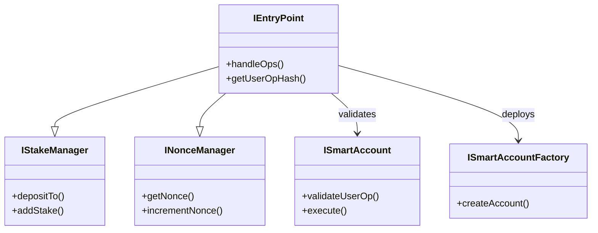
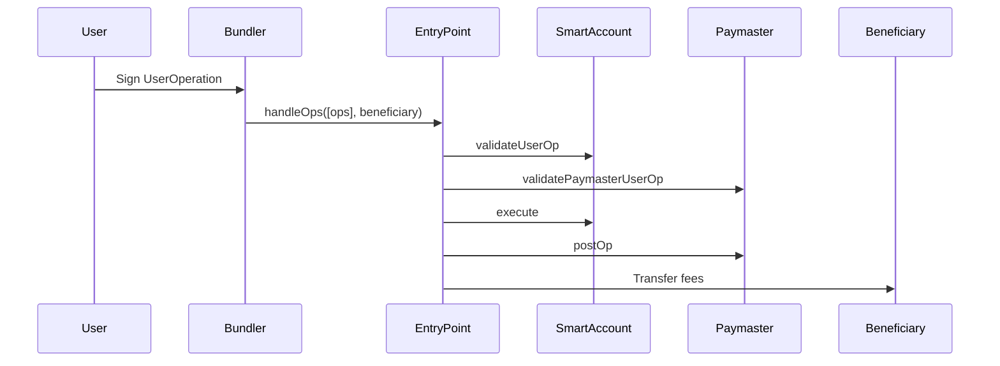
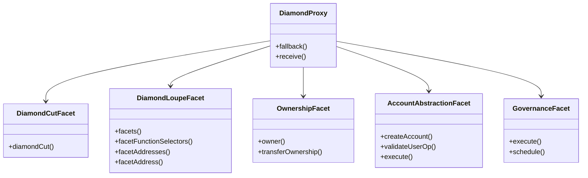
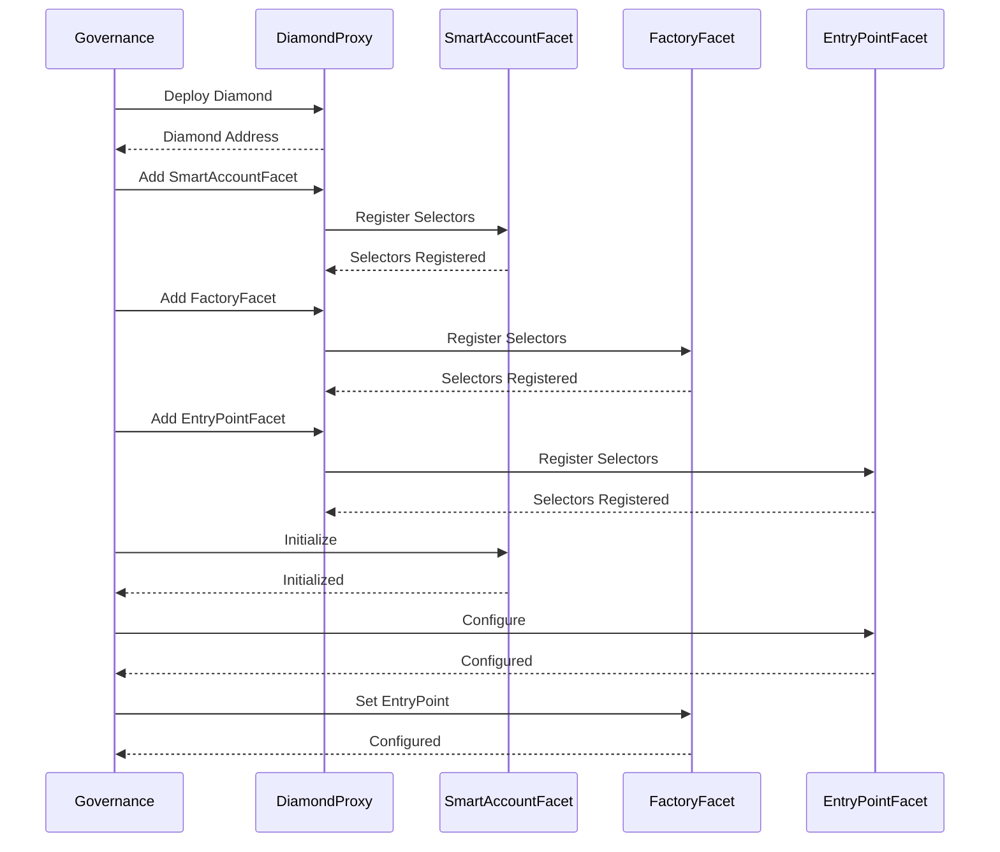
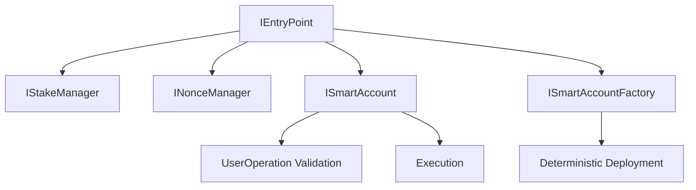
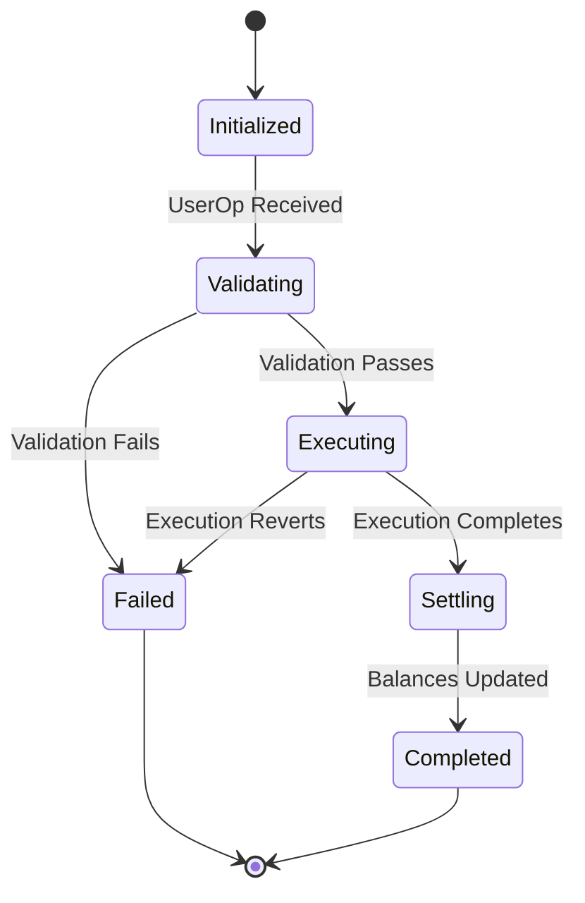
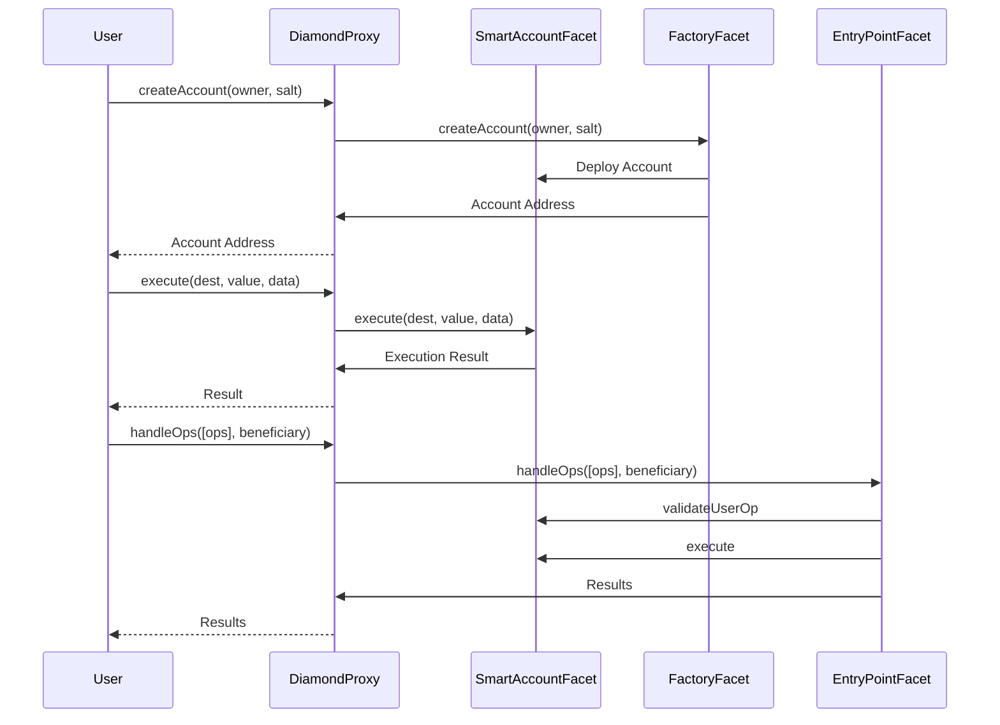

# ISBE-ART-08020: Implementación de Account Abstraction

---

## 1. Identificación del Documento

| Campo                    | Valor                                                                                                                                                 |
| ------------------------ | ----------------------------------------------------------------------------------------------------------------------------------------------------- |
| **Nombre del Artefacto** | ISBE-ART-08020 — Implementación de Account Abstraction                                                                                                |
| **Origen**               | Derivado del repositorio oficial de Smart Contracts, consolidando información técnica para la administración pública y organizaciones de financiación |
| **Estado**               | Validado                                                                                                                                              |
| **Versión**              | 0.1.1                                                                                                                                                 |
| **Fecha**                | 2025-08-11                                                                                                                                            |
| **Repositorio**          | [https://github.com/alastria/isbe-contracts](https://github.com/alastria/isbe-contracts)                                                              |
| **Commit**               | `2c3a2accef78bbf723c970c8139df34a4d3137c8`                                                                                                            |

---

## 2. Introducción

### 2.1 Propósito

Este documento especifica la implementación de Account Abstraction (ERC-4337) dentro del marco de trabajo de ISBE, permitiendo un comportamiento de cuenta programable a través de billeteras de contratos inteligentes con características que incluyen:

- Patrocinio de gas
- Transacciones por lotes
- Agregación de firmas
- Gestión de cuentas sin custodia

### 2.2 Alcance

La implementación abarca:

- **Componentes Núcleo**: Contratos de _smart account_, EntryPoint, Paymaster y Factory.
- **Interfaces**: `ISmartAccount`, `ISmartAccountFactory`, `IEntryPoint`, `IStakeManager`, `INonceManager`.
- **Cumplimiento de Estándares**: Implementación completa de ERC-4337 con extensiones de ISBE.

### 2.3 Audiencia

- Desarrolladores de contratos inteligentes.
- Arquitectos de sistemas.
- Auditores de seguridad.
- Gobernanza del protocolo.

## 3. Descripción General de la Arquitectura

### 3.1 Componentes del Sistema



### 3.2 Flujo de Datos



## 4. Especificaciones de Interfaces

### 4.1 ISmartAccount

**Propósito**: Interfaz de cuenta inteligente principal que extiende ERC-4337 con características específicas de ISBE.
**Funciones Clave**:

```solidity
function validateUserOp(
    PackedUserOperation calldata userOp,
    bytes32 userOpHash,
    uint256 missingAccountFunds
) external returns (uint256 validationData);
function execute(
    address dest,
    uint256 value,
    bytes calldata functionData
) external;
```

**Eventos**:

- `SmartAccountInitialized(address entryPoint)`
- `EntryPointUpdated(address newEntryPoint)`

**Errores**:

- `SmartAccount_NotFromEntryPointOrOwner()`
- `SmartAccount_CallFailed(bytes result)`
- `EntryPointInterfaceMismatch(address entryPoint)`

### 4.2 ISmartAccountFactory

**Propósito**: Despliegue determinista de cuentas inteligentes utilizando CREATE2.
**Funciones Clave**:

```solidity
function createAccount(address owner, bytes32 salt) external returns (address);
```

**Errores**:

- `EntryPointInterfaceMismatch(address entryPoint)`

### 4.3 IEntryPoint

**Propósito**: Coordinador central de operaciones que implementa el EntryPoint de ERC-4337.
**Funciones Clave**:

```solidity
function handleOps(
    PackedUserOperation[] calldata ops,
    address payable beneficiary
) external;
function getUserOpHash(
    PackedUserOperation calldata userOp
) external view returns (bytes32);
```

**Estructuras**:

- `PostOpMode`: Enumeración de resultados de la operación.
- `ReturnInfo`: Resultados agregados de la operación.
- `MemoryUserOp`: Representación de la operación en memoria.
- `UserOpInfo`: Metadatos de validación.

**Eventos**:

- `UserOperationEvent`
- `AccountDeployed`
- `UserOperationRevertReason`

### 4.4 IStakeManager

**Propósito**: Seguridad económica a través de depósitos y participaciones bloqueadas por tiempo.
**Funciones Clave**:

```solidity
function depositTo(address account) external payable;
function addStake(uint32 unstakeDelaySec) external payable;
function unlockStake() external;
function withdrawStake(address payable withdrawAddress) external;
```

**Estructuras**:

- `DepositInfo`: Información completa del depósito.
- `StakeInfo`: Información específica de la participación.

### 4.5 INonceManager

**Propósito**: Protección contra ataques de repetición mediante la gestión de nonces.
**Funciones Clave**:

```solidity
function getNonce(address account) external view returns (uint256);
function incrementNonce(address account) external;
```

**Eventos**:

- `NonceIncremented(address indexed account, uint256 nonce)`

## 5. Detalles de Implementación

### 5.1 Despliegue de Smart Account

**Proceso**:

1. La Factory valida la interfaz del EntryPoint.
2. Utiliza CREATE2 con un _salt_ para obtener una dirección determinista.
3. Inicializa la cuenta con el propietario y el EntryPoint.
4. Emite eventos de despliegue.

**Consideraciones de Seguridad**:

- Validación de la interfaz del EntryPoint.
- Verificación de la unicidad del _salt_.
- Validación de la dirección del propietario.

### 5.2 Procesamiento de Operaciones

**Fase de Validación**:

1. El EntryPoint recibe un lote de operaciones.
2. Valida en cada operación: - Firma. - Nonce. - Requisitos de pre-financiación. - Límites de gas.

**Fase de Ejecución**:

1. Ejecuta las operaciones validadas.
2. Gestiona la contabilidad del gas.
3. Gestiona el `postOp` del paymaster.
4. Distribuye las comisiones.

### 5.3 Seguridad Económica

**Sistema de Depósitos**:

- Las cuentas mantienen depósitos para la cobertura de gas.
- Los paymasters utilizan depósitos para el patrocinio.
- Los bundlers recolectan comisiones de los depósitos.

**Mecanismo de Staking**:

- Participaciones bloqueadas por tiempo (mínimo 1 día).
- Retirada en dos fases (desbloqueo → retirada).
- Previene la retirada inmediata de fondos.

## 6. Estrategia de Pruebas

### 6.1 Cobertura de Pruebas

| Componente          | Archivo de Prueba           | Áreas de Cobertura                    | Pruebas |
| ------------------- | --------------------------- | ------------------------------------- | ------- |
| SmartAccountFactory | SmartAccountFactory.spec.ts | Despliegue, Permisos, Creación        | 6       |
| SmartAccount        | SmartAccount.spec.ts        | Inicialización, Validación, Ejecución | 21      |
| EntryPoint          | EntryPoint.spec.ts          | Lotes, Validación, Gas, Paymasters    | 69      |

**Métricas de Cobertura**:

- Cobertura de Líneas: 100%
- Cobertura de Ramas: 100%
- Cobertura de Funciones: 100%

### 6.2 Escenarios Clave de Prueba

**Pruebas de Factory**:

- Validación de configuración.
- Control de acceso basado en roles.
- Verificación de interfaz del EntryPoint.
- Despliegue determinista.
  **Pruebas de Account**:
- Validación de inicialización.
- Validación de UserOperation.
- Flujo de ejecución.
- Recepción de tokens.
- Actualizaciones del EntryPoint.
  **Pruebas de EntryPoint**:
- Procesamiento de operaciones por lotes.
- Contabilidad de gas.
- Flujo de validación.
- Integración con Paymaster.

## 7. Consideraciones de Seguridad

### 7.1 Modelo de Amenazas

**Vectores de Ataque**:

- Ataques de repetición (mitigados por la gestión de nonces).
- Front-running (mitigado por el despliegue determinista).
- Gas griefing (mitigado por los límites de gas).
- Paymasters maliciosos (mitigados por el staking).

### 7.2 Medidas de Seguridad

**Control de Acceso**:

- Permisos basados en roles.
- Validación de interfaz del EntryPoint.
- Verificación del propietario.

**Seguridad Económica**:

- Requisitos de stake.
- Gestión de depósitos.
- Mecanismos de _slashing_.

**Seguridad de Ejecución**:

- Protección contra reentrancy.
- Aplicación de límites de gas.
- Verificaciones de validación.

## 8. Referencias

### 8.1 Referencias Externas

- [ERC-4337](https://eips.ethereum.org/EIPS/eip-4337): Estándar de Account Abstraction.
- [EIP-2938](https://eips.ethereum.org/EIPS/eip-2938): Precursor de Account Abstraction.
- [EIP-1014](https://eips.ethereum.org/EIPS/eip-1014): Opcode CREATE2.
- [EIP-712](https://eips.ethereum.org/EIPS/eip-712): Datos estructurados tipados.
- [EIP-1559](https://eips.ethereum.org/EIPS/eip-1559): Mecánica de tarifas de gas.
- [EIP-2535](https://eips.ethereum.org/EIPS/eip-2535): Diamonds, Multi-Facet Proxy.
- [EIP-1967](https://eips.ethereum.org/EIPS/eip-1967): Proxy Storage Slots.

### 8.2 Referencias Internas

- [ISBE-ART-01040](ISBE-ART-01040.md): Arquitectura de Gobernanza.
- [ISBE-ART-01050](ISBE-ART-01050.md): Patrón Diamond Proxy.
- [ISBE-ART-01060](ISBE-ART-01060.md): Sistema de Control de Acceso.

## 9. Mejoras Futuras

### 9.1 Mejoras del Protocolo

- Compatibilidad de cuentas multi-cadena.
- Soporte para operaciones _cross-chain_.
- Mecanismos de recuperación social.
- Técnicas de optimización de gas.

### 9.2 Mejoras de Seguridad

- Requisitos de stake dinámicos.
- Staking delegado.
- Condiciones de _slashing_ mejoradas.
- Funcionalidad de pausa de emergencia.

### 9.3 Optimizaciones Económicas

- Requisitos de stake variables.
- Sistemas basados en reputación.
- Optimización de tarifas de gas.
- Mejoras en el procesamiento por lotes.

## 10. Integración con la Gobernanza

### 10.1 Arquitectura Diamond Proxy

El sistema de gobernanza de ISBE implementa el patrón de Diamond Proxy que permite la actualización modular manteniendo una única dirección de contrato. Los contratos de Account Abstraction se integran como facetas dentro de esta arquitectura.



### 10.2 Puntos de Integración

#### 10.2.1 Registro de Facetas

Los contratos de Account Abstraction se registran como facetas en el Diamond Proxy mediante el proceso de despliegue de gobernanza:

```typescript
// From governance.ts deployment
const facets = [
    {
        facetName: 'SmartAccountFacet',
        contractName: 'SmartAccountFacet',
        resolverKey: ACCOUNT_ABSTRACTION_SMART_ACCOUNT_RESOLVER_KEY,
        isInit: true,
        isUseCase: true,
    },
    {
        facetName: 'SmartAccountFactoryFacet',
        contractName: 'SmartAccountFactoryFacet',
        resolverKey: ACCOUNT_ABSTRACTION_SMART_ACCOUNT_FACTORY_RESOLVER_KEY,
        isInit: false,
        isUseCase: true,
    },
    {
        facetName: 'EntryPointFacet',
        contractName: 'EntryPointFacet',
        resolverKey: ENTRY_POINT_RESOLVER_KEY,
        isInit: true,
        isUseCase: true,
    },
]
```

#### 10.2.2 Gestión de Selectores

Los selectores de funciones se gestionan cuidadosamente para prevenir conflictos:

```typescript
// Selector management in governance.ts
const selectors = {
    SmartAccountFacet: [
        'initializeSmartAccount(address)',
        'validateUserOp((address,uint256,uint256,uint256,uint256,uint256,uint256,address,uint256,uint256,bytes,bytes,bytes,bytes,bytes,bytes,bytes,bytes,bytes,bytes),bytes32,uint256)',
        'execute(address,uint256,bytes)',
        'updateEntryPoint(address)',
        'onERC721Received(address,address,uint256,bytes)',
        'onERC1155Received(address,address,uint256,uint256,bytes)',
        'onERC1155BatchReceived(address,address,uint256[],uint256[],bytes)',
    ],
    SmartAccountFactoryFacet: ['createAccount(address,bytes32)'],
    EntryPointFacet: [
        'handleOps((address,uint256,uint256,uint256,uint256,uint256,uint256,address,uint256,uint256,bytes,bytes,bytes,bytes,bytes,bytes,bytes,bytes,bytes,bytes)[],address)',
        'getUserOpHash((address,uint256,uint256,uint256,uint256,uint256,uint256,address,uint256,uint256,bytes,bytes,bytes,bytes,bytes,bytes,bytes,bytes,bytes,bytes))',
    ],
}
```

### 10.3 Proceso de Despliegue

#### 10.3.1 Inicialización

El proceso de despliegue en `governance.ts` sigue estos pasos:

1. **Despliegue del Diamond**:

```typescript
const diamond = await deployDiamond(
    admin,
    facets,
    diamondInit,
    diamondInitParams,
    diamondCutFacet,
    diamondLoupeFacet,
    ownershipFacet
)
```

2. **Registro de Facetas**:

```typescript
// Register account abstraction facets
await registerFacets(
    diamond,
    [SmartAccountFacet, SmartAccountFactoryFacet, EntryPointFacet],
    admin
)
```

3. **Configuración del Sistema**:

```typescript
// Set up account abstraction configuration
await configureAccountAbstraction(
    diamond,
    entryPointAddress,
    factoryAddress,
    admin
)
```

#### 10.3.2 Gestión de Configuración

La configuración se maneja a través del sistema de gobernanza:

```typescript
// Configuration constants from governance.ts
const ACCOUNT_ABSTRACTION_SMART_ACCOUNT_RESOLVER_KEY = '0x...'
const ACCOUNT_ABSTRACTION_SMART_ACCOUNT_FACTORY_RESOLVER_KEY = '0x...'
const ENTRY_POINT_RESOLVER_KEY = '0x...'
const CONFIGURATION_ID_ACCOUNT_ABSTRACTION_SMART_ACCOUNT = 1
```

### 10.4 Integración del Control de Acceso

#### 10.4.1 Definición de Roles

Account abstraction introduce roles específicos:

```typescript
// From governance.ts role definitions
const SMART_ACCOUNT_DEPLOYER_ROLE = keccak256('SMART_ACCOUNT_DEPLOYER_ROLE')
const ENTRY_POINT_ADMIN_ROLE = keccak256('ENTRY_POINT_ADMIN_ROLE')
```

#### 10.4.2 Asignación de Roles

Los roles se asignan durante el despliegue:

```typescript
// Role assignment in governance.ts
await accessControlFacet.grantRole(
    SMART_ACCOUNT_DEPLOYER_ROLE,
    entryPointAddress
)
await accessControlFacet.grantRole(ENTRY_POINT_ADMIN_ROLE, governanceAddress)
```

### 10.5 Mecanismo de Actualización

#### 10.5.1 Actualización de Facetas

Las facetas de Account Abstraction pueden actualizarse a través de la gobernanza:

```typescript
// Upgrade process in governance.ts
async function upgradeAccountAbstraction(
    diamond: Diamond,
    newSmartAccountImpl: string,
    newFactoryImpl: string,
    admin: Signer
) {
    const diamondCut = new DiamondCutFacet(diamond.address, admin)
    const cuts = [
        {
            facetAddress: newSmartAccountImpl,
            action: FacetCutAction.Replace,
            functionSelectors: getSelectors(newSmartAccountImpl),
        },
        {
            facetAddress: newFactoryImpl,
            action: FacetCutAction.Replace,
            functionSelectors: getSelectors(newFactoryImpl),
        },
    ]
    await diamondCut.diamondCut(cuts, ethers.ZeroAddress, '0x')
}
```

#### 10.5.2 Gestión de Versiones

Se mantiene el seguimiento de versiones:

```typescript
// Version management
const ACCOUNT_ABSTRACTION_VERSION = {
    SmartAccount: '1.0.0',
    Factory: '1.0.0',
    EntryPoint: '1.0.0',
}
```

### 10.6 Flujo de Trabajo de Gobernanza



### 10.7 Consideraciones de Seguridad

#### 10.7.1 Riesgos del Diamond Proxy

1. **Colisión de Selectores**:
    - Mitigada mediante una gestión cuidadosa de selectores.
    - Pruebas automatizadas de conflictos.
2. **Riesgos de Actualización**:
    - Actualizaciones con bloqueo de tiempo.
    - Requisitos de multi-firma.
    - Pruebas exhaustivas.
3. **Diseño de Almacenamiento**:
    - Slots de almacenamiento fijos para datos críticos.
    - Diseños de almacenamiento versionados.
    - Scripts de migración.

#### 10.7.2 Especificaciones de Account Abstraction

1. **Validación del EntryPoint**:
    - Verificaciones de interfaz en todas las interacciones.
    - Control de acceso basado en roles.
2. **Aislamiento de Facetas**:
    - Clara separación de responsabilidades.
    - Dependencias mínimas entre facetas.
    - Pruebas independientes.

### 10.8 Pruebas de Integración con Gobernanza

#### 10.8.1 Cobertura de Pruebas

```typescript
// From governance test files
describe('Account Abstraction Governance Integration', () => {
    it('should properly register all account abstraction facets', async () => {
        const facets = await diamondLoupeFacet.facets()
        expect(facets).to.include.members([
            {
                facetAddress: smartAccountFacetAddress,
                functionSelectors: SMART_ACCOUNT_SELECTORS,
            },
            {
                facetAddress: factoryFacetAddress,
                functionSelectors: FACTORY_SELECTORS,
            },
            {
                facetAddress: entryPointFacetAddress,
                functionSelectors: ENTRY_POINT_SELECTORS,
            },
        ])
    })
    it('should maintain proper role assignments', async () => {
        expect(
            await accessControlFacet.hasRole(
                SMART_ACCOUNT_DEPLOYER_ROLE,
                entryPointAddress
            )
        ).to.be.true
    })
})
```

#### 10.8.2 Pruebas de Integración

Escenarios clave de pruebas de integración:

1. **Despliegue de Facetas**:
    - Verificar que todos los selectores estén registrados correctamente.
    - Confirmar que las direcciones de las facetas sean correctas.
    - Probar el mecanismo de fallback.
2. **Escenarios de Actualización**:
    - Probar el reemplazo de facetas.
    - Verificar la preservación del almacenamiento.
    - Confirmar las actualizaciones de versión.
3. **Gestión de Roles**:
    - Probar asignaciones de roles.
    - Verificar el control de acceso.
    - Confirmar las restricciones basadas en roles.

### 10.9 Mejoras Futuras en Gobernanza

#### 10.9.1 Actualizaciones Modulares

- Actualizaciones independientes de facetas.
- Despliegues versionados.
- Capacidades de reversión.

#### 10.9.2 Seguridad Mejorada

- Actualizaciones con bloqueo de tiempo.
- Requisitos de multi-firma.
- Verificaciones de seguridad automatizadas.

#### 10.9.3 Gestión de Configuración

- Configuración dinámica.
- Ajustes de parámetros en tiempo de ejecución.
- Banderas de características.

## Appendix A: Relaciones de Interfaces



## Appendix B: Ciclo de Vida de la Operación



## Appendix C: Parámetros de Despliegue

```typescript
// Example deployment parameters from governance.ts
const ACCOUNT_ABSTRACTION_DEPLOYMENT_PARAMS = {
    initialStake: ethers.parseEther('10'),
    unstakeDelay: 86400, // 1 day
    minDeposit: ethers.parseEther('1'),
    gasLimits: {
        verificationGasLimit: 1000000,
        callGasLimit: 5000000,
        paymasterVerificationGasLimit: 500000,
        paymasterPostOpGasLimit: 500000,
    },
}
```

## Appendix D: Diagrama de Interacción de Facetas


