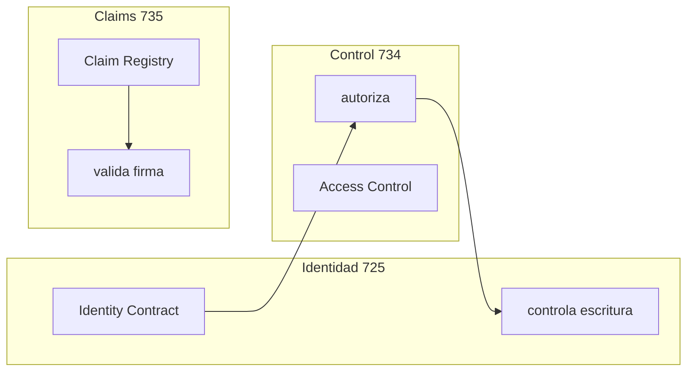
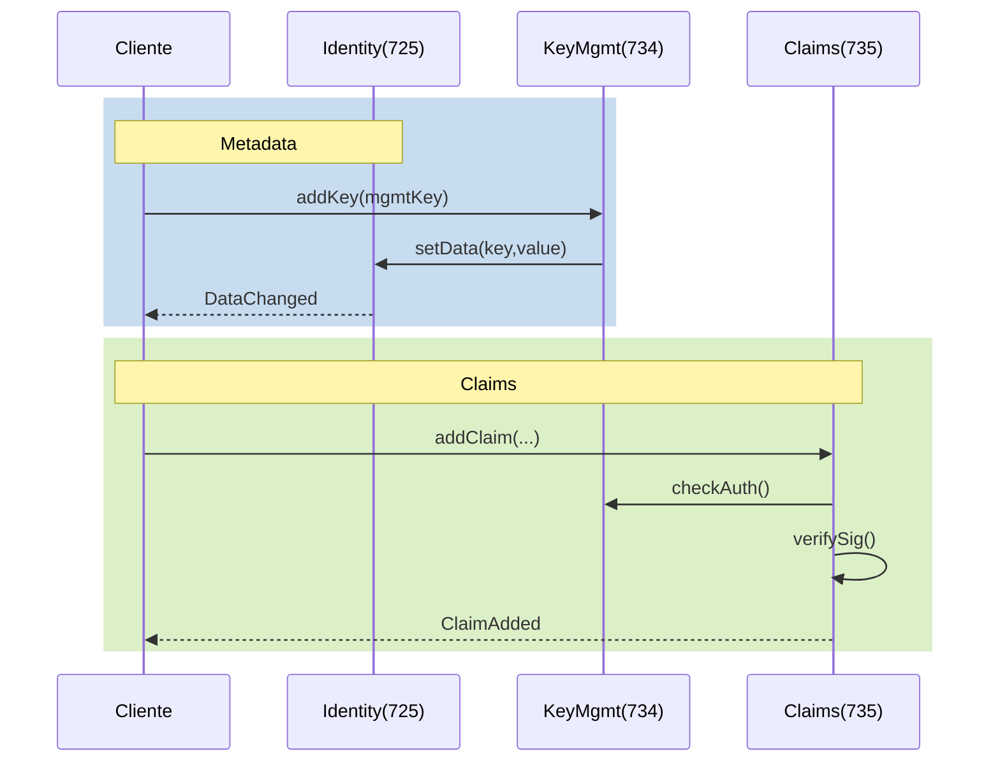

# DOC-001 · Patrón de identidad Smart Contract (ERC-725/734/735)

# 1. Resumen ejecutivo

## 1.1 Objetivo y alcance
- **Objetivo:** describir el **patrón de identidad on-chain** basado en **ERC-725 (identidad/metadata)**, **ERC-734 (gestión de claves)** y **ERC-735 (claims)**.
- **Alcance:** qué estandariza cada ERC, cómo se **combinan**, **modelo de datos** (claves y claims), **operaciones** básicas y consideraciones de **privacidad/seguridad**.
- **Fuera de alcance:** comparativa con **DID/VC** (DOC-003) e integración con **ERC-3643** (DOC-004).

## 1.2 Qué aporta
- **Identidad como contrato (725):** dirección del contrato representa al sujeto y almacena metadata key-value
- **Control por claves (734):** propósitos y umbrales para autorización multifirma
- **Claims verificables (735):** afirmaciones firmadas con estado on-chain
- **Separación clara:** 725=identidad, 734=control, 735=atributos
- **Privacidad por diseño:** PII off-chain, solo hashes/URI en cadena

## 1.3 Qué NO cubre
- No define políticas de confianza (qué emisores/claims aceptar)
- No implementa KYC/AML ni recuperación social
- No resuelve portabilidad fuera de EVM

# 2. Arquitectura lógica

## 2.1 Componentes y límites



| ERC | Es | Hace | NO hace |
|---|---|---|---|
| 725 | Contrato identidad | Metadata key-value | No autoriza escrituras |
| 734 | Control de acceso | Multifirma y rotación | No guarda metadata/claims |
| 735 | Claims verificables | Afirmaciones firmadas | No define trust policy |

## 2.2 Fronteras y flujos

### Fronteras
- **On-chain:** toda escritura pasa por 734 (≥ umbral)
- **Trust:** verificación externa de claims
- **Datos:** PII siempre off-chain

### Flujos principales


# 3. Modelo de datos

## 3.1 Claves y control

### Propósitos estándar
```solidity
uint256 constant MANAGEMENT_KEY = 1;  // gobierno
uint256 constant ACTION_KEY = 2;      // operación
uint256 constant CLAIM_SIGNER_KEY = 3;// emisión claims
uint256 constant ENCRYPTION_KEY = 4;  // cifrado (opt)
```

### Estructura clave
```solidity
struct Key {
    bytes32 key;         // hash de pública
    uint256[] purposes;  // MANAGEMENT, ACTION...
    uint256 keyType;     // 1 = ECDSA
    uint256 weight;      // peso para umbral
}
```

### Operaciones principales
```solidity
interface IERC734 {
    function addKey(bytes32 _key, uint256 _purpose, uint256 _keyType, uint256 _weight) 
        external returns (bool success);
    
    function removeKey(bytes32 _key, uint256 _purpose) 
        external returns (bool success);
    
    function setThreshold(uint256 _purpose, uint256 _threshold)
        external returns (bool success);
        
    function keyHasPurpose(bytes32 _key, uint256 _purpose)
        external view returns (bool exists);
}
```

## 3.2 Claims verificables

### Estructura base
```solidity
struct Claim {
    bytes32 topic;     // tipo (KYC, etc)
    address issuer;    // quién firma
    bytes signature;   // firma del payload
    bytes data;       // hash/flags (no PII)
    string uri;       // evidencia off-chain
}

// Payload canónico
bytes32 payload = keccak256(abi.encodePacked(
    topic,
    subject,   // previene replay
    version,   // permite evolución
    keccak256(data)
));
```

### Operaciones principales
```solidity
interface IERC735 {
    function addClaim(
        bytes32 _topic,
        uint256 _scheme,
        address _issuer,
        bytes calldata _signature,
        bytes calldata _data,
        string calldata _uri
    ) external returns (bytes32 claimRequestId);
    
    function removeClaim(bytes32 _claimId) 
        external returns (bool success);
}
```

### Validación claims
```solidity
function validateClaim(Claim memory c) internal view returns (bool) {
    // 1. Reconstruir payload
    bytes32 payload = keccak256(abi.encodePacked(
        c.topic,
        msg.sender,  // subject
        keccak256(c.data)
    ));
    
    // 2. Verificar firma
    address signer = recoverSigner(payload, c.signature);
    require(signer == c.issuer, "Invalid signature");
    
    // 3. Verificar estado
    require(!revoked[c.id], "Claim revoked");
    require(block.timestamp >= c.validFrom, "Claim not yet valid");
    require(c.validTo == 0 || block.timestamp <= c.validTo, "Claim expired");
    
    // 4. Política específica del verificador
    return isIssuerAndTopicAllowed(c.issuer, c.topic);
}
```

## 3.3 Estado claims

### Estructura estado
```solidity
struct ClaimStatus {
    bool revoked;
    uint256 validFrom;
    uint256 validTo;
}

mapping(bytes32 => ClaimStatus) public claimStatus;
```

### Eventos
```solidity
event ClaimAdded(
    bytes32 indexed claimId,
    bytes32 indexed topic,
    address indexed issuer
);

event ClaimRevoked(
    bytes32 indexed claimId,
    address indexed revoker,
    uint256 timestamp
);
```

# 4. Operaciones (playbooks)

## 4.1 Alta inicial

### Pasos
1. Deploy contrato identity
2. Configurar claves iniciales:
```solidity
function setupIdentity(address[] calldata controllers) external {
    require(msg.sender == address(this), "Only identity");
    
    for (uint i = 0; i < controllers.length; i++) {
        addKey(
            keccak256(abi.encodePacked(controllers[i])),
            MANAGEMENT_KEY,
            1, // ECDSA
            1  // weight
        );
    }
    
    setThreshold(MANAGEMENT_KEY, controllers.length);
    setThreshold(ACTION_KEY, 1);
}
```

## 4.2 Rotación claves

### Pasos seguros
1. Añadir nueva clave
2. Verificar umbral alcanzado
3. Retirar clave antigua
4. Actualizar metadata

```solidity
// Ejemplo rotación
function rotateKey(bytes32 oldKey, bytes32 newKey, uint256 purpose) external {
    require(keyHasPurpose(msg.sender, MANAGEMENT_KEY), "Not authorized");
    
    // 1. Añadir nueva
    addKey(newKey, purpose, 1, 1);
    
    // 2. Verificar umbral
    require(getKeyWeight(purpose) >= getThreshold(purpose), "Insufficient weight");
    
    // 3. Retirar antigua
    removeKey(oldKey, purpose);
}
```

## 4.3 Gestión claims

### Emisión
```solidity
function issueClaim(
    address subject,
    bytes32 topic,
    bytes calldata data
) external returns (bytes32) {
    require(keyHasPurpose(msg.sender, CLAIM_SIGNER_KEY), "Not issuer");
    
    // 1. Preparar payload
    bytes32 payload = keccak256(abi.encodePacked(
        topic,
        subject,
        keccak256(data)
    ));
    
    // 2. Firmar
    bytes memory signature = sign(payload);
    
    // 3. Emitir
    return addClaim(topic, msg.sender, signature, data, "");
}
```

### Verificación
```solidity
function verifyClaim(bytes32 claimId) external view returns (bool) {
    Claim memory c = getClaim(claimId);
    
    // 1. Validar firma/estado
    bool valid = validateClaim(c);
    
    // 2. Política específica
    return valid && acceptableIssuer[c.issuer];
}
```

## 4.4 Revocación

### Soft delete (recomendado)
```solidity
function revokeClaim(bytes32 claimId) external {
    require(msg.sender == getClaim(claimId).issuer, "Not issuer");
    
    claimStatus[claimId].revoked = true;
    emit ClaimRevoked(claimId, msg.sender, block.timestamp);
}
```

# 5. Roles y reglas

## 5.1 Roles principales

| Rol | Poder | Uso |
|-----|-------|-----|
| Controller | MANAGEMENT | Gobierno |
| Operator | ACTION | Operativa |
| Issuer | CLAIM_SIGNER | Certificación |
| Verifier | Read-only | Consumo |

## 5.2 Reglas prácticas (muy concisas)

- **Separación de funciones:** MANAGEMENT ≠ ACTION ≠ CLAIM_SIGNER
- **Umbrales:** gobierno > operación (2/3 vs 1/n)
- **Rotación:** nuevo → verificar → retirar viejo
- **Privacidad:** solo hashes/URI en cadena

> **Antipatrón:** mezclar gobierno/operación o exponer PII en cadena.