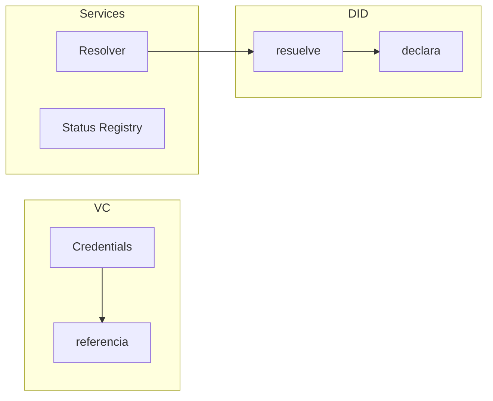
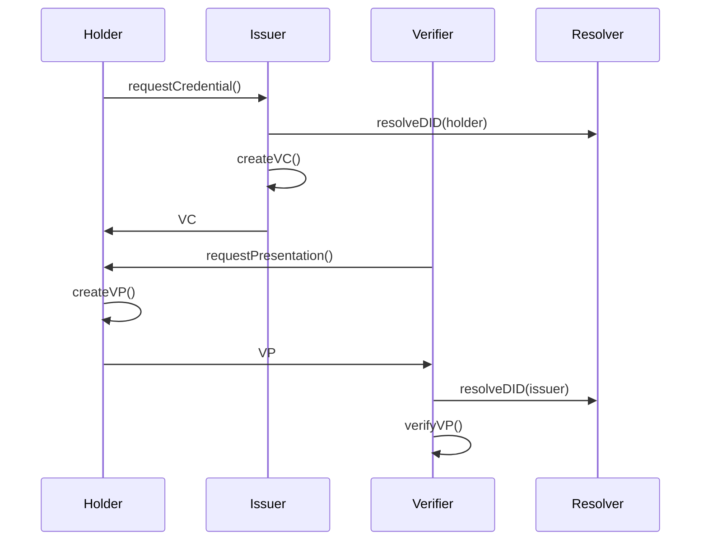

# DOC-002 · Patrón de identidad distribuida (DID/VC)

# 1. Resumen ejecutivo

## 1.1 Objetivo y alcance
- **Objetivo:** describir el **patrón de identidad distribuida** basado en **DID/VC**
- **Alcance:** estándares W3C, modelo de datos y operaciones básicas
- **Fuera de alcance:** comparativa con ERC-725/734/735 e integración ERC-3643

## 1.2 Qué aporta
- **Identificador como string (DID):** formato universal para sujeto + claves/endpoints
- **Control descentralizado:** múltiples métodos de autenticación (keys, biometría, contratos)
- **Credenciales verificables:** claims firmados con estado y metadata estándar
- **Independencia blockchain:** funciona en cualquier red o incluso off-chain
- **Estándares W3C:** alta adopción en ecosistema SSI

## 1.3 Qué NO cubre
- No resuelve UX/UI ni integración con wallets
- No determina políticas de confianza
- No define detalles técnicos específicos

# 2. Arquitectura lógica

## 2.1 Componentes y límites



| Componente | Es | Hace | NO hace |
|---|---|---|---|
| DID | Identificador universal | Resuelve a documento | No almacena claims |
| Document | Contenedor métodos/servicios | Declara capacidades | No guarda estado |
| VC | Claim firmado | Afirma atributos | No define trust |

## 2.2 Fronteras y flujos

### Fronteras
- **Control:** verificación de métodos en DID Document
- **Trust:** confianza en issuer + firma válida
- **Estado:** verificación vía endpoints declarados

### Flujo básico


# 3. Modelo de datos

## 3.1 Verification Methods

### Tipos principales
```json
{
  "verificationMethod": [{
    "id": "#key-1",
    "type": "EcdsaSecp256k1VerificationKey2019",
    "controller": "did:ethr:0x123...",
    "publicKeyHex": "0x456..."
  }],
  "authentication": ["#key-1"],
  "assertionMethod": ["#key-2"]
}
```

### Relaciones estándar
- **authentication:** control del DID
- **assertionMethod:** firma de VCs
- **keyAgreement:** cifrado
- **capabilityInvocation:** delegación

## 3.2 Verifiable Credentials

### Estructura mínima
```json
{
  "@context": ["https://www.w3.org/2018/credentials/v1"],
  "type": ["VerifiableCredential"],
  "issuer": "did:ethr:0xissuer...",
  "credentialSubject": {
    "id": "did:ethr:0xsubject...",
    "claims": "..."
  },
  "proof": {
    "type": "EcdsaSecp256k1Signature2019",
    "proofPurpose": "assertionMethod",
    "verificationMethod": "did:ethr:0xissuer...#key-1",
    "jws": "eyJhbGci..."
  }
}
```

## 3.3 Estado y revocación

### Smart Contract Registry
```solidity
contract CredentialRegistry {
    mapping(bytes32 => bool) public revoked;
    mapping(bytes32 => uint256) public validTo;
    
    event CredentialRevoked(bytes32 indexed id);
    event CredentialSuspended(bytes32 indexed id, uint256 until);
}
```

### StatusList2021
```json
{
  "statusPurpose": "revocation",
  "statusListIndex": "123",
  "statusListCredential": "https://example.com/statuslist"
}
```

# 4. Operaciones básicas

## 4.1 Gestión DID Document

### Alta inicial
1. Generar claves seguras
2. Crear DID Document
3. Registrar métodos
4. Publicar servicios

### Rotación claves
1. Añadir nuevo método
2. Verificar control
3. Retirar antiguo
4. Actualizar servicios

## 4.2 Emisión VCs

### Pasos emisor
1. Resolver DID subject
2. Verificar control
3. Crear VC
4. Firmar y entregar

### Pasos holder
1. Verificar firma
2. Validar metadata
3. Almacenar seguro

## 4.3 Presentación VPs

### Generación
1. Seleccionar VCs
2. Crear VP
3. Firmar con auth
4. Incluir challenge

### Verificación
1. Validar VP
2. Resolver DIDs
3. Verificar firmas
4. Comprobar estado

## 4.4 Revocación

### On-chain
```solidity
function revoke(bytes32 credentialId) public {
    require(isIssuer[msg.sender], "Not issuer");
    revoked[credentialId] = true;
    emit CredentialRevoked(credentialId);
}
```

### Off-chain
1. Actualizar status list
2. Firmar nueva lista
3. Publicar endpoint
4. Propagar evento

# 5. Roles y reglas

## 5.1 Roles mínimos

| Rol | Control | Propósito |
|-----|---------|-----------|
| Holder | authentication | VPs |
| Issuer | assertionMethod | VCs |
| Verifier | - | Consumo |
| Controller | management | DID |

## 5.2 Reglas prácticas (muy concisas)

- **Separación de funciones:** Authentication ≠ Assertion ≠ Management
- **Propósitos clave:**
  ```json
  {
    "authentication": ["#key-1"],    // solo auth/VPs
    "assertionMethod": ["#key-2"],   // solo firma VCs
    "management": ["#key-3"]         // solo control DID
  }
  ```
- **Control y verificación:**
  - HSM para claves críticas
  - Rotación periódica
  - Política explícita
- **Estado y privacidad:**
  - Status off-chain por defecto
  - Eventos sin metadata
  - Evidencias por hash

> **Antipatrón:** mezclar claves entre roles o usar la misma para todo.