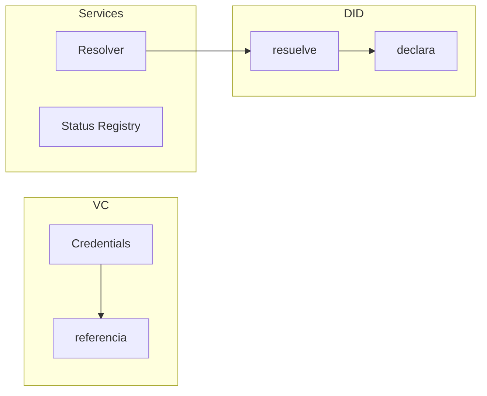
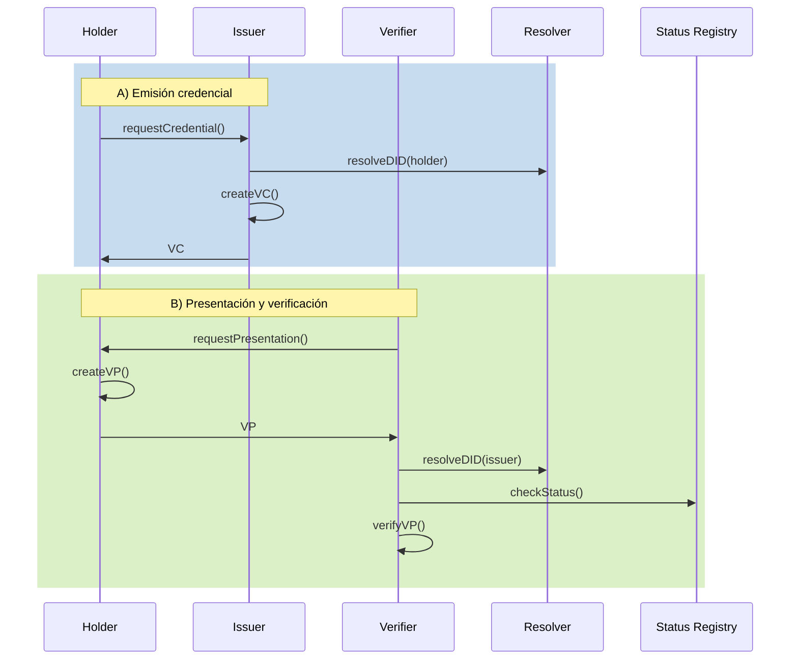
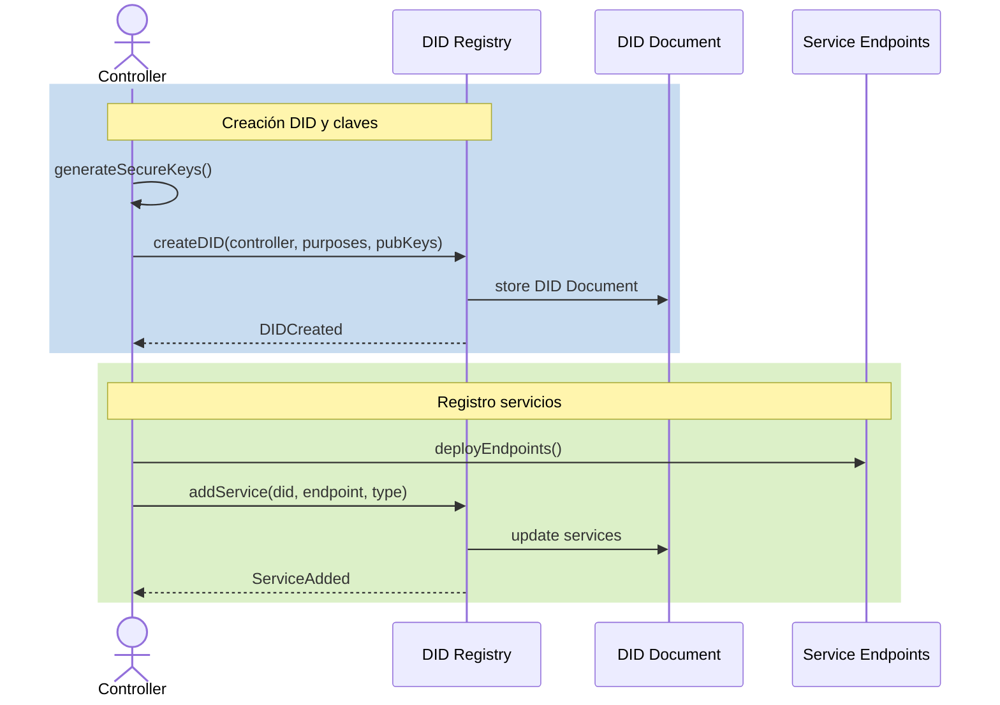
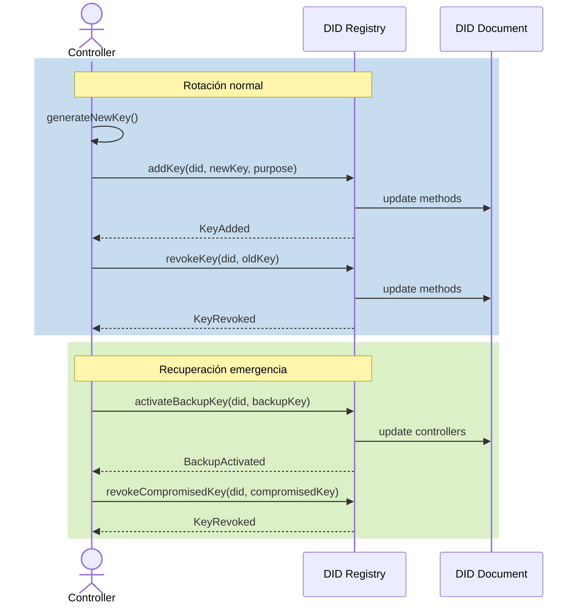
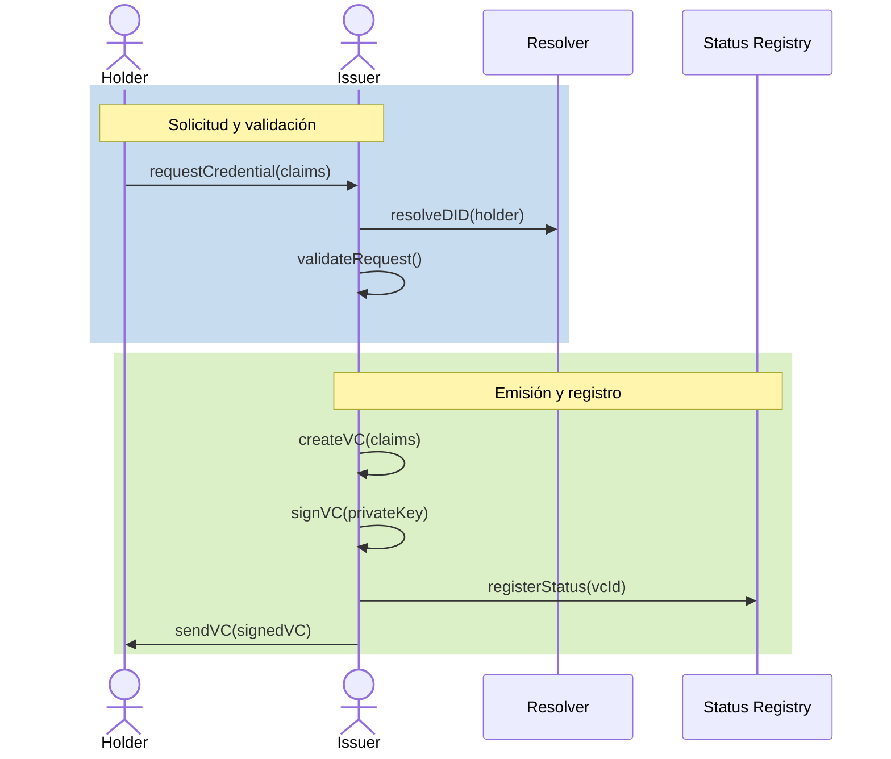
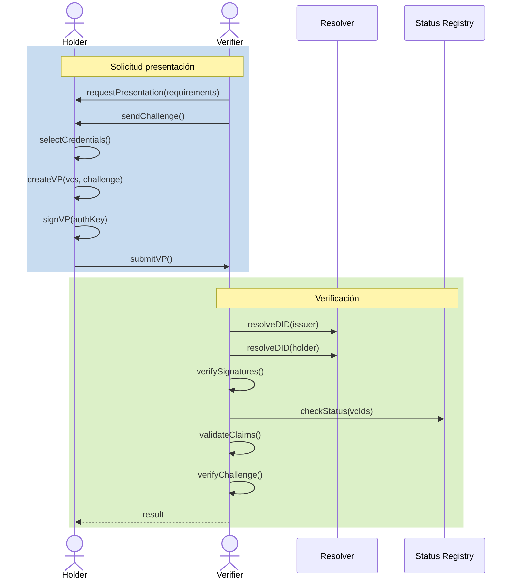

# DOC-002 · Patrón de identidad distribuida (DID/VC)

# 1. Resumen ejecutivo

## 1.1 Objetivo y alcance
- **Objetivo:** describir el **patrón de identidad distribuida** basado en **DID/VC**
- **Alcance:** estándares W3C, modelo de datos y operaciones básicas
- **Fuera de alcance:** comparativa con ERC-725/734/735 e integración ERC-3643

## 1.2 Qué aporta
- **Identificador como string (DID):** formato universal para sujeto + claves/endpoints
- **Control descentralizado:** múltiples métodos de autenticación (keys, biometría, contratos)
- **Credenciales verificables:** claims firmados con estado y metadata estándar
- **Independencia blockchain:** funciona en cualquier red o incluso off-chain
- **Estándares W3C:** alta adopción en ecosistema SSI

## 1.3 Qué NO cubre
- No resuelve UX/UI ni integración con wallets
- No determina políticas de confianza
- No define detalles técnicos específicos

# 2. Arquitectura lógica

## 2.1 Componentes y límites



[Tabla de componentes se mantiene igual...]

## 2.2 Flujos principales



[Las secciones 3.1, 3.2 y 3.3 se mantienen igual...]

# 4. Operaciones básicas

## 4.1 Gestión DID Document

### Pasos
1. Generar claves seguras
2. Crear DID Document
3. Registrar métodos
4. Publicar servicios

### Implementación (did:ethr)
```solidity
contract EthereumDIDRegistry {
    function createDID(
        address identity,
        uint256[] calldata purposes,
        bytes32[] calldata pubKeys
    ) external {
        require(msg.sender == identity, "Not authorized");
        
        for (uint i = 0; i < pubKeys.length; i++) {
            addKey(identity, pubKeys[i], purposes[i]);
        }
        
        emit DIDCreated(identity);
    }
}
```

### Flujo detallado


## 4.2 Rotación claves

### Pasos
1. Añadir nuevo método
2. Verificar control
3. Retirar antiguo
4. Actualizar servicios

### Implementación
```solidity
function rotateKey(
    address identity,
    bytes32 oldKey,
    bytes32 newKey,
    uint256 purpose
) external {
    require(isController(msg.sender, identity), "Not authorized");
    
    addKey(identity, newKey, purpose);
    require(validSigningKeys(identity) >= 2, "Need backup key");
    revokeKey(identity, oldKey);
    
    emit KeyRotated(identity, oldKey, newKey);
}
```

### Flujo detallado


## 4.3 Emisión VCs

### Pasos emisor
1. Resolver DID subject
2. Verificar control
3. Crear VC
4. Firmar y entregar

### Implementación (TypeScript)
```typescript
async function issueVC(
    subject: string,
    claims: any,
    issuerDid: string,
    privateKey: string
): Promise<VerifiableCredential> {
    // 1. Resolver DID subject
    const didDoc = await resolver.resolve(subject);
    
    // 2. Crear VC
    const credential = {
        "@context": ["https://www.w3.org/2018/credentials/v1"],
        type: ["VerifiableCredential"],
        issuer: issuerDid,
        issuanceDate: new Date().toISOString(),
        credentialSubject: {
            id: subject,
            ...claims
        }
    };
    
    // 3. Firmar
    const proof = await createProof(credential, privateKey);
    
    return {
        ...credential,
        proof
    };
}
```

### Flujo detallado


## 4.4 Presentación VPs

### Pasos
1. Seleccionar VCs
2. Crear VP
3. Firmar con auth
4. Incluir challenge

### Implementación (TypeScript)
```typescript
async function createVP(
    vcs: VerifiableCredential[],
    holderDid: string,
    privateKey: string,
    challenge: string
): Promise<VerifiablePresentation> {
    const presentation = {
        "@context": ["https://www.w3.org/2018/credentials/v1"],
        type: ["VerifiablePresentation"],
        holder: holderDid,
        verifiableCredential: vcs,
    };

    const proof = await createProof(presentation, privateKey, {
        challenge,
        domain: "example.com"
    });

    return {
        ...presentation,
        proof
    };
}
```

### Flujo detallado


[Las secciones 5.1 y 5.2 se mantienen igual...]

> **Antipatrón:** mezclar claves entre roles o usar la misma para todo.

# 5. Roles y reglas

## 5.1 Roles mínimos

| Rol | Control | Propósito |
|-----|---------|-----------|
| Holder | authentication | VPs |
| Issuer | assertionMethod | VCs |
| Verifier | - | Consumo |
| Controller | management | DID |

## 5.2 Reglas prácticas (muy concisas)

- **Separación de funciones:** Authentication ≠ Assertion ≠ Management
- **Propósitos clave:**
  ```json
  {
    "authentication": ["#key-1"],    // solo auth/VPs
    "assertionMethod": ["#key-2"],   // solo firma VCs
    "management": ["#key-3"]         // solo control DID
  }
  ```
- **Control y verificación:**
  - HSM para claves críticas
  - Rotación periódica
  - Política explícita
- **Estado y privacidad:**
  - Status off-chain por defecto
  - Eventos sin metadata
  - Evidencias por hash

> **Antipatrón:** mezclar claves entre roles o usar la misma para todo.