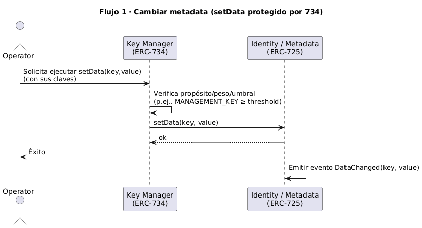
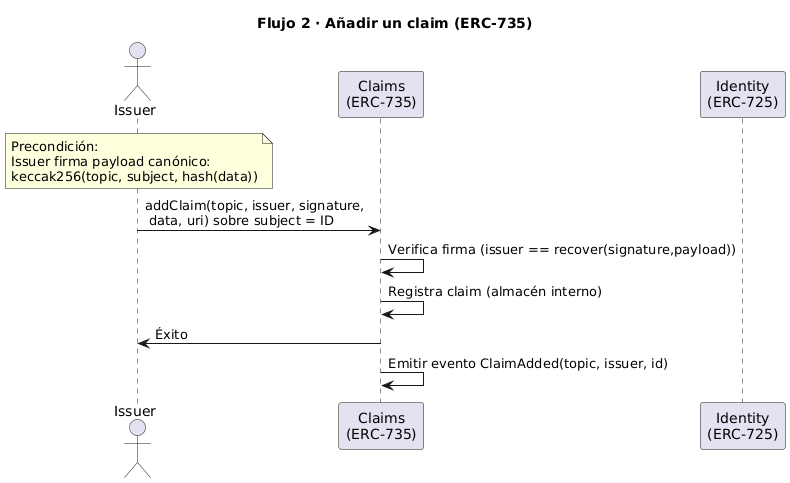
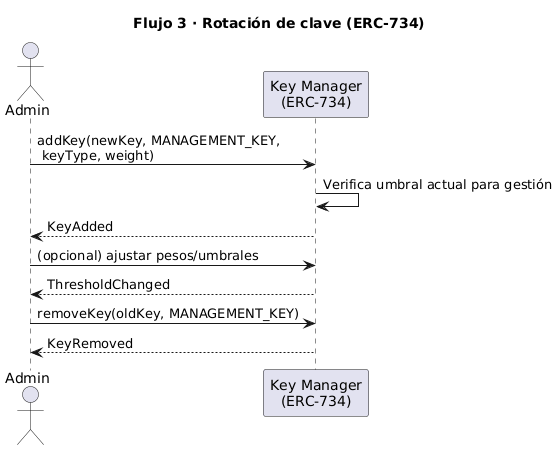
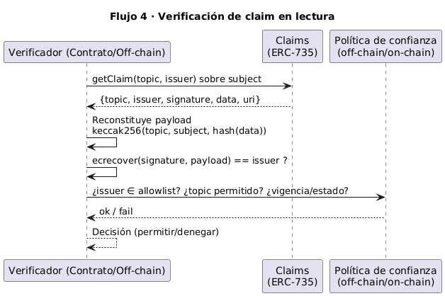
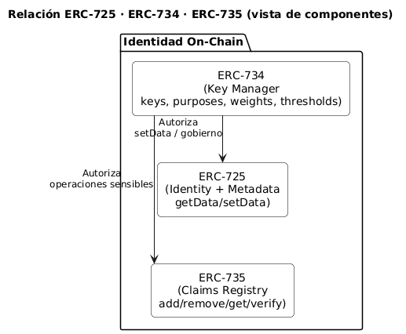
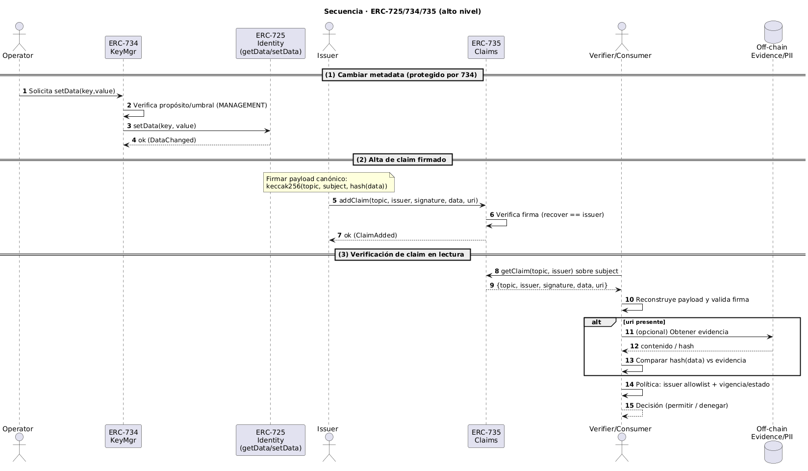

# DOC-001 · OnchainID (ERC-725/734/735)

1. Resumen ejecutivo  
   1.1 Objetivo y alcance  
   1.2 Qué aporta (5 bullets)  
   1.3 Qué NO cubre  

2. Fundamentos y estándares base  
   2.1 ERC-725 — Identidad/metadata  
   2.2 ERC-734 — Gestión de claves (Key Manager)  
   2.3 ERC-735 — Claims (modelo y firmas)  
   2.4 Relación 725–734–735 dentro de OnchainID  

3. Arquitectura lógica  
   3.1 Componentes internos (Identity, Key Manager, Claims)  
   3.2 Fronteras de confianza y flujo de datos  
   3.3 Diagrama de alto nivel (placeholder)  

4. Modelo de datos  
   4.1 Claves: tipos, propósitos, pesos, umbrales  
   4.2 Claims: `topic`, `issuer`, `signature`, `data`, `uri`  
   4.3 Estados: vigencia, expiración, revocación  

5. Operaciones y flujos  
   5.1 Alta/configuración de identidad y claves  
   5.2 Rotación/recuperación de claves  
   5.3 Emisión/verificación de claims  
   5.4 Revocación/actualización de claims  

6. Roles y gobernanza  
   6.1 Controladores/propietarios vs gestores de clave  
   6.2 Emisores de claims (criterios de confianza)  
   6.3 Separación de funciones y límites operativos  

7. Privacidad y cumplimiento  
   7.1 Minimización de datos y PII off-chain  
   7.2 Evidencias y enlaces externos  
   7.3 Consideraciones regulatorias (KYC/AML, GDPR, eIDAS – alto nivel)  

8. Seguridad y riesgos  
   8.1 Amenazas (claves, emisores, suplantación)  
   8.2 Controles técnicos/operativos recomendados  

9. Interoperabilidad y compatibilidad  
   9.1 Patrones de firma y compatibilidad con wallets EVM  
   9.2 Lecturas/ABIs típicas para integradores  
   9.3 Consideraciones de rendimiento/gas  

10. Eventos y trazabilidad  
    10.1 Eventos clave (claves y claims)  
    10.2 Observabilidad y auditoría  

11. Glosario  

12. Referencias técnicas  

# 1. Resumen ejecutivo

## 1.1 Objetivo y alcance

**Objetivo.** Explicar con claridad cómo **OnchainID** implementa identidad on-chain mediante **ERC-725/734/735**, y dejar una base común para compararlo después con otros modelos (DID+VC) y, más adelante, estudiar integraciones.

**Alcance (incluye):**
- Descripción de los **estándares** y su papel: ERC-725 (identidad/metadata), ERC-734 (gestión de claves), ERC-735 (claims).
- **Arquitectura lógica** de OnchainID: componentes internos, fronteras de confianza y flujo de datos.
- **Modelo de datos**: claves (tipos/propósitos/umbrales) y claims (topic/issuer/signature/data/uri) con sus estados.
- **Operaciones y flujos**: alta/rotación/recuperación de claves; emisión/verificación/revocación de claims.
- **Roles y gobernanza**: controladores/gestores y emisores de claims.
- **Privacidad, seguridad y trazabilidad**: minimización de datos, riesgos y eventos relevantes.

**Fuera de alcance (no cubre):**
- Detalles de **despliegue**, **upgrades** o factories.
- Políticas de **confianza** específicas (qué emisores/temas aceptar).
- Diseño detallado de **integración con ERC-3643** (se abordará en DOC-004).
- Comparativa con **DID/VC** (se abordará en DOC-003).

## 1.2 Qué aporta

- **Identidad soberana en cadena.** Un contrato **representa** al sujeto y persiste más allá de claves concretas; la identidad no “muere” si rotas llaves.
- **Gestión de claves robusta.** **ERC-734** permite altas/bajas, **propósitos**, **pesos** y **umbrales** (multifirma) para operaciones sensibles.
- **Afirmaciones verificables on-chain.** **ERC-735** modela *claims* firmados por emisores, con lectura determinista y trazabilidad por eventos.
- **Auditabilidad nativa.** Cambios de claves y de estado de claims emiten **eventos** que facilitan monitoreo, forénsica y cumplimiento.
- **Componibilidad EVM.** Al ser estándares ERC, es fácil integrarlo con otros contratos, herramientas y patrones comunes del ecosistema.

## 1.3 Qué NO cubre

- **Política de confianza.** No define qué **emisores** son válidos ni qué **topics** deben aceptarse; eso es decisión de gobernanza externa.
- **PII y evidencias.** No prescribe cómo gestionar **datos personales** ni almacenamiento/retención de **evidencias** (se recomienda mantenerlas *off-chain*).
- **Verificación humana/legal.** No resuelve procesos KYC/AML/eIDAS; asume que el **issuer** ya verificó fuera de cadena.
- **Identidad fuera de EVM.** No estandariza portabilidad multi-ecosistema (DNS/HTTPS, métodos DID, etc.); está centrado en **on-chain EVM**.
- **Experiencia de usuario.** No especifica wallets UX, recuperación social fuera de contrato, ni interfaces de presentación al usuario final.

---

# 2. Fundamentos y estándares base

## 2.1 ERC-725 — Identidad/metadata

**Qué es.** Propone la **identidad como contrato inteligente**. La dirección del contrato *es* el sujeto (persona/entidad) y expone un **espacio de datos** tipo *key–value* para metadata vinculada a esa identidad.

**Objetivos clave**
- **Anclar la identidad en cadena** sin atarla a una clave concreta (las claves podrán rotar después).
- **Guardar/descubrir metadata** relevante (URIs, hashes, flags) sin meter PII en la cadena.
- **Emitir eventos** de cambio para auditabilidad.

**Conceptos**
- **Identity Contract**: dirección on-chain que representa al sujeto.
- **Data Keys**: identificadores (normalmente `bytes32`) que etiquetan valores (`bytes`).
- **Namespacing**: conviene estandarizar claves (p. ej., `keccak256("onchainid.uri.profile")`).

**Operaciones típicas (orientativas)**
- `getData(bytes32 key) → bytes`
- `setData(bytes32 key, bytes value)` *(requiere permisos de gestión; ver ERC-734)*
- Eventos: `DataChanged(key, value)`

**Buenas prácticas**
- **Sin PII en on-chain**: almacenar **hashes** o **URIs** a evidencias off-chain.
- **Claves compactas** (`bytes32`) y valores mínimos (evitar strings largos) para **ahorrar gas**.
- **Convenciones de claves** documentadas para interoperabilidad (catálogo interno de keys).

## 2.2 ERC-734 — Gestión de claves (Key Manager)

**Qué es.** Estándar para **gestionar claves y permisos** de una identidad on-chain mediante **propósitos**, **pesos** y **umbrales**. Permite **añadir/retirar** llaves y **rotarlas** sin cambiar la identidad (el contrato).

**Objetivos clave**
- **Separar funciones por propósito** (gobierno, acciones operativas, firma de claims, cifrado).
- **Control granular** con **pesos** por clave y **umbrales** por operación (multifirma).
- **Resiliencia**: rotación/recuperación de llaves sin perder historial.

**Conceptos**
- **Key**: identificador de la clave (habitual `bytes32` derivado de la pública).
- **Purpose (propósito)** — ejemplos comunes:
  - `MANAGEMENT_KEY` → gobierno (alta/baja de claves, umbrales…)
  - `ACTION_KEY` → ejecución de acciones autorizadas por la identidad
  - `CLAIM_SIGNER_KEY` → firmar *claims* como emisor
  - `ENCRYPTION_KEY` → cifrado/intercambio (opcional)
- **Weight (peso)**: importancia de la clave (p. ej. `1`, `2`, `3`…).
- **Threshold (umbral)**: suma mínima de pesos requerida para autorizar una acción.

**Operaciones típicas (orientativas)**
- `addKey(bytes32 key, uint256 purpose, uint256 keyType, uint256 weight)`
- `removeKey(bytes32 key, uint256 purpose)`
- `keyHasPurpose(bytes32 key, uint256 purpose) → bool`
- `getKeysByPurpose(uint256 purpose) → bytes32[]`
- `getKey(bytes32 key) → (purposes[], keyType, weight)`

**Eventos**
- `KeyAdded(key, purpose, keyType, weight)`
- `KeyRemoved(key, purpose, keyType, weight)`
- *(según implementación)* `ThresholdChanged(purpose, newThreshold)`

**Buenas prácticas**
- **Separación de llaves**: no reutilizar la misma clave para gobierno y acciones.
- **Umbrales adecuados**: más alto para `MANAGEMENT`, más bajo para `ACTION`.
- **Rotación segura**: añadir nueva clave, otorgar permisos, retirar la antigua.
- **Material mínimo on-chain**: almacenar identificadores (`bytes32`), evitar datos largos para ahorrar gas.

## 2.3 ERC-735 — Claims (modelo y firmas)

**Qué es.** Estándar para **registrar y consultar afirmaciones** (*claims*) sobre una identidad **on-chain**, emitidas y **firmadas** por **emisores** (otras direcciones/identidades). Permite **añadir**, **revocar** y **verificar** dichas afirmaciones de forma determinista.

**Objetivos clave**
- **Afirmaciones verificables**: cada claim está **firmado** por su emisor.
- **Consulta determinista**: lectura on-chain (sin depender de servicios externos).
- **Trazabilidad**: eventos de alta/baja/actualización para auditoría.
- **Composición**: múltiples claims, múltiples emisores, múltiples temas (*topics*).

**Estructura típica de un claim**
- `topic` — **Tipo de afirmación** (entero/`bytes32`). Ej.: `KYC_OK`, `RESIDENCY`, `ACCREDITED`.
- `issuer` — **Quién afirma** (address o identidad/contrato).
- `signature` — Firma del *issuer* sobre un **payload** normalizado.
- `data` — **Contenido mínimo** o **hash** del dato/evidencia (mantener PII off-chain).
- `uri` — (opcional) **enlace** a evidencia off-chain (sólo referencia).
> Algunas implementaciones incluyen tiempos en `data` (p. ej., `validFrom`, `validTo`) o gestionan la **revocación** vía tablas/flags.

**Cómo se firma (idea general)**
- Se define un **payload** canónico (p. ej., `keccak256(topic, subject, data)`).
- El *issuer* **firma** ese hash con su clave (`secp256k1` ECDSA).
- On-chain se **recupera** el firmante (`ecrecover`) y se **compara** con `issuer`.

**Operaciones típicas (orientativas)**
- `addClaim(topic, issuer, signature, data, uri)` — registra o actualiza una afirmación.
- `removeClaim(topic, issuer)` / `revokeClaim(...)` — retira o marca como no válida.
- `getClaim(topic, issuer)` — devuelve la estructura del claim.
- `getClaimIdsByTopic(topic)` — lista de IDs/índices para ese tema.

**Eventos**
- `ClaimAdded(topic, issuer, claimId)`  
- `ClaimRemoved(topic, issuer, claimId)` / `ClaimRevoked(...)`

**Verificación on-chain (pasos típicos)**
1. **Leer** el claim requerido (`topic`) para un **sujeto** (la identidad).
2. **Validar firma**: reconstruir payload y comprobar que `issuer` es quien firmó.
3. **Comprobar estado**: que **no esté revocado** y (si aplica) **vigente** por tiempo.
4. **(Opcional)** Validar que `issuer` cumpla una **política de confianza** externa.

**Buenas prácticas**
- **Minimiza datos**: en `data` guarda **hashes/flags**, no PII.
- **URI opcional**: sólo como **puntero** a evidencia; autentica acceso y conserva integridad (hash).
- **Topics claros**: define un **catálogo** interno de topics (IDs, semántica, versionado).
- **Revocación explícita**: modela revocación/expiración (campo en `data` o tabla de estado).
- **Varios emisores**: permite **redundancia/consenso** (p. ej., 2 de 3 emisores aceptados).

**Antipatrones a evitar**
- **Meter PII en `data`** (irreversible y problemático).
- **Firmas no canónicas**: sin esquema estable del payload → verificaciones frágiles.
- **Acoplar lógica de confianza** dentro del contrato de identidad: mantenla **externa** para poder actualizar políticas sin migraciones.

**Ejemplo de payload (conceptual)**
```
payload = keccak256(abi.encodePacked
        (
        bytes32(topic),
        address(subject), // la identidad a la que se refiere
        keccak256(data) // o data canónica
        )
    )
// signature = sign(issuerPrivateKey, payload)
```

## 2.4 Relación 725–734–735 dentro de OnchainID

**Resumen en una frase.**  
- **ERC-725** define *qué es la identidad* (el contrato y su metadata).  
- **ERC-734** define *quién puede hacer qué* sobre esa identidad (claves, propósitos, umbrales).  
- **ERC-735** define *qué se afirma del sujeto* y *quién lo afirma* (claims firmados por emisores).

**Mapa funcional**
| Capa | Pregunta que responde | Qué aporta | Ejemplos de uso |
|---|---|---|---|
| **ERC-725** (Identidad/metadata) | ¿Quién es el **sujeto on-chain**? | Contrato de identidad + KV de metadatos | Guardar `uri` de política, hash de documento, versión de esquema |
| **ERC-734** (Claves/Key Manager) | ¿Quién está **autorizado** a cambiar/dictar cosas? | Propósitos (`MANAGEMENT`, `ACTION`, …), pesos y umbrales | Permitir `setData`, añadir/quitar claves, ajustar umbrales |
| **ERC-735** (Claims) | ¿Qué **afirmaciones verificables** existen sobre el sujeto? | Claims firmados por **emisores** con estado (vigencia/revocación) | `KYC_OK`, `RESIDENCY`, `ACCREDITED` firmados por emisores |

**Flujos**

#### Flujo 1 — Cambiar metadata (setData protegido por 734)

*Una clave con propósito de gobierno (734) autoriza `setData` (725). Se emite `DataChanged`.*

#### Flujo 2 — Añadir un claim (ERC-735)

*El issuer firma el payload canónico y registra el claim (735). Se emite `ClaimAdded`.*

#### Flujo 3 — Rotación de clave (ERC-734)

*Se añade nueva clave, se ajustan pesos/umbrales y se retira la antigua (`KeyAdded`/`KeyRemoved`).*

#### Flujo 4 — Verificación de claim en lectura

*El verificador lee el claim, valida firma/estado y aplica su política de confianza.*


**Responsabilidades y fronteras**
- **725**: modelo de identidad y metadatos **no normativos** (no usar para decisiones regulatorias).
- **734**: **autenticación + autorización** de operaciones sensibles (gobierno, cambios de datos).
- **735**: **atributos verificables** (firmas de emisores) y su **estado**. La política de confianza (qué emisores/temas valen) es **externa** a los estándares.

**Caminos típicos de ejecución**
1) **Cambiar un metadato**  
   - Requiere clave con **propósito de gobierno** (734) → `setData(...)` en 725 → evento `DataChanged`.
2) **Añadir un claim**  
   - Emisor firma el payload → se registra vía función de 735 → evento `ClaimAdded`.  
   - Lectores verifican **firma** del emisor y **estado** del claim.
3) **Rotar una clave**  
   - Con claves existentes que sumen **umbral**, se añade una nueva (`KeyAdded`) → se eleva su peso/propósito → se retira la antigua (`KeyRemoved`).

**Decisiones de diseño (recomendadas)**
- **Acoplar autorización de 725 a 734**: proteger `setData` y operaciones de gobierno con **propósitos/umbrales**.
- **Mantener PII fuera de 725/735**: usar **hash/URI** como referencia; la verificación de evidencias ocurre fuera de cadena.
- **Política de confianza fuera del contrato**: listas de emisores y validación de *topics* **fuera** de la identidad para poder evolucionarlas sin migrar.

**Diagrama**


## 3. Arquitectura lógica

### 3.1 Componentes internos (Identity, Key Manager, Claims)

#### A) Identity — ERC-725 (contenedor + metadata)
- **Responsabilidad**: representar al **sujeto on-chain** y exponer un **KV store** de metadatos.
- **Estado**: `mapping(bytes32 => bytes)` (claves compactas → valores mínimos).
- **Interfaz (lectura/escritura)**:
  - Lectura: `getData(bytes32 key) → bytes` (libre).
  - Escritura: `setData(bytes32 key, bytes value)` (**protegida** por la capa 734).
- **Eventos**: `DataChanged(key, value)`.
- **Buenas prácticas**: **sin PII**; usar **hash/URI**; claves estandarizadas.
- **No hace**: validación regulatoria ni decisiones de cumplimiento.

#### B) Key Manager — ERC-734 (autorización por claves)
- **Responsabilidad**: **autenticación y autorización** de operaciones sensibles sobre la identidad.
- **Modelo**:
  - **Propósitos**: `MANAGEMENT_KEY`, `ACTION_KEY`, `CLAIM_SIGNER_KEY`, `ENCRYPTION_KEY` (ejemplos).
  - **Pesos** por clave + **umbrales** por operación → multifirma.
- **Interfaz típica**:
  - Gestión de claves: `addKey`, `removeKey`, `keyHasPurpose`, `getKeysByPurpose`, `getKey`.
  - Umbrales (si aplica): `setThreshold`, `getThreshold`.
- **Eventos**: `KeyAdded`, `KeyRemoved` (+ cambios de umbral).
- **Relación con 725/735**: **autoriza** `setData` (725) y operaciones críticas asociadas a claims (735).
- **No hace**: almacenar PII ni emitir afirmaciones de terceros.

#### C) Claims — ERC-735 (afirmaciones firmadas)
- **Responsabilidad**: **registrar y exponer** *claims* firmados por **emisores** sobre la identidad.
- **Estructura de claim**: `topic`, `issuer`, `signature`, `data` (mínimo/hash), `uri` (opcional).
- **Interfaz (lectura/escritura)**:
  - Escritura: `addClaim(...)`, `removeClaim(...)` / `revokeClaim(...)` (controlada por reglas del contrato; la **validez** depende de la **firma del issuer**).
  - Lectura: `getClaim(...)`, `getClaimIdsByTopic(topic)`.
- **Eventos**: `ClaimAdded`, `ClaimRemoved`/`ClaimRevoked`.
- **Verificación**: reconstruir **payload canónico** y comprobar firma (**issuer**).
- **No hace**: decidir si un issuer es “de confianza” ni aplicar políticas regulatorias; eso va **fuera** del estándar.

---

**Límites claros entre capas**
- **725** = identidad + **metadata informativa** (no normativa).
- **734** = **quién puede** cambiar estado/metadata (autorización).
- **735** = **qué se afirma** del sujeto (con **firma** y **estado** de la afirmación).

### 3.2 Fronteras de confianza y flujo de datos

**Actores y qué se fían de qué**
- **Controladores/operadores** (dueños de la identidad): se autentican con **claves** bajo **ERC-734**.  
  → Confianza = *quien tiene propósito y supera umbral puede cambiar estado*.
- **Emisores** (terceros que afirman): sus *claims* se aceptan **si la firma verifica** y si una **política externa** (no estándar) los admite.
- **Lectores/verificadores** (contratos/servicios): **leen on-chain** (725/735) y aplican **política** propia (allowlist de emisores, topics requeridos, vigencia).

**Fronteras**
- **Autorización interna (on-chain):** todos los cambios sensibles en la identidad (p. ej., `setData`, altas/bajas de claves) pasan por **ERC-734** (propósitos + umbrales).
- **Afirmaciones externas:** cualquiera puede proponer un claim, pero **solo vale** si la **firma** corresponde al `issuer` declarado; su **aceptación** final depende de la **política del verificador**.
- **Evidencias/PII:** **fuera de cadena**; en on-chain solo **hash/URI**. La verificación del contenido se hace off-chain.

**Flujos de escritura (resumen)**
1) **Metadata (725):**  
   operador con propósito/umbral (`MANAGEMENT_KEY`) → `setData(key, value)` → `DataChanged`.
2) **Claves (734):**  
   claves existentes ≥ umbral → `addKey/removeKey`/`setThreshold` → `KeyAdded/Removed`.
3) **Claims (735):**  
   emisor firma payload → `addClaim(topic, issuer, signature, data, uri)` → valida firma → `ClaimAdded`.

**Flujos de lectura (consumo)**
- **Deterministas on-chain:**  
  `getData(key)` (contexto no normativo); `getClaim(...)` / `getClaimIdsByTopic(topic)` (atributos).  
  El **consumidor** valida: firma ↔ issuer, **vigencia/estado** (no revocado), y su **política** (issuer/tema permitido).
- **Off-chain opcional:**  
  si `uri` apunta a evidencia, el verificador puede descargar y contrastar con el **hash** anclado.

**Invariantes esperados**
- **Sin PII en cadena.**  
- **Cambios sensibles** siempre **autorizados por 734** (propósito + umbral).  
- **Claims válidos** = firma del issuer verificada + no revocado + (si aplica) vigente por tiempo.  
- La **política de confianza** (qué issuer/topic aceptar) **no vive** en 725/734/735.

**Antipatrones a evitar**
- Usar **metadata (725)** para tomar **decisiones regulatorias** (hazlo con **claims 735**).  
- Meter **PII** en `data` o valores grandes en `setData`.  
- Endurecer la **política** dentro del contrato de identidad (bloquea la evolución).  
- No modelar **rotación**/**revocación** de claves y claims (riesgo operativo).

### 3.3 Diagrama de alto nivel (placeholder)

Flujo típico: **(1) cambio de metadata protegido**, **(2) alta de claim firmado**, **(3) verificación de claim**.



## 4. Modelo de datos

Esta sección define **cómo se representan en estado** los elementos clave de la identidad on-chain:
- **Claves** (ERC-734): identificadores, propósitos, pesos y umbrales.
- **Claims** (ERC-735): estructura de la afirmación y su ciclo de vida.
- **Estados** comunes: vigencia, expiración y revocación (sin PII en cadena).

> Objetivo: que un integrador sepa **qué leer** y **qué escribir** (a nivel de tipos y campos) para operar con identidades y claims.

---

### 4.1 Claves: tipos, propósitos, pesos, umbrales

**Identificador de clave**
- Representado típicamente como **`bytes32`** (p. ej., `keccak256(publicKey)`).
- Evita almacenar la **clave pública completa** para ahorrar gas; si necesitas la pública, mantenla off-chain y referencia su hash.

**Estructura conceptual**
```solidity
struct Key {
    bytes32 key;          // identificador (hash de la pública)
    uint256 keyType;      // p. ej., 1 = ECDSA secp256k1 (orientativo)
    uint256[] purposes;   // lista de propósitos asociados
    uint256 weight;       // peso para cómputo de umbral
}
```

**Propósitos (ejemplos habituales)**
- `MANAGEMENT_KEY` → gobierno de la identidad (añadir/quitar claves, ajustar umbrales, autorizar `setData`).
- `ACTION_KEY` → ejecutar acciones operativas en nombre de la identidad.
- `CLAIM_SIGNER_KEY` → firmar *claims* (cuando la identidad actúa como issuer).
- `ENCRYPTION_KEY` → cifrado/intercambio (opcional; fuera del camino crítico on-chain).

> Los valores numéricos de propósitos pueden variar por implementación; documenta tu **catálogo interno** (IDs y semántica).

**Umbrales por operación**
- Cada **categoría de operación** (p. ej., *gobierno*, *acción*) tiene un **umbral** requerido.
- El **peso agregado** de las claves que firman/consienten debe ser **≥ umbral**.

**Reglas prácticas**
- **Separación de funciones**: no reutilices la misma clave para `MANAGEMENT` y `ACTION`.
- **Multifirma adaptable**: eleva **umbral de gobierno** (p. ej., 2/3) y usa **umbral menor** para acciones rutinarias.
- **Rotación segura**: añade la nueva clave, verifica que alcanza umbral y **luego** retira la antigua.
- **Registro mínimo on-chain**: `bytes32` + metadatos estrictamente necesarios; evita blobs grandes.

**Consultas típicas (lectura)**
- `getKeysByPurpose(purpose) → bytes32[]` — **quién** puede firmar una operación concreta.
- `keyHasPurpose(bytes32 key, uint256 purpose) → bool` — **valida** que una clave está autorizada.
- `getKey(bytes32 key) → (purposes[], keyType, weight)` — **inspecciona** la ficha de la clave.

**Ejemplo de política (pseudo-lógica)**
```solidity
// Gobierno: exige peso acumulado de MANAGEMENT_KEY ≥ mgmtThreshold
require(accWeight(msg.sender, MANAGEMENT_KEY) >= mgmtThreshold, "Not enough management weight");

// Acción: para ejecutar una operación de negocio
require(accWeight(msg.sender, ACTION_KEY) >= actionThreshold, "Not enough action weight");
```

**Eventos relevantes**
- `KeyAdded(key, purpose, keyType, weight)`
- `KeyRemoved(key, purpose, keyType, weight)`
- *(si aplica)* `ThresholdChanged(purpose, newThreshold)`

**Antipatrones a evitar**
- **Una sola clave** con todos los propósitos (punto único de fallo).
- **Umbrales = 1** para gobierno en entornos regulados.
- **Reutilizar** la misma clave en múltiples identidades (correlación/compromiso).
- **Guardar la pública completa** si no es imprescindible (coste de gas).


