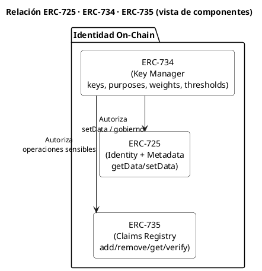
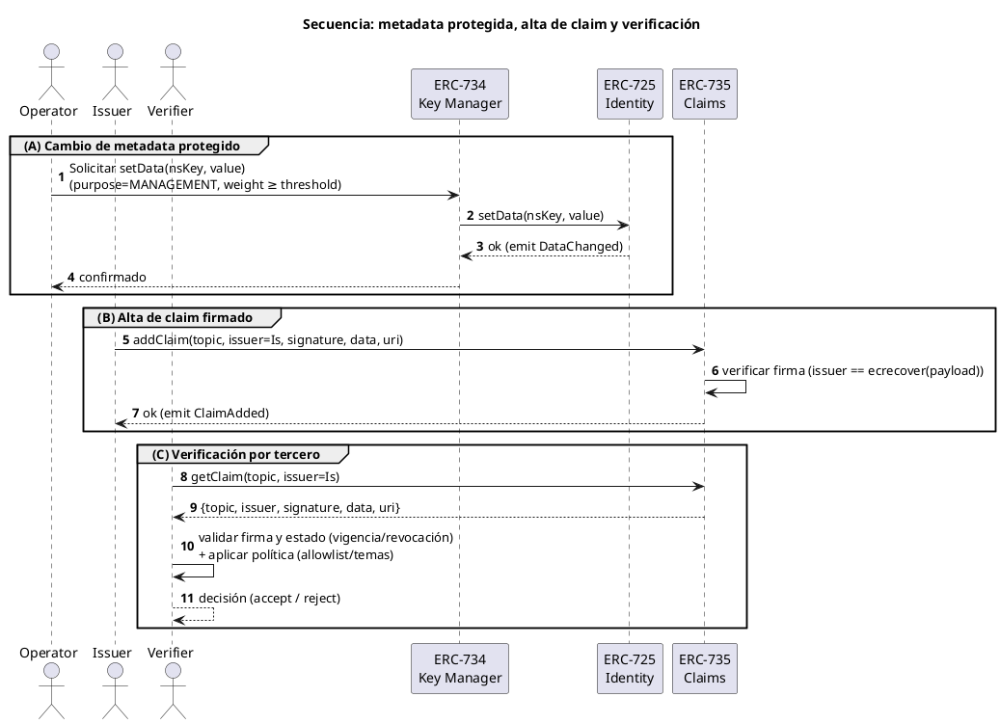
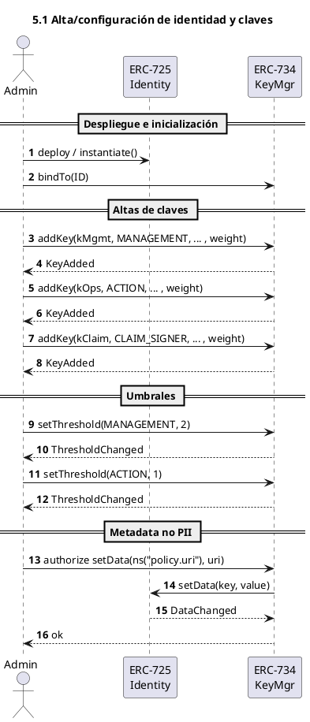
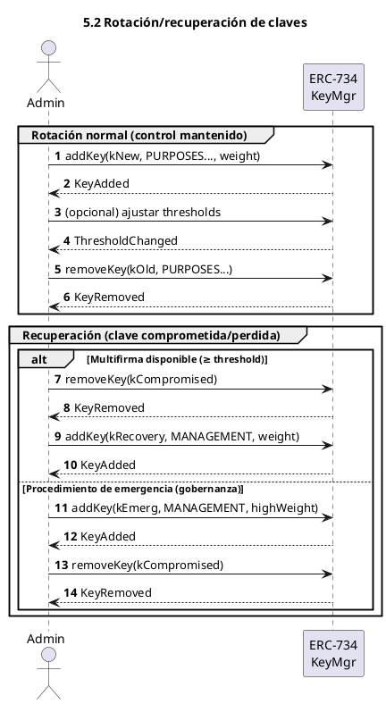
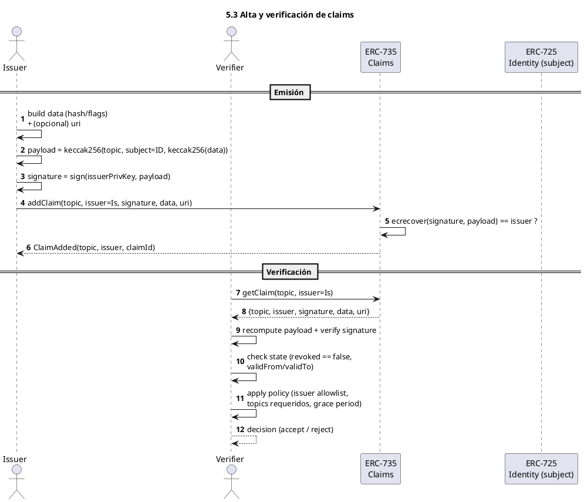
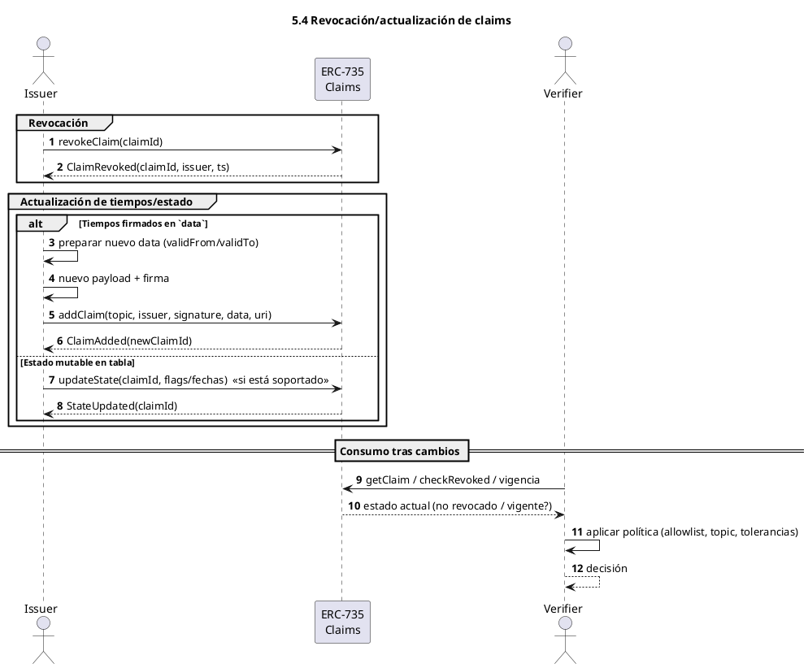

# DOC-001 · Patrón de identidad on-chain (ERC-725/734/735)

# 1. Resumen ejecutivo

## 1.1 Objetivo y alcance
- **Objetivo:** describir el **patrón de identidad on-chain** basado en **ERC-725 (identidad/metadata)**, **ERC-734 (gestión de claves)** y **ERC-735 (claims)**.
- **Alcance:** qué estandariza cada ERC, cómo se **combinan**, **modelo de datos** (claves y claims), **operaciones** básicas y consideraciones de **privacidad/seguridad**.
- **Fuera de alcance:** comparativa con **DID/VC** (DOC-003) e integración con **ERC-3643** (DOC-004).

## 1.2 Qué aporta
- **Identidad como contrato (725):** la dirección del contrato **representa al sujeto** y expone metadata *key–value* (sin PII).
- **Gobernanza por claves (734):** **propósitos, pesos y umbrales** → multifirma y **rotación** sin perder identidad.
- **Afirmaciones verificables (735):** *claims* **firmados por emisores**, lectura on-chain y **trazabilidad por eventos**.
- **Separación de responsabilidades:** 725 = **qué es** la identidad; 734 = **quién puede cambiar**; 735 = **qué se afirma**.
- **Buenas prácticas implícitas:** **PII off-chain**, evidencias por **hash/URI**, **política de confianza externa**.

## 1.3 Qué NO cubre
- No define **políticas de confianza** (qué emisores/temas aceptar).
- No resuelve **KYC/AML/eIDAS** ni **UX de wallets** o recuperación social.
- No aborda **portabilidad fuera de EVM** ni integraciones específicas.

---

# 2. Arquitectura lógica

## 2.1 Componentes y límites



| ERC | ¿Qué es? | Para qué sirve | Qué **no** hace |
|---|---|---|---|
| **725** | Identidad como **contrato** con almacén **clave–valor** (metadata) | Anclar la identidad on-chain; publicar **hash/URI** y flags no PII | No autoriza escrituras ni define atributos verificables |
| **734** | **Gestión de claves** con **propósitos, pesos y umbrales** | Autorización multifirma; **rotación/recuperación** sin perder la identidad | No guarda metadata ni claims; no trata PII |
| **735** | **Claims firmados**: `topic, issuer, signature, data, uri` | Afirmaciones verificables con **eventos** y lectura on-chain | No define **política de confianza**; no almacena PII |

> Atajo mental: **725 = identidad**, **734 = autorización**, **735 = atributos firmados**.


## 2.2 Fronteras de confianza y flujos

**Fronteras**
- **Interna (on-chain):** toda escritura sensible (p. ej., `setData`, alta/baja de claves, claims) pasa por **734** (propósito correcto y **≥ umbral**).
- **Externa (emisores/verificadores):** un claim es **aceptable** si (i) la **firma** corresponde al `issuer` y (ii) la **política del verificador** lo admite (issuer/topic/vigencia).
- **Evidencias/PII:** permanecen **off-chain**; on-chain sólo **hash/URI**.

**Flujos resumidos**
1) **Metadata (725):** operador con `MANAGEMENT` ≥ umbral → `setData(key, value)` → `DataChanged`.  
2) **Claves (734):** `addKey/removeKey/setThreshold` con firmas suficientes → `KeyAdded/Removed/ThresholdChanged`.  
3) **Claims (735):** issuer firma payload → `addClaim(...)` → valida firma → `ClaimAdded`.  
4) **Lectura (consumo):** `getData` / `getClaim(...)` → verificar firma, **estado** (vigencia/revocación) → aplicar **política**. (Si `uri`, contrastar **hash**.)


## 2.3 Diagrama de alto nivel (secuencia única)



# 3. Modelo de datos

## 3.1 Claves (identificador, propósitos, pesos, umbrales, eventos)

### Identificador
- `bytes32 key` (típicamente `keccak256(publicKey)` para ahorrar gas)
- Evitar guardar la **pública completa** on-chain salvo necesidad

### Estructura conceptual
```solidity
// Estructura conceptual de una clave en ERC-734
struct Key {
    bytes32 key;         // hash de la clave pública
    uint256[] purposes;  // array de propósitos (MANAGEMENT, ACTION, etc)
    uint256 keyType;     // tipo (1 = ECDSA, etc)
    uint256 weight;      // peso para cálculo de umbral
}

// Constantes de propósito
uint256 constant MANAGEMENT_KEY = 1;
uint256 constant ACTION_KEY = 2;
uint256 constant CLAIM_SIGNER_KEY = 3;
uint256 constant ENCRYPTION_KEY = 4;
```

### Propósitos (ejemplos)
- **MANAGEMENT_KEY:** gobierno (añadir/quitar claves, umbrales, autorizar `setData`)
- **ACTION_KEY:** operaciones funcionales de la identidad
- **CLAIM_SIGNER_KEY:** firmar claims cuando se actúa como issuer
- **ENCRYPTION_KEY:** cifrado/intercambio (opcional)

### Umbrales
- Umbral por categoría (gobierno/acción)
- Suma de `weights` de las claves firmantes ≥ `threshold`

### Lecturas típicas
```solidity
// Funciones principales de lectura ERC-734
interface IERC734 {
    // Obtener todas las claves con cierto propósito
    function getKeysByPurpose(uint256 _purpose) 
        external view returns(bytes32[] memory keys);
    
    // Verificar si una clave tiene cierto propósito
    function keyHasPurpose(bytes32 _key, uint256 _purpose) 
        external view returns(bool exists);
    
    // Obtener detalles completos de una clave
    function getKey(bytes32 _key) external view returns(
        uint256[] memory purposes,
        uint256 keyType,
        uint256 weight
    );

    // Consultar umbral por propósito
    function getThreshold(uint256 _purpose) 
        external view returns(uint256);
}
```

### Eventos
- `KeyAdded(key, purpose, keyType, weight)`
- `KeyRemoved(key, purpose, keyType, weight)` 
- (si aplica) `ThresholdChanged(purpose, newThreshold)`

### Buenas prácticas
- Separar funciones (no mezclar `MANAGEMENT` y `ACTION` en la misma clave)
- `Threshold` de gobierno > acción (multifirma donde aplique)
- Rotación segura: añadir → elevar permisos → retirar clave antigua
- Registro mínimo on-chain (identificadores compactos)

### Antipatrones
- Una sola clave "todopoderosa"
- `Threshold` de gobierno = 1 en entornos regulados
- Reutilizar la misma clave en múltiples identidades
- Guardar públicas/strings largos sin necesidad

## 3.2 Claims (topic, issuer, signature, data, uri, payload)

### Estructura mínima
- **topic (uint256/bytes32):** tipo de afirmación (p.ej. `KYC_OK`, `RESIDENCY`, `ACCREDITED`)
- **issuer (address):** quién firma la afirmación (EOA/contrato/identidad)
- **signature (bytes):** firma del `issuer` sobre un payload canónico
- **data (bytes):** hash/flags/códigos (evitar PII)
- **uri (string|bytes):** puntero a evidencia off-chain (IPFS/HTTPS)

### Payload canónico (idea)
```solidity
bytes32 payload = keccak256(
    abi.encodePacked(
        bytes32(topic),
        address(subject),   // identidad a la que se refiere el claim
        keccak256(data)     // o data canónica compacta
    )
);
// signature = sign(issuerPrivKey, payload)
```

### Almacenamiento e indexación
- Por topic: `getClaimIdsByTopic(topic) → bytes32[]`
- Por (topic, issuer): `getClaim(topic, issuer) → Claim`

### Operaciones
```solidity
interface IERC735 {
    function addClaim(
        bytes32 topic,
        address issuer,
        bytes calldata signature,
        bytes calldata data,
        string calldata uri
    ) external returns (bytes32 claimId);

    function removeClaim(bytes32 claimId) external returns (bool success);
    
    function getClaim(bytes32 claimId) external view returns (
        bytes32 topic,
        address issuer,
        bytes memory signature,
        bytes memory data,
        string memory uri
    );
}
```

### Eventos
- `ClaimAdded(topic, issuer, claimId)`
- `ClaimRemoved(topic, issuer, claimId)` / `ClaimRevoked(...)`

### Validación (consumidor)
1. Obtener claim → `{topic, issuer, signature, data, uri}`
2. Recalcular payload y comprobar firma ↔ `issuer`
3. Verificar estado (no revocado, vigencia) → §4.3
4. Aplicar política externa (`issuer/topic` permitido)
5. Si hay `uri`, contrastar hash de evidencia

### Buenas prácticas
- Minimizar `data` (hash/flags/códigos; sin PII)
- Versionar el esquema de `data` en el payload
- Permitir múltiples emisores por topic (redundancia/consenso)
- Validar integridad de evidencias (hash anclado)

### Antipatrones
- Confiar en `uri` sin verificar integridad
- Cambiar el payload sin versionar
- Acoplar la política de confianza dentro del contrato

## 3.3 Estado de claims (vigencia, expiración, revocación)

### Conceptos
- **Vigencia:** intervalo en que el claim es válido
- **Expiración:** invalidez automática tras `validTo`
- **Revocación:** invalidación anticipada marcada por el `issuer` o política del sistema

### Modelado (on-chain)
#### A) Campos temporales (en claim o tabla auxiliar)
- `validFrom: uint64`, `validTo: uint64` (0 = sin expiración)

#### B) Revocación (tabla por `claimId`)
```solidity
mapping(bytes32 => bool) public revoked; // claimId => true/false
```
- `claimId = keccak256(subject, topic, issuer, signature)` o índice interno

#### C) Eventos
- `ClaimRevoked(claimId, issuer, timestamp)`
- (o) reutilizar `ClaimRemoved` con semántica documentada

#### D) Fuente de tiempo
- `block.timestamp` para evaluar vigencia/expiración

### Verificación de estado (pseudocódigo)
```solidity
function isClaimActive(Claim memory c) public view returns (bool) {
    if (revoked[c.id]) return false;
    if (c.validFrom != 0 && block.timestamp < c.validFrom) return false;
    if (c.validTo   != 0 && block.timestamp > c.validTo)   return false;
    return true;
}
```
- La firma/issuer se validan antes (§4.2). La política se aplica después.

### Dónde guardar tiempos/estado
1. **En `data` (firmado):** `validFrom/validTo` ABI-encode dentro de `data`
   - **Pro:** el tiempo forma parte del payload firmado
   - **Con:** cambiar tiempos ⇒ nuevo claim/firma
2. **En tablas auxiliares (mutables):** estado por `claimId`
   - **Pro:** actualizar sin cambiar firma
   - **Con:** dos fuentes (datos vs. estado)

**Patrón híbrido recomendado:** tiempos en `data` (firmados) + revocación en tabla mutable

### Estrategias de revocación
- Por `issuer` (preferida) o por política de sistema (p.ej., compromiso del `issuer`)
- **Soft delete:** `revoked[claimId] = true` (auditoría)
- **Hard delete:** borrar almacenamiento (pierde trazabilidad; desaconsejado)

### Reglas para verificadores
1. Recuperar claim
2. Validar firma ↔ `issuer`
3. Comprobar estado (revocado/vigencia)
4. Aplicar política (`issuer/topic`, grace period)
5. (Opcional) Validar evidencia (`uri + hash`)

### Casos límite
- **Reloj de cadena:** usar márgenes si hay desincronización multi-red
- **Grace period:** configurable en renovaciones
- **Anti-replay:** incluir `subject` y versión de esquema en payload

### Antipatrones
- Confiar solo en expiración sin revocación
- Expiraciones muy largas sin controles operativos
- Borrado físico de claims
- Estado solo off-chain sin anclaje on-chain

# 4. Operaciones (playbooks)

> Guías breves y accionables. Cada playbook indica **precondiciones**, **pasos**, **verificaciones** y **errores comunes**.

## 4.1 Alta/configuración de identidad y claves

**Objetivo:** crear la identidad (ERC-725), configurar autorización (ERC-734) y dejarla operativa.

### Precondiciones
- Tener al menos **1 clave de gobierno** (cuidada en HSM/segura)
- Catálogo interno de **propósitos** y **umbrales** definido

### Pasos
1. **Desplegar/instanciar** contrato de **identidad (725)**
2. **Añadir claves** en **734**:
   ```solidity
   addKey(kMgmt, MANAGEMENT, keyType, weight)
   addKey(kOps,  ACTION,    keyType, weight)
   addKey(kClaim, CLAIM_SIGNER, keyType, weight)  // opcional
   ```
3. **Configurar umbrales**:
   ```solidity
   setThreshold(MANAGEMENT, mgmtThreshold)  // ej: 2
   setThreshold(ACTION, actionThreshold)    // ej: 1
   ```
4. **Inicializar metadata (725)** sin PII:
   ```solidity
   setData(ns("policy.uri"), bytes(uri))
   setData(ns("schema.version"), bytes32(ver))
   ```

### Verificaciones
- `keyHasPurpose(kMgmt, MANAGEMENT) == true`
- `getKeysByPurpose(ACTION)` devuelve al menos una clave activa
- Eventos `KeyAdded` y `DataChanged` emitidos

### Errores comunes
- Mezclar **gobierno** y **acción** en la misma clave
- Umbral de gobierno = 1 en contexto regulado
- PII en `setData` (irreversible)



## 4.2 Rotación/recuperación de claves

**Objetivo:** sustituir una clave comprometida/antigua o recuperar control.

### Precondiciones
- Aún se alcanza **umbral** con el set de claves vigente (o se tiene un **procedimiento de emergencia** fuera de banda)

### Pasos de rotación (clave conocida, control mantenido)
1. **Añadir nueva clave**:
   - `addKey(kNew, PURPOSES..., keyType, weight)`
2. **Ajustar pesos/umbrales** si procede
3. **Retirar clave antigua**:
   - `removeKey(kOld, PURPOSES...)`
4. **Registrar cambio** en metadata (opcional): `setData(ns("key.lastRotation"), now)`

### Pasos de recuperación (clave perdida/comprometida)
- **Plan A (multifirma operativa)**: usar otras claves MANAGEMENT ≥ umbral → `removeKey(compromised)` → añadir reemplazo
- **Plan B (procedimiento legal/guardianes)**: ejecutar lógica definida en gobernanza (no estándar) para introducir una **clave de recuperación** con permisos de MANAGEMENT y eliminar las comprometidas

### Verificaciones
- Tras la rotación, `accWeight(MANAGEMENT) ≥ mgmtThreshold`
- Eventos `KeyAdded`/`KeyRemoved` correctos

### Errores comunes
- Quitar primero la vieja → perder **umbral** temporalmente
- No actualizar **inventario**/catálogo de claves (auditoría)



## 4.3 Alta y verificación de claims

**Objetivo:** registrar un claim firmado (735) y validarlo al consumirlo.

### Precondiciones
- `issuer` posee clave válida (CLAIM_SIGNER o equivalente) y **política** del verificador lo reconoce
- Definido **payload canónico** (con `subject` y **versión** de esquema)

### Alta (emisor)
1. Preparar `data` (hash/flags; sin PII) y **(opcional)** `uri` (evidencia)
2. Construir `payload`:
   ```solidity
   bytes32 payload = keccak256(abi.encodePacked(
       bytes32(topic),
       address(subject),
       keccak256(data)
   ));
   ```
3. Firmar: `signature = sign(issuerPrivKey, payload)`
4. Registrar: `addClaim(topic, issuer, signature, data, uri)`
5. Confirmar `ClaimAdded(topic, issuer, claimId)`

### Verificación (consumidor)
1. Leer: `getClaim(topic, issuer)` → `{topic, issuer, signature, data, uri}`
2. Recalcular payload y verificar firma ↔ `issuer` (ecrecover)
3. Comprobar estado (ver §4.3): !revoked, validFrom/validTo
4. Aplicar política: issuer allowlisted, topic requerido, grace period
5. (Opc.) Si uri, descargar evidencia y verificar hash anclado en data

### Errores comunes
- Cambiar formato de data sin versionar el payload
- Confiar solo en uri sin integridad
- No incluir subject en el payload (riesgo de replay)



## 4.4 Revocación/actualización de claims

**Objetivo:** invalidar un claim o actualizar su estado/tiempos.

### Precondiciones
- Poder de revocación definido: issuer (preferido) o política de sistema

### Revocación
- **Soft delete** (recomendado):
  ```solidity
  // tabla de estado
  revoked[claimId] = true;
  emit ClaimRevoked(claimId, issuer, block.timestamp);
  ```
- **Hard delete** (no recomendado): eliminar almacenamiento (pierde traza)

### Actualización
- **Tiempos en data** (firmado): emitir nuevo claim con nueva firma
- **Estado mutable** (tabla): actualizar flags/fechas sin cambiar la firma (coordinar fuentes)

### Verificaciones
- `isClaimActive(...) == false` tras revocar
- Consumidores detectan la revocación (event-driven o lectura directa)

### Errores comunes
- Revocar sin evento → verificadores no lo observan a tiempo
- Mantener expiraciones largas sin revisiones operativas
- Depender solo de expiración sin canal de revocación


# 5. Roles (mínimo necesario)

## 5.1 Roles

| Rol | Poder on-chain | Para qué se usa |
|---|---|---|
| **Controlador** | Claves con **MANAGEMENT** (ERC-734) | Alta/baja de claves, ajuste de umbrales, autorizar `setData` (ERC-725). |
| **Operador** | Claves con **ACTION** (ERC-734) | Ejecutar acciones operativas permitidas por la identidad. |
| **Emisor de claims** | Firma **claims** (ERC-735) con su propia identidad/clave | Emitir, actualizar y revocar *claims* (`topic`) sobre un sujeto. |
| **Verificador** | Lectura 725/735 | Leer metadata/claims y tomar decisiones (aceptar/denegar) según firma y estado del claim. |

## 5.2 Reglas prácticas (muy concisas)

- **Separación de funciones:** MANAGEMENT ≠ ACTION ≠ CLAIM_SIGNER.  
- **Umbrales:** `MANAGEMENT` > `ACTION` (p. ej., 2/3 vs 1).  
- **Rotación segura:** añadir nueva clave → alcanzar umbral → retirar la antigua.  
- **Sin PII en cadena:** usar **hash/URI**; evidencias fuera de cadena.

